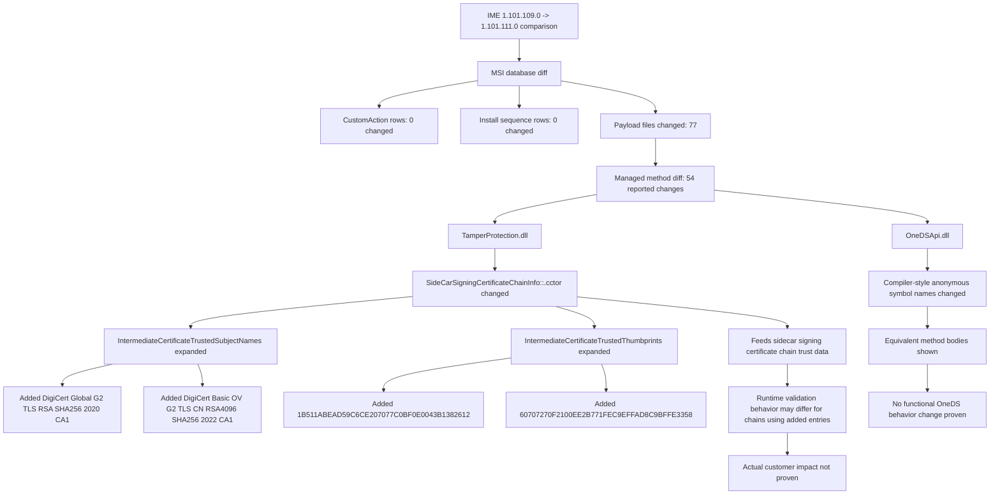

# Intune Management Extension release note

## Summary

Intune Management Extension MSI changed from `1.101.109.0` to `1.101.111.0`.

The MSI evidence shows a versioned payload replacement with:

- No `CustomAction` table changes.
- No install sequence table changes.
- Broad file hash/version changes across the IME payload.
- One meaningful managed-code/data change proven in `Microsoft.Management.Clients.IntuneManagementExtension.TamperProtection.dll`: the sidecar signing certificate intermediate trust data was expanded.

No customer impact is directly proven by the supplied evidence.

## What changed

### Facts

- `ProductVersion` changed:
  - `1.101.109.0` → `1.101.111.0`
- `ProductCode` changed:
  - `{30660FD5-D7DB-4A20-872D-382274CA0E44}` → `{CEFAEC57-33DC-4775-BFD2-561699357699}`
- `UpgradeCode` stayed the same:
  - `{9FE9701C-0F89-40B4-B77A-AA65607E87D8}`
- MSI size stayed the same:
  - `565,248` bytes
- MSI SHA-256 changed:
  - Old: `8C8B0593F2ED84A10A8BE246EB0BA22E6A9D8678C976460C504172FFD0572660`
  - New: `31CF9221A53DED65BB8ADE9E6EE2E2FAA68A9AA9CD9FFA79BC039C72370C797D`
- File changes reported: `77`
- MSI table diff rows: `156`
- Managed method changes reported: `54`
- `CustomAction` diff rows: `0`
- Install sequence diff rows: `0`

### Meaningful DLL change

`Microsoft.Management.Clients.IntuneManagementExtension.TamperProtection.dll` changed in `SideCarSigningCertificateChainInfo::.cctor`.

Added to `IntermediateCertificateTrustedSubjectNames`:

- `DigiCert Global G2 TLS RSA SHA256 2020 CA1`
- `DigiCert Basic OV G2 TLS CN RSA4096 SHA256 2022 CA1`

Added to `IntermediateCertificateTrustedThumbprints`:

- `1B511ABEAD59C6CE207077C0BF0E0043B1382612`
- `60707270F2100EE2B771FEC9EFFAD8C9BFFE3358`

## Why it matters

### Supported by evidence

- The TamperProtection sidecar certificate chain trust data was expanded.
- The change is targeted to intermediate certificate subject names and thumbprints.
- No evidence shows a general relaxation of certificate validation logic.
- No evidence shows changes to MSI install sequencing or MSI custom actions.

### Interpretation

- The new trusted intermediate entries may support sidecar signing certificate chain validation for certificate chains using the added DigiCert intermediates or thumbprints.
- This may be related to certificate issuance path or certificate rotation support.
- Actual production use of these chains is not proven by the supplied evidence.

## Changed components

### Package and installation metadata

- `ProductVersion`
- `ProductCode`
- `Upgrade` table version bounds
- `Signature` table `NewerFileVersionSearch` minimum version
- `IntuneWindowsAgent.cat` catalog file

### Changed payload groups

- Core service and executables:
  - `Microsoft.Management.Services.IntuneWindowsAgent.exe`
  - `AgentExecutor.exe`
  - `ImeUI.exe`
  - `ClientHealthEval.exe`
  - `ClientCertCheck.exe`
- IME plug-ins and workload DLLs:
  - `Win32AppPlugIn.dll`
  - `AppEnforcementProcessor.dll`
  - `ScriptPlugIn.dll`
  - `Win32AppInventoryCollector.dll`
  - `WinGetLibrary.dll`
  - `TamperProtection.dll`
- Shared agent libraries:
  - `AgentCommon.dll`
  - `BootstrapperAgentCore.dll`
  - `RebootCoordinator.dll`
- Dependencies:
  - `OneDSApi.dll`
  - `Newtonsoft.Json.dll`
  - `Polly.dll`
  - `Microsoft.IdentityModel.dll`
  - `Microsoft.IdentityModel.Extensions.dll`
- Localized satellite resources:
  - `AgentExecutor.resources.dll`
  - `ImeUI.resources.dll`

### Method-level evidence

- `TamperProtection.dll`: substantive change in `SideCarSigningCertificateChainInfo::.cctor`.
- `OneDSApi.dll`: added/removed compiler-style symbols with equivalent bodies; no functional OneDS behavior change proven.

## Mermaid flow

## Evidence

| Area | Old | New | Finding |
|---|---:|---:|---|
| MSI version | `1.101.109.0` | `1.101.111.0` | Version bump |
| ProductCode | `{30660FD5-D7DB-4A20-872D-382274CA0E44}` | `{CEFAEC57-33DC-4775-BFD2-561699357699}` | Product identity changed |
| UpgradeCode | `{9FE9701C-0F89-40B4-B77A-AA65607E87D8}` | Same | Same upgrade family |
| MSI size | `565,248` | `565,248` | Same size, different hash |
| CustomAction diff rows | `0` | `0` | No MSI custom action table change |
| Install sequence diff rows | `0` | `0` | No MSI install sequence table change |
| File changes | `77` | `77` | Broad payload replacement |
| Managed method changes | `54` | `54` | Concentrated in `TamperProtection.dll` and `OneDSApi.dll` |
| `TamperProtection.dll` size | `60,272` | `60,784` | Increased |
| `SideCarSigningCertificateChainInfo::.cctor` code size | `0x434` | `0x460` | Static trust data expanded |
| `OneDSApi.dll` size | `190,328` | `190,328` | Same size |
| `OneDSApi.dll` version | `1.101.109.0` | `1.101.111.0` | Version bump; method bodies equivalent for shown add/remove pairs |

## Uncertainty

- The evidence does not include source commits, product release notes, telemetry, or runtime logs.
- The exact production runtime paths that invoke `SideCarSigningCertificateChainInfo` are not proven by this evidence.
- Customer impact is not proven.
- Native executable internals are not fully semantically diffed by the supplied managed method evidence.
- Resource DLL string/content changes were not provided.
- For many changed binaries, the evidence proves hash/version changes but not behavioral changes.
