# Intune Management Extension release note

## Summary

This release updates the Intune Management Extension MSI from **1.101.109.0** to **1.101.111.0**.

**Evidence-backed finding:** no MSI custom action or install sequence changes were detected. The strongest functional code evidence is a SideCar signing certificate trust-list refresh in `Microsoft.Management.Clients.IntuneManagementExtension.TamperProtection.dll`.

## What changed

### Facts

- MSI ProductVersion changed:
  - `1.101.109.0` → `1.101.111.0`
- MSI ProductCode changed:
  - `{30660FD5-D7DB-4A20-872D-382274CA0E44}` → `{CEFAEC57-33DC-4775-BFD2-561699357699}`
- CustomAction table diff rows: `0`
- Install sequence diff rows: `0`
- File changes reported: `77`
- Managed method changes reported: `54`
- Method-level changes were reported only for:
  - `Microsoft.Management.Clients.IntuneManagementExtension.TamperProtection.dll`
  - `OneDSApi.dll`

### Main code/data change

`TamperProtection.dll` contains the only clearly meaningful managed code/data change shown by the focused DLL evidence.

The changed function is:

```text
Microsoft.Management.Clients.IntuneManagementExtension.TamperProtection.CertificateValidation.SideCarSigningCertificateChainInfo::.cctor
```

This static constructor initializes SideCar signing certificate-chain trust data. Its IL code size increased from `1076` bytes to `1120` bytes.

Added intermediate certificate subject names:

```text
DigiCert Global G2 TLS RSA SHA256 2020 CA1
DigiCert Basic OV G2 TLS CN RSA4096 SHA256 2022 CA1
```

Added intermediate certificate thumbprints:

```text
1B511ABEAD59C6CE207077C0BF0E0043B1382612
60707270F2100EE2B771FEC9EFFAD8C9BFFE3358
```

## Why it matters

### Facts

- The accepted intermediate certificate trust metadata used by the SideCar signing certificate-chain data structure was expanded.
- Existing SideCar leaf subject names were not shown as changed.
- Root subject names and root thumbprint lists were not shown as changed.
- The supplied method evidence does not show a certificate validation algorithm change.

### Interpretation

- This likely supports SideCar signing certificate-chain validation when chains use the newly listed DigiCert intermediate identities or thumbprints.
- Because `LeafCertificateTrustedIssuers` is assigned from `IntermediateCertificateTrustedSubjectNames`, the new intermediate subject names also become available as trusted leaf issuers in this static trust data.
- Customer-visible impact is not proven by the supplied evidence.

## Changed components

### MSI/package

- `IntuneWindowsAgent_1.101.109.0.msi` removed from comparison set.
- `IntuneWindowsAgent_1.101.111.0.msi` added to comparison set.
- MSI size remained `565,248` bytes.
- Upgrade/downgrade version thresholds advanced to `1.101.111.0`.

### Payload refresh

Many payload binaries changed hash/version, including:

- `Microsoft.Management.Services.IntuneWindowsAgent.exe`
- `AgentExecutor.exe`
- `ImeUI.exe`
- `ClientCertCheck.exe`
- `ClientHealthEval.exe`
- app/script/inventory plug-ins
- localized resource assemblies
- `IntuneWindowsAgent.cat`
- dependency libraries such as `Newtonsoft.Json.dll`, `Polly.dll`, and `Microsoft.IdentityModel*`

No method-level functional change was proven for most of these files.

### `TamperProtection.dll`

- Version: `1.101.109.0` → `1.101.111.0`
- Size: `60,272` → `60,784` bytes
- Primary evidenced change: expanded SideCar signing certificate intermediate trust metadata.

### `OneDSApi.dll`

- Version: `1.101.109.0` → `1.101.111.0`
- Size unchanged: `190,328` bytes
- Reported changes are compiler-generated anonymous namespace symbol renames with equivalent method bodies in the supplied evidence.
- No OneDS telemetry behavior change is proven.

## Mermaid function flow

```mermaid
flowchart TD
    A["Start: SideCarSigningCertificateChainInfo .cctor"] --> B["Set shouldSkipV2Validation = false"]

    B --> C["Create LeafCertificateTrustedSubjectNames"]
    C --> C1["Add existing SideCarSignCert.manage-* subject names"]
    C1 --> C2["Store LeafCertificateTrustedSubjectNames"]

    C2 --> D["Create IntermediateCertificateTrustedSubjectNames"]
    D --> D1["Add existing Microsoft Azure / Microsoft / DigiCert intermediate subject names"]
    D1 --> D2["New subject: DigiCert Global G2 TLS RSA SHA256 2020 CA1"]
    D2 --> D3["New subject: DigiCert Basic OV G2 TLS CN RSA4096 SHA256 2022 CA1"]
    D3 --> D4["Store IntermediateCertificateTrustedSubjectNames"]

    D4 --> E["Create IntermediateCertificateTrustedThumbprints"]
    E --> E1["Add existing intermediate thumbprints"]
    E1 --> E2["New thumbprint: 1B511ABEAD59C6CE207077C0BF0E0043B1382612"]
    E2 --> E3["New thumbprint: 60707270F2100EE2B771FEC9EFFAD8C9BFFE3358"]
    E3 --> E4["Store IntermediateCertificateTrustedThumbprints"]

    E4 --> F["Create RootCertificateTrustedSubjectNames"]
    F --> F1["Root subject list unchanged in supplied evidence"]
    F1 --> G["Create RootCertificateTrustedThumbprints"]
    G --> G1["Root thumbprint lists unchanged in supplied evidence"]

    G1 --> H["Assign LeafCertificateTrustedIssuers = IntermediateCertificateTrustedSubjectNames"]
    H --> I["Assign IntermediateCertificateTrustedIssuers = RootCertificateTrustedSubjectNames"]
    I --> J["Assign RootCertificateTrustedIssuers = RootCertificateTrustedSubjectNames"]
    J --> K["Static SideCar signing certificate-chain trust data ready"]

    K -.->|inferred; runtime caller path not proven| L["Validators may consume expanded intermediate trust data"]
```



## Evidence

- MSI deep diff:
  - File changes: `77`
  - MSI table diff rows: `156`
  - CustomAction diff rows: `0`
  - Install flow sequence diff rows: `0`
  - Managed method changes: `54`
- Focused `TamperProtection.dll` report:
  - `SideCarSigningCertificateChainInfo::.cctor` grew from `1076` to `1120` IL bytes.
  - Added two intermediate subject-name strings.
  - Added two intermediate thumbprint strings.
  - Other reviewed changed methods were IL-identical aside from RVA/address movement.
- Focused `OneDSApi.dll` report:
  - Three removed and three added compiler-mangled module methods.
  - Old/new method bodies are equivalent except for anonymous namespace symbol prefixes.
- Quick/extended analysis:
  - No MSI custom action changes.
  - No MSI install sequence changes.
  - Broad payload version/hash refresh.

## Uncertainty

- The runtime entry point that invokes `SideCarSigningCertificateChainInfo` was not proven.
- The evidence does not prove whether subject-name and thumbprint checks are combined with AND, OR, or staged validation.
- Customer impact is not proven.
- Changed resource DLLs may contain string changes, but no resource string diff was supplied.
- Changed native or mixed-mode behavior in `OneDSApi.dll` outside the shown method evidence was not fully assessed.
- Hash/version changes alone should not be treated as proof of functional changes.
