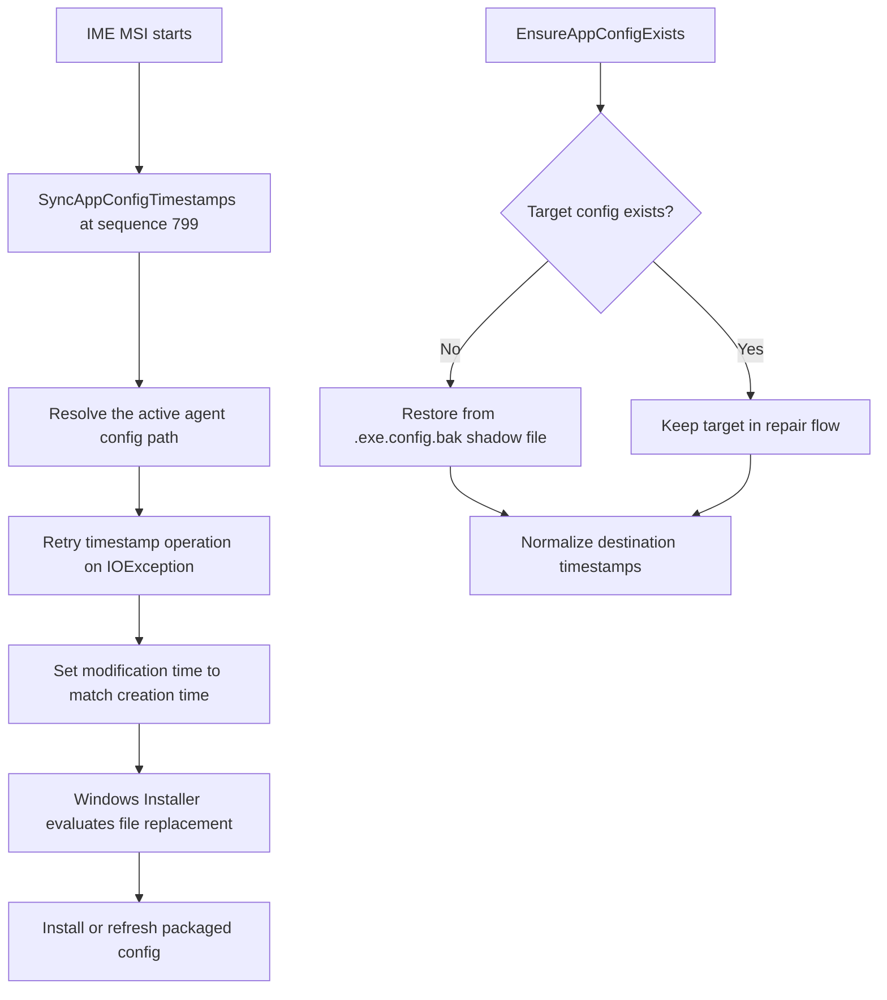
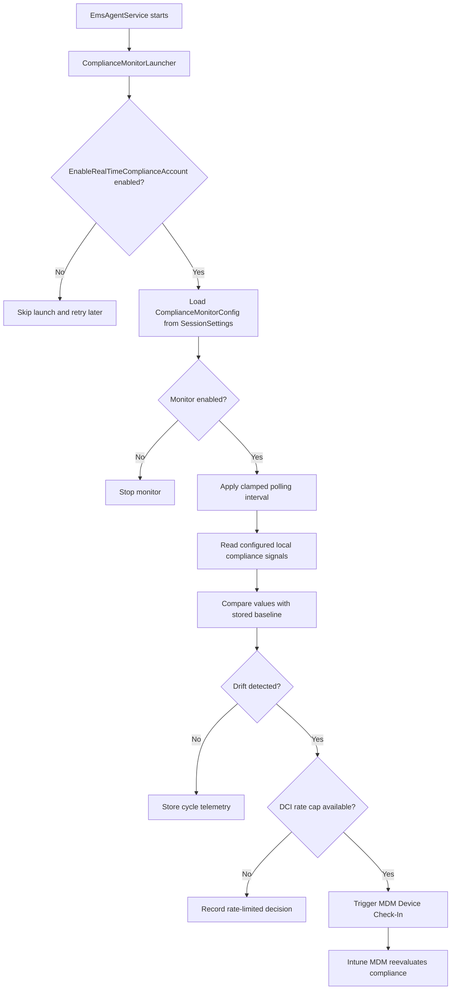
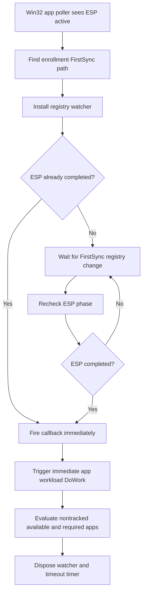

# ime-1.101.111.0-to-1.103.101.0

## Scope

This document describes the changes found between these Intune Management Extension packages:

| Package | Version |
|---|---:|
| Previous package | `1.101.111.0` |
| New package | `1.103.101.0` |

The findings are based on MSI table comparison, extracted CAB payloads, managed assembly metadata, portable string differences, and method-level IL hashes. The comparison produced 104 file changes, 287 MSI table changes, two CustomAction table changes, three install-sequence changes, and 15,448 managed method-diff rows.

This is an independent investigation report. A method or feature being present in the client does not prove that Microsoft has enabled it for every tenant. Several paths are controlled through ECS, session settings, or explicit flight values.

## Executive summary

The three most important functional changes are:

1. A new real-time `ComplianceMonitor` that evaluates selected local compliance signals, detects drift, and can trigger an MDM Device Check-In (DCI).
2. A new ESP `FirstSync` registry watcher that can trigger an immediate Win32 app workload check-in when ESP completes, instead of relying only on the normal one-hour retry cycle.
3. A stronger application-config repair model using `Microsoft.Management.Services.IntuneWindowsAgent.exe.config.bak`, `EnsureAppConfigExists`, and the new `SyncAppConfigTimestamps` MSI custom action.

The release also contains substantial notification-dispatch, script scheduling, Trouter/IC3, WinGet, client-health, crash-telemetry, cloud-environment, Remote Help, and APv2/DPP changes.

## Package-level changes

The main agent binaries moved from file version `1.101.111.0` to `1.103.101.0`. Their managed assembly version generally remains `5.0.0.0`.

| Component | Previous size | New size | Change |
|---|---:|---:|---:|
| `Microsoft.Management.Services.IntuneWindowsAgent.exe` | 340,344 | 403,320 | +62,976 |
| `Microsoft.Management.Services.IntuneWindowsAgent.AgentCommon.dll` | 675,704 | 720,248 | +44,544 |
| `Microsoft.Management.Clients.IntuneManagementExtension.Win32AppPlugIn.dll` | 863,088 | 870,776 | +7,688 |
| `Microsoft.Management.Clients.IntuneManagementExtension.ScriptPlugIn.dll` | 238,968 | 244,088 | +5,120 |
| `Microsoft.IC3.Trouter.dll` | 297,016 | 412,728 | +115,712 |

Three payload files were added:

```text
Microsoft.Bcl.Memory.dll
System.Threading.Channels.dll
Microsoft.Management.Services.IntuneWindowsAgent.exe.config.bak
```

Important dependency changes include:

| Dependency | Previous | New |
|---|---:|---:|
| `WindowsPackageManager.dll` | `1.26.560.0` | `1.28.220.0` |
| `Microsoft.Management.Deployment.InProc.dll` | `1.26.560.0` | `1.28.220.0` |
| `Microsoft.IC3.Trouter.dll` | `1.1.52.0` | `1.2.9.0` |
| Visual C++ runtime files | `14.23.27820.0` | `14.50.35727.0` |

Several `System.*` dependencies, including `System.Text.Json`, also moved from .NET 9-era builds to .NET 10-era builds.

## 1. Application config repair

### The old failure

`Microsoft.Management.Services.IntuneWindowsAgent.exe.config` is an unversioned file. Windows Installer can preserve an unversioned file when its modification time indicates that it has been changed since installation. That allowed an old IME config to survive while the DLLs around it were upgraded.

The stale binding redirects could then point the CLR toward assembly versions that no longer matched the files on disk. In the affected user-app flow, this caused token parsing to fail with errors such as `IDX12729` and `0x80131040` before StatusService and the Win32 app plug-in could start.

Background investigations:

- [Company Portal stuck on Downloading: IDX12729 and 0x80131040](https://patchmypc.com/blog/company-portal-stuck-on-downloading-idx12729-0x80131040/)
- [IT1272653: Company Portal stuck on Download Pending](https://patchmypc.com/blog/it1272653-company-portal-stuck-on-downloading/)

### MSI changes

The new MSI adds this custom action:

| Action | Source | Target | Type |
|---|---|---|---:|
| `SyncAppConfigTimestamps` | `IntuneWindowsAgentCustomActions` | `SyncAppConfigTimestamps` | `65` |

It is scheduled as follows:

| Action | Condition | Sequence |
|---|---|---:|
| `SyncAppConfigTimestamps` | `NOT UPGRADINGPRODUCTCODE` | `799` |

Sequence 799 places the action very early in `InstallExecuteSequence`, before the normal file-costing and replacement stages determine how the existing config should be handled.

The custom-action assembly adds:

```text
CustomActions.SyncAppConfigTimestamps
CustomActions.RetryOnIOException
```

`CustomActions.EnsureAppConfigExists` also changed substantially.

### Shadow config model

The new MSI installs this baseline file:

```text
Microsoft.Management.Services.IntuneWindowsAgent.exe.config.bak
```

The new custom-action logging identifies both a shadow and destination path:

```text
EnsureAppConfigExists: InstallFolder={0}, ShadowConfigPath={1}, TargetConfigPath={2}
EnsureAppConfigExists: Synced destination timestamps (modify = create)
SyncAppConfigTimestamps: InstallFolder={0}, ConfigPath={1}
SyncAppConfigTimestamps: Failed to sync timestamps after retries
```

This confirms that the repair model no longer depends only on restoring an embedded resource when the config is missing. It now has a physical shadow copy beside the agent and explicit timestamp normalization.

`RetryOnIOException` protects the file operation against temporary locks or other short-lived I/O failures. After the destination is restored or prepared, its modification timestamp is synchronized with its creation timestamp. That directly addresses the Windows Installer rule that previously made a touched config look like user data that should be preserved.

### Config repair flow



### Practical result

The installer now covers both major config failure modes. `EnsureAppConfigExists` covers a missing config, while the shadow file and timestamp synchronization address a present but touched config that Windows Installer would previously preserve.

The evidence does not show a normalized content hash comparison. The repair is based on file presence, a shadow copy, retryable file operations, and timestamp handling.

## 2. Real-time Compliance Monitor

### New service area

`Microsoft.Management.Services.IntuneWindowsAgent.exe` contains a completely new `ComplianceMonitor` namespace and lifecycle. Important classes include:

```text
ComplianceMonitor
ComplianceMonitorLauncher
ComplianceMonitorStore
ComplianceSettingHelper
ComplianceMonitorPrecheck
ComplianceMonitorAuditing
ComplianceCycleAggregator
DciHelper
CycleTelemetry
HourlyRollup
DriftRecord
```

The agent service now initializes a `ComplianceMonitorLauncher` during startup and disposes the monitor during shutdown. The launcher is controlled by `EnableRealTimeComplianceAccount`, so the code can be present without being active for every account.

### Server-controlled configuration

The service-contract assembly adds:

```text
ComplianceMonitorConfig
PerSettingConfig
```

`ComplianceMonitorConfig` exposes:

```text
Enabled
Settings
PerSetting
PollIntervalSeconds
DciMaxCheckInsPerHourPerDevice
```

The configuration is delivered through session settings rather than being fully hardcoded in the client. If the server configuration is absent, the monitor logs that it will retry during the next cycle. Polling intervals and DCI caps are clamped when read to prevent invalid server values from causing an unsafe cadence.

### Local state

The monitor persists configuration, setting state, and rate-window information below:

```text
HKLM\SOFTWARE\Microsoft\IntuneManagementExtension\ComplianceMonitor
HKLM\SOFTWARE\Microsoft\IntuneManagementExtension\ComplianceMonitor\Config
HKLM\SOFTWARE\Microsoft\IntuneManagementExtension\ComplianceMonitor\Config\PerSetting
HKLM\SOFTWARE\Microsoft\IntuneManagementExtension\ComplianceMonitor\Config\RateWindow
HKLM\SOFTWARE\Microsoft\IntuneManagementExtension\ComplianceMonitor\Settings
```

The store retains the previous value for each monitored signal, drift information, and the DCI rate window.

### Compliance signals

The new code contains setting identifiers and readers for signals including:

```text
ActiveFirewallRequired
AntiSpywareRequired
AntiSpywareSignatureCurrent
AntivirusRequired
AntivirusSignatureCurrent
BitLockerEnabled
CodeIntegrityEnabled
DefenderEnabled
RtpEnabled
SecureBootEnabled
TpmRequired
```

Evidence shows WMI and local security-state access involving:

```text
MDM_DeviceStatus_Compliance01
MDM_DeviceStatus_Antivirus01
MDM_DeviceStatus_Antispyware01
MDM_DeviceStatus_Firewall01
MSFT_MpComputerStatus
MSFT_MpPreference
Win32_Tpm
Win32_DeviceGuard
```

The monitor also includes a precheck that can skip processing when Microsoft Defender is not the active antivirus provider.

### Drift and DCI behavior

The monitor does not directly mark the device compliant or noncompliant in Intune. It detects a local change and can trigger an MDM Device Check-In so that the normal MDM compliance pipeline reevaluates the device sooner.

`DciHelper` records whether the trigger was invoked, rate-limited, simulated, or failed. The client keeps a per-device hourly rate window and honors `DciMaxCheckInsPerHourPerDevice` to avoid repeatedly triggering MDM check-ins when a setting is unstable.

Relevant logging includes:

```text
[ComplianceMonitor] Poll interval changed {0}s -> {1}s.
[ComplianceMonitor] server config absent from SessionSettings; will retry next cycle.
[ComplianceMonitor] server config Enabled=false; stopping monitor.
[ComplianceMonitor] not applicable: Microsoft Defender is not the active AV.
[DciHelper] decision=Invoked drifts=[{0}] corrId={1} durationMs={2}
[DciHelper] decision=TriggerFailed drifts=[{0}] errorCode={1:X8} durationMs={2}
```

### Compliance flow



### Expected impact

When enabled and configured with a short polling interval, the feature can reduce the time between a local security-state change and the next Intune compliance evaluation. The actual interval and monitored settings are server-controlled, so a 60-second observation in one environment should not be treated as a universal fixed value.

## 3. ESP completion and the one-hour Win32 app delay

### The old race

The previous Win32 app flow could run its first post-logon check-in before ESP had fully moved out of Account Setup or before IME resolved the final Entra user. If the available-app pass exited early, the required-app pass did not start and the app poller fell back to its normal `3600000` millisecond retry.

That behavior is documented in [Why Do Required Apps Wait 60 Minutes After Autopilot Enrollment?](https://patchmypc.com/blog/why-do-required-apps-wait-60-minutes-after-autopilot-enrollment/).

### New methods

`Win32AppPlugIn.dll` adds:

```text
EspHelper.SetupEspRegistryWatcher
EspHelper.FindFirstSyncKeyPath
EspHelper.OnEspRegistryValueChanged
EspHelper.DisposeEspRegistryWatcher
```

The plug-in searches beneath:

```text
HKLM\SOFTWARE\Microsoft\Enrollments
```

It finds the applicable enrollment's `FirstSync` subtree and installs a registry watcher. The watcher turns the post-ESP transition into an event-driven path instead of depending only on the next polling interval.

### Race handling and cleanup

The new strings show that Microsoft accounted for several race conditions:

```text
[Win32App][EspHelper][SetupEspRegistryWatcher] Watcher already running, skipping setup.
[Win32App][EspHelper][SetupEspRegistryWatcher] Installing RegistryWatcher on
[Win32App][EspHelper][SetupEspRegistryWatcher] ESP already completed after watcher started. Firing callback directly.
[Win32App][EspHelper][SetupEspRegistryWatcher] Safety timeout ({0}h) reached. Disposing ESP registry watcher.
[Win32App][EspHelper][OnEspRegistryValueChanged] Registry value change detected under FirstSync subtree.
[Win32App][EspHelper][OnEspRegistryValueChanged] ESP completed. Triggering immediate app workload check-in.
[Win32App][EspHelper][OnEspRegistryValueChanged] Post-ESP check-in DoWork failed: {0}
```

The direct callback closes the window where ESP completes immediately after the watcher is created but before the next registry event is observed. A lock prevents duplicate watchers, and a safety timer disposes a watcher that never sees a successful completion transition.

`ApplicationPoller.DoWorkInternal` now references:

```text
RunNontrackedAppsCheckinImmediatelyAfterEsp
```

This identifies the intended workload: applications not tracked as blocking ESP applications can receive an immediate app workload check-in after ESP finishes.

### Removed behavior

The old flight properties were removed:

```text
FlightManager.get_ClearGRSInESPEnabled
IFlightManager.get_ClearGRSInESPEnabled
```

The old log entry about clearing GRS for locked-in apps also disappeared. The new design is more targeted: observe the actual ESP completion event and run the app workload at that point.

### ESP flow



### What this changes

The hardcoded one-hour timer still exists as a fallback. The improvement is that IME no longer has to wait for it when the only problem was an early first check-in. A reboot, service restart, logoff/logon, or custom StatusService trigger should no longer be required for the normal ESP-to-desktop transition when this flight is active.

## 4. Notification workload dispatch

The notification payload model now exposes:

```text
SidecarNotificationPayloadExtensions.GetSyncType
SidecarNotificationPayloadExtensions.GetAdditionalWorkloads
```

Two action values were added:

```text
PowerShellScriptWorkload = 8
ProactiveRemediation = 9
```

`EmsAgentService.DeviceActionCallbackAsync` now has evidence for dispatching additional work from a notification, including PowerShell scripts, proactive remediation, compliance scripts, Pivot Device Query, compliance sync, and asynchronous Win32 app work.

The dispatch path is controlled by `EnableNotificationWorkloadDispatch`. When enabled, the notification can carry `SyncType`, `AdditionalWorkloads`, `NotificationID`, and `NotificationIntent` into a `ClientContext` and the resulting check-in telemetry.

This is part of a wider move from fixed polling toward service-triggered work. The feature is still server and flight controlled.

## 5. ScriptPlugIn scheduling

`ScriptPlugIn.dll` adds:

```text
PolicyPoller.ScheduleForNotification
PolicyPoller.RunSchedule
MinuteScheduleHandler
DeferOneHourScheduleHandler
ScheduleManager.IsHourlyComplianceScriptCadenceEnabled
```

`ScheduleForNotification` uses a single-flight guard so repeated notifications do not start overlapping schedules. Its logging can report that a notification schedule was dropped because another one was already running.

The service-contract layer adds `MinuteSchedule`, while the script plug-in can inspect minute-based schedules and fall back to a one-hour deferral when minute handling is not enabled. Another flight, `EnableHourlyComplianceScriptCadence`, can force an hourly cadence for the relevant compliance-script policy type.

`PowerShellScriptPlugIn.ScriptPluginOnTimer` also gains optional concurrency protection through `IsPowershellScriptConcurrentProcessingEnabled`.

For APv2, `ScriptProcessorV2.ProcessScripts` now contains a path that skips policy type `10` while `ProviderCommonHelper.IsDeviceInApV2Mode()` is true.

## 6. IC3 and Trouter refactor

`Microsoft.IC3.Trouter.dll` moved from `1.1.52.0` to `1.2.9.0` and grew from 297,016 to 412,728 bytes. Type count increased from 220 to 314, while method count increased from 1,264 to 1,736.

New architecture includes:

```text
ClientStateManager
ConnectionStateManager
ConnectionHandler
IConnectionHandler
SocketIoMessageRouter
ServerEventHandlers
PingPongKeepAliveHandler
MessageLossHandler
AudienceSubscriptionHandler
UserActivityManager
TrouterNetworkIssueEventArgs
TrouterParameterStorage
ConnectionParamsStorage
```

The changed logging and method set show stronger handling for stale connection generations, secondary transports, WebSocket timeout fallback, ping/pong health, reconnects, cached connection parameters, proxy changes, and registration state.

Important signals include:

```text
Switch.Microsoft.Trouter.UseServerSideRegistration
X-Trouter-RegistrationInfo
TraceWebSocketTimeoutFallingBackToLongPoll
TraceStaleHandlerMessageIgnored
TraceStaleTransportMessageIgnored
TraceSecondaryTransportNetworkErrorIgnored
WarningLoadingConnectionParamsCache
WarningSavingConnectionParamsCache
```

The old literal registration endpoints `prod.registrar.skype.com`, `v3/registrations`, and `v4/users/ME/endpoints` disappeared from the user-string heap. Registration logic appears to have moved behind newer allocation and registration abstractions, with an optional server-side registration path.

This is a large reliability refactor rather than a single user-facing feature.

## 7. WinGet enforcement reliability

The Win32 and WinGet components add flight-controlled support for:

```text
wingetEnforcementTimeoutEnabled
wingetRetryOnTransientErrors
enableRetryOnTransientErrors
```

`WinGetOperationRequest` now exposes:

```text
EnableRetryOnTransientErrors
MaxRetries
RetryDelay
```

The default values visible in the decompiled model are three retries with a retry delay value of 100. The exact unit should be validated at runtime.

Additional changes include cancellation-token support, a dedicated `WinGetEnforcementTimeoutException`, an `EnforcementTimeout` result code, retry-capable catalog initialization, progress debouncing, and explicit operation timeout logging.

`WinGetLocalProgressAndResultSender` also contains a duplicate-result guard:

```text
[WinGet] Ignoring {0} result {1} because a result has already been reported.
```

This prevents a late completion or cancellation path from reporting a second terminal result after an earlier result has already been sent.

## 8. APv2 and DPP provisioning

The agent's initial-provisioning path adds signals including:

```text
APv2EnableAutoReconnectOnRestart
InitialProvisioningInvokeArgument
Provisioning already active, skipping.
NamedPipes
```

This indicates additional restart, reconnect, and duplicate-provisioning protection around APv2 initial provisioning.

`Microsoft.Management.Services.BootstrapperAgentCore.dll` also adds an ECS-controlled post-DPP app check-in path:

```text
RunNontrackedAppsCheckinImmediatelyAfterDpp
```

This mirrors the ESP improvement: once Device Preparation provisioning finishes, IME can trigger work for applications that were not part of the tracked provisioning set instead of waiting for the next normal poll.

## 9. Session settings and shared infrastructure

`AgentCommon.dll` adds a session-settings persistence layer:

```text
SessionSettingsStore
SessionSettingsPersister
ISessionSettingsStore
ISessionSettingsPersister
```

Gateway-delivered settings are persisted under:

```text
HKLM\SOFTWARE\Microsoft\IntuneManagementExtension\SessionSettings
```

The parser includes response-size and key-length limits, JSON failure handling, secured registry-key creation, and telemetry. `ComplianceMonitorConfig` is one consumer of this new store.

The same assembly adds `EnvironmentResolver` logic that normalizes and caches `AzureScaleUnit`. If the SideCar Gateway URL is unavailable, the resolver can load the scale unit from the local registry cache.

New DCI plumbing includes:

```text
DciTrigger
DeviceTriggerBase
DeviceTriggerResult
MdmSessionWrapper
```

The trigger returns API success, a correlation ID, and an error code. Session startup has a timeout wrapper so a blocked MDM session cannot hang the caller indefinitely.

## 10. User and Remote Help changes

AAD user discovery now has two instrumented attempts involving the Device Check-In application audience and `GraphAudience`. The new `UserAccount` model records whether each attempt occurred, which audience was used, whether it succeeded, and the exception when it failed.

Windows Remote Help unattended handling no longer depends only on the English group name `Remote Desktop Users`. It resolves the built-in group through SID:

```text
S-1-5-32-555
```

That is a localization fix for non-English Windows installations. The English group name remains as a fallback if SID-to-name resolution fails.

The Remote Help path also adds more explicit registration-status timeouts, registry retries, Remote Desktop state checks, service start/stop handling, helper-session cleanup, and notification-payload validation.

## 11. Client health and crash telemetry

`ClientHealthEval.exe` adds a new `ProcessMonitoring` health-check type with substantial supporting code:

```text
ProcessMonitoringRuleHandler
PointInTimeCollector
DiskUsageCollector
ClientHealthTelemetryManager
ProcessMetrics
DiskUsageEntry
```

The collector records process, handle, thread, and disk-usage information with timeout and collection-state handling. The SideCar health-report API version also moved from `1.5` to `1.6`.

`Microsoft.Management.Clients.Common.Telemetry.dll` adds collection and correlation for managed/.NET crash Event ID `1026`. It can correlate that event with application crash Event ID `1000`, retain process IDs, parse managed exception details, and extract method names from managed stack traces.

Crash collection level retrieval also moved to an asynchronous configuration delegate.

## 12. Common process and cloud infrastructure

`Microsoft.Management.Clients.Common.Base.dll` adds:

```text
CloudEnvironmentProvider
ICloudEnvironmentProvider
JobObject
IJobObject
```

The cloud environment provider calls `SignatureValidationLibrary.dll!GetRegistrationEnvironment` and maps the result to an Intune cloud environment.

The new Windows Job Object wrapper can assign child processes and configure kill-on-close behavior. This gives IME a stronger way to ensure child processes are terminated when their owning workload is disposed.

`IIpcServer.StopAsync` now accepts a `CancellationToken`, improving controlled shutdown behavior.

## 13. DataSensor and sovereign cloud handling

`DataSensorPlugIn.dll` contains changed proxy and environment behavior around:

```text
CollectorEndpoint.RefreshCollectorServiceURL
ListenerFrameworkFactory.InitializeEventManagerCollectionAsync
ListenerFrameworkFactory.IsProxyUpdateRequired
ListenerFrameworkFactory.GetProxyDetails
```

New logging separates an uninitialized flighting client, invalid operation, and general proxy exceptions. The plug-in can log and continue instead of treating every proxy-read problem as the same failure.

The environment model adds BLP/BLEU handling, including `IsEnrolledWithIntuneBLP` and explicit event-manager initialization for BLP.

`Microsoft.Management.Clients.Flighting.dll` adds `EcsProductionBleu` and `EcsProductionDelos` plus sovereign ECS endpoints under `svc.sovcloud.fr` and `svc.sovcloud.de`.

## 14. Tamper Protection trust data

`TamperProtection.dll` updates the static trusted root data in `SideCarSigningCertificateChainInfo`.

Added root subject:

```text
Microsoft RSA Root Certificate Authority 2017
```

Added thumbprint:

```text
73A5E64A3BFF8316FF0EDCCC618A906E4EAE4D74
```

Many other certificate-validation methods were marked changed, but their displayed IL was instruction-identical apart from build/RVA movement. The defensible functional claim is the trusted-root-list update, not a wider certificate-validation algorithm rewrite.

`IntuneWindowsAgent.cat` also changed. The available evidence does not include a complete old/new Authenticode chain comparison, so no signer-identity conclusion is made here.

## 15. Catalog-copy MSI change

The MSI removes:

```text
RunCopyCatalogSilently
```

It now schedules `CopyCatalog` directly at sequence `5799` with condition `NOT REMOVE`.

This removes the old managed wrapper action from that part of the installation flow while retaining catalog copying as an explicit install-sequence step.

## Evidence and confidence

### High confidence

The following changes are supported by added classes or methods, added strings, and connected call-path evidence:

- Compliance Monitor lifecycle, configuration, drift detection, persistence, and DCI triggering.
- ESP `FirstSync` registry watcher and immediate post-ESP app workload check-in.
- Config shadow file, missing-file repair, retryable I/O, and timestamp synchronization.
- Notification payload parsing and additional workload dispatch.
- Script notification scheduling and concurrency guards.
- WinGet retry, timeout, cancellation, and duplicate-result protection.
- Trouter connection-state and transport-lifecycle refactor.
- Process-monitoring health check and managed crash telemetry.
- Session-settings persistence, DCI helper infrastructure, and scale-unit caching.
- Remote Desktop Users localization through SID `S-1-5-32-555`.

### Flight or server dependent

The following code exists but can be controlled by ECS, session settings, policy payloads, or tenant rollout:

- `EnableRealTimeComplianceAccount`
- `EnableComplianceMonitorSimulateMode`
- `RunNontrackedAppsCheckinImmediatelyAfterEsp`
- `RunNontrackedAppsCheckinImmediatelyAfterDpp`
- `EnableNotificationWorkloadDispatch`
- `EnableHourlyComplianceScriptCadence`
- `wingetEnforcementTimeoutEnabled`
- `wingetRetryOnTransientErrors`
- `Switch.Microsoft.Trouter.UseServerSideRegistration`

### Rebuild or metadata-only candidates

Several components changed version strings, PDB paths, signatures, or method RVAs without enough semantic evidence to claim a new behavior. Examples include visible changes in `AppEnforcementProcessor.dll`, `IntunePivotPlugIn.dll`, `PivotParser.dll`, `ProcessingAnalysis.dll`, and `SideCarETWProvider.dll`.

These files should not be presented as functionally changed without additional IL or runtime evidence.

## Suggested validation

### Compliance Monitor

Confirm the account flight and server configuration, monitor the `ComplianceMonitor` registry tree, change one enabled local signal, and correlate the drift record with the DCI correlation ID and the subsequent Intune compliance check-in.

### ESP watcher

Enroll without forcing an ESP reboot. Confirm the watcher-start log, let `FirstSync` complete, and verify that the callback triggers `ApplicationPoller.DoWork` before the one-hour timer expires.

### Config repair

Test three states before an MSI upgrade: missing config, untouched config, and modified config. Capture MSI logging and compare creation/modification timestamps and content for `.exe.config` and `.exe.config.bak` before and after installation.

### WinGet

Test a transient catalog failure, an operation that exceeds the configured enforcement timeout, and a cancellation/completion race. Confirm that retries occur only when flighted and that one terminal result is reported.

### Trouter

Interrupt WebSocket connectivity, change proxy state, and restore connectivity. Confirm fallback, stale-generation suppression, reconnect behavior, and absence of duplicate message handling.

## Final assessment

IME `1.103.101.0` is a substantial functional release. Compliance Monitor is the largest new capability, the ESP watcher addresses a long-standing post-enrollment timing gap, and the config shadow/timestamp model closes an installer problem that previously survived normal IME upgrades.

The remaining changes reinforce the same direction: more event-driven workload delivery, stronger runtime recovery, better server-controlled configuration, and more detailed health and telemetry collection. Not every path will be active for every tenant immediately, but the client-side architecture for those behaviors is present in this build.
