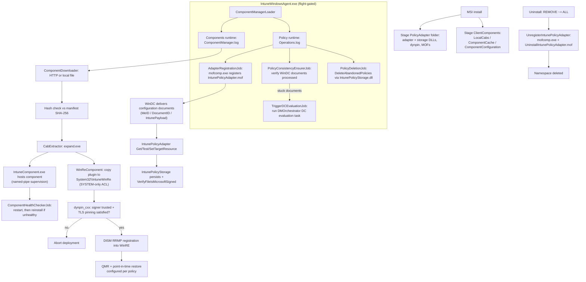
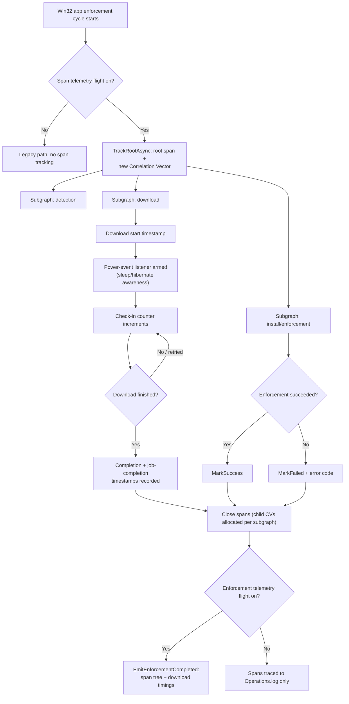
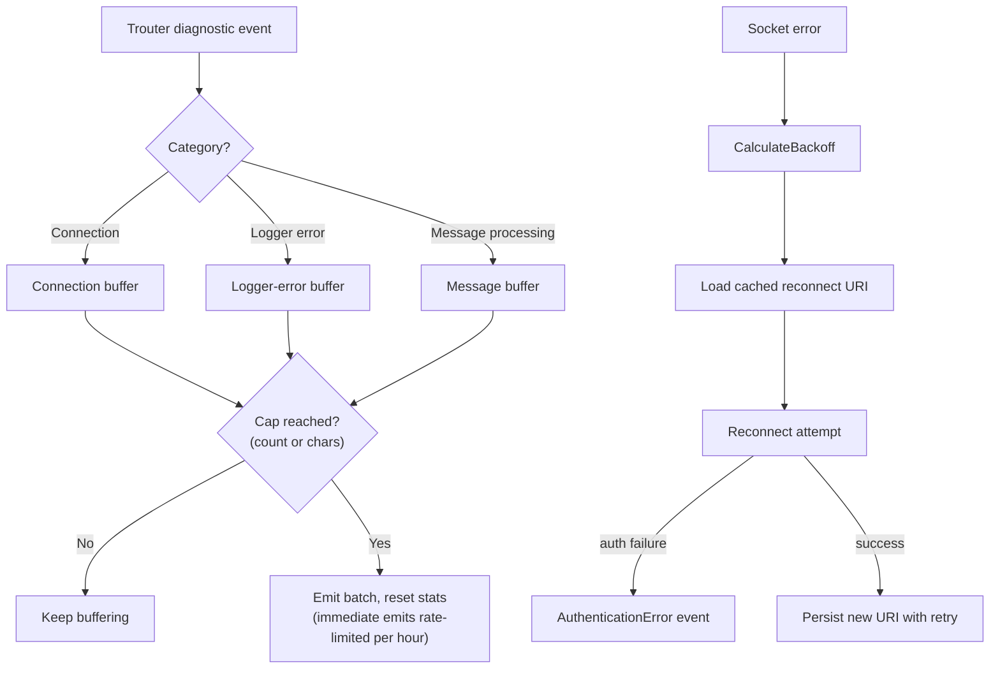
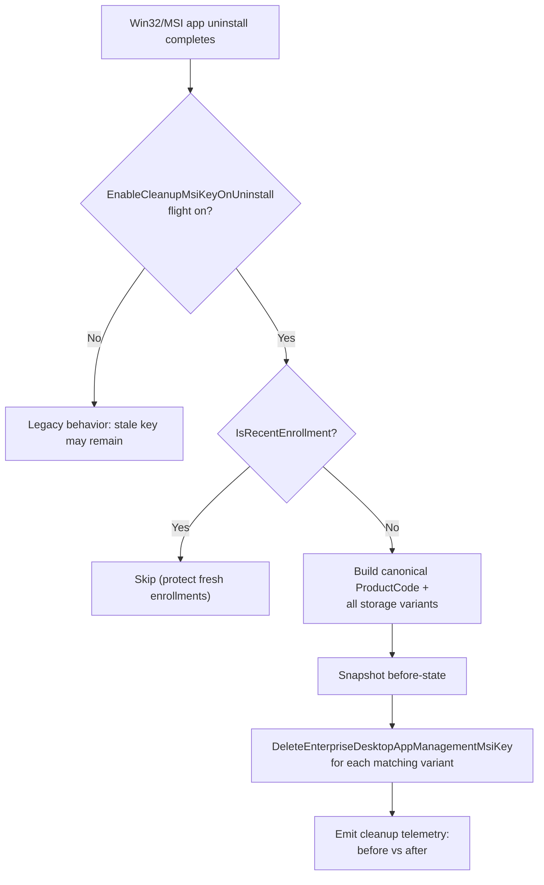

# ime-1.103.101.0-to-1.104.102.0

## Scope

This document describes the changes found between these Intune Management Extension packages:

| Package | Version |
|---|---:|
| Previous package | `1.103.101.0` |
| New package | `1.104.102.0` |

Evidence sources: MSI table comparison (`msiinfo`/`msidump`), extracted CAB payloads, ECMA-335 metadata table row counts read from each assembly's CLR header, ASCII **and UTF-16** string-heap diffing (managed string literals live in the UTF-16 `#US` heap — an ASCII-only pass misses them), direct reading of the shipped `.mof`/`.json`/`.config` text files, the extracted contents of `Microsoft.Intune.WinRe.Bundle.cab`, and the actual `IntuneWindowsAgentCustomActions` binary stream (SfxCA archive) unpacked from both MSIs. No decompiler was available, so IL-level logic is not shown; findings are structural but were cross-checked across two independently produced extractions of the same packages.

This is an independent investigation report. Presence of code does not mean a feature is active for every tenant.

## Executive summary

This is the largest IME release in this series — the package grew from 8.0 MB to 13.1 MB with **17 new files** (none removed). What it adds is best understood as three layers of one architectural change, plus incremental improvements:

1. **A Windows Declared Configuration (WinDC) policy channel.** The new `IntunePolicyAdapter` WMI/DSC provider, its native `IntunePolicyStorage` backend, and a `Policy Runtime` hosted in the agent connect IME to the WinDC/MMP-C stack (`SOFTWARE\Microsoft\DMOrchestrator`, "WinDC policy documents", declared-configuration evaluation tasks). This is a general-purpose policy pipeline — its literals already mention EPM policy types — not a single-feature bolt-on.
2. **A ComponentManager subsystem** that can download (HTTP or local file), hash-verify, CAB-extract (via `expand.exe`), install, health-check, restart, and reinstall self-contained "components", each hosted out-of-process by the new `Microsoft.Management.IntuneComponent.exe` and supervised over named-pipe IPC.
3. **The first component shipped through that pipeline: the WinRE recovery bundle** for Quick Machine Recovery / Windows Resiliency Initiative. Its own strings show it deploys to `%SystemRoot%\System32\IntuneWinRe`, registers into WinRE through DISM's RRMP APIs, and manages both **QMR** and **point-in-time restore (PITR)** configuration (restore-point frequency, retention, disk usage, user-initiated restore).

Alongside that: an `OperationSpan` distributed-tracing model (built on Microsoft Correlation Vectors) shared by the agent and the Win32 app plug-in, batched IC3/Trouter telemetry, an EnterpriseDesktopAppManagement stale-MSI-key cleanup, script "golden signal" decryption telemetry, and a routine .NET dependency refresh.

## Package-level changes

| Property | 1.103.101.0 | 1.104.102.0 |
|---|---|---|
| ProductVersion | `1.103.101.0` | `1.104.102.0` |
| ProductCode | `{58976FF3-87CA-4691-BDFC-671F37F07CB6}` | `{6A7DFC50-0395-4E1E-BF84-ED1404E72051}` |
| UpgradeCode | `{9FE9701C-0F89-40B4-B77A-AA65607E87D8}` (unchanged) | same |
| Package/Revision GUID | `{FD26577E-75B9-4537-B3E2-FDF20273FEE9}` | `{E737BF9F-9ACA-4522-B78B-14D7A9D2C12A}` |
| Build timestamp | 2026-06-25 06:56:14 | 2026-07-17 07:14:16 |
| MSI file size | 8,003,584 bytes | 13,090,816 bytes |
| Files in payload | 134 | 151 (+17 added, 0 removed) |

## New files (all 17)

| File | Version | Size | Location |
|---|---:|---:|---|
| `Microsoft.Management.IntuneComponent.exe` | 7.1.1.28 | 47,992 | `INSTALLLOCATION` |
| `Microsoft.Management.IntuneComponent.exe.config` | — | 609 | `INSTALLLOCATION` |
| `Microsoft.Management.Clients.Policy.Runtime.dll` | 7.1.1.28 | 88,440 | `INSTALLLOCATION` |
| `Microsoft.Management.Clients.Policy.Base.dll` | 7.1.1.28 | 16,208 | `INSTALLLOCATION` |
| `Microsoft.Management.Clients.Components.Runtime.dll` | 7.1.1.28 | 172,960 | `INSTALLLOCATION` |
| `Microsoft.Management.Clients.Components.Base.dll` | 7.1.1.28 | 34,640 | `INSTALLLOCATION` |
| `PolicyStorageCmdlets.dll` | 7.1.1.28 | 40,352 | `INSTALLLOCATION` |
| `IntunePolicyAdapter.dll` (native, WMI provider) | 7.1.1.28 | 780,664 | `PolicyAdapter\` |
| `IntunePolicyStorage.dll` (native) ×2 | 7.1.1.28 | 1,091,448 | `PolicyAdapter\` **and** `INSTALLLOCATION` |
| `dynpin_cxx.dll` (native, Rust) ×2 | — | 958,272 | `PolicyAdapter\` **and** `INSTALLLOCATION` |
| `IntunePolicyAdapter.mof` | — | 25,190 | `PolicyAdapter\` |
| `IntunePolicyAdapterNs.mof` | — | 231 | `PolicyAdapter\` |
| `UninstallIntunePolicyAdapter.mof` | — | 151 | `PolicyAdapter\` |
| `Microsoft.Intune.WinRe.Bundle.cab` | — | 3,853,127 | `ClientComponents\LocalCabs\` |
| `Microsoft.Intune.WinRe.Bundle.json` | — | 6,806 | `ClientComponents\ComponentConfiguration\` |

New MSI directories: `PolicyAdapter`, `IntunePolicies`, `ClientComponents`, `ClientComponents\ComponentCache`, `ClientComponents\ComponentConfiguration`, `ClientComponents\LocalCabs` — all under `INSTALLLOCATION`.

## 1. The Policy Adapter: IME joins the Windows Declared Configuration stack

### The WMI/DSC provider

`IntunePolicyAdapter.mof` registers a WMI provider (`ClsId {6B5A70A8-98F6-4D59-9A02-179AFE94A58E}`, `HostingModel = "LocalServiceHost"`) inside a new namespace created by `IntunePolicyAdapterNs.mof`:

```text
#pragma namespace("\\\\.\\root")
[NamespaceSecuritySDDL("O:BAG:BAD:P(A;;0x6001F;;;SY)")]
instance of __Namespace
{
    Name = "MicrosoftDeviceManagement_IntuneExtensibility";
};
```

The SDDL restricts the namespace to SYSTEM. The provider class, verbatim from the MOF, follows the DSC Get/Test/Set resource pattern:

```text
class IntunePolicyAdapter : OMI_BaseResource
{
    string MeID;                 // "Required configuration document MMP-C MeID."
    string DocumentID;            // "Required configuration document ID."
    string Version;               // "Configuration document Version."
    string PayloadName = "IntunePayload";
    string SettingReportIDs = ""; // split on ';' for multi-ID reporting
    string ExtendedProperties = "{}";
    string IntunePayload;         // "actions to be taken on underlying WMI providers"
    string UserSid = "";
    string Ensure = "Present";    // Present | Absent

    uint32 GetTargetResource(...);
    uint32 TestTargetResource(...);
    uint32 SetTargetResource(...);
};
```

The `MeID` description says **MMP-C** outright, and the new `Policy Runtime` (next section) confirms the wiring: this is the client end of a policy channel where Intune delivers *declared configuration documents* through the Windows Declared Configuration (WinDC) engine, and this adapter is the DSC-style resource WinDC invokes to apply and report them. The MOF's mention of "underlying WMI providers" and a per-user `UserSid` field indicate the payload can drive other WMI-based configuration on the device, per-device or per-user.

### The Policy Runtime: registration, consistency, deletion

`Microsoft.Management.Clients.Policy.Runtime.dll` (hosted in the main agent — see section 2) contains four background jobs, named in its metadata: `AdapterRegistrationJob`, `PolicyConsistencyEnsurerJob`, `PolicyDeletionJob`, and `TriggerDCEvaluationJob`. Its UTF-16 string literals spell out the mechanics:

```text
mofcomp.exe                       -namespace "
IntunePolicyAdapter.mof           IntunePolicyAdapterNs.mof
UninstallIntunePolicyAdapter.mof
AdapterRegistrationHandler: Failed to register MOF file
ROOT\MicrosoftDeviceManagement_IntuneExtensibility
CheckIfIntunePolicyAdapterIsRegistered
```

So **registration happens at agent runtime, not install time**: `AdapterRegistrationJob` checks whether the adapter is registered and, if not, runs `mofcomp.exe` against the shipped MOFs. That's why the MSI has no "Register" custom action — only the uninstall-side `UnregisterIntunePolicyAdapter` (which, per the custom-action assembly analysis in section 8, also spawns `mofcomp.exe`, with a bounded `MofCompTimeoutMilliseconds`, against `UninstallIntunePolicyAdapter.mof`).

The consistency job's literals tie the whole thing to WinDC and to the OS-side orchestrator:

```text
[PolicyConsistencyEnsurer] All WinDC documents are processed sucessfully by the Policy Runtime: WinDC documents analyzed {0}
[PolicyConsistencyEnsurer] WinDC documents in Active state to analyze {0}
[PolicyConsistencyEnsurer] Retry limit reached triggering declared configuration refresh, retry={0}
... not processed after WinDC policy document, a device configuration refresh will be triggered.
... not present in any EPM Agent policy type, a device configuration refresh will be triggered
Initiated declared configuration evaluation task at
Unable to find declared configuration evaluation task
SOFTWARE\Microsoft\DMOrchestrator
SOFTWARE\Microsoft\DeclaredConfiguration\HostOS\Config\enrollments
SOFTWARE\Microsoft\IntuneManagementExtension\IntunePolicyPlugin\Settings
NativeMethods.DeleteAbandonedPolicies() return with error {0}: {1}
```

Read together: the Policy Runtime periodically verifies that every Active WinDC document was actually processed; when documents are stuck it triggers the OS's *declared configuration evaluation* scheduled task (under `DMOrchestrator`) with a retry limit; `PolicyDeletionJob` calls into the native `IntunePolicyStorage.dll` (`DeleteAbandonedPolicies`) to purge orphaned policies; and its own settings live under `HKLM\SOFTWARE\Microsoft\IntuneManagementExtension\IntunePolicyPlugin`. The explicit mention of **EPM Agent policy types** shows Endpoint Privilege Management is one intended consumer of this channel.

### The native storage backend

`IntunePolicyStorage.dll` is native (exports `GetPolicyPayload`, `GetAllPoliciesPayload`, `GetAllPoliciesSettingsAggregatedPayload`, `VerifyFileIsMicrosoftSigned`, `DeleteAbandonedPolicies` via the runtime's native-methods wrapper). It embeds roughly a dozen SHA-256-shaped hex constants adjacent to the signature-verification export — consistent with a pinned trust allow-list, though unverifiable without disassembly. A companion PowerShell module, `PolicyStorageCmdlets.dll` (`CmdletAttribute`, `OpenHive`, `ParsePolicyKeyName`, `GetInt32Value`/`GetStringValue`), gives support engineers read access to the stored policy state; its cmdlet names are attribute-encoded and not visible as plain strings.

## 2. The ComponentManager: a component download/host/heal pipeline

### Hosting

The main agent (`Microsoft.Management.Services.IntuneWindowsAgent.exe`, +26 types / +103 methods) now owns the lifecycle of both new runtimes, confirmed by types (`IComponentManagerLoader`, `ComponentRuntimeExecutionManagerFactory`, `IIntunePolicyBackgroundExecutionManager`, `StartInternalAsync`/`StopManagerSafeAsync`, `ShouldOptimizeStartup`/`StartupOptimizationHelper`) and by two new trace sources in the shipped `.exe.config` writing to **`ComponentManager.log`** and **`Operations.log`**. Startup of the runtimes can be deferred (`EnableStartupOptimization` flight in `AgentCommon`) so agent boot isn't slowed.

Individual components run out-of-process in the new **`Microsoft.Management.IntuneComponent.exe`** ("ComponentHost", its own `ComponentHost.log` via its shipped config; .NET Framework 4.7.2). The agent supervises hosts over named-pipe IPC — `ComponentHostCommandNamedPipe`, `CommandNamedPipeIpcServer`, `ClientComponentsNamedPipesRelativeRegistryKey` (pipe names are persisted to the registry), with pipe-recycling and busy/timeout handling in the literals.

### Download, verify, install, heal

`Microsoft.Management.Clients.Components.Runtime.dll` (108 types / 344 methods) implements the pipeline, all directly evidenced in strings:

- **Download**: `DownloadComponentAsync`, `DownloadFromHttpAsync`, `DownloadFromFileUriAsync` ("ComponentDownloader: Downloading from HTTP URL:") — so components can come from the service *or* from a locally staged file, which is exactly how the WinRE bundle ships (pre-staged in `LocalCabs`).
- **Verify**: `CalculateFileHashAsync`/`ComputeHash` against the manifest's per-file SHA-256 hashes and overall `PackageHash`.
- **Extract**: `CabExtractor` runs **`expand.exe`** as a child process ("CabExtractor: expand.exe exit code: {0}").
- **Health**: `ComponentHealthCheckerJob` with a full event ladder — healthy, unhealthy, process-restart, reinstall, recovered (`COMPONENT_HEALTH_CHECK_*_EVENT_NAME`) — plus `AttemptReinstallAsync` and `DefaultMaxReinstallAttempts`. Unhealthy components get restarted, then reinstalled from the verified package, with telemetry at each step.

The `ComponentCache` and `ComponentConfiguration` folders map to this pipeline's staging and manifest storage; `ECSFlightKeyEnableComponentManager` (in `DataSensorPlugIn`) confirms the whole subsystem is ECS-flight-gated.

## 3. The first component: the WinRE bundle (QMR + point-in-time restore)

`Microsoft.Intune.WinRe.Bundle.json` manifests the co-shipped 3.85 MB CAB: six managed assemblies (including `Microsoft.Management.Clients.Policy.OfflineReader.dll` — policy reading *inside WinRE*, where the normal agent isn't running) plus native `IntuneRemoteManagementPlugin` binaries for Amd64/Arm64/I386 (`MicrosoftIntuneWinReRemoteManagementPlugin.dll`, `CoreLib.dll`, `dynpin_cxx.dll`, `SignatureValidationLibrary.dll`), every file SHA-256-hashed. Entry point: `Microsoft.Intune.WinRe.Component.WinReComponent`.

Extracting the CAB and reading `Microsoft.Intune.WinRe.Component.dll` / `Microsoft.Intune.WinRe.Registration.dll` (internal version `6.2607.1.1005`, built 2026-07-01) shows what it actually does:

- **Deploys the plugin to `%SystemRoot%\System32\IntuneWinRe\`** and refuses to copy unless the target has a SYSTEM-only ACL ("' with SYSTEM-only ACL. Aborting copy.").
- **Registers into WinRE through DISM's Remote Remediation Management Plugin (RRMP) API**: `DismRegisterRRMP`, `DismUnregisterRRMP`, `DismGetRRMPStatus`, `DismSetRRMPAltitude`, session GUID `DISM_{53BFAE52-B167-4E2F-A258-0A37B57FF845}` — with a registry-only fallback path when DISM initialization fails.
- **Manages two recovery features, not one**: `QmrConfiguration` (Quick Machine Recovery) and `PitrConfiguration` — point-in-time restore, with `RestorePointFrequency`, `RestorePointRetention`, `RestorePointDiskUsage`, and `AllowUserToInitiatePitr` settings. PITR/"Windows Recovery and Remediation" is the second pillar of Microsoft's recovery tooling announcement alongside QMR.
- Includes tick-based scheduling with exponential backoff (`BackoffUntilUtc`, "Skipping this tick") and policy tracking (`AddOrUpdate (PolicyId=`).

`dynpin_cxx.dll` (Rust; source path `src\dynpin-cxx\src\dynpinmgr.rs`) provides the trust gate: `is_payload_signer_trusted`, `is_tls_pinning_satisfied`, `perform_background_update`, `update_periodically`, `get_ec_point_from_spki` — dynamic certificate pinning with background refresh, shipped per-architecture because WinRE offers no full OS security stack.

### End-to-end flow



## 4. OperationSpan tracing (agent-wide, built on Correlation Vectors)

The span-tracing model reported in the Win32 plug-in actually lives in **`AgentCommon.dll`** (+24 types / +136 methods) and is shared infrastructure: `OperationSpan`, `SpanContext`, `SpanSerializer`, `TrackRoot`/`TrackRootAsync`/`TrackAsync`, `MarkSuccess`/`MarkFailed`, `OperationStatus`, with **Microsoft Correlation Vector** plumbing (`CorrelationVector`, `AllocateChildCV`, `GetCVDepth`, `MaxCVDepth`, `OriginCvKey`/`ParentCvKey`) and output guardrails (`MaxPropertiesCount`, `MaxPropertyValueLength`, `ExceedsBreadthLimit`, `SanitizeForTelemetry`, `LogEmissionWarningThrottled`). Spans are traced to the new `Operations.log` (`TraceOperationEvent`/`OperationsLog`) and gated by `OperationSpanLoggingEnabled`.

`Win32AppPlugIn.dll` (+26 types / +111 methods) is the first big consumer: root/subgraph span tracking around enforcement (`ProcessSubgraph`, `AddPolicyDetailsToOperation`, `AddExecutorOutcomeToOperation`, `EmitEnforcementCompleted`, `GetEnforcementErrorCode`), flight-gated by `Win32AppOperationSpanTelemetryEnabledKey`/`Win32AppEnforcementTelemetryEnabledKey`, plus explicit download timing keys (`DownloadStartTimeKey`, `DownloadCompletionTimeKey`, `DownloadJobCompletionTimeKey`, `DownloadCheckInCountKey`, `DownloadStatusKey`) and a power-event listener (`EnsurePowerEventListenerStarted`) — presumably to account for sleep/hibernate during long downloads.



## 5. IC3/Trouter telemetry batching

New in `IntuneWindowsAgent.exe`: a bounded, batched aggregation layer for three categories of IC3/Trouter (real-time messaging channel) diagnostics — `IC3ConnectionEventStats/Entry`, `IC3LoggerErrorStats/Entry`, `IC3MessageProcessingStats/Entry` — with buffer caps (`MaxBufferedConnectionEvents`, `MaxBufferedLoggerErrors`, `MaxBufferedMessageProcessing`, `MaxCharsPerBatch`, `MaxImmediateEmitsPerHour`) and batch emitters (`EmitConnectionEventBatches` etc.), likely to control telemetry volume. `Microsoft.IC3.Trouter.dll` moved `1.2.9.0` → `1.2.18.0` (+4,888 bytes) with reconnection-resilience additions: `CalculateBackoff`, `IReconnectUriStore` (cached reconnect URI persisted with retry), and a new `AuthenticationError` event.



## 6. EnterpriseDesktopAppManagement MSI key cleanup

Present in `AgentCommon.dll`, `IntuneWindowsAgent.exe`, and `ScriptPlugIn.dll`. The `AgentCommon` strings give more precision than previously reported: `GetEnterpriseDesktopAppManagementProductCodeVariants`, `TryBuildCanonicalProductCode`, `AddProductCodeVariant` (the CSP historically stores product codes in multiple GUID formats — braces, case, compressed — so cleanup must match variants), `IsRecentEnrollment` (a guard so fresh enrollments aren't touched), and the flight **`EnableCleanupMsiKeyOnUninstall`** — indicating the cleanup fires when an app is uninstalled, removing its stale `EnterpriseDesktopAppManagement` CSP registry entry, with before/after snapshot telemetry (`EnterpriseDesktopAppManagementCleanupSnapshot`/`...CleanupTelemetryContext`).



## 7. Script plug-in: decryption "golden signals"

`ScriptPlugIn.dll` + `AgentCommon.dll` add `IScriptGoldenSignalProvider`/`ScriptGoldenSignals`/`NullScriptGoldenSignalProvider` with `LogDecryptionSuccess`/`LogDecryptionFailure`, `DecryptionEventName`, and the flight `EnablePSScriptDecryptionSignalFlight`. Reading the names precisely: this is **observability ("golden signals") around the existing encrypted-script decryption path**, not new encryption — IME has long decrypted policy-delivered script content; what's new is flight-gated success/failure telemetry (with a `decryptionCode`) around it. A `PolicySecurityMode` enum value appears alongside, suggesting the decryption signal distinguishes policy security modes.

## 8. MSI mechanics and the custom-action assembly (cross-checked)

Three new custom actions, all uninstall-scoped:

```text
RemoveIntunePoliciesFolder     REMOVE ~= "ALL" AND (NOT UPGRADINGPRODUCTCODE)   seq 6592
RemoveClientComponentsFolder   REMOVE ~= "ALL" AND (NOT UPGRADINGPRODUCTCODE)   seq 6591
UnregisterIntunePolicyAdapter  REMOVE ~= "ALL" AND (NOT UPGRADINGPRODUCTCODE)   seq 3499
```

The actual custom-action assembly (`SideCarSetupCustomActions.dll`, extracted from the MSI's `IntuneWindowsAgentCustomActions` binary stream) grew by exactly 6 methods and 1 field between the two builds: the three action entry points above, plus `ConfigureFolderPermissions`/`GetDefaultInstallationFolderPermissions`/`GetRestrictedPermissions` (private helpers — the existing `ConfigureInstallationFolderPermission` action was extended in place to apply restricted ACLs to the new folders), plus the `MofCompTimeoutMilliseconds` field with process-launch members (`get_ExitCode`, `set_WorkingDirectory`, `get_SystemDirectory`, async output reading) — the uninstall-side `mofcomp.exe` invocation. Existing actions only shifted sequence numbers; conditions and relative order are unchanged. `Property`/`Upgrade`/`Signature` reflect the version bump only. All table-level findings were independently cross-checked against a second extraction toolchain and matched exactly.

**Version caveat for the custom-action evidence**: the second extraction's "new" build is `1.104.56.0000` (`{6BC2537A-3B69-40E5-BC1C-0FD9C1CCDAB6}`) — an adjacent internal build, not `1.104.102.0` itself. Its `CustomAction` table matches `1.104.102.0` exactly and its `dynpin_cxx.dll` is byte-identical (MD5 `957473f3501b32bda4e5b3b6cc14b004`), so the findings almost certainly carry over, but they were not verified against `1.104.102.0`'s own custom-action binary.

## 9. No functional change, despite file churn

- `Flighting.dll` (46/204/150/39), `TamperProtection.dll` (33/143/70/7): metadata row counts identical to 1.103.101.0; only version stamps, PDB paths, and signature metadata moved. No new certificate data in TamperProtection this release.
- `ClientHealthEval.exe`: essentially flat (−1 method, −1 field). **`HealthCheck.xml` is byte-identical** — the ProcessMonitoring health check added in 1.103 is unchanged here.
- `Common.Base/Telemetry/EtwProvider.Sidecar.dll`: version-stamp wave `7.1.1.18` → `7.1.1.32` (the family now shared with the six new Policy/Components DLLs at `7.1.1.28`), single-digit-KB deltas.
- `WindowsPackageManager.dll` / `Microsoft.Management.Deployment.InProc.dll`: byte-size identical — no WinGet engine change this release.
- Removed strings across the diffed assemblies: nothing functionally meaningful (a handful of compiler-generated and logging identifiers).

## 10. .NET dependency refresh

The `System.*`/`Microsoft.Extensions.*`/`Microsoft.Bcl.*` family moves `10.0.626.17701` → `10.0.926.27113`, with `.exe.config` binding redirects moving in lockstep `0.0.0.0-10.0.0.6` → `0.0.0.0-10.0.0.9` — a routine BCL refresh. Both `Microsoft.Management.Services.IntuneWindowsAgent.exe.config` and its `.bak` shadow copy grew identically (+709 bytes), confirming the 1.102-era shadow-config mechanism is being maintained in sync.

## Evidence and confidence

### High confidence (directly readable text, exported symbols, or new types/strings absent from 1.103.101.0 — several cross-checked across two extractions)

- The Policy Adapter is a WinDC/MMP-C-integrated policy channel: MOF text, `mofcomp.exe -namespace` literals, WinDC-document consistency logging, `DMOrchestrator` DC-evaluation task triggering, `DeleteAbandonedPolicies`, and the `IntunePolicyPlugin` registry path are all verbatim strings.
- Runtime (not install-time) adapter registration via `AdapterRegistrationJob` + `mofcomp.exe`; uninstall-side `mofcomp.exe` with timeout in the custom-action assembly.
- ComponentManager pipeline: HTTP/file download, SHA-256 verification, `expand.exe` CAB extraction, named-pipe-supervised out-of-process hosting in `IntuneComponent.exe`, and health-check → restart → reinstall — all verbatim strings in `Components.Runtime.dll`.
- WinRE bundle behavior: `System32\IntuneWinRe` deployment with SYSTEM-only ACL enforcement, DISM RRMP registration APIs, and QMR **plus PITR** (restore-point frequency/retention/disk-usage/user-initiated) configuration — verbatim strings inside the extracted CAB's own binaries.
- `OperationSpan`/Correlation Vector tracing in `AgentCommon` with `Win32AppPlugIn` as first consumer; IC3 telemetry batching; EDAM cleanup (uninstall-triggered, variant-matching, enrollment-guarded); script decryption golden signals.
- Non-changes: Flighting/TamperProtection/ClientHealthEval/HealthCheck.xml/WinGet engine.

### Inferred, not confirmed

- The SHA-256-shaped constants in `IntunePolicyStorage.dll` as a pinned trust allow-list (adjacent to `VerifyFileIsMicrosoftSigned`, but not disassembled).
- The exact trigger conditions and ordering of the four Policy Runtime jobs (names and log strings are confirmed; scheduling specifics are not).
- Carry-over of the custom-action findings from build `1.104.56.0000` to `1.104.102.0` exactly (strongly supported, see section 8 caveat).

### Flight or server dependent

`ECSFlightKeyEnableComponentManager`, `EnableStartupOptimization`, `EnableCleanupMsiKeyOnUninstall`, `EnablePSScriptDecryptionSignalFlight`, `OperationSpanLoggingEnabled`, `Win32AppOperationSpanTelemetryEnabledKey`/`Win32AppEnforcementTelemetryEnabledKey`, `ECSFlightKeyDisableInstanceLevelEpmEvents`, and whatever server-side rollout controls WinDC document delivery and QMR/`RemoteRemediation` CSP enablement.

## Suggested validation

**Policy Adapter / WinDC**: on an upgraded device with the ComponentManager flight enabled, watch for `mofcomp.exe` child processes of the agent (Process Monitor), then `Get-CimInstance -Namespace root -ClassName __Namespace | ? Name -match IntuneExtensibility`. Check `HKLM\SOFTWARE\Microsoft\IntuneManagementExtension\IntunePolicyPlugin` and correlate `Operations.log` `[PolicyConsistencyEnsurer]` entries with the `DMOrchestrator` scheduled task's run history.

**ComponentManager**: check for `ComponentManager.log` and `ComponentHost.log`, a running `Microsoft.Management.IntuneComponent.exe`, and named-pipe names under the ClientComponents registry key. Kill the component host process and confirm the health checker's restart (and, repeated, reinstall) events.

**WinRE bundle**: after component deployment, verify `%SystemRoot%\System32\IntuneWinRe\` exists with a SYSTEM-only ACL and query WinRE plugin registration (`reagentc /info`, DISM RRMP status). Check that QMR/PITR settings delivered via the `RemoteRemediation` CSP or Settings Catalog appear in the component's policy store.

**Win32 span telemetry / EDAM cleanup / decryption signals**: as per the respective flights — install/uninstall a Win32 MSI app and check the EDAM CSP node before/after; run an encrypted platform script and look for the decryption golden-signal event.

**Uninstall**: uninstall IME and confirm `mofcomp.exe` launches (ProcMon), the WMI namespace disappears, and the `PolicyAdapter`/`IntunePolicies`/`ClientComponents` folders are removed.

## Final assessment

`1.104.102.0` is an architectural release, not an incremental one. Underneath the headline — Quick Machine Recovery — IME gains three durable pieces of infrastructure: a Windows Declared Configuration policy channel (`IntunePolicyAdapter` + Policy Runtime + native policy storage), a generic component delivery/hosting/healing pipeline (ComponentManager + `IntuneComponent.exe`), and agent-wide distributed tracing (OperationSpan on Correlation Vectors). The WinRE recovery bundle — which itself manages both QMR and point-in-time restore via DISM's RRMP interfaces — is best read as the *first tenant* of that infrastructure rather than its purpose; the Policy Runtime's own strings already name EPM as another consumer. Everything else (IC3 batching, EDAM cleanup, decryption signals, BCL refresh) is incremental, and several files that changed version stamps (`Flighting.dll`, `TamperProtection.dll`, WinGet engine) show no structural change at all.

Sources:
- [Windows Resiliency Initiative | Windows Security & Business Continuity](https://www.microsoft.com/en-us/windows/business/windows-resiliency-initiative)
- [Quick Machine Recovery: Built-In Resilience for Windows 24H2](https://patchmypc.com/blog/quick-machine-recovery-windows/)
- [Windows Recovery and Remediation for Quick Machine Recovery](https://patchmypc.com/blog/windows-recovery-and-remediation/)
- [How to enable and configure Quick Machine Recovery with Intune - Ugur Koc](https://ugurkoc.de/how-to-enable-and-configure-quick-machine-recovery-with-intune/)
- [Getting started with Quick Machine Recovery - All about Microsoft Intune](https://petervanderwoude.nl/post/getting-started-with-quick-machine-recovery/)
- [Scalable Windows Resiliency with new recovery tools - Windows IT Pro Blog](https://techcommunity.microsoft.com/blog/windows-itpro-blog/scalable-windows-resiliency-with-new-recovery-tools/4470659)
