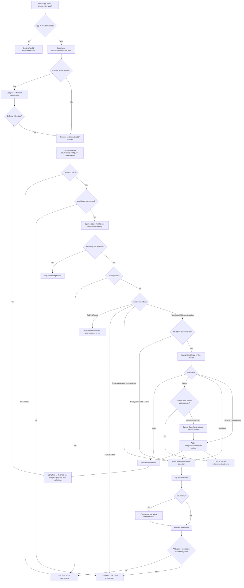
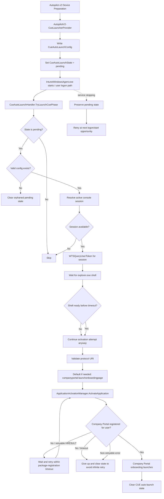
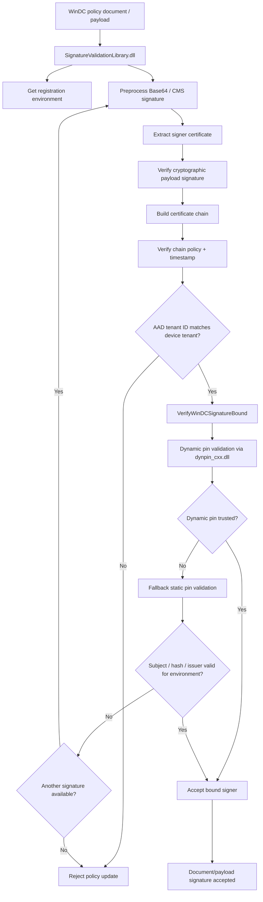
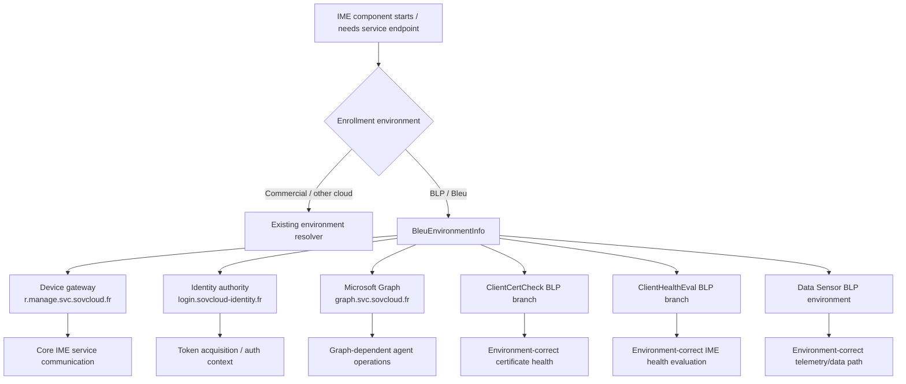
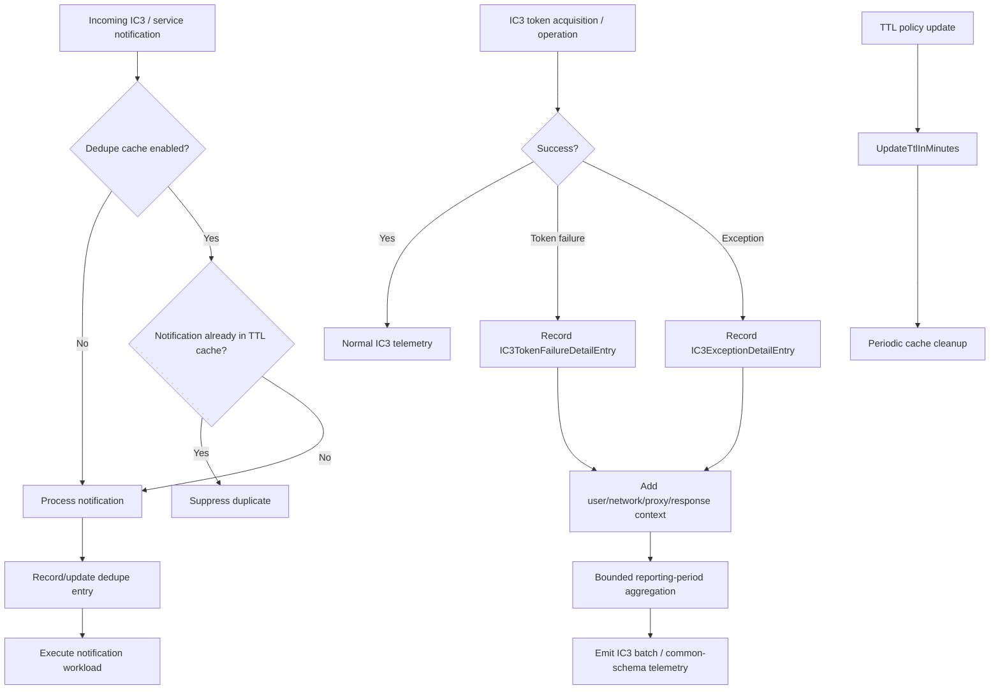
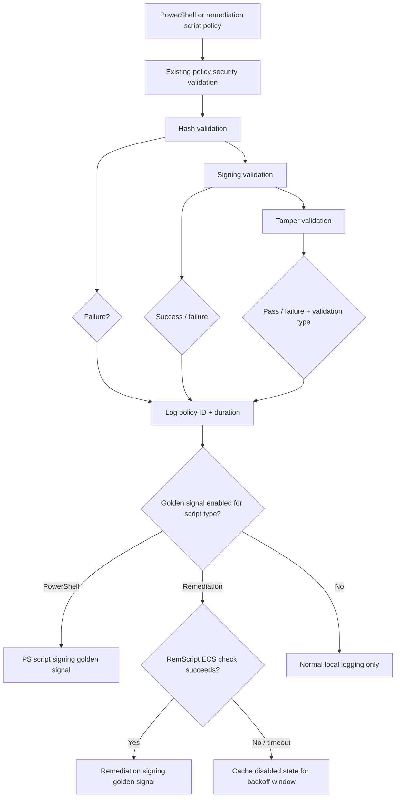

# ime-1.104.102.0-to-1.105.101.0

## Scope

This document describes the changes found between these Intune Management Extension packages:

Package | Version
--- | ---
Previous package | `1.104.102.0`
New package | `1.105.101.0`

Evidence sources: MSI database/table comparison, complete extraction of both embedded CAB payloads, SHA-256 comparison of every payload file, ECMA-335 metadata table comparison for managed assemblies, managed metadata/type/method/field/ImplMap inspection, ASCII and UTF-16 string diffing, PE import/export inspection for new native DLLs, direct reading of the Bootstrapper ETW manifest, direct comparison of the existing WinRE CAB and manifest, and extraction/comparison of the actual `IntuneWindowsAgentCustomActions` SfxCA binary stream from both packages.

The embedded MSI cabinets contain a few alias file records that refer to the same compressed payload extent and records that are not strictly folder ordered. A working copy of each CAB index was normalized so standard extraction tooling could read every file. The compressed data itself was not modified. All 151 files from `1.104.102.0` and all 153 files from `1.105.101.0` were extracted and compared.

No full managed IL or native-code decompilation was used. Findings below are based on package structure, metadata, strings, exported/native API surfaces, manifests, and cross-component correlation. Where the evidence supports behavior but not the exact call site or activation condition, that is called out as inferred.

A second verification pass independently re-extracted both MSI cabinets, re-counted and re-hashed every payload file, re-ran managed TypeDef/MethodDef and new-name comparisons across all changed managed binaries, rechecked the new native exports/imports, extracted the unchanged nested WinRE CAB, and compared its AMD64 trust libraries with the new root copies. That pass also widened the string-diff sweep across all 77 changed shared files. The second pass produced three material refinements reflected below: explicit Bleu/BLP support was expanded and deserved its own section; the App In Use ImeUI handler names were tightened to the actual metadata; and the new root WinDC trust DLLs were confirmed to be newer, distinct builds rather than byte-for-byte copies of the WinRE versions.

This is an independent reverse-engineering report. Presence of code does not mean a feature is active for every tenant.

## Executive summary

`1.105.101.0` is smaller in architectural scope than `1.104.102.0`, but it contains several substantial feature additions inside existing assemblies. The MSI grows by about 639 KB, adds only two files, and leaves the new `1.104` Policy Adapter, Policy Runtime, ComponentManager, and WinRE recovery bundle byte-identical.

The important changes are elsewhere:

1. **Win32 App In Use becomes a first-class enforcement path.** `Win32AppPlugIn.dll` grows by 30 types and 206 methods and now contains process rules, process detection, critical-process protection, four in-use enforcement modes, interactive prompting, deferrals, countdowns, cancel/terminate handling, safe process termination, post-kill verification, and wake-time scheduling for deferred apps. `ImeUI.exe` gets the matching user prompt. The service-contract layer also adds dedicated App In Use failure/result codes for invalid configuration, detection timeout/API failure, critical processes, process respawn/PID safety, prompt launch failure, and FailAndReport.
2. **Autopilot v2 gains a Continuous User Experience launcher.** The Bootstrapper provider can stage a CUE auto-launch request, while the main IME service waits for the user shell and Company Portal package registration before activating `companyportal:launchonboardingpage` in the active user's session. New ETW events `460-467` and `470-474` instrument the complete path.
3. **The WinDC signature-validation stack moves into the main IME install.** Two native DLLs, `CoreLib.dll` and `SignatureValidationLibrary.dll`, are newly installed at `INSTALLLOCATION`. The latter exposes WinDC document/payload/leaf-certificate verification, tenant binding, certificate chain/timestamp validation, dynamic pinning through `dynpin_cxx.dll`, and static pin fallback. The same library family already existed inside the unchanged WinRE bundle in `1.104`, but the new root x64 builds are version `7.1.1.28` and are not byte-identical to the AMD64 WinRE `7.1.1.26` binaries.
4. **The signature library was prewired one release earlier.** The byte-identical `Microsoft.Management.Clients.Common.Base.dll` already contains a P/Invoke for `GetRegistrationEnvironment` from `SignatureValidationLibrary.dll` in `1.104`. `1.105` now installs a root native dependency that satisfies that bridge, strongly indicating a staged rollout rather than a one-build implementation.
5. **Bleu/BLP support expands into core IME routing and health paths.** `AgentCommon` adds `BleuEnvironmentInfo` plus French sovereign management, identity, and Graph endpoints. The main service, ClientCertCheck, and ClientHealthEval add explicit `IsEnrolledWithIntuneBLP` / `OnStart, this is bleu (BLP) env.` branches. Some BLP awareness already existed elsewhere in `1.104`, so this is an expansion into core agent components, not the first Bleu reference in IME.
6. **IC3 notification handling gets duplicate suppression and better failure diagnostics.** The main agent adds a TTL-based notification dedupe cache plus detailed token-failure and exception records with response status, user-logon, network, and proxy context. `AgentCommon` also adds `DeviceTokenResult` and rebuilt async token-request state machines. `Microsoft.IC3.Trouter.dll` moves `1.2.18.0` to `1.2.23.0` with registration-version reconciliation and expired-transport handling.
7. **Script security telemetry becomes more explicit.** The script plug-in adds per-policy timing for hash, signing, and tamper validation. `AgentCommon` adds PowerShell and remediation-script signing golden signals, including an ECS-controlled remediation-script path.
8. **The MSI installer itself barely changes.** No new custom actions, registry rows, services, install sequence entries, directories, or uninstall mechanics were added. The custom-action assembly has identical metadata shape and only build/version churn. The two native signature DLLs are ordinary new MSI components attached to the existing product feature.

The headline for this build is therefore not “two new DLLs.” It is **safer application enforcement, a new post-provisioning Company Portal handoff, broader sovereign-cloud routing, and the next stage of the WinDC trust chain introduced in 1.104.**

## Package-level changes

Property | 1.104.102.0 | 1.105.101.0
--- | --- | ---
ProductVersion | `1.104.102.0` | `1.105.101.0`
ProductCode | `{6A7DFC50-0395-4E1E-BF84-ED1404E72051}` | `{EA1E4C91-8D4A-4185-960A-B6F13EC6424C}`
UpgradeCode | `{9FE9701C-0F89-40B4-B77A-AA65607E87D8}` | same
Package/Revision GUID | `{E737BF9F-9ACA-4522-B78B-14D7A9D2C12A}` | `{9589A41D-2E5C-458D-8F38-4925EF548C9D}`
Build timestamp | 2026-07-17 07:14:16 | 2026-08-11 20:52:36
MSI SHA-256 | `4d6b85fd3c49cf227ab4711308bca1f3c701cad9bff1799da4c6b6616066bb5e` | `805eafae177a9c3f660283886d2ace1577c316f3bf06993d7a6666ae9db83cb3`
MSI file size | 13,090,816 bytes | 13,729,792 bytes (`+638,976`, about `+4.88%`)
Embedded CAB size | 12,503,402 bytes | 13,135,926 bytes (`+632,524`, about `+5.06%`)
Files in payload | 151 | 153 (`+2`, `0` removed)
Shared files changed | — | 77
Shared files byte-identical | — | 74

The MSI still uses WiX Toolset `5.0.2.0`.

## New files (all 2)

File | Version | Size | MSI component | Location | SHA-256
--- | --- | ---: | --- | --- | ---
`CoreLib.dll` | `7.1.1.28` | 1,231,184 | `f_495A5463` / `{495A5463-3B00-47F3-98FD-1D33E1513BE7}` | `INSTALLLOCATION` | `5285fcaee9c27dc8a7b1c65f1871f2171c7721a6d860625bb934f66b7a2ca9d9`
`SignatureValidationLibrary.dll` | `7.1.1.28` | 513,360 | `f_A35BE4C7` / `{A35BE4C7-526C-4C50-9E94-80A9E2459238}` | `INSTALLLOCATION` | `c5ae60b1a235fc381d4edae3848e099543a77c306921497c8ab80d2bd0c8697a`

Both components are attached to the existing `ProductFeature`; there is no new MSI feature, directory, service, custom action, or registry configuration associated with them.

## Largest managed-code deltas

Assembly | TypeDef | MethodDef | Size delta
--- | ---: | ---: | ---:
`Microsoft.Management.Clients.IntuneManagementExtension.Win32AppPlugIn.dll` | `660 -> 690` | `3178 -> 3384` | `+61,952`
`Microsoft.Management.Services.IntuneWindowsAgent.exe` | `233 -> 251` | `1038 -> 1144` | `+29,696`
`Microsoft.Management.Services.IntuneWindowsAgent.AgentCommon.dll` | `651 -> 658` | `3182 -> 3263` | `+13,272`
`ImeUI.exe` | `9 -> 11` | `84 -> 107` | `+11,304`
`Microsoft.Management.Services.BootstrapperAgentCore.dll` | `126 -> 128` | `603 -> 620` | `+3,544`
`Microsoft.IC3.Trouter.dll` | `318 -> 320` | `1762 -> 1777` | `+3,584`
`Microsoft.Management.Services.BootstrapperAgentEtwProvider.dll` | `4 -> 4` | `120 -> 133` | `+3,584`
`Microsoft.Management.Clients.IntuneManagementExtension.AppEnforcementProcessor.dll` | `73 -> 75` | `516 -> 528` | `+2,520`
`Microsoft.Management.Services.DevicePreparationProviderCommon.dll` | `19 -> 20` | `98 -> 110` | `+2,088`
`Microsoft.Management.Clients.IntuneManagementExtension.ScriptPlugIn.dll` | `90 -> 90` | `432 -> 432` | `+1,496`

The first four rows account for most of the visible new feature surface.

# 1. Win32 App In Use: detection, deferral, prompting, and safe termination

The largest change in the package is in `Win32AppPlugIn.dll`: `+30` TypeDefs, `+206` MethodDefs, and `+61,952` bytes.

New types form a complete subsystem rather than a few helper methods:

```text
Microsoft.Management.Clients.IntuneManagementExtension.Win32AppPlugIn.AppInUse.AppInUsePromptLauncher
Microsoft.Management.Clients.IntuneManagementExtension.Win32AppPlugIn.AppInUse.DetectedProcess
Microsoft.Management.Clients.IntuneManagementExtension.Win32AppPlugIn.AppInUse.IAppInUsePromptLauncher
Microsoft.Management.Clients.IntuneManagementExtension.Win32AppPlugIn.AppInUse.IProcessDetector
Microsoft.Management.Clients.IntuneManagementExtension.Win32AppPlugIn.AppInUse.IProcessTerminator
Microsoft.Management.Clients.IntuneManagementExtension.Win32AppPlugIn.AppInUse.ImeUiCommandLineBuilder
Microsoft.Management.Clients.IntuneManagementExtension.Win32AppPlugIn.AppInUse.ProcessDetectionResult
Microsoft.Management.Clients.IntuneManagementExtension.Win32AppPlugIn.AppInUse.ProcessDetector
Microsoft.Management.Clients.IntuneManagementExtension.Win32AppPlugIn.AppInUse.ProcessTerminationResult
Microsoft.Management.Clients.IntuneManagementExtension.Win32AppPlugIn.AppInUse.ProcessTerminator
Microsoft.Management.Clients.IntuneManagementExtension.Win32AppPlugIn.AppInUse.TerminationOutcome
Microsoft.Management.Clients.IntuneManagementExtension.Win32AppPlugIn.AppInUse.TerminationResult
Microsoft.Management.Clients.IntuneManagementExtension.Win32AppPlugIn.DeferralEnforcementActionHandler
Microsoft.Management.Clients.IntuneManagementExtension.Win32AppPlugIn.InUseEnforcementType
Microsoft.Management.Clients.IntuneManagementExtension.Win32AppPlugIn.InUseExperience
Microsoft.Management.Clients.IntuneManagementExtension.Win32AppPlugIn.InUseRule
Microsoft.Management.Clients.IntuneManagementExtension.Win32AppPlugIn.OperationalState.DeferralState
Microsoft.Management.Clients.IntuneManagementExtension.Win32AppPlugIn.OperationalState.InUseDeferralConfiguration
Microsoft.Management.Clients.IntuneManagementExtension.Win32AppPlugIn.SimulatedDeferralEnforcementActionHandler
```

### New policy model

`InUseExperience` exposes the policy shape directly:

```text
EnforcementType
NumberOfDeferrals
MinutesBetweenDeferrals
CountdownMinutes
Rules
```

Each `InUseRule` contains at least:

```text
DisplayName
ProcessName
```

The enforcement enum contains four modes:

```text
SkipDetection
FailAndReport
TerminateWithoutUserInteraction
TerminateWithUserInteraction
```

That gives the service a much richer choice than simply “install now” or “fail because a process is running.”

### Deferral state is persisted

The plug-in adds a stored `DeferralState` containing:

```text
DeferralsUsed
DeferUntilTime
InitiationTime
MaxDeferrals
MinutesBetweenDeferrals
CountdownMinutes
AutoDeferred
```

New methods include `GetActiveDeferral`, `AdvanceDeferral`, `SetDeferralInitiated`, `SetDeferralResult`, `ClearDeferralState`, `GetEarliestActiveAppInUseDeferralExpiryUtc`, and `MergeDeferralExpiryIntoWakeTime`.

This means a user deferral is not just an ImeUI response. It becomes part of the Win32 enforcement graph and scheduling state. An active deferral can move the next agent wake time forward to the deferral expiry, and an expired deferral can force a subgraph to process even when the normal reevaluation interval has not expired.

The plug-in also protects staged content while a deferral is active:

```text
Skipping content cleanup for {0} because it has a pending start deadline or active deferral.
```

If policy changes while a deferral is already active, the code explicitly refers to using **pinned app-in-use deferral settings**, which prevents a live server-side change from silently mutating an already-granted deferral window.

When no deferrals remain, the new path moves into the final enforcement attempt instead of granting another deferral.

### Process detection is deliberately race-aware

The new `ProcessDetector` does more than compare process names from a snapshot.

It:

* Enumerates process rules with a bounded timeout.
* Opens matched processes and keeps a verified process handle.
* Resolves the image name from the opened handle and compares it again with the configured rule.
* Detects a possible PID reuse race and skips that process if the opened handle resolves to a different image than the original process enumeration.
* Treats process criticality as a blocking safety condition.
* Re-runs a termination-bound detection immediately before termination.
* Treats enumeration/API failures or timeouts as explicit failure state instead of assuming the process is safe to terminate.

The strings are unusually explicit about the security intent:

```text
PID reuse suspected. Skipping.
Refusing to terminate by PID. Recording unverified-handle skip.
No processes will be killed and enforcement will be blocked.
Critical process detected ... No processes will be terminated and no prompt will be shown.
```

New helpers `CheckIsProcessCritical` and `CheckIsProcessCriticalByHandle`, together with AgentCommon's native process wrappers, protect Windows critical processes from this new forced-close path.

### Termination is graceful first, forceful second, then verified

`ProcessTerminator` adds:

```text
TryGracefulClose
TerminateProcesses
TerminateSingleProcess
VerifyProcessesTerminated
```

`TerminationOutcome` distinguishes:

```text
AlreadyExited
ClosedGracefully
KilledForcefully
FailedToKill
TerminationNotConfirmed
SkippedUnverifiedHandle
```

So forced application closure is not a blind `TerminateProcess` call. IME first tries a graceful close, can force termination when needed, waits on the verified handle, and performs a fresh post-kill process detection pass. If IME cannot confirm that the process is gone, enforcement fails rather than continuing under a false assumption.

### Userless, ESP, and Autopilot v2 behavior

The code contains a specific fallback for `TerminateWithUserInteraction` when there is no session in which a prompt can be shown:

```text
userless/system check-in or ESP/APV2 provisioning
```

In that situation the effective mode changes to `TerminateWithoutUserInteraction`.

That is an important distinction for required applications during provisioning: the policy can still define an interactive user experience for normal desktop enforcement while the same rule remains enforceable during a system-only provisioning phase where no user UI can exist.

### Concurrent multi-user sessions are excluded

There is also an explicit guardrail:

```text
App policy ... will not be evaluated because the app in-use feature is not supported on a concurrent multi-user session device. The app will be reported as not applicable.
```

So this new app-in-use experience is not universally applicable to every Windows session model.

### App In Use gets explicit reportable failure outcomes

`Microsoft.Management.Services.IntuneWindowsAgent.AgentCommon.ServiceContracts.dll` adds dedicated App In Use result/error names that were absent in `1.104`:

```text
AppInUseCriticalProcessDetected
AppInUseDetectionApiFailed
AppInUseDetectionTimeout
AppInUseFailAndReport
AppInUseInvalidConfig
AppInUseProcessRespawned
AppInUsePromptLaunchFailed
```

This matters because the feature is not only a local UI/enforcement branch. IME now has service-contract vocabulary for distinguishing why App In Use enforcement could not proceed. `AppInUseProcessRespawned` also lines up with the PID-reuse/race defenses visible in `ProcessDetector`, while `AppInUseCriticalProcessDetected` lines up with the explicit refusal to terminate a critical process.

### Required apps do not simply accept Cancel

A second-pass string review found an important policy distinction. The handler explicitly logs that if a required policy returns `Cancel`, that policy does not offer Cancel; IME ignores that response and resolves the next action from local state. In other words, the visible `Cancel` result exists in the shared prompt protocol, but it must not be interpreted as “a user can always cancel a required app.”

### App In Use enforcement flow



# 2. ImeUI gets the matching App In Use experience

`ImeUI.exe` grows from `246,648` to `257,952` bytes and adds two concrete types:

```text
Microsoft.Management.Clients.IntuneWindowsAgent.ImeUI.AppInUsePrompt
Microsoft.Management.Clients.IntuneWindowsAgent.ImeUI.AppInUsePromptHandler
```

The new prompt has two method-level click handlers in metadata:

```text
SecondaryButton_Click
TerminateNowButton_Click
```

The secondary button is context-sensitive. Its log branches are labeled `CancelButton_Click` or `DeferButton_Click`, which is why both actions are visible in strings even though they are not separate method names. This is a metadata-level naming correction from the first pass; the user-visible Cancel/Defer behavior remains the same.

New resources make the intended experience clear:

```text
The installation will continue in:
Cancel installation
Defer installation
Close now and install
You are installing {0}. Before the installation can continue, software currently in use must be closed.
Your organization is installing {0}. Before the installation can continue, software currently in use must be closed.
```

The command-line payload passed from the Win32 plug-in to ImeUI includes the detected process names, whether the app is Available, remaining deferrals, and prompt timeout.

The prompt also calls `SHQueryUserNotificationState`. If Windows indicates that the current notification state is unsuitable, the code can suppress the prompt instead of blindly displaying UI. The suppression decision receives `isAvailableApp` and `deferralsRemaining`, which allows the enforcement layer to choose an appropriate fallback rather than treating “UI not shown” as an unexplained launch failure.

Every localized `ImeUI.resources.dll` in the package changed or grew, matching the introduction of a user-visible prompt rather than an English-only prototype.

`AgentCommon.dll` adds a corresponding `AppInUsePromptExitCode` enum:

```text
Unknown
Terminate
Defer
Cancel
Timeout
Suppressed
LaunchError
UnknownError
```

This is a proper request/response contract between the Win32 enforcement engine and ImeUI.

# 3. Autopilot v2 Continuous User Experience auto-launch

The second major feature is split between the Device Preparation Bootstrapper and the main IME service.

`Microsoft.Management.Services.BootstrapperAgentCore.dll` adds:

```text
Microsoft.Management.Services.BootstrapperAgentCore.Provider.Providers.ContinuousUserExperienceLauncher.ContinuousUserExperienceLauncherProvider
Microsoft.Management.Services.BootstrapperAgentCore.Provider.Contexts.ContinuousUserExperienceLauncher.ContinuousUserExperienceLauncherContext
```

The provider name is:

```text
AutopilotV2-CueLauncherProvider
```

The context carries:

```text
ProtocolUri
ShellWaitTimeoutSeconds
PackageRegistrationWaitTimeoutSeconds
```

`Microsoft.Management.Services.DevicePreparationProviderCommon.dll` adds `CueAutoLaunchConfig` and state/config helpers including:

```text
GetCueAutoLaunchState
SetCueAutoLaunchState
ClearCueAutoLaunchState
GetCueAutoLaunchConfig
SetCueAutoLaunchConfig
CueAutoLaunchState
CueAutoLaunchConfig
```

The visible Device Preparation registry base remains under:

```text
SOFTWARE\Microsoft\Provisioning\AutopilotSettings\DevicePreparation
```

The default state literal is `pending`.

### The main service performs the actual user-session launch

`Microsoft.Management.Services.IntuneWindowsAgent.exe` adds `CueAutoLaunchHandler` with methods including:

```text
TryLaunchCuePhase
GetCueAutoLaunchConfig
LaunchCueExperienceAsync
LaunchProtocolInUserSessionAsync
ActivateWithRetryAsync
TryActivateCompanyPortalInSession
WaitForShellReadyAsync
```

The default URI is explicit:

```text
companyportal:launchonboardingpage
```

The target Company Portal AUMID is:

```text
Microsoft.CompanyPortal_8wekyb3d8bbwe!App
```

The flow is defensive:

* No config means no launch.
* A `pending` state with a missing/invalid config is treated as orphaned and cleared.
* IME requires an active console session.
* It gets the user token for that session through `WTSQueryUserToken`.
* It waits for `explorer.exe` so the interactive shell is ready.
* A shell timeout is not fatal; activation is still attempted.
* `ApplicationActivationManager.ActivateApplication` is used in the target user session.
* If Company Portal is not registered for that user yet, IME retries for the configured package-registration window.
* Non-retryable HRESULTs stop the retry loop.
* Service shutdown preserves state so the operation can retry on the next logon.
* A final timeout clears state to prevent an infinite retry loop.
* The configured protocol must pass validation; the default is the Company Portal onboarding URI.

This is not merely “launch Company Portal at startup.” It is a provisioning-aware handoff from the Autopilot v2 Bootstrapper into the interactive user's Company Portal onboarding experience.

### New ETW coverage

`BootstrapperAgentEtwProviderSchema.man` grows by 5,450 bytes and adds the following events:

Event | Symbol | Purpose
---: | --- | ---
460 | `CueLauncherInitialize` | Provider initialization
461 | `CueLauncherExecuteStart` | Provisioning execute started
462 | `CueLauncherExecuteComplete` | Provisioning execute completed
463 | `CueLauncherException` | Provider exception
464 | `CueLauncherSkipped` | Provider skipped
465 | `CueLauncherWaitingForPackage` | Waiting for AppX package
466 | `CueLauncherPackageFound` | Required package found
467 | `CueLauncherLaunchAttempt` | URI/session launch attempt
470 | `CueLauncherHandlerStart` | Main-agent auto-launch handler start
471 | `CueLauncherHandlerComplete` | Main-agent handler complete
472 | `CueLauncherHandlerSkipped` | Handler skipped
473 | `CueLauncherHandlerCancelled` | Handler cancelled
474 | `CueLauncherHandlerError` | Handler error

That event split also confirms the architecture: one side is the provisioning provider, the other is the main-agent user-session launch handler.

### CUE flow



# 4. Root-level WinDC signature validation arrives

`1.105.101.0` adds two native x64 DLLs to the root IME install:

```text
CoreLib.dll
SignatureValidationLibrary.dll
```

This needs to be read in the context of `1.104.102.0`: that release already shipped `CoreLib.dll` and `SignatureValidationLibrary.dll` inside the nested `Microsoft.Intune.WinRe.Bundle.cab` for each recovery-plugin architecture. The root MSI did not install them beside the main agent.

In `1.105`, the WinRE CAB and its manifest are byte-identical to `1.104`, while the same trust-library family is now present in the main `INSTALLLOCATION`. A second-pass extraction of the nested WinRE CAB confirms an important nuance: **the new root x64 DLLs are newer, distinct builds, not byte-for-byte copies of the AMD64 WinRE DLLs.**

File | Root 1.105 build | WinRE AMD64 build in unchanged 1.104/1.105 CAB | Root size | WinRE size
--- | --- | --- | ---: | ---:
`CoreLib.dll` | `7.1.1.28` | `7.1.1.26` | 1,231,184 | 1,231,224
`SignatureValidationLibrary.dll` | `7.1.1.28` | `7.1.1.26` | 513,360 | 475,472

The root and WinRE `SignatureValidationLibrary.dll` variants expose the same 11 export names, but their hashes and internal sizes differ. The safer interpretation is therefore **extension of the existing WinDC/WinRE trust-library family into the normal IME runtime with a newer root-specific build**, not a simple file promotion/copy and not creation of the technology from scratch.

### `CoreLib.dll`: shared trust and crypto utility layer

The new root `CoreLib.dll` exports a broad Client.Common utility surface. Security-relevant exports/strings include:

```text
AipGetFileSignature
GetCertificateChain
GetCertificateHash
GetFileHash
IsFileMicrosoftSigned
VerifyFileTrust
VerifySignerCertChainTimeStamp
```

It imports Windows trust/cryptography facilities and provides the lower-level primitives consumed by `SignatureValidationLibrary.dll`.

### `SignatureValidationLibrary.dll`: explicit WinDC verification APIs

The DLL imports:

```text
dynpin_cxx.dll
CRYPT32.dll
WINHTTP.dll
KERNEL32.dll
ADVAPI32.dll
SHELL32.dll
corelib.dll
NETAPI32.dll
ntdll.dll
ole32.dll
OLEAUT32.dll
```

Its 11 exports include:

```text
ConfigureLogging
GetRegistrationEnvironment
GetValueFromPayload
VerifyWinDCLeafCertSignatureEx        (two overloads)
VerifyWinDCPayloadSignature
VerifyWinDCPayloadSignatureEx
VerifyWinDcDocumentSignature          (two overloads)
VerifyWinDcDocumentSignatureEx
```

The strings expose a complete validation pipeline:

* Base64/CMS signature preprocessing.
* Signer-certificate extraction.
* Cryptographic payload-signature verification.
* Certificate chain building with `CertGetCertificateChain`.
* Chain policy verification with `CertVerifyCertificateChainPolicy`.
* Timestamp-aware certificate-validity handling.
* AAD tenant ID binding.
* Dynamic pin validation through `dynpin_cxx.dll`.
* Static subject/hash/issuer pin validation as fallback.
* Environment-aware registration information.
* Multi-signature processing where a bound verification must succeed.

A particularly important policy-protection string says that if the document tenant does not match the device AAD tenant, the policy will not be updated.

### Dynamic pin first, static pin fallback

The native strings make the pinning strategy visible:

```text
Attempting dynamic pin validation
DynPin validation succeeded
DynPin did not trust chain
DynPin active mode: validation succeeded, using dynpin result
DynPin active mode: validation failed, falling back to static pinning
```

Static validation then checks environment-specific certificate identity/hash/issuer data.

### The managed bridge was already present in 1.104

This is one of the clearest staged-rollout clues in the diff.

`Microsoft.Management.Clients.Common.Base.dll` is byte-identical across the two packages. In both `1.104` and `1.105`, its `Microsoft.Management.Clients.Common.Base.Cloud.NativeMethods` metadata contains a P/Invoke:

```text
GetRegistrationEnvironment -> SignatureValidationLibrary.dll
```

The other five P/Invokes in the assembly are normal `kernel32.dll` job/process functions.

So the managed code was already compiled to call the native registration-environment API in `1.104`, but the root MSI did not yet install that DLL. `1.105` supplies the missing native dependency without changing the managed bridge.

That is strong evidence of a deliberately staged deployment: **wire the consumer first, then ship/activate the root trust library in the next IME build.** The exact runtime call path into every `VerifyWinDC*` export is not proven without native/IL decompilation, so the report does not claim that every exported verifier is already actively invoked by the main agent.

### WinDC signature-validation flow



# 5. Bleu / BLP: sovereign-cloud support expands into core IME paths

The second pass found a cross-component environment change that deserved more weight than it received initially. `1.105` expands explicit support for Microsoft's French Bleu national-partner-cloud environment, identified in the binaries as `Bleu`, `BLP`, and `BleuCloud`.

This is **not the first Bleu awareness anywhere in IME**. `1.104` already contains BLP-related telemetry/ECS references in some supporting components. The change in `1.105` is that Bleu-specific environment routing now appears directly in core `AgentCommon`, the main IME service, certificate-health checks, and client-health evaluation.

### New AgentCommon environment object and sovereign endpoints

`Microsoft.Management.Services.IntuneWindowsAgent.AgentCommon.dll` adds:

```text
Microsoft.Management.Services.IntuneWindowsAgent.AgentCommon.BleuEnvironmentInfo
```

and these endpoint strings, all absent from the `1.104` copy of `AgentCommon`:

```text
https://r.manage.svc.sovcloud.fr/devicegatewayproxy/cimhandler.ashx
https://login.sovcloud-identity.fr
https://login.sovcloud-identity.fr/common
https://graph.svc.sovcloud.fr
```

The identity and Graph endpoints match Microsoft's current `BleuCloud` environment definitions in Microsoft Graph PowerShell. That independently validates that these strings are environment routing data rather than incidental text.

### Main service, certificate check, and client health now branch on BLP

The following changed components gain explicit Bleu/BLP strings/types in `1.105` that were not present in their `1.104` copies:

Component | New evidence
--- | ---
`Microsoft.Management.Services.IntuneWindowsAgent.exe` | `BleuEnvironmentInfo`, `IsEnrolledWithIntuneBLP`, `OnStart, this is bleu (BLP) env.`
`Microsoft.Management.Services.IntuneWindowsAgent.AgentCommon.dll` | `BleuEnvironmentInfo` plus sovereign management/auth/Graph endpoints
Client certificate check | `BleuEnvironmentInfo`, `IsEnrolledWithIntuneBLP`, `OnStart, this is bleu (BLP) env.`
Client health evaluation | `BleuEnvironmentInfo`, `IsEnrolledWithIntuneBLP`, `OnStart, this is bleu (BLP) env.`
Data Sensor plug-in | adds `BleuEnvironmentInfo` / `current-enroll-env = BLP` on top of BLP telemetry support that already existed

This is strong evidence that `1.105` broadens the IME-side environment abstraction so normal agent routing, health, certificate checks, Graph access, and device-gateway communication can resolve Bleu-specific endpoints. It does **not** by itself prove that every Intune workload is generally available in Bleu or that every server-side dependency has completed rollout.

### Bleu / BLP environment flow



# 6. Notification dedupe and richer IC3 diagnostics

The main agent adds a new namespace/type family for duplicate notification suppression:

```text
Microsoft.Management.Services.IntuneWindowsAgent.NotificationDedupeCache
INotificationDedupeCache
NotificationDedupeCache
```

New methods include:

```text
IsDuplicateNotification
UpdateTtlInMinutes
Enforce
CleanUp
GetTtl
HasCleanupIntervalElapsed
```

Visible configuration/state includes:

```text
NotificationCacheTTL
DefaultTtlInMinutes
MaximumTtlInMinutes
isDuplicate
dedupecacheEnabled
```

This adds a bounded time-to-live cache in front of notification processing. The TTL can be updated dynamically, and stale cache entries are periodically cleaned up. That should prevent the same service notification from being executed twice within the dedupe window while still allowing the cache policy to change without a new agent build.

### IC3 failures now carry device context

`IntuneWindowsAgent.exe` also adds richer diagnostic records:

```text
IC3TokenFailureDetailEntry
IC3ExceptionDetailEntry
```

The token failure detail contains fields such as:

```text
ErrorCode
TimestampUtc
ErrorMessage
ResponseStatus
IsUserLoggedOn
IsNetworkAvailable
HasProxy
```

The exception detail adds:

```text
Operation
ExceptionType
HResult
Message
TimestampUtc
IsUserLoggedOn
IsNetworkAvailable
HasProxy
```

New aggregation strings include:

```text
Token failures: {0} in reporting period
IC3 exceptions: {0} in reporting period
```

This extends the batching infrastructure added in `1.104`: that release made IC3 diagnostics bounded and batchable; `1.105` makes the batched failures much more actionable by carrying the state of the user session, network, proxy, response, HRESULT, and operation at failure time.

`AgentCommon` also adds a new `DeviceTokenResult` type with success/failure, response-status, and exception-oriented fields, plus rebuilt async state-machine types for `GetDeviceAADAuthTokenRequestAsync` and `GetDeviceAuthTokenRequestAsyncIC3`. The request method names themselves already existed in `1.104`, so this should be read as **token acquisition/result restructuring and richer failure propagation**, not as a brand-new IC3 authentication API.

The telemetry service also gains a common-schema bridge (`SetAgentCommonClientTelemetry`, `EmitCommonSchemaOperationEvent`), which lets these diagnostics participate in the newer common telemetry model rather than remaining isolated IC3 log records.

### Notification/IC3 flow



# 7. Trouter 1.2.23.0: registration-version reconciliation and expired transports

`Microsoft.IC3.Trouter.dll` changes from `1.2.18.0` to `1.2.23.0` and adds two types / 15 methods.

Meaningful additions include:

```text
BumpToAtLeast
GetResponseTargetAsync
InfoSsrVersionConflictReconcile
IsApplicationDataMessage
MarkExpired
IsExpired
StoredVersion
TraceSendAsyncWebSocketExceptionOnExpiredTransport
```

New strings include:

```text
ssr-version-mismatch
Reconciling SSR registration version to stored version ... after a server version-conflict disconnect
SendAsync WebSocketException on expired transport ...
```

Read together, this looks like hardening around two real-time messaging edge cases:

1. **SSR registration version conflicts.** After the server disconnects because of a version conflict, the client can reconcile its registration version with the stored version rather than getting stuck in a mismatched state.
2. **Expired transport usage.** The transport can be marked expired and `SendAsync` failures on that expired socket are distinguished from ordinary WebSocket failures, improving reconnect/error handling and diagnostics.

This builds on the reconnection/backoff work seen in `1.104` rather than replacing the IC3 stack.

# 8. Script plug-in: from decryption signals to signing and tamper-validation signals

`ScriptPlugIn.dll` keeps the same TypeDef and MethodDef counts (`90` / `432`) but grows by 1,496 bytes and has meaningful string changes.

The older generic validation messages are replaced/expanded with policy-aware, timed records:

```text
[PowerShell] Hash validation fails for policy {0}, duration = {1}ms
[PowerShell] Script signing validation succeeded for policy {0}, duration = {1}ms
[PowerShell] Tamper validation fails for policy {0}, duration = {1}ms
[PowerShell] Tamper validation fails for policy {0}, type = {1}, duration = {2}ms
[PowerShell] Tamper validation pass for policy {0}, type = {1}, duration = {2}ms
Tamper validation failed; ErrorCode={0}
```

`AgentCommon.dll` adds/renames golden-signal plumbing around both PowerShell and remediation scripts:

```text
IsPSScriptGoldenSignalEnabled
IsRemScriptGoldenSignalEnabled
LogRemScriptSigningFailure
LogRemScriptSigningSuccess
LogScriptSigningValidationFailure
LogScriptSigningValidationSuccess
```

New event strings include:

```text
Script signing validation failed
Script signing validation succeeded
Remediation script signing failed
Remediation script signing succeeded
```

The remediation-script signal is explicitly ECS-controlled and has cached backoff if the flight check fails or times out:

```text
[ScriptGoldenSignal] RemScript ECS flight check failed, disabling signal for {0}m
[ScriptGoldenSignal] RemScript ECS flight check timed out ... disabling signal ...
```

This should be read as an **observability/security-validation expansion**, not proof that script signing or tamper validation itself first appeared in `1.105`. The existing plug-in already had hash/tamper validation paths. The new evidence shows finer success/failure telemetry, policy IDs, duration, validation type, error codes, and a dedicated remediation-script signing signal.

### Script validation telemetry flow



# 9. AgentCommon process primitives support the safer enforcement path

`AgentCommon.dll` adds only seven types but 81 methods, and much of the meaningful growth lines up with App In Use.

New process-monitor capabilities include:

```text
ProcessMonitorOptions
ReadExitCodeFromProcessHandle
IsProcessCritical
IsProcessCriticalByHandle
IsProcessCriticalBySafeProcessHandle
WaitForProcessToExitViaHandle
```

The process-monitor path can retain a process handle and use it to read exit state rather than relying only on a process ID. Failures from `GetExitCodeProcess` / `WaitForSingleObject` are surfaced as explicit monitor/wait failures rather than silently becoming a successful exit code.

This common layer is what makes the Win32 plug-in's PID-reuse protection and post-termination confirmation possible without duplicating all native process safety code inside the plug-in.

# 10. AppEnforcementProcessor makes deferral a graph-level result

`Microsoft.Management.Clients.IntuneManagementExtension.AppEnforcementProcessor.dll` adds two types:

```text
DeferralEnforcementAction
DeferralResult
```

New members include:

```text
SetDeferralResult
get_DeferralResult
get_HasDeferralConfig
set_DeferralResult
set_HasDeferralConfig
```

One of the new validation strings is explicit:

```text
A deferral result must be provided when the deferral action succeeds.
```

That matters architecturally: deferral is not being bolted onto ImeUI as a local UI choice. It is represented as an enforcement action/result in the application graph, which is why the V3 processor can later reason about active/expired deferrals, dependency state, cleanup, and reevaluation timing.

Related states visible in the Win32 plug-in include:

```text
PrimaryApp_AppInUse
PrimaryApp_Deferred
PrimaryApp_AutoDeferred
RelatedDependencyApp_DependencyPendingAppInUse
```

So app-in-use state can affect dependency/subgraph processing, not just the primary app's single install command.

# 11. MSI mechanics: almost completely unchanged

At the MSI database level this is a very clean release.

Table | 1.104 | 1.105 | Functional change
--- | ---: | ---: | ---
`File` | 151 | 153 | Two native DLLs added
`Component` | 158 | 160 | Two matching components added
`FeatureComponents` | 158 | 160 | Both added to `ProductFeature`
`Registry` | 9 | 9 | None
`CustomAction` | 22 | 22 | None
`InstallExecuteSequence` | 52 | 52 | None
`InstallUISequence` | 9 | 9 | None
`AdminExecuteSequence` | 8 | 8 | None
`ServiceInstall` | 1 | 1 | None
`ServiceControl` | 1 | 1 | None
`RemoveFile` | 7 | 7 | None
`Feature` | 1 | 1 | None
`Directory` | 57 | 57 | None

`Property` changes only the normal `ProductVersion` and `ProductCode` values.

`Upgrade` still has two rows and simply moves its version boundary from `1.104.102.0` to `1.105.101.0`.

`MsiFileHash` remains 23 rows; only the hashes for the changed `BootstrapperAgentEtwProviderSchema.man` and `IntuneWindowsAgent.cat` move.

### Custom-action SfxCA comparison

The `Binary.IntuneWindowsAgentCustomActions` stream changes only slightly:

```text
1.104: 479,840 bytes
1.105: 479,736 bytes
```

The embedded SfxCA CAB contains the same eight files in both builds. Seven are byte-identical. Only `SideCarSetupCustomActions.dll` changes:

```text
1.104: 56,184 bytes
SHA-256 bce960f6ad82826e1ad7df4c3b28d53830ca37ad4c6e7be45a9992d13e45fed9

1.105: 56,176 bytes
SHA-256 daae2e5e1ddd055bfd0f35c09009e5ff4abf479f249baec70c38fcafdb620fb9
```

Its metadata shape is exactly the same in both builds:

```text
TypeDef   29 -> 29
MethodDef 81 -> 81
Field     145 -> 145
MemberRef 172 -> 172
```

The meaningful string delta is the build/version/PDB stamp. There is no structural evidence of a new custom-action code path.

Therefore the `1.104` uninstall actions such as `UnregisterIntunePolicyAdapter`, `RemoveClientComponentsFolder`, and `RemoveIntunePoliciesFolder` remain in place, but `1.105` does not add installer logic for App In Use, CUE, or signature validation. Those are runtime changes.

# 12. The 1.104 architecture is byte-identical in 1.105

This is important because it narrows the interpretation of the release.

The major infrastructure introduced in `1.104` is unchanged at the binary level:

File | SHA-256 in both packages
--- | ---
`Microsoft.Intune.WinRe.Bundle.cab` | `160ec5412a56dae1b1206daa950a79d963c138897fa7440b853c3db2319b2434`
`Microsoft.Intune.WinRe.Bundle.json` | `0412189ecf46a7ccd159be3f79a5b1c5a96eeec76b3676d9d3da5485ef3671dd`
`IntunePolicyAdapter.dll` | `b610b4364f5d844ac169443fb1b83648519071b40103bfe1785f03f9679ab79d`
`IntunePolicyStorage.dll` | `4d3d91668194180fca7993ab9cfc96597e3794e489e7df588379c1426ca45b30`
`dynpin_cxx.dll` | `53a33178fe980363a0678b3e2b6a6a179fab5f29620ad14554a6871386f90e0f`
`Microsoft.Management.Clients.Policy.Runtime.dll` | `bc0f0ba69822933e29b09204f56e8cf035fd362664e75282d468a219d68c870c`
`Microsoft.Management.Clients.Components.Runtime.dll` | `06768405cafa393d81a792a8c528e920fff1691beeff97be8e110a1c3b09b398`
`Microsoft.Management.IntuneComponent.exe` | `46d35d681c74f61133f3f967c38929e9846e80be6fb18092457ffe0fe8afdfde`
`Microsoft.Management.Clients.Common.Base.dll` | `c849c06003a4bf689c37ed69f5bfe68e89ec52acaf025dcf7eaff82aa8685acd`

Both installed copies of `IntunePolicyStorage.dll` remain identical to each other, as do both installed copies of `dynpin_cxx.dll`.

Consequences:

* No code change was found in the Policy Adapter itself.
* No code change was found in the Policy Runtime that registers/maintains WinDC documents.
* No code change was found in ComponentManager or its out-of-process host.
* No QMR/PITR/WinRE bundle change was found.
* No WinRE trust-library update was found; the new signature DLLs are an additional root deployment of that trust family.

So if a behavior changed between `1.104` and `1.105` in one of those byte-identical components, the cause is more likely configuration, service-side rollout, a dependency outside that binary, or an interaction with newly supplied root libraries than a changed implementation inside the component itself.

# 13. Other changed files: mostly rebuild/localization churn, with room for small opaque fixes

Of the 151 shared files, 77 are byte-different and 74 are byte-identical. Not every byte change maps to a new feature.

Examples:

* `ImeUI.resources.dll` changes across all shipped languages, consistent with the new App In Use UI strings.
* `BootstrapperAgentEtwProviderSchema.man` grows because of the new CUE ETW events.
* `IntuneWindowsAgent.cat` changes because the signed package/file set changes.
* `ClientHealthEval.exe` grows by only 512 bytes; no new large structural surface was identified in this pass.
* `DataSensorPlugIn.dll` grows by 504 bytes without TypeDef/MethodDef expansion.
* Several dependency assemblies change bytes while keeping the same public/metadata shape and file version.
* `WindowsPackageManager.dll` remains unchanged, so there is no WinGet engine change attributable to this release.
* The .NET 10 dependency refresh introduced in `1.104` remains in place; there is no second broad BCL version wave in `1.105`.

A byte-different managed DLL can still contain a small method-body fix even when its type/method counts and strings are unchanged. Without IL decompilation it would be incorrect to label every such file “no functional change.” The safe conclusion is narrower: **no new structural feature surface was identified in those files.**

## Evidence and confidence

### High confidence: directly visible in MSI tables, metadata, exports, manifests, or strings

* Exact MSI/package/file/component changes and the absence of new MSI custom actions, directories, registry rows, service rows, or sequence changes.
* Two newly root-installed native files: `CoreLib.dll` and `SignatureValidationLibrary.dll`, both `7.1.1.28`; the unchanged WinRE CAB contains distinct AMD64 `7.1.1.26` variants rather than identical copies.
* The App In Use class model, enforcement enum, process rules, deferral state, prompt launcher, safe process detection/termination, critical-process checks, post-kill verification, and graph-level `DeferralResult`.
* ImeUI's App In Use prompt, Cancel/Defer/Terminate actions, countdown resources, notification-state query, and localization changes.
* The explicit fallback from interactive termination to noninteractive termination when no user session exists during a system check-in, ESP, or APv2 provisioning.
* Concurrent multi-user sessions being marked not applicable for App In Use.
* The `AutopilotV2-CueLauncherProvider`, `CueAutoLaunchConfig`, `CueAutoLaunchHandler`, default `companyportal:launchonboardingpage` URI, Company Portal AUMID, shell wait, package-registration retry, active-session launch, and state-preservation/cleanup behavior.
* CUE ETW events 460-467 and 470-474.
* `SignatureValidationLibrary.dll` WinDC verification exports, `CoreLib.dll` trust APIs, cryptographic/certificate-chain calls, AAD tenant binding, dynamic pinning, and static pin fallback strings.
* The pre-existing `GetRegistrationEnvironment -> SignatureValidationLibrary.dll` P/Invoke in the byte-identical `Common.Base.dll` from `1.104`.
* Expanded Bleu/BLP environment support in AgentCommon, the main service, ClientCertCheck, ClientHealthEval, and Data Sensor, including `sovcloud.fr` management/auth/Graph endpoints.
* Notification TTL dedupe cache, `DeviceTokenResult`, and new IC3 token/exception detail schema.
* Trouter `1.2.23.0` SSR version-conflict reconciliation / expired-transport additions.
* PowerShell/remediation script signing and tamper-validation telemetry strings.
* Byte identity of the `1.104` Policy Adapter, Policy Runtime, ComponentManager, WinRE CAB/manifest, and related native storage/pinning files.

### Strong inference, but not proven by a full call-graph decompilation

* The new root `SignatureValidationLibrary.dll`/`CoreLib.dll` are intended to complete/activate the main-agent WinDC trust path that was prewired in `Common.Base.dll` in `1.104`. The staging evidence is strong; the exact first production call site is not shown. The root files are newer distinct builds, so 'extends the trust-library family into the root agent' is more precise than 'copies/promotes the WinRE DLLs.'
* The service-side schema that produces `InUseExperience` is intended for a new/expanding Intune Win32 app “in use” configuration. The client model and behavior are explicit; portal availability and rollout status are not proven by the MSI.
* The exact UI fallback chosen after ImeUI returns `Timeout`, `Suppressed`, or `Cancel` depends on policy/context. The result enum and handler paths are visible, but not every branch was reconstructed at IL level.

### Server, policy, or rollout dependent

* App In Use only executes when the incoming Win32 policy contains a valid in-use experience/rules configuration.
* CUE only executes when Autopilot v2/Device Preparation has staged a valid `pending` CUE configuration.
* WinDC signature-validation use depends on the WinDC/policy path consuming the root trust library.
* Remediation script signing golden signals are explicitly ECS controlled.
* Notification dedupe has an enable/configuration path and dynamic TTL.
* Bleu-specific branches only apply when IME resolves the enrollment/environment as BLP/Bleu; binary support alone does not establish full server-side workload availability in that cloud.

## Suggested validation

### App In Use

Use a test Win32 app whose installer cannot safely continue while a known noncritical application is open. On an `1.105.101.0` device, capture `IntuneManagementExtension.log`, the Win32 app workload log, and ImeUI logs while testing each service-provided enforcement mode.

Watch for:

```text
[Win32App][ProcessDetector]
[Win32App][DeferralEnforcementActionHandler]
[Win32App][ProcessTerminator]
[Win32App][AppInUsePrompt]
```

Specifically validate:

1. A matching process triggers the App In Use branch.
2. Defer creates persistent state and changes the next evaluation/wake behavior.
3. The app is reevaluated when the deferral expires even if the normal reevaluation interval has not.
4. “Close now and install” first attempts graceful close, then force-closes only if required.
5. IME refuses to terminate a process if its opened handle cannot be verified against the original rule.
6. A critical process blocks enforcement rather than being terminated.
7. A process that exits/restarts during detection does not allow PID reuse to target the wrong process.
8. Required/system-context enforcement during ESP/APv2 follows the no-interactive-session fallback.
9. On a multi-session device, an app using this feature is reported not applicable as indicated by the client strings.

### CUE / Autopilot v2

During a Device Preparation deployment, monitor:

```text
HKLM\SOFTWARE\Microsoft\Provisioning\AutopilotSettings\DevicePreparation
```

Look for CUE state/config values and correlate them with Bootstrapper ETW events `460-467` and main-agent CUE handler events `470-474`.

Validate the sequence:

1. CUE state becomes `pending`.
2. User sign-in creates an active console session.
3. IME waits for `explorer.exe`.
4. If Company Portal registration lags, activation retries rather than failing immediately.
5. Company Portal launches with `companyportal:launchonboardingpage`.
6. Successful completion clears the state.
7. Stopping IME during the pending path preserves state and allows a later retry.

### Root signature validation / WinDC

On an upgraded device verify that the root IME directory now contains:

```text
CoreLib.dll
SignatureValidationLibrary.dll
```

Compare their versions/hashes with the values in this report. Use Process Monitor or module-load tracing to identify which IME process first loads `SignatureValidationLibrary.dll` during WinDC policy handling.

For deeper tracing, instrument:

```text
GetRegistrationEnvironment
VerifyWinDcDocumentSignatureEx
VerifyWinDCPayloadSignatureEx
```

and correlate with WinDC document arrival / Policy Runtime activity. A module-load trace is especially useful because it can confirm the inferred transition from the prewired `Common.Base.dll` P/Invoke to active runtime use without modifying the agent.

### Bleu / BLP environment routing

On a Bleu/BLP-enrolled test device, correlate the new environment path across the main IME log, certificate check, and client health evaluation. Useful binary/log indicators include:

```text
IsEnrolledWithIntuneBLP
OnStart, this is bleu (BLP) env.
current-enroll-env = BLP
```

Validate that the resolved endpoints match the Bleu environment instead of the commercial cloud where applicable:

```text
r.manage.svc.sovcloud.fr
login.sovcloud-identity.fr
graph.svc.sovcloud.fr
```

The useful failure test is not merely DNS reachability. Verify that token acquisition, device-gateway communication, certificate health, and Graph-dependent operations all stay inside the intended Bleu endpoint set for that enrollment environment.

### IC3 notification dedupe

Capture repeated identical real-time notifications and compare behavior before/after the dedupe cache is enabled/configured. Look for duplicate suppression and TTL changes. For IC3 failures, intentionally test a controlled proxy/network/token failure and confirm the new telemetry captures response status plus user/network/proxy context.

### Script golden signals

Run a normal PowerShell script and remediation script, then inspect script/agent logs for the new signing/tamper validation messages with policy ID and duration. If remediation-script signal telemetry is absent, correlate with the ECS flight-check/backoff messages before concluding the validation path is missing.

## Final assessment

`1.105.101.0` is an **incremental architecture release with major runtime behavior changes**.

It does not repeat the `1.104` expansion of IME into WinDC, ComponentManager, and WinRE. Those binaries are unchanged. Instead, Microsoft uses that new foundation while expanding three areas that directly affect how the device behaves:

1. Win32 application enforcement can now understand that an application is in use, negotiate with the user, persist a deferral, wake at the right time, safely close the blocking process, and refuse to continue when process identity or termination cannot be verified.
2. Autopilot v2 can hand the user from provisioning into a Company Portal onboarding experience through a durable, retryable CUE state rather than assuming Company Portal and the shell are immediately ready.
3. The WinDC signature-verification library family that was already packaged inside the `1.104` WinRE component is now also installed beside the main IME agent using newer root-specific `7.1.1.28` builds, satisfying a native dependency that `Common.Base.dll` had already been compiled to call one release earlier.
4. Bleu/BLP routing moves further into core IME, with explicit sovereign management, identity, and Graph endpoints plus environment-aware main-service, certificate-check, and client-health branches.

Around those features, the release hardens real-time messaging with notification dedupe, a richer device-token result model, better IC3 failure context, Trouter registration/transport recovery, and richer script-signing/tamper telemetry.

The MSI mechanics are almost intentionally boring: two normal components, no new install-time logic. That is useful evidence in itself. **The 1.105 story lives in runtime behavior, not in setup.**

## Sources

* Previous IME tracker comparison, `1.103.101.0 -> 1.104.102.0`: https://github.com/call4cloud-code/IME-Change-Tracker/blob/main/release-notes/ime-1.103.101.0-to-1.104.102.0.MD
* IME Change Tracker repository: https://github.com/call4cloud-code/IME-Change-Tracker
* Microsoft Learn, Intune Management Extension for Windows: https://learn.microsoft.com/en-us/intune/device-management/tools/management-extension-windows
* Microsoft Learn, Win32 App Management in Microsoft Intune: https://learn.microsoft.com/en-us/intune/app-management/deployment/win32
* Microsoft Learn, Windows Autopilot device preparation overview: https://learn.microsoft.com/en-us/autopilot/device-preparation/overview
* Microsoft Learn, Windows Autopilot device preparation requirements: https://learn.microsoft.com/en-us/autopilot/device-preparation/requirements
* Microsoft Learn, Microsoft Graph PowerShell authentication environments (`BleuCloud` identity and Graph endpoints): https://learn.microsoft.com/en-us/powershell/microsoftgraph/authentication-commands?view=graph-powershell-1.0
* Microsoft Learn, National Partner Clouds overview: https://learn.microsoft.com/en-us/azure/azure-sovereign-clouds/partner/overview-national-partner-clouds

