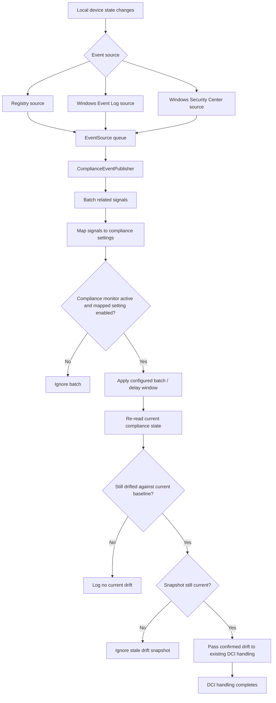

# ime-1.105.101.0-to-1.105.103.0

## Scope

This document describes the changes found between these Intune Management Extension packages:

| Package | Version |
| --- | --- |
| Previous package | `1.105.101.0` |
| New package | `1.105.103.0` |

Evidence sources: MSI database and table comparison, complete extraction of both embedded CAB payloads, SHA-256 comparison of every payload file, ECMA-335 metadata table comparison for managed assemblies, managed type, method, field and ImplMap inspection, ASCII and UTF-16 string diffing, PE architecture inspection, direct inspection of native imports used by the new event sources, and extraction and comparison of the actual `IntuneWindowsAgentCustomActions` SfxCA binary stream from both packages.

The embedded MSI cabinets use the same irregular layout seen in the preceding IME packages: a few alias file records share the same compressed payload extent and records are not strictly folder ordered. A working copy of each CAB index was normalized so standard extraction tooling could read every file. The compressed data itself was not modified. All 153 files from both packages were extracted and compared.

No full managed IL or native-code decompilation was used. Findings below are based on package structure, metadata, strings, imports, manifests, and cross-component correlation. Where the evidence supports behavior but does not prove the exact call site or server-side activation condition, that is called out as inferred.

This is an independent investigation report. Presence of code does not mean a feature is active for every tenant.

## Executive summary

`1.105.103.0` is a focused release. The MSI grows by only about 24 KB, adds no files, removes no files, and leaves most of the architecture introduced in `1.105.101.0` structurally unchanged.

The important change is concentrated in the main IME service:

1. **Compliance Monitor becomes event driven.** `Microsoft.Management.Services.IntuneWindowsAgent.exe` grows by 49 types and 204 methods and adds a general event-source framework plus compliance-specific Registry, Event Log, and Windows Security Center sources.
2. **Relevant local state changes can enter the existing compliance drift path without waiting only for the normal monitor cycle.** New code batches incoming signals, maps them to enabled compliance settings, rechecks whether the device is still drifted, and then hands confirmed drift into the existing DCI handling path.
3. **The event path is deliberately throttled and guarded.** It has configurable batch and delay/cooldown windows, listener reconciliation, startup synchronization, event coalescing, per-setting enable checks, stale-drift suppression, and hourly telemetry.
4. **The first visible event sources cover security and OS state.** Strings and registrations identify Windows Defender, Secure Boot, Windows build information, Windows Security Center, and BitLocker/Defender Event Log channels.
5. **The service contract is extended for the new configuration.** `ComplianceMonitorConfig` gains `ComplianceEventProcessorBatchTimeSeconds`, `ComplianceEventProcessorDelayTimeSeconds`, and `EventPerSetting`.
6. **Registry monitoring gets a small reliability improvement in AgentCommon.** The shared registry watcher gains explicit startup signaling so a consumer can wait for notification registration to succeed or fail rather than assuming it started.
7. **This is not another App In Use or CUE feature wave.** The major `1.105.101.0` App In Use, CUE, Policy Runtime, ComponentManager, WinRE, and root WinDC trust binaries show no new structural feature surface in this comparison.

The headline for this build is therefore **event-driven client compliance evaluation, with batching and fail-safe drift confirmation before the existing DCI path runs.**

## Package-level changes

| Property | 1.105.101.0 | 1.105.103.0 |
| --- | --- | --- |
| ProductVersion | `1.105.101.0` | `1.105.103.0` |
| ProductCode | `{EA1E4C91-8D4A-4185-960A-B6F13EC6424C}` | `{DDF6D6BF-887E-4EB3-A89D-2C153BAF3256}` |
| UpgradeCode | `{9FE9701C-0F89-40B4-B77A-AA65607E87D8}` | same |
| Package/Revision GUID | `{9589A41D-2E5C-458D-8F38-4925EF548C9D}` | `{821B51F5-6CFE-4767-9383-6AEF874DA940}` |
| MSI Summary create time | `2026-08-11 18:52:36` | `2026-08-25 22:28:02` |
| MSI SHA-256 | `805eafae177a9c3f660283886d2ace1577c316f3bf06993d7a6666ae9db83cb3` | `c7b6993f752a7d9dffcd8015cb6ded537114c3994ae6fa6b7035f109acb6b2c1` |
| MSI file size | 13,729,792 bytes | 13,754,368 bytes (`+24,576`, about `+0.18%`) |
| Embedded CAB size | 13,135,926 bytes | 13,163,998 bytes (`+28,072`, about `+0.21%`) |
| Files in payload | 153 | 153 |
| Files added | — | 0 |
| Files removed | — | 0 |
| Shared files changed | — | 75 |
| Shared files byte-identical | — | 78 |

The MSI still uses WiX Toolset `5.0.2.0`.

## Largest payload deltas

| File | 1.105.101.0 | 1.105.103.0 | Size delta |
| --- | ---: | ---: | ---: |
| `Microsoft.Management.Services.IntuneWindowsAgent.exe` | 465,272 | 530,296 | `+65,024` |
| `Microsoft.Management.Services.IntuneWindowsAgent.AgentCommon.dll` | 762,232 | 763,296 | `+1,064` |
| `Microsoft.Management.Services.IntuneWindowsAgent.AgentCommon.ServiceContracts.dll` | 44,960 | 45,944 | `+984` |
| `ImeUI.resources.dll` and other localized/resource binaries | varies | varies | mostly `±40` to `±48` |
| `IntuneWindowsAgent.cat` | 139,690 | 139,727 | `+37` |

The 65 KB growth in the main service accounts for essentially all of the meaningful new structural feature surface.

## Largest managed-code deltas

| Assembly | TypeDef | MethodDef | Interpretation |
| --- | ---: | ---: | --- |
| `Microsoft.Management.Services.IntuneWindowsAgent.exe` | `251 -> 300` | `1144 -> 1348` | New generic event framework and compliance event processing |
| `AgentCommon.ServiceContracts.dll` | `36 -> 36` | `238 -> 244` | Three new Compliance Monitor configuration properties |
| `AgentCommon.dll` | `658 -> 658` | `3263 -> 3265` | Small shared helper changes; registry watcher startup signaling is visible in strings/members |

# 1. Compliance Monitor gets a general event-source framework

The main service adds a reusable event-listening layer rather than embedding every signal directly in `ComplianceMonitor`.

New types include:

```text
Microsoft.Management.Services.IntuneWindowsAgent.EventListening.EventLogEventSource<T>
Microsoft.Management.Services.IntuneWindowsAgent.EventListening.EventSourceBase<T>
Microsoft.Management.Services.IntuneWindowsAgent.EventListening.EventSourceListener
Microsoft.Management.Services.IntuneWindowsAgent.EventListening.IEventPublisher<T>
Microsoft.Management.Services.IntuneWindowsAgent.EventListening.IEventSource
```

The compliance-specific layer then adds:

```text
Microsoft.Management.Services.IntuneWindowsAgent.ComplianceMonitor.EventListening.ComplianceEventPublisher
Microsoft.Management.Services.IntuneWindowsAgent.ComplianceMonitor.EventListening.ComplianceEventSignal
Microsoft.Management.Services.IntuneWindowsAgent.ComplianceMonitor.EventListening.ComplianceEventSourceCatalog
Microsoft.Management.Services.IntuneWindowsAgent.ComplianceMonitor.EventListening.IComplianceEventSourceCatalog
Microsoft.Management.Services.IntuneWindowsAgent.ComplianceMonitor.EventListening.IComplianceEventSourceRegistration
Microsoft.Management.Services.IntuneWindowsAgent.ComplianceMonitor.EventListening.EventLogEventSourceRegistration
Microsoft.Management.Services.IntuneWindowsAgent.ComplianceMonitor.EventListening.RegistryEventSourceRegistration
Microsoft.Management.Services.IntuneWindowsAgent.ComplianceMonitor.EventListening.RegistryEventSource<T>
Microsoft.Management.Services.IntuneWindowsAgent.ComplianceMonitor.EventListening.WindowsSecurityCenterEventSourceRegistration
Microsoft.Management.Services.IntuneWindowsAgent.ComplianceMonitor.EventListening.WindowsSecurityCenterEventSource<T>
Microsoft.Management.Services.IntuneWindowsAgent.ComplianceMonitor.EventListening.WindowsSecurityCenterWatcher
```

This split matters. It shows that `1.105.103.0` is not adding one hardcoded callback. It adds a source catalog, source registrations, a generic listener, a publisher, and an event-processing path that can represent several kinds of local state changes.

The common event layer logs queueing, dispatch, start/stop, drain, and failure states:

```text
[EventSource] Event queued: source=
[EventSource] Event dispatched: source=
[EventSource] Dropped event from
[EventSource] Event drain failed for
[EventSourceListener] Starting listener: sourceCount=
[EventSourceListener] Failed to start
[EventSourceListener] Failed to stop
```

That is a stronger design than firing the compliance check directly inside an OS callback. Sources feed a controlled event pipeline first.

# 2. Registry, Event Log, and Windows Security Center are the first concrete sources

Three source families are directly visible.

## Registry sources

Named source identifiers include:

```text
registry.defender-version-change
registry.os-version-change
registry.secure-boot-change
```

Visible registry paths and values include:

```text
SOFTWARE\Microsoft\Windows Defender
SOFTWARE\Microsoft\Windows NT\CurrentVersion
SYSTEM\CurrentControlSet\Control\SecureBoot\State
UEFISecureBootEnabled
CurrentBuild
ProductName
```

The registry source logs both startup-time and normal changes:

```text
[ComplianceEventListener] Registry listener started: source={0}, key={1}\{2}, values=[{3}].
[ComplianceEventListener] Registry change detected during startup: source={0}, values=[{1}].
[ComplianceEventListener] Registry change detected: source={0}, values=[{1}].
[ComplianceEventListener] Registry notification received: source=
```

The explicit startup branch is useful: if state changes while the listener is coming online, the design does not assume the initial snapshot is enough.

## Event Log sources

The package contains registrations for:

```text
Microsoft-Windows-BitLocker-API
Microsoft-Windows-BitLocker/BitLocker Management
Microsoft-Windows-Windows Defender
Microsoft-Windows-Windows Defender/Operational
```

Signal names include:

```text
BitLockerManagementEncryption
DefenderOperationalRtp
```

`EventLogWatcher`, `EventLogQuery`, event IDs, provider names, and `EventRecordWritten` handlers are present in the new framework.

The exact list of event IDs and their server-side compliance-setting mappings was not reconstructed in this pass. The evidence does prove that BitLocker and Defender Event Log channels are registered as event sources.

## Windows Security Center

The new code imports directly from:

```text
wscapi.dll
WscRegisterForChanges
WscUnRegisterChanges
```

and contains:

```text
wsc.general-change
SecurityCenterDefenderService
Windows Defender
```

The callback path is explicitly coalesced:

```text
[ComplianceEventListener] Windows Security Center change received: source=
[ComplianceEventListener] Windows Security Center callbacks coalesced: count={0}, durationMs={1}.
```

That is important because Windows Security Center can generate multiple notifications around one logical state transition. IME does not need to turn every callback into an immediate compliance operation.

# 3. Incoming events are batched before compliance handling

The new `ComplianceEventPublisher` exposes:

```text
PublishAsync
ProcessBatchAsync
```

The main `ComplianceMonitor` gains:

```text
ProcessEventBatchAsync
GetEventBatchWindow
GetEventCooldownWindow
IsEventSettingCurrentlyEnabled
IsEventSettingEnabled
StartEventListenerIfNeeded
ReconcileEventListenerAsync
AwaitEventListenerStartAsync
ObserveEventListenerStart
LogEventBatch
```

The corresponding strings show the intended order:

```text
[ComplianceEventProcessor] Event batch processing: settings=
[ComplianceEventProcessor] Event batch confirmed drift: settings=
[ComplianceEventProcessor] Event batch DCI handling completed: settings=
[ComplianceEventProcessor] Event batch processed without drift: settings=
```

The processor therefore does not equate an event with noncompliance. The event is a reason to evaluate relevant state. Only confirmed drift is handed into the existing DCI handling path.

That distinction prevents a registry or WSC callback from becoming an automatic compliance failure just because a watched value changed.

# 4. Batch and cooldown behavior are configurable

`AgentCommon.ServiceContracts.dll` adds these properties to `ComplianceMonitorConfig`:

```text
ComplianceEventProcessorBatchTimeSeconds
ComplianceEventProcessorDelayTimeSeconds
EventPerSetting
```

The main service adds matching configuration names:

```text
ComplianceEventProcessorBatchTimeSeconds
ComplianceEventProcessorDelayTimeSeconds
EventSettings
```

and default/minimum/maximum handling:

```text
DefaultEventProcessorBatchTimeSeconds
DefaultEventProcessorDelayTimeSeconds
MinEventProcessorBatchTimeSeconds
MaxEventProcessorBatchTimeSeconds
MinEventProcessorDelayTimeSeconds
MaxEventProcessorDelayTimeSeconds
```

Invalid values are clamped:

```text
[ComplianceMonitor] ComplianceEventProcessorBatchTimeSeconds {0} clamped to {1}.
[ComplianceMonitor] ComplianceEventProcessorDelayTimeSeconds {0} clamped to {1}.
```

The visible naming indicates two distinct controls:

* a short collection window for combining related events into one batch;
* a delay/cooldown window around repeated processing.

The exact production values are configuration dependent and are not hardcoded as a universal behavior in this report.

# 5. Event sources are mapped to enabled settings before DCI runs

The new configuration store includes:

```text
Software\Microsoft\IntuneManagementExtension\ComplianceMonitor\Config\EventPerSetting
EventSettings
EventDrivenSettingNames
```

and methods such as:

```text
IsAllowedEventDrivenSettingName
IsEventSettingEnabled
IsEventSettingCurrentlyEnabled
```

The processor has explicit skip paths:

```text
[ComplianceEventProcessor] Event batch ignored because compliance monitoring is disabled, stopped, or flighted off.
[ComplianceEventProcessor] Event batch ignored because compliance monitoring stopped before DCI handling.
[ComplianceEventProcessor] Event batch ignored because no mapped settings are enabled.
```

This is important architecturally. The event catalog can know about a source without forcing it to run for every tenant or every compliance policy. The local event is first mapped to a setting that is currently enabled for event-driven monitoring.

# 6. Drift is revalidated to avoid stale event work

`DciHelper` adds:

```text
IsCurrentDrift
```

and the new build contains:

```text
[DciHelper] Ignoring stale drift snapshot because its baseline was already updated.
```

This closes a race that is especially relevant to event-driven evaluation:

1. a local event says that something may have changed;
2. the event is batched and queued;
3. another normal compliance cycle or event can update the baseline before this batch runs;
4. the older batch must not act on a drift snapshot that is no longer current.

The new guard explicitly checks for that condition.

# 7. Listener startup and lifecycle are defensive

The new listener path has explicit reconciliation and startup coordination:

```text
StartEventListenerIfNeeded
ReconcileEventListenerAsync
AwaitEventListenerStartAsync
ObserveEventListenerStart
```

The generic event sources also have asynchronous start, stop, and drain state machines.

A related small change appears in `AgentCommon`'s registry watcher. New visible members/strings include startup synchronization and failures such as:

```text
Registry notification registration failed.
Timed out waiting for registry notification registration.
```

This is relevant because the compliance layer now depends on registry notifications as a first-class input. It needs to know whether the native watch actually registered before treating the listener as healthy.

# 8. Flighting and local configuration can turn the event path off

Visible switches include:

```text
EnableEventBasedComplianceEventLog
FlightEnableEventBasedComplianceEventLog
```

The listener explicitly logs:

```text
[EventSourceListener] Stopped listener because EnableEventBasedComplianceEventLog is OFF.
```

This means the client code can be present without being active. It also explains why comparing binaries alone cannot establish whether every tenant or device is already using event-driven compliance.

Microsoft's public Intune compliance documentation now describes **client-driven compliance evaluation (preview)** as a Windows capability that can detect supported local state changes and proactively request compliance reevaluation rather than relying only on scheduled check-in. The `1.105.103.0` client implementation strongly aligns with that public behavior, but the MSI alone does not prove tenant rollout state or the exact server-side mapping for every setting.

# 9. Event-driven compliance flow



This diagram stays deliberately at the client boundary. The package proves the event sources, mapping, batching, drift recheck, and DCI handoff. It does not by itself prove every server-side action after DCI handling.

# 10. What did not materially change

The narrow scope of this build is easier to see by checking the binaries that do **not** gain structural feature surface.

The following major `1.105.101.0` foundations are byte-identical in `1.105.103.0`:

```text
Microsoft.Intune.WinRe.Bundle.cab
Microsoft.Intune.WinRe.Bundle.json
IntunePolicyAdapter.dll
IntunePolicyStorage.dll
dynpin_cxx.dll
Microsoft.Management.Clients.Policy.Runtime.dll
Microsoft.Management.Clients.Components.Runtime.dll
Microsoft.Management.IntuneComponent.exe
Microsoft.Management.Clients.Common.Base.dll
CoreLib.dll
SignatureValidationLibrary.dll
```

Consequences:

* No Policy Runtime or ComponentManager implementation change was found in this build.
* No WinRE/QMR/PITR bundle change was found.
* No root WinDC trust-library change was found.
* No new App In Use class or method expansion was found in `Win32AppPlugIn.dll`.
* No new CUE structural expansion was found in `BootstrapperAgentCore.dll`.
* `WindowsPackageManager.dll` and the existing WinGet engine are not part of the new feature story for this build.

Several shared binaries are byte-different because of rebuild, version, signing, catalog, or resource churn. A byte difference can still hide a small method-body fix even when metadata shape is unchanged, so this report does not label every such binary “functionally unchanged.” The narrower statement is that no additional structural feature surface was identified there.

# 11. MSI mechanics are unchanged

At the MSI database level, `1.105.103.0` is almost identical to `1.105.101.0`.

| Table | 1.105.101.0 | 1.105.103.0 | Functional change |
| --- | ---: | ---: | --- |
| `File` | 153 | 153 | None |
| `Component` | 160 | 160 | None |
| `FeatureComponents` | 160 | 160 | None |
| `Registry` | 9 | 9 | None |
| `CustomAction` | 22 | 22 | None |
| `InstallExecuteSequence` | 52 | 52 | None |
| `InstallUISequence` | 9 | 9 | None |
| `AdminExecuteSequence` | 8 | 8 | None |
| `ServiceInstall` | 1 | 1 | None |
| `ServiceControl` | 1 | 1 | None |
| `RemoveFile` | 7 | 7 | None |
| `Feature` | 1 | 1 | None |
| `Directory` | 57 | 57 | None |
| `MsiFileHash` | 23 | 23 | No row-count change |

Normal product identity and upgrade boundary values move to the new version. There is no new install-time mechanism for event-driven compliance.

## Custom-action SfxCA comparison

The `Binary.IntuneWindowsAgentCustomActions` stream changes only slightly:

```text
1.105.101.0: 479,736 bytes
1.105.103.0: 479,976 bytes
```

The embedded SfxCA CAB contains the same eight files in both builds. The meaningful changed file remains `SideCarSetupCustomActions.dll`:

```text
1.105.101.0: 56,176 bytes
SHA-256 daae2e5e1ddd055bfd0f35c09009e5ff4abf479f249baec70c38fcafdb620fb9

1.105.103.0: 56,184 bytes
SHA-256 d69972ed54c5912d4e3cf4045d239aeacc492fe1d663c2eb7694c7e2951d0636
```

Its metadata shape remains:

```text
TypeDef    29 -> 29
MethodDef  81 -> 81
Field     145 -> 145
MemberRef 172 -> 172
```

No structural evidence of a new MSI custom-action path was found.

## Evidence and confidence

### High confidence: directly visible in MSI tables, metadata, imports, or strings

* Exact MSI/file counts, package sizes, hashes, and the absence of added or removed payload files.
* `IntuneWindowsAgent.exe` adding 49 TypeDefs and 204 MethodDefs.
* The new generic event-source framework and compliance event publisher/catalog/registration types.
* Registry, Event Log, and Windows Security Center event source implementations.
* Native imports of `WscRegisterForChanges` and `WscUnRegisterChanges` from `wscapi.dll`.
* Named sources for Defender, OS version, Secure Boot, WSC, BitLocker, and Defender Event Log activity.
* Event batching, delay/cooldown configuration, per-setting mapping, listener reconciliation, stale-drift checks, and DCI handoff log strings.
* The three new `ComplianceMonitorConfig` properties in `AgentCommon.ServiceContracts.dll`.
* The unchanged MSI custom-action/table structure.
* Byte identity of the major Policy Runtime, ComponentManager, WinRE, root trust, and Common.Base binaries between these two packages.

### Strong inference, but not proven by a full call-graph decompilation

* The new event framework is the IME-side implementation supporting the current public “client-driven compliance evaluation” behavior. The binary naming and public feature behavior line up strongly, but the MSI does not contain the server-side policy mapping or rollout decision.
* `ComplianceEventProcessorDelayTimeSeconds` functions as a cooldown/delay around repeated event-driven processing. The names and processing strings support this, but the exact timing semantics of every branch were not reconstructed at IL level.
* The event source catalog is designed to be extensible beyond the first visible Defender/BitLocker/Secure Boot/OS/WSC signals. The architecture is generic; future source population is not proven by this build.

### Server, policy, or rollout dependent

* The event listener only matters when the event-based compliance flight/configuration is enabled.
* A source only triggers useful work when it maps to a compliance setting that is currently enabled.
* The precise server-side set of supported event-driven settings is not established by the MSI alone.
* The production batch and delay values can be supplied through configuration and should not be assumed from binary defaults alone.

## Suggested validation

### Event listener startup

On an `1.105.103.0` test device, monitor `IntuneManagementExtension.log` and related IME logs for:

```text
[EventSourceListener]
[EventSource]
[ComplianceEventListener]
[ComplianceEventProcessor]
[DciHelper]
```

Verify that the listener starts only when the event-based compliance path is enabled and that failures to start a registry or WSC source are surfaced instead of silently ignored.

### Per-setting configuration

Inspect:

```text
HKLM\Software\Microsoft\IntuneManagementExtension\ComplianceMonitor\Config\EventPerSetting
```

and correlate local state with the current Compliance Monitor configuration rather than assuming every named event source is enabled.

Useful client-side identifiers include:

```text
EnableEventBasedComplianceEventLog
FlightEnableEventBasedComplianceEventLog
ComplianceEventProcessorBatchTimeSeconds
ComplianceEventProcessorDelayTimeSeconds
EventSettings
```

### Controlled state-change tests

Use a lab device and observe normal or controlled changes related to:

```text
Windows Defender state / definition related registry activity
Windows Security Center state
BitLocker management events
Secure Boot state reporting
Windows build/version registry state
```

The useful validation sequence is:

1. A supported source produces one or more local events.
2. Multiple callbacks inside the batch window are combined rather than causing independent DCI operations.
3. IME maps the source to a currently enabled compliance setting.
4. IME re-evaluates current drift instead of treating the event as proof of noncompliance.
5. No DCI handling occurs when the device is no longer drifted.
6. A stale drift snapshot is ignored if another cycle already updated the baseline.
7. Confirmed current drift reaches the existing DCI handler.
8. Repeated WSC callbacks are coalesced as indicated by the new logs.

Do state-changing tests only on a lab device. The goal is to observe the client event path, not to weaken production security settings.

## Final assessment

`1.105.103.0` is a **small package update with one substantial behavioral change**.

Microsoft does not add another broad IME subsystem in this release. Instead, the existing Compliance Monitor gains an event-driven front end. Registry changes, Windows Event Log records, and Windows Security Center callbacks can now become controlled signals for compliance re-evaluation.

The implementation is intentionally defensive. Events are queued, batched, mapped to enabled settings, rechecked against current drift, and discarded when the monitor is disabled, the setting is not enabled, or the drift snapshot has already become stale. Only then does confirmed drift enter the existing DCI handling path.

That explains the unusual shape of this release: **no new payload files, no installer changes, almost no growth outside the main service, but a 49-type / 204-method expansion inside `IntuneWindowsAgent.exe`.**

The best headline is therefore:

> **IME 1.105.103.0 adds the event layer behind faster client-driven compliance evaluation.**

## Sources

* Previous IME tracker comparison, `1.104.102.0 -> 1.105.101.0`: https://github.com/call4cloud-code/IME-Change-Tracker/blob/main/release-notes/ime-1.104.102.0-to-1.105.101.0.MD
* IME Change Tracker repository: https://github.com/call4cloud-code/IME-Change-Tracker
* Microsoft Learn, Intune Management Extension for Windows: https://learn.microsoft.com/en-us/intune/device-management/tools/management-extension-windows
* Microsoft Learn, Create compliance policies in Microsoft Intune, including client-driven compliance evaluation: https://learn.microsoft.com/en-us/intune/device-security/compliance/create-policy
* Microsoft Learn, Device compliance overview: https://learn.microsoft.com/en-us/intune/device-security/compliance/overview
