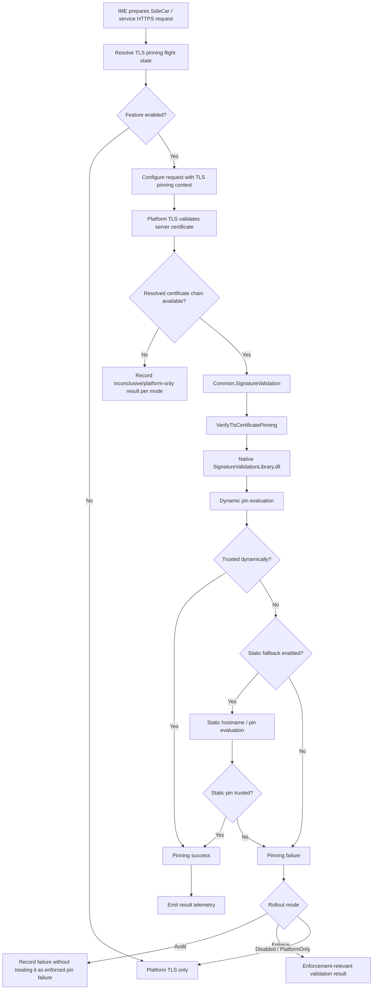
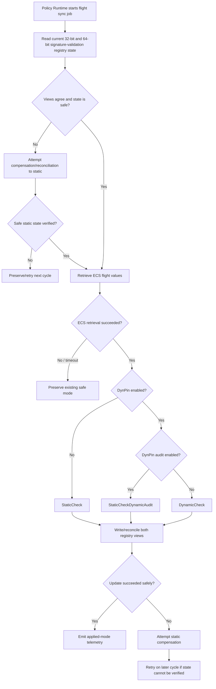
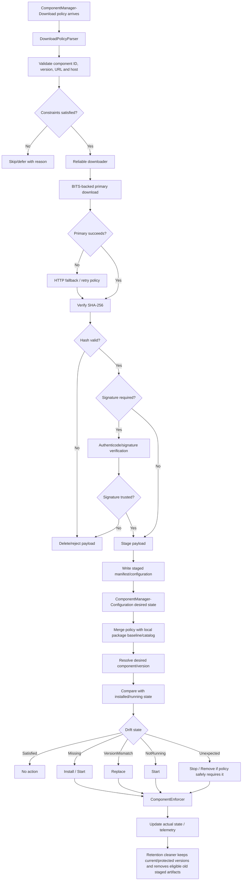
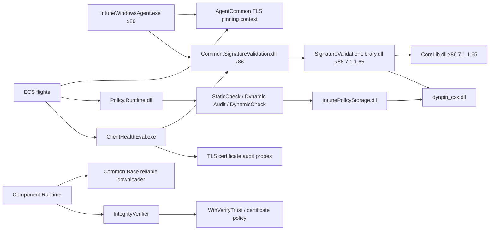

# ime-1.105.103.0-to-1.105.152.0

## Scope

This document describes the changes found between these Intune Management Extension packages:

| Package | Version |
| --- | --- |
| Previous package | `1.105.103.0` |
| New package | `1.105.152.0` |

Evidence sources: MSI database and table comparison, complete extraction of both embedded CAB payloads, SHA-256 comparison of every payload file, ECMA-335 metadata table comparison for managed assemblies, managed type, method, field and ImplMap inspection, ASCII and UTF-16 string diffing, PE architecture inspection, native import/export inspection, direct comparison of the nested WinRE CAB and manifest, and extraction and comparison of the actual `IntuneWindowsAgentCustomActions` SfxCA binary stream from both packages.

The embedded MSI cabinets use the same irregular layout seen in the preceding IME packages: a few alias file records share the same compressed payload extent and records are not strictly folder ordered. A working copy of each CAB index was normalized so standard extraction tooling could read every file. The compressed data itself was not modified. All 153 files from `1.105.103.0` and all 154 files from `1.105.152.0` were extracted and compared.

No full managed IL or native-code decompilation was used. Findings below are based on package structure, metadata, strings, native exports/imports, PE architecture, and cross-component correlation. Where evidence supports behavior but does not prove the exact runtime call site or server-side activation condition, that is called out as inferred.

This is an independent investigation report. Presence of code does not mean a feature is active for every tenant.

## Executive summary

`1.105.152.0` is a much more architectural release than `1.105.103.0`. The package itself grows by only about 37 KB because several binaries are replaced rather than simply added, but the managed metadata shows large internal expansions in the Component Runtime, Common Base, Client Health, Policy Runtime, and trust stack.

The important changes are:

1. **The root signature-validation stack changes architecture and becomes directly usable by the 32-bit IME process.** In `1.105.103.0`, root `CoreLib.dll` and `SignatureValidationLibrary.dll` are x64 while `IntuneWindowsAgent.exe` and its managed runtime are x86/32-bit. `1.105.152.0` replaces both root native libraries with x86 `7.1.1.65` builds and adds a new managed `Microsoft.Management.Clients.Common.SignatureValidation.dll` wrapper. That is a materially stronger integration point than the earlier root placement.
2. **A managed signature-validation abstraction is added.** The new DLL exposes detached CMS validation, WinDC document validation, TLS server certificate pinning, logging, telemetry, static/dynamic pinning controls, certificate chain diagnostics, and native P/Invokes into `SignatureValidationLibrary.dll`.
3. **SideCar/IME gains TLS certificate pinning rollout logic.** `AgentCommon` adds TLS pinning context, modes, flight-state resolution, request configuration, server-certificate validation, gateway-host matching, telemetry, and ECS-driven Audit/Enforce/static-fallback controls. The main service initializes the path and adds `SignatureValidation.log` integration.
4. **Policy Runtime gains controlled policy-signature-validation rollout.** New ECS flights select `StaticCheck`, `StaticCheckDynamicAudit`, or `DynamicCheck`, with separate 32-bit/64-bit registry-view reconciliation and fail-safe recovery to static validation when partial state cannot be trusted.
5. **ClientHealthEval gets a pluggable connectivity-probe framework and TLS certificate audit.** The older health code is expanded into generic HTTP/TCP/AFD/IC3/TLS probe executors. TLS audit can perform a handshake, inspect the resolved chain, run the signature validator, and report pinning/tamper signals without being the enforcement path itself.
6. **ComponentManager becomes a full download, staging, desired-state, and enforcement pipeline.** `Components.Runtime.dll` grows by 87 types and 467 methods. It now has download policy parsing, host/URL checks, reliable downloading, integrity validation, staging, retention, desired-state reconciliation, drift detection, and explicit Install/Start/Stop/Replace/Remove actions.
7. **Common.Base gains the reusable downloader used by the new component path.** It adds BITS-backed download interop, HTTP fallback, retries, destination-root checks, byte ceilings, SHA-256 verification, signature verification hooks, proxy support, and metered-network awareness.
8. **The out-of-process component host hardens assembly loading.** `Microsoft.Management.IntuneComponent.exe` adds final-path and handle-based validation designed to ensure the requested assembly remains inside the trusted component installation directory even if the path changes while being validated.
9. **The native trust and DynPin libraries are upgraded together.** `SignatureValidationLibrary.dll` expands from 11 to 23 exports, including detached CMS and TLS pinning APIs. `dynpin_cxx.dll` adds TLS-pinning and transition-policy related strings and moves its visible API path from `v12.0.1` to `v12.2.9`.
10. **The MSI remains intentionally simple.** Only one file/component is added. There are still no new MSI custom actions, services, registry rows, directories, or install-sequence entries for these runtime features.
11. **The WinRE bundle remains byte-identical.** The trust changes in this release are root/runtime changes; the nested WinRE CAB and manifest do not change.

The headline for this build is therefore **the trust and component-delivery foundations from the earlier 1.105 builds become a much more complete runtime system: 32-bit signature validation, TLS pinning, policy-signature rollout controls, health auditing, and downloadable ComponentManager workloads.**

## Package-level changes

| Property | 1.105.103.0 | 1.105.152.0 |
| --- | --- | --- |
| ProductVersion | `1.105.103.0` | `1.105.152.0` |
| ProductCode | `{DDF6D6BF-887E-4EB3-A89D-2C153BAF3256}` | `{7ECACCD0-8601-4884-8860-7A4ADF4ED814}` |
| UpgradeCode | `{9FE9701C-0F89-40B4-B77A-AA65607E87D8}` | same |
| Package/Revision GUID | `{821B51F5-6CFE-4767-9383-6AEF874DA940}` | `{D5177D08-E000-417C-9DE1-3398A3450D7A}` |
| MSI Summary create time | `2026-08-25 22:28:02` | `2026-09-04 17:06:26` |
| MSI SHA-256 | `c7b6993f752a7d9dffcd8015cb6ded537114c3994ae6fa6b7035f109acb6b2c1` | `a9ac24c064b1c35e73af391abfcb40b276f45c1f227f9587a7b82aa6622b707a` |
| MSI file size | 13,754,368 bytes | 13,791,232 bytes (`+36,864`, about `+0.27%`) |
| Embedded CAB size | 13,163,998 bytes | 13,197,808 bytes (`+33,810`, about `+0.26%`) |
| Files in payload | 153 | 154 (`+1`) |
| Files added | — | 1 |
| Files removed | — | 0 |
| Shared files changed | — | 92 |
| Shared files byte-identical | — | 61 |

The MSI still uses WiX Toolset `5.0.2.0`.

## New file

Exactly one new payload file is added:

| File | Version | Size | MSI component | Location | SHA-256 |
| --- | --- | ---: | --- | --- | --- |
| `Microsoft.Management.Clients.Common.SignatureValidation.dll` | `7.1.1.65` | 47,440 | `f_8D2F6A41` / `{8D2F6A41-71D2-4E5B-9C3A-4F08D79B61E2}` | `INSTALLLOCATION` | `09349449fa08782440a9ecc43f8ff7dfe319b3ed974f3fda6cfc564f68353aff` |

The component is attached to the existing `ProductFeature`. No new MSI feature, directory, service, custom action, or registry row accompanies it.

## Largest payload deltas

| File | 1.105.103.0 | 1.105.152.0 | Size delta | Version change |
| --- | ---: | ---: | ---: | --- |
| `CoreLib.dll` | 1,231,184 | 1,084,240 | `-146,944` | `7.1.1.28 -> 7.1.1.65` |
| `Microsoft.Management.Clients.Components.Runtime.dll` | 172,960 | 297,848 | `+124,888` | `7.1.1.28 -> 7.1.1.65` |
| `ClientHealthEval.exe` | 139,640 | 180,600 | `+40,960` | `1.105.103.0 -> 1.105.152.0` |
| `Microsoft.Management.Clients.Common.Base.dll` | 80,720 | 114,512 | `+33,792` | `7.1.1.32 -> 7.1.1.65` |
| `Microsoft.Management.Clients.Policy.Runtime.dll` | 88,440 | 111,992 | `+23,552` | `7.1.1.28 -> 7.1.1.65` |
| `dynpin_cxx.dll` | 958,272 | 971,072 | `+12,800` each copy | native update |
| `AgentCommon.dll` | 763,296 | 772,472 | `+9,176` | `1.105.103.0 -> 1.105.152.0` |
| `SignatureValidationLibrary.dll` | 513,360 | 519,504 | `+6,144` | `7.1.1.28 -> 7.1.1.65` |
| `IntunePolicyStorage.dll` | 1,091,448 | 1,097,040 | `+5,592` each copy | `7.1.1.28 -> 7.1.1.65` |
| `Microsoft.Management.IntuneComponent.exe` | 47,992 | 53,112 | `+5,120` | `7.1.1.28 -> 7.1.1.65` |
| `IntuneWindowsAgent.exe` | 530,296 | 534,424 | `+4,128` | `1.105.103.0 -> 1.105.152.0` |
| `Microsoft.Management.Clients.Components.Base.dll` | 34,640 | 37,200 | `+2,560` | `7.1.1.28 -> 7.1.1.65` |

The negative `CoreLib.dll` delta is not a rollback. The file changes from an x64 build to a new x86 build, which explains much of the size reduction.

## Largest managed-code deltas

| Assembly | TypeDef | MethodDef | Size delta |
| --- | ---: | ---: | ---: |
| `Microsoft.Management.Clients.Components.Runtime.dll` | `108 -> 195` | `344 -> 811` | `+124,888` |
| `ClientHealthEval.exe` | `93 -> 133` | `481 -> 686` | `+40,960` |
| `Microsoft.Management.Clients.Common.Base.dll` | `84 -> 123` | `305 -> 491` | `+33,792` |
| `Microsoft.Management.Clients.Policy.Runtime.dll` | `73 -> 90` | `278 -> 346` | `+23,552` |
| `AgentCommon.dll` | `658 -> 665` | `3265 -> 3296` | `+9,176` |
| `IntuneWindowsAgent.exe` | `300 -> 303` | `1348 -> 1365` | `+4,128` |
| `Microsoft.Management.IntuneComponent.exe` | `25 -> 26` | `95 -> 110` | `+5,120` |
| `Microsoft.Management.Clients.Components.Base.dll` | `26 -> 26` | `164 -> 175` | `+2,560` |

The new `Microsoft.Management.Clients.Common.SignatureValidation.dll` starts with 30 TypeDefs and 153 MethodDefs of its own.

# 1. Important refinement: the root trust libraries switch from x64 to x86

The preceding `1.104.102.0 -> 1.105.101.0` investigation correctly identified the arrival of root-level `CoreLib.dll` and `SignatureValidationLibrary.dll`, but this comparison adds an important PE-architecture detail that changes how that earlier staging should be interpreted.

In both `1.105.101.0` and `1.105.103.0`:

```text
CoreLib.dll                     PE32+ x86-64
SignatureValidationLibrary.dll  PE32+ x86-64
IntuneWindowsAgent.exe          PE32 Intel i386 .NET
Common.Base.dll                 PE32 Intel i386 .NET
```

A 32-bit process cannot load an x64 DLL in-process. Therefore the earlier root x64 `7.1.1.28` trust libraries could not directly satisfy a P/Invoke made from the 32-bit main IME process.

In `1.105.152.0` the root libraries change to:

```text
CoreLib.dll                                      PE32 Intel i386
SignatureValidationLibrary.dll                   PE32 Intel i386
Microsoft.Management.Clients.Common.SignatureValidation.dll
                                                 PE32 Intel i386 .NET
IntuneWindowsAgent.exe                           PE32 Intel i386 .NET
```

The corresponding hashes change from:

| File | 1.105.103.0 SHA-256 | 1.105.152.0 SHA-256 |
| --- | --- | --- |
| `CoreLib.dll` | `5285fcaee9c27dc8a7b1c65f1871f2171c7721a6d860625bb934f66b7a2ca9d9` | `26c355ed4b1dc45263a553f0315fc27bcfd52fe179f5ef8c791760a5acd5bad0` |
| `SignatureValidationLibrary.dll` | `c5ae60b1a235fc381d4edae3848e099543a77c306921497c8ab80d2bd0c8697a` | `2369ec53f7e792bb39f4953ea54ca3c865f73d0df777514f01fb2fb8ef027252` |

This is stronger evidence for the runtime trust-stack integration point:

* `1.105.101/103` place newer x64 trust-family binaries in the root IME package.
* `1.105.152` replaces them with the architecture that matches the 32-bit IME runtime.
* `1.105.152` simultaneously adds a new managed signature-validation wrapper and new references from IME-side components.

The safer corrected interpretation is therefore: **the earlier builds staged the trust-library family in the root package, while `1.105.152.0` is the first build in this sequence that visibly supplies a matching 32-bit native stack plus a managed bridge suitable for direct in-process use by the main IME runtime.**

That does not prove the first production call happened in this exact build for every tenant. It does correct the architecture-level assumption from the earlier report.

# 2. New managed `Common.SignatureValidation` layer

`Microsoft.Management.Clients.Common.SignatureValidation.dll` is the only new file in the MSI and is one of the most important changes in the release.

Its metadata shape is:

```text
TypeDef    30
MethodDef 153
Field     153
ImplMap     5
```

Its five native imports all target `SignatureValidationLibrary.dll`:

```text
VerifyDetachedCmsSignatureEx2
VerifyWinDcDocumentSignatureEx
ConfigureSignatureValidationTelemetry
ConfigureSignatureValidationLogging
VerifyTlsCertificatePinning
```

Visible managed concepts include:

```text
CertificatePinningMode
DynamicPinningMode
INativeSignatureValidator
ISignatureValidator
ITlsCertificateValidator
NativeSignatureValidator
SignatureValidator
SignatureValidationDiagnostics
SignatureValidationFailure
SignatureValidationInitializationOptions
SignatureValidationOptions
SignatureValidationResult
SignatureValidationStage
TlsPinningFailure
TlsPinningOptions
TlsPinningResult
TlsPinningStatus
```

The layer exposes at least three distinct validation families:

```text
ValidateDetachedCms
ValidateWinDcDocumentSignature
ValidateTlsServerCertificate
```

This is not merely a P/Invoke holder. The managed layer carries options, status, diagnostics, logging, telemetry, pinning mode, retry information, certificate-chain results, and normalized failure outcomes around the native verifier.

## Validation stages

Visible stage names include:

```text
NotStarted
CmsDecode
SignerResolution
SignatureVerification
ChainBuild
ChainPolicy
Pinning
Completed
```

Visible failure names include:

```text
None
SignatureInvalid
InvalidSignerCount
CertificateChainInvalid
NativeValidationFailed
SignerNotTrusted
UnexpectedError
```

That gives consumers a structured reason for a validation failure instead of only a native HRESULT or boolean result.

## Pinning modes

The managed layer contains both certificate and dynamic-pinning mode controls. Visible values include:

```text
Enforce
Audit
Disabled
UseRegistry
StaticOnly
Enabled
```

The exact enum membership differs between the certificate and dynamic-pinning settings, but the important point is clear: the verifier supports policy-driven static, dynamic, audit, and enforcement behavior rather than one hardwired trust decision.

## Detached CMS settings

Strings show configurable controls for:

```text
DetachedCmsRetryCount
DetachedCmsUrlRetrievalTimeout
DetachedCmsRetryDelay
DetachedCmsDynamicPinningMode
DetachedCmsCertificatePinningMode
```

and diagnostics such as:

```text
ChainPolicyError
ChainTrustErrors
StaticPinTrusted
DynamicPinTrusted
DynamicPinStatus
DynamicPinErrorFlags
UsedStaticPinFallback
```

This makes the new managed DLL a common trust abstraction for more than WinDC document signatures alone.

# 3. Native `SignatureValidationLibrary.dll` expands from WinDC into detached CMS and TLS pinning

The native library changes from x64 `7.1.1.28` to x86 `7.1.1.65` and its export surface grows from 11 names to 23.

The earlier WinDC exports remain, including:

```text
GetRegistrationEnvironment
GetValueFromPayload
VerifyWinDCLeafCertSignatureEx
VerifyWinDCPayloadSignature
VerifyWinDCPayloadSignatureEx
VerifyWinDcDocumentSignature
```

New/expanded C exports visible in `1.105.152.0` include:

```text
ConfigureSignatureValidationLogging
ConfigureSignatureValidationTelemetry
VerifyDetachedCmsSignatureEx
VerifyDetachedCmsSignatureEx2
VerifyTlsCertificatePinning
VerifyWinDcDocumentSignatureEx
```

and matching x86 stdcall exports include:

```text
_ConfigureSignatureValidationLogging@4
_ConfigureSignatureValidationTelemetry@8
_GetRegistrationEnvironment@4
_VerifyDetachedCmsSignatureEx2@44
_VerifyDetachedCmsSignatureEx@32
_VerifyLeafCertDynamicPinning@40
_VerifyTlsCertificatePinning@52
_VerifyWinDcDocumentSignatureEx@32
```

That export set lines up directly with the five P/Invokes in the new managed wrapper.

## New native trust behavior

New strings expose behavior around:

* TLS server certificate validation.
* Static TLS hostname/pin matching.
* Detached CMS verification.
* Configurable rejection of expired certificates.
* URL retrieval/retry behavior for chain construction.
* Custom certificate-chain engines.
* Dynamic pinning with static fallback.
* Audit mode in which a pinning failure is recorded but can be accepted by policy.
* Certificate-pinning-disabled behavior where cryptographic signature and chain verification can still succeed.
* Environment/tenant diagnostics.

One visible audit string is particularly explicit:

```text
Certificate pinning did not trust the signer; accepting because audit mode is configured.
```

Another separates pinning from base cryptographic trust:

```text
Bound signature and chain verification succeeded with certificate pinning disabled.
```

So the library does not collapse “signature valid”, “chain valid”, and “pin trusted” into one opaque result. Those decisions can be evaluated separately according to rollout mode.

# 4. SideCar/IME gets TLS certificate pinning flight state

`AgentCommon.dll` adds a new TLS-pinning family including:

```text
ITlsCertificatePinningContext
ITlsCertificatePinningFlightStateProvider
TlsCertificatePinningContext
TlsCertificatePinningFlightState
TlsCertificatePinningFlightStateProvider
TlsCertificatePinningMode
```

Visible methods include behavior for:

```text
ConfigureRequest
ValidateServerCertificate
ResolveFlightState
TryGetSidecarGatewayHostname
IsSameServicePath
CopyResolvedChain
EmitResult
RefreshAsync
```

Visible ECS/flight names include:

```text
EnableTlsCertificatePinning
EnforceTlsCertificatePinning
UseStaticTlsPinFallback
EnableTlsCertAuditProbe
```

The main IME service adds:

```text
ResolveTlsCertificatePinningFlightStateAsync
LogFlightMisconfiguration
SideCarTlsSignatureValidationLogAdapter
```

and a dedicated log path/name:

```text
SignatureValidation.log
```

There is also an explicit misconfiguration case: if an enforcement flight is enabled while the base TLS-pinning feature is disabled, the client logs the inconsistent state rather than blindly treating enforcement as valid.

## Visible TLS result handling

AgentCommon strings include outcomes such as:

```text
[TlsCertificatePinning] Platform TLS did not provide a resolved certificate chain in mode {0}.
SVL validation failed in mode
Rollout-mode evaluation failed; using PlatformOnly
Sidecar Gateway TLS certificate-pinning validation completed.
```

This indicates a layered model:

1. Windows/.NET platform TLS performs its normal validation.
2. The client obtains the resolved certificate chain when available.
3. The signature-validation layer evaluates Intune-specific pinning policy.
4. The current rollout mode determines whether that additional result is audit-only or enforcement-relevant.

Without a full call-graph reconstruction, this report does not claim the exact network-block behavior for every `Audit`, `Enforce`, or fallback branch. The existence of the modes, validation callback, ECS state, and result telemetry is direct evidence.

# 5. TLS certificate pinning flow



The final network behavior under each mode is rollout/configuration dependent. The flow above only represents the directly visible validation and mode-selection architecture.

# 6. Policy Runtime gains signature-validation flight synchronization

`Microsoft.Management.Clients.Policy.Runtime.dll` grows from 73 to 90 TypeDefs and from 278 to 346 MethodDefs.

New types include:

```text
SignatureValidationFlightSyncJob
IPolicyRuntimeFlightProvider
ISignatureValidationModeRegistry
PolicyRuntimeBooleanFlightValue
PolicyRuntimeFlightValueStatus
PolicySignatureValidationMode
SignatureValidationModeApplyOutcome
SignatureValidationModeApplyResult
SignatureValidationModeRegistry
SignatureValidationModeReset
SignatureValidationModeSnapshot
SignatureValidationTelemetry
```

Visible policy-signature modes are:

```text
StaticCheck
StaticCheckDynamicAudit
DynamicCheck
```

The two visible ECS flights are:

```text
PolicyRuntimeSignatureValidationDynPinEnabled
PolicyRuntimeSignatureValidationDynPinAuditEnabled
```

The local flighting base is:

```text
SOFTWARE\Microsoft\IntuneManagementExtension\Flighting
```

## Safe 32/64-bit registry reconciliation

The new runtime explicitly tracks:

```text
Registry32Mode
Registry64Mode
```

and logs disagreement between views before reconciling toward a safe state.

Visible handling includes:

```text
[SignatureValidationFlightSyncJob] Registry views disagree ...; reconciling to static.
[SignatureValidationFlightSyncJob] Applied policy signature validation mode {0} ({1}).
[SignatureValidationFlightSyncJob] Policy signature validation mode remains {0}; no registry update is required.
```

Failure behavior is deliberately conservative:

```text
[SignatureValidationFlightSyncJob] ECS flights were unavailable; preserving {0}.
[SignatureValidationFlightSyncJob] ECS retrieval timed out; preserving {0}.
[SignatureValidationFlightSyncJob] A safe registry state could not be verified; the next scheduled cycle will retry reconciliation.
[SignatureValidationFlightSyncJob] Registry compensation failed; the next scheduled cycle will retry reconciliation.
```

There are explicit reset/compensation methods:

```text
ClearDynamic
SetAudit
SetDynamic
TryRestoreStatic
CompensatedToStatic
```

This is a notable rollout design. A temporary ECS failure is not treated as permission to silently enable a stronger mode, and a partial registry write is not accepted as healthy state.

## Provider-missing behavior

The factory also has explicit handling when the host does not inject the ECS provider:

```text
Required ECS flight provider was not supplied; static signature validation was verified.
Required ECS flight provider was not supplied; the static fallback encountered a registry failure.
Signature validation flight synchronization is not available because the host did not provide an ECS flight provider; existing registry values are preserved.
```

So static validation is the fail-safe anchor of this rollout mechanism.

# 7. Policy signature-validation rollout flow



# 8. ClientHealthEval gets a generic connectivity-probe framework

`ClientHealthEval.exe` grows by 40 TypeDefs and 205 MethodDefs.

New types include:

```text
AfdHttpEndpointResolver
AfdHttpProbe
AfdHttpProbeExecutor
AfdTcpProbe
ConnectivityProbeContext
ConnectivityProbeDefinition
ConnectivityProbeFactory
ConnectivityProbeRunner
ConnectivityProbeTelemetryContext
EndpointAddressValidator
EndpointResolverRegistry
GenericProbe
HttpProbeExecutor
IC3EndpointResolver
IConnectivityProbe
IEndpointResolver
IProbeExecutor
ProbeDefinitions
ProbeEndpoint
ProbeErrorCode
ProbeExecutorRegistry
ProbeResult
ProbeType
SslStreamTlsHandshakeClient
TlsCertAuditEndpointResolver
TlsCertAuditProbeExecutor
TlsCertAuditSignatureValidationLogAdapter
TlsHandshakeResult
```

This is a refactor from more workload-specific health checks toward a registry of probe definitions, endpoint resolvers, executors, and common results.

Visible probe families include:

```text
AFD_HTTP
TLS_CERT_AUDIT
```

and flight/configuration names include:

```text
EnableIC3Probe
EnableTlsCertAuditProbe
```

# 9. ClientHealth TLS certificate audit is separate from enforcement

The new `TlsCertAuditProbeExecutor` performs an `SslStream` handshake and evaluates the resulting chain through the new signature-validation layer.

Visible audit output includes:

```text
TlsCertAudit [{0}]: host={1} leafSubject='{2}' leafIssuer='{3}'
TlsCertAudit [{0}]: host={1} PlatformValid={2} IsValid={3} IsPinned={4} DynPinStatus={5} TamperSuspected={6}
```

It also has explicit inconclusive/failure handling:

```text
handshake ... connected but produced no resolved certificate chain (leaf-only); audit inconclusive
handshake ... did not complete
invalid endpoint address
validator error
```

The endpoint resolver can derive relevant Intune endpoints from local enrollment/service state and contains separate handling for DCI and MMPC-related legs. It also reads the locally configured IC3/Trouter endpoint when the IC3 probe is enabled.

This is best read as **health/audit telemetry for the trust path**, not as proof that `ClientHealthEval.exe` itself blocks network connections. The enforcement-oriented TLS mode is visible in the main IME/AgentCommon path; the health component is explicitly named `TlsCertAudit`.

# 10. Component Runtime expands into a complete delivery pipeline

This is the largest managed-code change in the package.

`Microsoft.Management.Clients.Components.Runtime.dll` changes:

```text
TypeDef   108 -> 195   (+87)
MethodDef 344 -> 811   (+467)
Size      172,960 -> 297,848 bytes
```

The earlier simple downloader/signature utility classes disappear:

```text
ComponentDownloader
IComponentDownloader
DebugBypassConfig
IDebugBypassConfig
ISignatureValidator
SignatureValidator
```

They are replaced by several full subsystems.

## New jobs

```text
ComponentConfigurationReconcileJob
ComponentMaintenanceJob
DownloadManagerJob
```

## New download policy and orchestration

```text
ComponentDefinitionPolicy
DownloadPolicyParser
DownloadConfiguration
IDownloadConfiguration
DownloadDeliveryStatus
DeliveryStatusCode
DownloadOrchestrator
IDownloadOrchestrator
DownloadUrlValidator
```

Visible policy names include:

```text
ComponentManager-Download
ComponentManager-Configuration
```

The download policy model exposes fields such as component name/version, download location, and package hash.

## Integrity verification

New types include:

```text
IIntegrityVerifier
IntegrityVerifier
PayloadVerifierAdapter
SignatureVerificationResult
```

The native interop surface includes Windows trust and certificate-chain structures, and strings show Authenticode/signature verification using Windows trust APIs.

Visible failures include:

```text
IntegrityVerifier: Signature rejected for
```

The new download path can require both SHA-256 integrity and signature validation before staging.

## Staging

New staging types include:

```text
IStagingManager
StagedComponentLayout
StagingManager
StagedComponentManifest
```

The staging path validates safe component/version path segments and publishes component configuration only after the payload is staged successfully.

Visible defensive text includes:

```text
StagingManager: Skipping component-configuration publish; ComponentId/Version is not a safe path segment.
```

## Retention and cleanup

New types include:

```text
ComponentRetentionConfiguration
IComponentRetentionConfiguration
IRetentionFileSystem
IStagedComponentCleaner
RetentionFileSystem
StagedComponentCleaner
VersionArtifacts
VersionRecencyComparer
```

The cleaner can retain previous versions and clean old staged artifacts, while checking actual component state before deletion.

A key fail-safe string is:

```text
StagedComponentCleaner: Could not read actual component state from the registry; treating it as unknown.
```

That prevents cleanup logic from assuming an unreadable component is safe to delete.

# 11. Component desired-state reconciliation and enforcement

`Components.Runtime.dll` also gains a full configuration model:

```text
ComponentConfigurationPolicy
ComponentConfigurationPolicyParser
ComponentConfigurationReconciler
ComponentConfigurationResolver
ComponentDriftStatus
ComponentReconciliationResult
ComponentSource
ExpectedComponent
IComponentConfigurationPolicyParser
IComponentConfigurationReconciler
IComponentConfigurationResolver
ILocalPackageCatalog
LocalPackageBaseline
LocalPackageCatalog
ReconciliationSummary
ResolvedComponent
ResolvedDesiredState
```

Visible drift states include:

```text
Satisfied
Missing
VersionMismatch
NotRunning
Unexpected
```

Visible enforcement actions include:

```text
None
Install
Start
Stop
Replace
Remove
```

and new enforcement types:

```text
ComponentEnforcementAction
ComponentEnforcementResult
ComponentEnforcer
IComponentEnforcer
```

This means ComponentManager is no longer just “download a component and launch it.” The runtime can compare desired policy state with locally available/staged packages and actual running/install state, then derive an explicit remediation action.

## Safety against destructive empty/invalid state

The new code contains multiple safeguards around missing/unreadable policy and local configuration. Strings show that enforcement can be skipped when desired state cannot be established reliably rather than treating missing input as an instruction to remove everything.

The same design appears in cleanup: if registry/local state cannot be read, the component is treated as unknown rather than automatically stale.

That is an important protection for a policy-driven component system where an empty state can otherwise be dangerously ambiguous.

# 12. Component download and enforcement flow



# 13. Common.Base adds the reusable reliable downloader

`Microsoft.Management.Clients.Common.Base.dll` changes:

```text
TypeDef    84 -> 123   (+39)
MethodDef 305 -> 491   (+186)
Size      80,720 -> 114,512 bytes
```

New types include:

```text
INetworkCostChecker
NetworkCostChecker
WinHttpProxyHandlerFactory
DeliveryOptimizationPayloadDownloader
DownloadRequest
DownloadResult
DownloadRetryOptions
FallbackPayloadDownloader
HttpPayloadDownloader
IPayloadDownloader
IPayloadVerifier
IReliableDownloader
PayloadDownloaderFactory
ReliableDownloader
ReliableDownloaderFactory
VerifiedDownloadResult
```

It also introduces a substantial BITS COM interop layer:

```text
BackgroundCopyManager
IBackgroundCopyManager
IBackgroundCopyJob
IBackgroundCopyCallback
IBackgroundCopyError
BitsCallbackHandler
BitsDownloadJob
BitsDownloadResult
```

The class is named `DeliveryOptimizationPayloadDownloader`, but the visible implementation contains `IBackgroundCopyManager`/BITS job handling. The safest description is therefore **a downloader abstraction whose primary visible implementation uses BITS-style background transfer, with an HTTP fallback path.**

Visible factory text states:

```text
PayloadDownloaderFactory: Using Delivery Optimization downloader with HTTP fallback.
```

## Download request safety

`DownloadRequest` includes:

```text
SourceUrl
DestinationPath
AllowedDestinationRoot
ExpectedSizeBytes
ExpectedSha256Hash
RequireSignature
```

`ReliableDownloader` adds:

```text
ValidateRequest
ValidateDestinationPath
DownloadWithRetryAsync
CleanupFile
```

This directly supports controls for:

* destination paths remaining under an allowed root;
* expected size / byte ceilings;
* SHA-256 verification;
* optional/required signature verification;
* retries and total retry budget;
* cleanup of failed/corrupt partial files;
* primary/fallback downloader behavior;
* proxy-aware HTTP handling;
* metered-network detection.

This common layer explains how `Components.Runtime` can become much larger without implementing all transfer mechanics inside the component-specific assembly.

# 14. Component delivery constraints and defensive checks

Strings across `Common.Base` and `Components.Runtime` show several checks before or during delivery:

```text
AllowedDestinationRoot
ExpectedSizeBytes
ExpectedSha256Hash
RequireSignature
AllowedDownloadHosts
```

The component layer requires safe component/version path segments and validates the download host/URL before handing it to the downloader.

Visible behavior also covers:

* HTTPS expectations for remote payload locations.
* host allow-list validation.
* metered-network deferral/constraint handling.
* disk-space checks.
* maximum concurrent download handling.
* retry/backoff and total time budget.
* staged-vs-installed detection.
* not consuming reinstall recovery budget merely because a required payload is not staged yet.

The exact server policy schema and allowed-host values are deployment dependent. The existence of the validation and constraint model is directly visible.

# 15. `Microsoft.IntuneComponent.exe` hardens assembly-path loading

The out-of-process component host grows from 25 to 26 TypeDefs and from 95 to 110 MethodDefs.

A new type appears:

```text
ValidatedAssemblyPath
```

`AssemblyLoader` gains helpers such as:

```text
IsPathFullyQualified
IsDirectorySeparator
ValidateAssemblyPath
```

The validated path implementation includes handle/final-path operations such as:

```text
Open
ValidateContainment
OpenDirectoryHandles
OpenHandle
GetFinalPath
NormalizeFinalPath
GetFinalPathNameByHandle
```

Visible rejection messages include:

```text
Assembly path must be fully qualified and located under the trusted component installation directory.
Assembly path changed while it was being validated.
Assembly path resolves outside the trusted component installation directory.
```

This is stronger than checking a string prefix once. Opening handles and resolving the final path is a standard defensive pattern against path redirection/reparse-point/TOCTOU style containment problems.

The exact exploit scenarios Microsoft intended to address are not stated in the binary, so the report does not claim a specific vulnerability. The direct conclusion is narrower: **`1.105.152.0` significantly hardens validation that the component assembly actually resolves inside the trusted installation root and did not change during validation.**

# 16. Components.Base supports staged-payload semantics

`Microsoft.Management.Clients.Components.Base.dll` does not add new TypeDefs but grows by 11 methods.

Visible additions include new component/package state around staged delivery, including package size and install outcomes such as a payload not being staged/ready.

That lines up with the larger runtime change: the component host and installer now need to distinguish “component policy exists” from “trusted payload is already staged locally.”

The logging layer also gains retention-oriented helpers, fitting the new long-lived component runtime rather than one-shot component launch behavior.

# 17. DynPin is updated alongside the new TLS and policy trust paths

Both installed copies of `dynpin_cxx.dll` change from 958,272 to 971,072 bytes.

Visible string changes include:

```text
api/pinning/v12.0.1 -> api/pinning/v12.2.9
is_tls_pinning_satisfied
```

and additional transition/cache/trust-anchor terminology. Visible trust states include concepts equivalent to:

```text
Trusted
Untrusted
ConditionallyTrusted
```

This lines up with two new consumers in the same package:

* TLS server certificate pinning through `SignatureValidationLibrary.dll`.
* Policy signature validation modes that can run dynamic pinning in audit or enforcement-oriented modes.

The API path/version string is direct evidence of a DynPin client update. The server-side changes behind that version are not available from the MSI.

# 18. `IntunePolicyStorage.dll` gains matching detached-CMS/pinning behavior

Both installed copies of `IntunePolicyStorage.dll` move from `7.1.1.28` to `7.1.1.65` and grow by 5,592 bytes.

New strings align with the common/native validation work, including detached CMS configuration, certificate pinning audit behavior, environment mismatch diagnostics, offline revocation handling, and custom chain-engine behavior.

This matters because Policy Runtime's new `StaticCheck` / `StaticCheckDynamicAudit` / `DynamicCheck` rollout modes need the native policy-storage/verification layer to understand those trust choices. The synchronized version move across Policy Runtime, Policy Storage, CoreLib, SignatureValidationLibrary, Common Base, Component Runtime, and Component Host strongly suggests a coordinated `7.1.1.65` trust/component stack refresh rather than isolated rebuild churn.

# 19. ClientHealth and main-agent trust paths are related but have different jobs

The same managed signature-validation assembly appears in both health/audit and main-agent code paths, but the naming shows two different intentions:

```text
Main IME / AgentCommon:
TlsCertificatePinningMode
TlsCertificatePinningFlightStateProvider
ValidateServerCertificate
EnforceTlsCertificatePinning

ClientHealthEval:
TlsCertAuditProbeExecutor
TlsCertAuditEndpointResolver
EnableTlsCertAuditProbe
```

So the safer architecture model is:

* **Main IME path:** rollout-aware TLS certificate-pinning validation that can have audit/enforcement semantics.
* **ClientHealth path:** independent probe that tests the trust result and records whether an unexpected certificate/pinning/tamper condition is visible.

That separation is useful operationally because health telemetry can validate the environment before broad enforcement is enabled.

# 20. Flighting adds additional sovereign ECS endpoints

`Microsoft.Management.Clients.Flighting.dll` grows slightly and adds environment names/endpoints including:

```text
EcsProductionUsNat
EcsProductionUsSec
https://config.ecs.teams.eaglex.ic.gov
https://config.ecs.teams.microsoft.scloud
```

The binary names these as dedicated ECS production environments. This is a small supporting change compared with the trust/component work, but it broadens the ECS environment resolver used by flight-controlled runtime features.

The package alone does not establish which Intune workloads are available in those environments.

# 21. The WinRE bundle is still unchanged

The nested recovery bundle remains byte-identical across `1.105.103.0` and `1.105.152.0`:

```text
Microsoft.Intune.WinRe.Bundle.cab
SHA-256 160ec5412a56dae1b1206daa950a79d963c138897fa7440b853c3db2319b2434

Microsoft.Intune.WinRe.Bundle.json
SHA-256 0412189ecf46a7ccd159be3f79a5b1c5a96eeec76b3676d9d3da5485ef3671dd
```

That narrows the interpretation of the trust update:

* the new x86 root signature stack is for the normal IME/runtime side;
* the existing WinRE trust libraries in the recovery bundle are not updated in this release;
* no QMR/PITR/WinRE payload change is attributable to `1.105.152.0`.

# 22. Existing App In Use and CUE features do not get another structural expansion

The large `1.105.101.0` App In Use and CUE additions remain in the package, but this comparison does not show another matching class/method expansion in their primary assemblies.

For example, the Win32 App plug-in changes bytes, but its TypeDef/MethodDef shape does not show a new feature family comparable to the `1.105.101.0` App In Use expansion.

Likewise, no new CUE provider architecture comparable to the earlier `AutopilotV2-CueLauncherProvider` addition was identified.

Small method-body fixes can still exist in byte-different assemblies. The safe statement is only that **the structural headline of `1.105.152.0` is trust, health, and ComponentManager delivery, not a second App In Use/CUE feature wave.**

# 23. MSI mechanics remain simple

At the MSI database level, only the new managed signature-validation DLL/component is added.

| Table | 1.105.103.0 | 1.105.152.0 | Functional change |
| --- | ---: | ---: | --- |
| `File` | 153 | 154 | One managed signature-validation DLL added |
| `Component` | 160 | 161 | One matching component added |
| `FeatureComponents` | 160 | 161 | Added to existing `ProductFeature` |
| `Registry` | 9 | 9 | None |
| `CustomAction` | 22 | 22 | None |
| `InstallExecuteSequence` | 52 | 52 | None |
| `InstallUISequence` | 9 | 9 | None |
| `AdminExecuteSequence` | 8 | 8 | None |
| `ServiceInstall` | 1 | 1 | None |
| `ServiceControl` | 1 | 1 | None |
| `RemoveFile` | 7 | 7 | None |
| `Feature` | 1 | 1 | None |
| `Directory` | 57 | 57 | None |

Normal product identity and upgrade-boundary values move from `1.105.103.0` to `1.105.152.0`.

There is no MSI-level setup action that “turns on” TLS pinning, ComponentManager downloading, or policy signature validation. Those are runtime behaviors controlled by the binaries, policy, local state, and flighting.

## Custom-action SfxCA comparison

The `Binary.IntuneWindowsAgentCustomActions` stream sizes are:

```text
1.105.103.0: 479,976 bytes
1.105.152.0: 479,896 bytes
```

The embedded SfxCA CAB still contains the same eight files. The changed custom-action assembly is:

```text
1.105.103.0 SideCarSetupCustomActions.dll
56,184 bytes
SHA-256 d69972ed54c5912d4e3cf4045d239aeacc492fe1d663c2eb7694c7e2951d0636

1.105.152.0 SideCarSetupCustomActions.dll
56,184 bytes
SHA-256 d47eeffc122ad81c5189204739b9546a83b0145fa201df7e3b1abdedae79654e
```

Its metadata shape remains unchanged:

```text
TypeDef    29 -> 29
MethodDef  81 -> 81
Field     145 -> 145
MemberRef 172 -> 172
```

No structural evidence of a new MSI custom-action path was found.

# 24. Trust architecture overview



The diagram shows the cross-component relationship, not a guarantee that every branch is active on every device.

## Evidence and confidence

### High confidence: directly visible in MSI tables, metadata, PE architecture, imports/exports, or strings

* Exact package/file/table changes and the single new `Microsoft.Management.Clients.Common.SignatureValidation.dll` component.
* Root `CoreLib.dll` and `SignatureValidationLibrary.dll` changing from x64 `7.1.1.28` to x86 `7.1.1.65`.
* The main IME service and new managed signature-validation wrapper being x86/32-bit.
* The new managed wrapper's 30 TypeDefs, 153 MethodDefs, and five P/Invokes into `SignatureValidationLibrary.dll`.
* Native exports for detached CMS validation, TLS certificate pinning, WinDC document validation, logging, and telemetry.
* AgentCommon TLS pinning context/mode/flight-state types and visible ECS flight names.
* Main-agent initialization of the TLS pinning flight path and `SignatureValidation.log` adapter.
* Policy Runtime's `StaticCheck`, `StaticCheckDynamicAudit`, and `DynamicCheck` modes plus ECS flight-sync, registry-view reconciliation, and static compensation strings.
* ClientHealth's new generic probe framework and explicit `TlsCertAudit` executor/resolver/logging.
* `Components.Runtime.dll` expanding by 87 TypeDefs and 467 MethodDefs and adding download, staging, retention, desired-state, drift, and enforcement types.
* `Common.Base.dll` adding BITS interop, HTTP fallback, retry, path, hash, signature, network-cost, and proxy abstractions.
* `Microsoft.IntuneComponent.exe` adding handle/final-path containment validation.
* `dynpin_cxx.dll` update and visible TLS-pinning/transition-related strings.
* Byte identity of the WinRE CAB and manifest.
* No new MSI custom actions, registry rows, directories, services, or execution-sequence entries.

### Strong inference, but not proven by a full call-graph/native decompilation

* `1.105.152.0` is the first build in this sequence that makes the root trust library directly suitable for in-process use by the 32-bit main IME through the new managed wrapper. Architecture and P/Invoke matching make this strong, but production activation is still flight/runtime dependent.
* The SideCar TLS pinning `Audit` and `Enforce` modes are intended for staged rollout from telemetry-only validation toward enforcement. The naming and flight structure are explicit; every HTTP failure/block branch was not reconstructed.
* ClientHealth's TLS audit is intended to provide pre-enforcement/ongoing trust visibility. It is explicitly an audit probe, but Microsoft's rollout strategy is not stated in the package.
* The ComponentManager changes are intended to support remotely delivered/updatable components rather than only MSI-shipped local components. Download policy, staging, desired-state and enforcement architecture make this strong; the server-side catalog/policy source is outside the MSI.
* Handle-based final-path checking in `IntuneComponent.exe` is intended to protect against path redirection/TOCTOU/reparse-style containment bypasses. The defensive behavior is direct; the threat model is inferred.

### Server, policy, or rollout dependent

* TLS pinning enforcement depends on the relevant ECS/flight state.
* Static fallback behavior depends on configuration and the availability/result of dynamic pinning.
* Policy Runtime dynamic pinning depends on the two policy-signature-validation ECS flights.
* `TlsCertAudit` health probing depends on its flight/configuration and resolvable endpoints.
* Component downloading requires the corresponding `ComponentManager-Download` policy/configuration.
* Component desired-state enforcement requires valid `ComponentManager-Configuration` input/local baseline state.
* The exact list of allowed component hosts, payloads, versions, and rollout components is not present as a universal static list in the MSI.

## Suggested validation

### 1. Confirm the architecture switch

On an upgraded `1.105.152.0` device, inspect the root IME directory and confirm:

```text
CoreLib.dll                                      7.1.1.65 / x86
SignatureValidationLibrary.dll                   7.1.1.65 / x86
Microsoft.Management.Clients.Common.SignatureValidation.dll 7.1.1.65 / managed x86
```

Compare against an `1.105.103.0` device where the first two root native libraries are x64 `7.1.1.28`.

Use module-load tracing or Process Monitor to confirm which 32-bit IME processes actually load `Microsoft.Management.Clients.Common.SignatureValidation.dll` and `SignatureValidationLibrary.dll` during policy or network activity.

### 2. TLS certificate pinning

Monitor IME logs and `SignatureValidation.log` for:

```text
TlsCertificatePinning
EnableTlsCertificatePinning
EnforceTlsCertificatePinning
UseStaticTlsPinFallback
Sidecar Gateway TLS certificate-pinning validation completed
```

Correlate the resolved flight state with actual requests instead of assuming `Enforce` is active because the code exists.

A controlled TLS-interception test can be useful in an isolated lab to distinguish platform TLS failure, signature-validation/pinning failure, audit-only handling, and enforcement behavior. Do not weaken or intercept production management traffic for this test.

### 3. Policy Runtime trust mode

Observe:

```text
SOFTWARE\Microsoft\IntuneManagementExtension\Flighting
```

and correlate both registry views with logs for:

```text
PolicyRuntimeSignatureValidationDynPinEnabled
PolicyRuntimeSignatureValidationDynPinAuditEnabled
SignatureValidationFlightSyncJob
StaticCheck
StaticCheckDynamicAudit
DynamicCheck
```

Useful failure tests in a lab include making the flight provider temporarily unavailable and confirming that the runtime preserves or restores a safe static mode instead of leaving a partial dynamic state.

### 4. ClientHealth TLS audit

Watch `ClientHealthEval.exe` logs/telemetry for:

```text
TlsCertAudit
EnableTlsCertAuditProbe
PlatformValid
IsValid
IsPinned
DynPinStatus
TamperSuspected
```

Verify that:

1. endpoint resolution succeeds for the intended Intune service leg;
2. an SSL/TLS handshake produces a resolved chain;
3. the new signature validator returns pinning details;
4. an inconclusive chain/handshake is reported separately from a definitive unexpected-certificate result.

### 5. ComponentManager download path

When service-side policy makes the path available, monitor for:

```text
ComponentManager-Download
DownloadManagerJob
DownloadOrchestrator
StagingManager
IntegrityVerifier
```

Validate:

1. an invalid/non-allowed URL or host is rejected before download;
2. metered-network constraints can defer work when configured;
3. incomplete/corrupt payloads do not become staged components;
4. SHA-256 mismatch fails closed;
5. required signature failure rejects the payload;
6. only successfully verified payloads are published to staged component configuration.

### 6. Component desired-state path

Monitor for:

```text
ComponentManager-Configuration
ComponentConfigurationReconcileJob
ComponentConfigurationResolver
ComponentConfigurationReconciler
ComponentEnforcer
StagedComponentCleaner
```

Validate state transitions for a lab component across:

```text
Missing
VersionMismatch
NotRunning
Satisfied
Unexpected
```

and confirm the corresponding actions:

```text
Install
Start
Stop
Replace
Remove
```

Specifically test policy/local-state read failures and verify that the runtime does not interpret an unreadable/empty desired state as permission to remove healthy components.

### 7. Component assembly containment

On a disposable lab device, trace `Microsoft.IntuneComponent.exe` while it loads a normal component and verify the new final-path validation occurs under the trusted installation root.

The useful negative test is an invalid path outside that root. It should be rejected with the new containment messages. There is no need to reproduce a path-race exploit to validate that the guard exists.

## Final assessment

`1.105.152.0` is an **architecture completion and hardening release**.

The package does not look dramatic from the MSI size alone: one new file and only about 37 KB of net MSI growth. That is misleading because the update replaces and expands several core binaries at once.

The first major story is trust. The root signature stack changes from x64 to x86 to match the 32-bit IME runtime, a managed signature-validation façade appears, the native verifier gains detached CMS and TLS pinning exports, AgentCommon/main IME gain TLS pinning rollout logic, Policy Runtime gains controlled static/audit/dynamic signature modes, and ClientHealth gains an independent TLS certificate audit path.

The second major story is ComponentManager. What was previously a much smaller component foundation becomes a full delivery lifecycle: policy parsing, safe download, BITS/HTTP fallback, hash/signature verification, staging, desired-state reconciliation, install/start/replace/remove enforcement, retention, and defensive handling when local or server state cannot be trusted.

The third story is hardening around that new flexibility. Component assembly paths are validated through final handles, staged files are constrained to safe roots, download hosts and destination paths are checked, corrupt/untrusted payloads are rejected, registry-view disagreement falls back toward static trust, and health auditing can observe certificate pinning separately from enforcement.

The WinRE bundle stays unchanged and the MSI remains almost deliberately boring. **The `1.105.152.0` story lives in runtime trust and component delivery, not setup.**

The best headline is therefore:

> **IME 1.105.152.0 turns the new WinDC/ComponentManager foundation into a 32-bit trust, TLS-pinning, and secure component-delivery runtime.**

## Sources

* Previous IME tracker comparison, `1.104.102.0 -> 1.105.101.0`: https://github.com/call4cloud-code/IME-Change-Tracker/blob/main/release-notes/ime-1.104.102.0-to-1.105.101.0.MD
* IME Change Tracker repository: https://github.com/call4cloud-code/IME-Change-Tracker
* Microsoft Learn, Intune Management Extension for Windows: https://learn.microsoft.com/en-us/intune/device-management/tools/management-extension-windows
* Microsoft Learn, Win32 app management in Microsoft Intune: https://learn.microsoft.com/en-us/intune/apps/apps-win32-app-management
* Microsoft Learn, Windows certificate and trust APIs: relevant behavior is correlated with the native Windows trust functions visible in the binaries; no Microsoft public document was found that describes these new IME-specific TLS-pinning flights or ComponentManager policy names at the time of this comparison.
