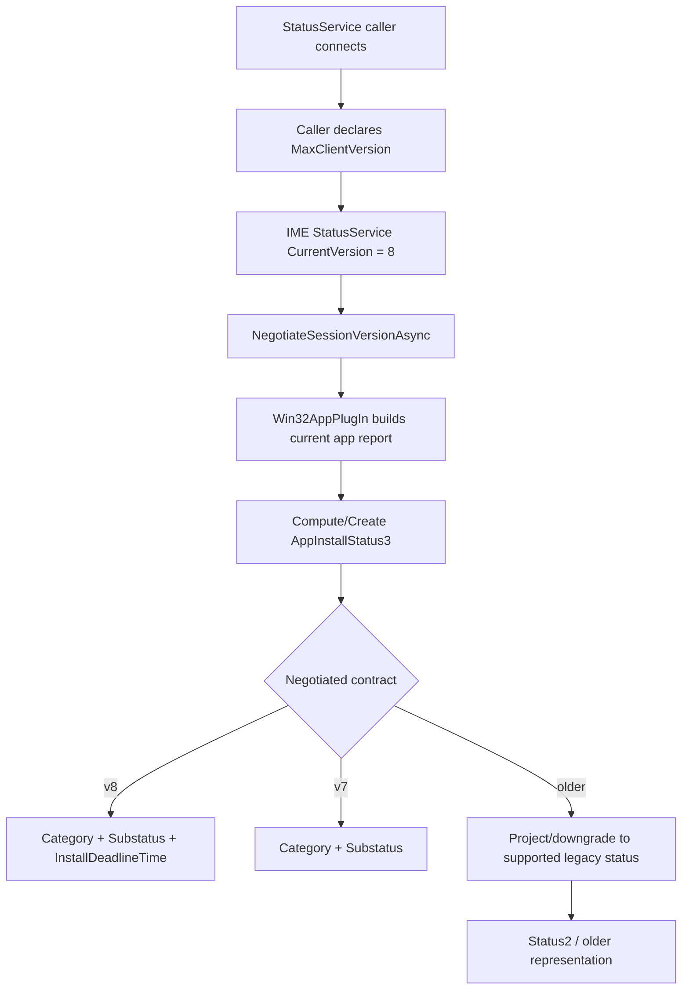
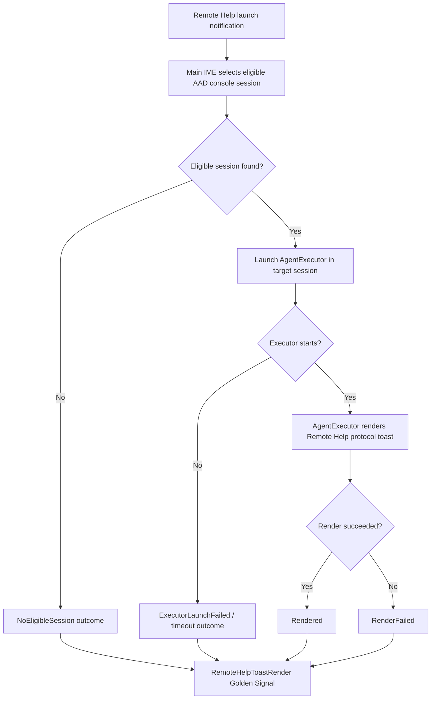
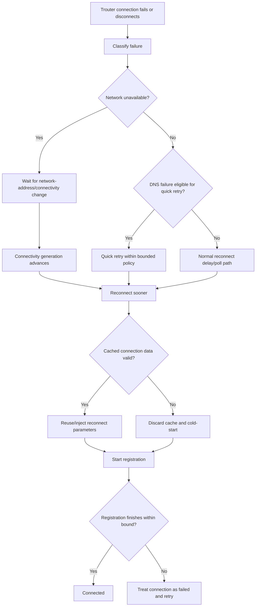
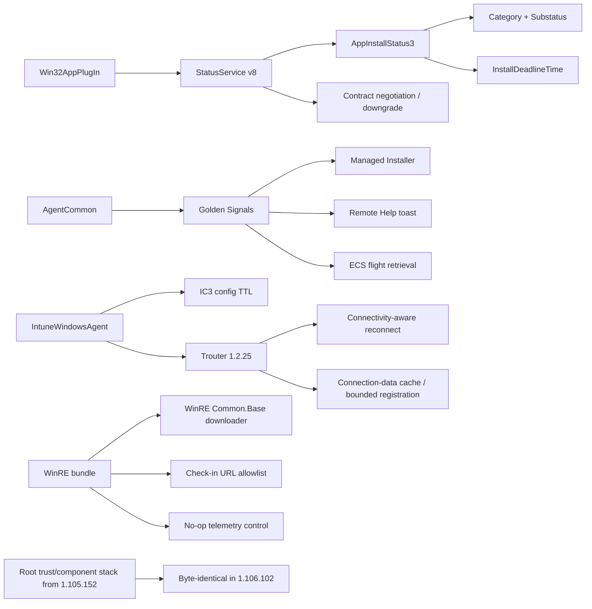

# ime-1.105.152.0-to-1.106.102.0

## Scope

This document describes the changes found between these Intune Management Extension packages:

| Package | Version |
| --- | --- |
| Previous package | `1.105.152.0` |
| New package | `1.106.102.0` |

Evidence sources: MSI database and table comparison, complete extraction of both embedded CAB payloads, SHA-256 comparison of every payload file, ECMA-335 metadata table comparison for managed assemblies, managed type, method, field and ImplMap inspection, ASCII and UTF-16 string diffing, PE architecture inspection, selected native export inspection, direct extraction and comparison of the nested WinRE CAB and manifest, and extraction and comparison of the actual `IntuneWindowsAgentCustomActions` SfxCA binary stream from both packages.

The embedded MSI cabinets use the same irregular layout seen in preceding IME packages: a few alias file records share the same compressed payload extent and records are not strictly folder ordered. A working copy of each CAB index was normalized so standard extraction tooling could read every file. The compressed data itself was not modified. All 154 files from both packages were extracted and compared.

No full managed IL or native-code decompilation was used. Findings below are based on package structure, metadata, constants, strings, PE architecture, selected native exports, and cross-component correlation. Where evidence supports behavior but does not prove the exact runtime call site or server-side activation condition, that is called out as inferred.

This is an independent investigation report. Presence of code does not mean a feature is active for every tenant.

### Independent verification

The most load-bearing specific claims in this document — the StatusService version-map constants (`CurrentVersion`, `CategorySubstatusFirstSupportedVersion`, `InstallDeadlineFirstSupportedVersion`), the `AppInstallStatusCategory`/`AppInstallSubstatus` enum literal values (including `DownloadedPendingInstallDeadline = 2002`), the IC3 `ConfigTTLDays`/`MaxConfigTTLDays` constants, and the byte-identical hashes claimed for the root trust/component binaries and the three WinRE `dynpin_cxx.dll` files — were independently re-derived from the same two source MSI packages using a purpose-built .NET `Constant`-table reader and fresh SHA-256 hashing of the raw MSI payload, rather than taken on trust. Every spot-checked value matched exactly.

Throughout the numbered findings below, the dense technical evidence is followed, where it would otherwise read as pure contract/telemetry jargon, by a short **"In plain terms"** paragraph explaining what the change means for someone running or supporting Intune — without removing or softening any of the underlying evidence.

## Executive summary

`1.106.102.0` is not another large ComponentManager or signature-validation expansion like `1.105.152.0`. The root trust and downloadable-component foundation introduced in that build is almost completely byte-identical here. Instead, this release concentrates on **Win32 app status contracts, backward-compatible status negotiation, observability, Remote Help toast reporting, IC3/Trouter reconnect behavior, and a substantial WinRE refresh**.

The important changes are:

1. **StatusService moves from contract version 6 to version 8.** A new `AppInstallStatus3` object, `AppInstallStatusCategory`, `AppInstallSubstatus`, and `VersionInfoAttribute` appear. `AppInstallStatusReport` gains a new `Status3` property and `IStatusService` gains `NegotiateSessionVersionAsync`.
2. **Status version 7 introduces category/substatus, while version 8 introduces install-deadline data.** The version map is explicit: `CategorySubstatusFirstSupportedVersion = 7`, `InstallDeadlineFirstSupportedVersion = 8`, and `CurrentVersion = 8`.
3. **The new status model can represent a downloaded app that is waiting for its install deadline.** `DownloadedPendingInstallDeadline = 2002` is added to `AppInstallSubstatus`, together with `InstallDeadlineTime` and Win32-side `ExecutionDeadlineTime` handling.
4. **The Win32 app plug-in adds contract negotiation and downgrade projection.** New helpers include `NegotiateVersion`, `ProjectReportToCallerVersion`, `CategoryDowngradeHelper`, and `SubstatusDowngradeHelper`. This is strong evidence that IME can expose richer status to newer callers without breaking older callers.
5. **ESP retry handling is refined for app-policy discovery/gateway failure.** A new `SetRetryEspCheckInRequiredForGatewayFailure` method appears with an explicit log path that marks the current check-in for a deferred ESP retry when app policy discovery fails.
6. **A reusable Golden Signals telemetry layer is added to AgentCommon.** New types include `GoldenSignalProvider`, `IGoldenSignalProvider`, `NullGoldenSignalProvider`, `TelemetrySanitizer`, and `SanitizedTelemetryException`. New signal families cover ECS flight retrieval, Managed Installer, and Remote Help toast rendering.
7. **Managed Installer gains cross-flow Golden Signals.** BootstrapperAgentCore exposes Managed Installer policy received/apply signals for the Autopilot flow, while ScriptPlugIn adds Managed Installer signaling for AppsSync and script execution. The Managed Installer engine itself is not new; the delta is observability around it.
8. **Remote Help launch toast handling gains explicit render-outcome reporting.** `AgentExecutor.exe` adds `ShowRemoteHelpLaunchToast` and a `RemoteHelpToastRenderer`; the main agent adds `SessionRenderOutcome` plus reason selection for `Rendered`, `RenderFailed`, `ExecutorLaunchFailed`, `ExecutorTimeout`, and `NoEligibleSession`. The existing Remote Help toast path is being instrumented rather than introduced from scratch.
9. **Trouter moves from `1.2.23.0` to `1.2.25.0` and adds connectivity-aware reconnect behavior.** New concepts include `EnableConnectivityAcceleratedReconnect`, `NetworkChangeConnectivitySignal`, `ConnectionDataStore`, cache validity/generation tracking, bounded registration, DNS/network failure classification, and waiting for network-address changes.
10. **IC3 notification configuration TTL becomes server-configurable.** The old fixed `ConfigTTLDays = 3` changes to a default of `7`; `configTTLDays` is now read as a named server value and `MaxConfigTTLDays = 365` appears, with validation/fallback logging.
11. **DataSensor gains a specific IME installer diagnostic event query.** It adds a query for Application log `MsiInstaller` event ID `1033` where `Data[1]` is `Microsoft Intune Management Extension`, mapped to `microsoft_sidecar_msiinstaller_1033`, with flight key `EmitSidecarMsiInstallerEvent`.
12. **The WinRE bundle changes materially after being byte-identical in the previous release.** It still contains 18 files, but 15 change. The manifest updates the package hash and those file hashes. The three architecture-specific `dynpin_cxx.dll` files remain byte-identical.
13. **WinRE Common.Base gains the reusable downloader framework.** It grows from 84 to 118 TypeDefs and 305 to 447 MethodDefs and adds BITS/Delivery Optimization naming, HTTP fallback, proxy handling, timeout/cancellation, metered-network detection, size ceilings, and retry classification.
14. **WinRE check-in URL handling is hardened.** `Microsoft.Intune.WinRe.Framework.dll` adds `IsAllowedCheckinUrl`, `GetHostSuffix`, `AllowedCheckinHostSuffixes`, HTTPS validation, and explicit rejection of recovery/discovery check-in URLs that do not match an allowed Microsoft device-management host.
15. **The MSI itself stays structurally boring.** No payload files are added or removed. The `File`, `Component`, `FeatureComponents`, `Registry`, custom-action, service, directory, and sequence table counts are unchanged. The SfxCA package also keeps the same eight embedded files and the same custom-action metadata shape.
16. **The `1.105.152.0` root trust/component architecture is retained unchanged.** Root `CoreLib.dll`, `SignatureValidationLibrary.dll`, `Common.SignatureValidation.dll`, `Policy.Runtime.dll`, `Components.Runtime.dll`, `Components.Base.dll`, `Common.Base.dll`, and `Microsoft.Management.IntuneComponent.exe` are all byte-identical.

The best headline for this build is therefore **IME 1.106.102.0 upgrades how app state is described and negotiated, adds targeted telemetry around Managed Installer and Remote Help, makes IC3/Trouter more resilient to connectivity changes, and refreshes/hardens the WinRE runtime without changing the MSI installation architecture.**

## Package-level changes

| Property | 1.105.152.0 | 1.106.102.0 |
| --- | --- | --- |
| ProductVersion | `1.105.152.0` | `1.106.102.0` |
| ProductCode | `{7ECACCD0-8601-4884-8860-7A4ADF4ED814}` | `{AF98F07E-B150-462A-BC23-DE6C1B377D58}` |
| UpgradeCode | `{9FE9701C-0F89-40B4-B77A-AA65607E87D8}` | same |
| Package/Revision GUID | `{D5177D08-E000-417C-9DE1-3398A3450D7A}` | `{8BC80A88-96E2-4711-B92A-D909548A822D}` |
| MSI Summary create time | `2026-09-04 17:06:26` | `2026-09-09 17:44:06` |
| MSI SHA-256 | `a9ac24c064b1c35e73af391abfcb40b276f45c1f227f9587a7b82aa6622b707a` | `5664b8225d3d58042bb530ddae72e92fb39758837b1cae1cdde895714fa31134` |
| MSI file size | 13,791,232 bytes | 13,840,384 bytes (`+49,152`, `+0.36%`) |
| Embedded CAB size | 13,197,808 bytes | 13,246,472 bytes (`+48,664`, `+0.37%`) |
| Files in payload | 154 | 154 |
| Files added | — | 0 |
| Files removed | — | 0 |
| Shared files changed | — | 90 |
| Shared files byte-identical | — | 64 |

The MSI still uses WiX Toolset `5.0.2.0`.

## No payload inventory change

Unlike `1.105.152.0`, which added `Microsoft.Management.Clients.Common.SignatureValidation.dll`, `1.106.102.0` adds **no new payload file** and removes none.

That distinction matters. The release is implemented by replacing existing binaries and updating the nested WinRE bundle, not by expanding the MSI feature/component inventory.

## Largest payload deltas

| File | 1.105.152.0 | 1.106.102.0 | Size delta | Version change |
| --- | ---: | ---: | ---: | --- |
| `Microsoft.Intune.WinRe.Bundle.cab` | 3,853,127 | 3,883,656 | `+30,529` | `` |
| `Microsoft.IC3.Trouter.dll` | 421,200 | 439,120 | `+17,920` | `1.2.23.0 -> 1.2.25.0` |
| `Microsoft.Management.Services.IntuneWindowsAgent.AgentCommon.dll` | 772,472 | 781,688 | `+9,216` | `1.105.152.0 -> 1.106.102.0` |
| `Microsoft.Management.Clients.IntuneManagementExtension.Win32AppPlugIn.dll` | 955,808 | 961,440 | `+5,632` | `1.105.152.0 -> 1.106.102.0` |
| `Microsoft.Management.Services.IntuneWindowsAgent.exe` | 534,424 | 538,016 | `+3,592` | `1.105.152.0 -> 1.106.102.0` |
| `Microsoft.Management.Clients.IntuneManagementExtension.ScriptPlugIn.dll` | 249,208 | 251,768 | `+2,560` | `1.105.152.0 -> 1.106.102.0` |
| `Microsoft.Management.Clients.IntuneManagementExtension.StatusServiceLibrary.dll` | 26,016 | 28,536 | `+2,520` | `1.105.152.0 -> 1.106.102.0` |
| `Microsoft.Management.Services.BootstrapperAgentCore.dll` | 188,792 | 189,856 | `+1,064` | `1.105.152.0 -> 1.106.102.0` |
| `Microsoft.Management.Clients.IntuneManagementExtension.DataSensorPlugIn.dll` | 168,824 | 169,848 | `+1,024` | `1.105.152.0 -> 1.106.102.0` |
| `el/ImeUI.resources.dll` | 19,832 | 20,384 | `+552` | `1.105.152.0 -> 1.106.102.0` |
| `AgentExecutor.exe` | 75,128 | 75,640 | `+512` | `1.105.152.0 -> 1.106.102.0` |
| `ClientCertCheck.exe` | 31,096 | 30,584 | `-512` | `1.105.152.0 -> 1.106.102.0` |
| `ru/ImeUI.resources.dll` | 19,872 | 20,344 | `+472` | `1.105.152.0 -> 1.106.102.0` |
| `Microsoft.Management.Clients.CopyAgentCatalog.exe` | 20,384 | 20,856 | `+472` | `1.105.152.0 -> 1.106.102.0` |

`ImeUI.resources.dll` exists once per shipped language under a locale subfolder (`el\`, `ru\`, and so on); the two rows above are the Greek and Russian satellite resource assemblies, not the same file listed twice. Both grew by a similarly small amount, consistent with new or changed UI strings being localized across languages rather than a code change.

The largest single delta is the nested WinRE bundle. Among normal root payload binaries, the largest behavioral changes are concentrated in Trouter, AgentCommon, Win32AppPlugIn, the main agent, ScriptPlugIn, StatusServiceLibrary, BootstrapperAgentCore, DataSensorPlugIn, and AgentExecutor.

A large part of the remaining 90 changed files consists of version-stamped/resource/dependency rebuilds with little or no managed metadata-shape change.

## Largest managed-code deltas

| Assembly | TypeDef | MethodDef | Field | Size delta |
| --- | ---: | ---: | ---: | ---: |
| `Microsoft.IC3.Trouter.dll` | `320 -> 335` | `1777 -> 1862` | `1584 -> 1674` | `+17,920` |
| `Microsoft.Management.Services.IntuneWindowsAgent.AgentCommon.dll` | `665 -> 674` | `3296 -> 3326` | `3216 -> 3269` | `+9,216` |
| `Microsoft.Management.Clients.IntuneManagementExtension.Win32AppPlugIn.dll` | `690 -> 692` | `3384 -> 3404` | `2537 -> 2547` | `+5,632` |
| `Microsoft.Management.Services.IntuneWindowsAgent.exe` | `303 -> 304` | `1365 -> 1371` | `1499 -> 1509` | `+3,592` |
| `Microsoft.Management.Clients.IntuneManagementExtension.ScriptPlugIn.dll` | `90 -> 90` | `432 -> 434` | `355 -> 355` | `+2,560` |
| `Microsoft.Management.Clients.IntuneManagementExtension.StatusServiceLibrary.dll` | `17 -> 21` | `55 -> 72` | `137 -> 169` | `+2,520` |
| `Microsoft.Management.Services.BootstrapperAgentCore.dll` | `128 -> 128` | `620 -> 620` | `629 -> 632` | `+1,064` |
| `Microsoft.Management.Clients.IntuneManagementExtension.DataSensorPlugIn.dll` | `88 -> 87` | `400 -> 401` | `434 -> 433` | `+1,024` |
| `AgentExecutor.exe` | `42 -> 42` | `164 -> 168` | `211 -> 212` | `+512` |

The largest managed expansion is `Microsoft.IC3.Trouter.dll`, followed by AgentCommon and Win32AppPlugIn. StatusServiceLibrary is small in bytes but disproportionately important because its public contract version moves from 6 to 8.

# 1. StatusService jumps from contract version 6 to version 8

`Microsoft.Management.Clients.IntuneManagementExtension.StatusServiceLibrary.dll` changes from:

```text
Size       26,016 -> 28,536 bytes
TypeDef        17 -> 21
MethodDef      55 -> 72
Field         137 -> 169
```

The new types are:

```text
AppInstallStatus3
AppInstallStatusCategory
AppInstallSubstatus
VersionInfoAttribute
```

`AppInstallStatusReport` itself also gains:

```text
Status3
get_Status3
set_Status3
Clone
```

The service interface gains:

```text
NegotiateSessionVersionAsync
```

The version map changes from:

```text
1.105.152.0
CurrentVersion = 6
```

to:

```text
1.106.102.0
CurrentVersion = 8
CategorySubstatusFirstSupportedVersion = 7
InstallDeadlineFirstSupportedVersion = 8
```

Existing compatibility boundaries remain:

```text
Status2FirstSupportedVersion = 3
ApplicabilityCode2FirstSupportedVersion = 3
UninstallStatusFirstSupportedVersion = 3
GetCurrentCheckInIdAsyncFirstSupportedVersion = 4
DownloadProgressUpdateFirstSupportedVersion = 5
AvailableAppCheckInAsyncFirstSupportedVersion = 6
```

This is direct evidence of two new contract generations rather than a single opaque status-object replacement.

> **In plain terms:** every app-status "conversation" between IME and something that asks it about app state (Company Portal, custom scripts, third-party tools using the local StatusService pipe) happens over a numbered contract. Older callers keep asking version 6 questions and get version 6 answers, exactly as before. Newer callers can now ask version 8 questions and get two new pieces of information back: a cleaner high-level category, and — for the first time — *when* an app is allowed to install. Nothing breaks for anyone who doesn't ask for the new version.

# 2. `AppInstallStatus3` separates category, substatus, and deadline

The new `AppInstallStatus3` object exposes:

```text
ContractVersion
Category
Substatus
InstallDeadlineTime
Clone
```

The category enum is deliberately coarse:

```text
Unknown         = 0
Installed       = 1000
Installing      = 2000
NotApplicable   = 3000
Failed          = 4000
NotInstalled    = 5000
Uninstalling    = 6000
UninstallFailed = 7000
```

The substatus enum preserves the more detailed state:

```text
Unknown                              = 0
Installed                            = 1000
InstalledButDependenciesNotPresent  = 1001
InstalledPendingReboot               = 1002
Installing                           = 2000
InstallingPendingReboot              = 2001
DownloadedPendingInstallDeadline     = 2002
NotApplicable                         = 3000
Failed                                = 4000
NotInstalled                          = 5000
UninstalledByGateway                  = 5001
Uninstalling                          = 6000
UninstallFailed                       = 7000
```

The separation gives the status consumer two levels of meaning: a stable high-level category and a more specific substatus.

The most interesting new value is:

```text
DownloadedPendingInstallDeadline = 2002
```

It adds a first-class way to distinguish an app that is already downloaded but is waiting for its install deadline from a generic `Installing` state.

> **In plain terms:** today, an app that has finished downloading but is intentionally waiting for its assignment's install deadline before it actually installs just looks like it's "still installing" to anything watching status. `DownloadedPendingInstallDeadline` gives that specific, entirely normal waiting period its own name, so a status consumer (or an admin reading a report built on this data) can tell "it's downloaded and waiting for its scheduled time" apart from "it's actually stuck installing." That distinction did not exist as a reportable state before this release.

# 3. Install-deadline reporting is version 8 functionality

The status library places install-deadline data behind contract version 8:

```text
InstallDeadlineFirstSupportedVersion = 8
```

Win32AppPlugIn adds matching concepts:

```text
ExecutionDeadlineTime
ExecutionDeadlineTimeKey
futureExecutionDeadline
installDeadlineTime
get_ExecutionDeadlineTime
set_ExecutionDeadlineTime
```

Together with `DownloadedPendingInstallDeadline`, this is strong evidence that a StatusService caller can now receive both the detailed state and the relevant install deadline when the caller negotiates contract version 8.

The exact user interface that consumes this data is not proven by this binary comparison. The client-side contract and projection path are directly visible.

# 4. Win32AppPlugIn adds backward-compatible contract negotiation

`Microsoft.Management.Clients.IntuneManagementExtension.Win32AppPlugIn.dll` grows from 690 to 692 TypeDefs and from 3,384 to 3,404 MethodDefs.

Important new methods include:

```text
BuildVersionInfoMap
ComputeAppInstallStatusV3
CreateAppInstallStatusV3
DowngradeToVersion
GetIntroducedInVersion
GetVersionInfo
NegotiateSessionVersionAsync
NegotiateVersion
ProjectReportToCallerVersion
ProjectReportToVersion
ToAppInstallStatus2
```

New local downgrade helpers include:

```text
CategoryDowngradeHelper
SubstatusDowngradeHelper
```

The plug-in also consumes the new StatusService `VersionInfoAttribute` metadata when building its version map.

Visible negotiation strings include:

```text
caller declared MaxClientVersion
agent CurrentVersion
negotiatedVersion
sessionNegotiatedVersion
targetVersion
clientMaxVersion
```

This is stronger than simply adding fields to a DTO. It shows an explicit compatibility model in which richer state can be generated and then projected to the version understood by the caller.

> **In plain terms:** IME now always builds the *richest* status internally (category, substatus, deadline) and then, per caller, "translates it down" to whatever contract version that specific caller understands — much like a modern API server that always computes the full answer but trims the response to match what an older client requested. This is what lets Microsoft evolve app-status reporting without breaking third-party tools or scripts written against the older, simpler status shape.

## Status contract negotiation flow



The exact implementation order inside individual methods is inferred from metadata names and version constants, but the negotiation and downgrade machinery itself is directly visible.

# 5. ESP app-policy discovery gets an explicit deferred retry path

Win32AppPlugIn adds:

```text
SetRetryEspCheckInRequiredForGatewayFailure
```

and a new log message states that when app-policy discovery fails, the current check-in is marked for a **deferred ESP retry**.

The existing ESP retry framework remains present, including retry counters and timer scheduling. The new delta specifically gives the gateway/policy-discovery failure path a way to set that retry-required state.

This is important because it distinguishes a transient inability to retrieve app policy from a final app evaluation outcome. The binary evidence does not prove which gateway HTTP/status failures are mapped into this path, only that the explicit failure-to-deferred-retry hook now exists.

# 6. AgentCommon introduces a reusable Golden Signals layer

`AgentCommon.dll` changes from:

```text
TypeDef    665 -> 674
MethodDef 3296 -> 3326
Field     3216 -> 3269
ImplMap    118 -> 118
```

New telemetry types include:

```text
GoldenSignalProvider
GoldenSignals
IGoldenSignalProvider
NullGoldenSignalProvider
TelemetrySanitizer
SanitizedTelemetryException
```

New methods include:

```text
IsSignalEnabled
LogSignal
Sanitize
SetClientTelemetry
EmitFlightRetrievalTelemetry
IsEcsFlightRetrievalSignalEnabled
```

Visible signal/flight names include:

```text
EnableEcsFlightRetrievalSignal
EnableManagedInstallerGoldenSignal
EnableRemoteHelpToastGoldenSignal
EcsFlightRetrieval
ManagedInstallerPolicyReceived
ManagedInstallerPolicyApply
ManagedInstallerScriptExecuted
RemoteHelpToastReceived
RemoteHelpToastRender
```

This creates a shared instrumentation layer rather than each workload inventing its own one-off signal format.

> **In plain terms:** "Golden Signals" is a common SRE term for the small set of metrics (traffic, errors, latency, saturation) that tell you whether a system is actually healthy. Before this release, if Managed Installer or the Remote Help toast wanted to report "did this actually work," each feature would have had to build its own ad-hoc telemetry. Now there's one shared, reusable component for that, which is why several unrelated-looking features (Managed Installer, Remote Help, ECS flight lookups) all pick up new instrumentation in the same release — they're all plugging into the same new plumbing rather than each being independently rewritten.

## Telemetry sanitization

The addition of:

```text
TelemetrySanitizer
SanitizedTelemetryException
```

is notable because it suggests the new signal framework intentionally normalizes or sanitizes exception/telemetry data before emission. The exact redaction rules are not proven without method-body inspection.

# 7. ECS flight retrieval gets its own health signal and cache entry

AgentCommon adds:

```text
FlightCacheEntry
ExpiryTicks
_flightCache
EmitFlightRetrievalTelemetry
EnableEcsFlightRetrievalSignal
```

Visible failure handling includes the ability to disable a signal temporarily if the ECS flight check itself fails or times out.

This avoids treating telemetry enablement lookup as an infinitely retried dependency and gives the flight-retrieval path its own observable success/failure behavior.

The cache implementation is visible at metadata/string level, but the exact eviction algorithm is not reconstructed here.

# 8. Managed Installer gains Golden Signals across Autopilot and normal AppsSync

Managed Installer behavior already existed before this release. `1.106.102.0` adds a clearer shared signal path around it.

AgentCommon defines:

```text
MANAGED_INSTALLER_FLOW_AUTOPILOT
MANAGED_INSTALLER_FLOW_APPS_SYNC
ManagedInstallerPolicyReceived
ManagedInstallerPolicyApply
ManagedInstallerScriptExecuted
```

and messages for:

```text
Managed installer policy received
Managed installer policy applied
Managed installer policy application failed
Managed installer script executed successfully
Managed installer script execution failed
```

`Microsoft.Management.Services.BootstrapperAgentCore.dll` adds Golden Signals references around its existing Managed Installer provider. That component already contains the Autopilot Device Preparation Managed Installer path and now exposes policy received/apply outcomes through the common signal provider.

`ScriptPlugIn.dll` adds:

```text
EmitAppsSyncManagedInstallerSignal
EmitManagedInstallerGoldenSignals
```

and visible flow name:

```text
AppsSync
```

There is also an explicit string saying that one remediation outcome does not emit a new Golden Signal because existing OCE telemetry already monitors that status. That is useful evidence that the new signal layer is intended to complement rather than blindly duplicate existing telemetry.

# 9. Remote Help toast rendering gets explicit outcome reporting

The underlying Remote Help launch/toast path already existed in `1.105.152.0`. The new change is explicit render-result plumbing.

`AgentExecutor.exe` adds:

```text
ShowRemoteHelpLaunchToast
RemoteHelpToastRenderer
-signalRenderOutcome
```

The existing toast contains the Remote Help protocol launch form:

```text
ms-remote-help:autolaunch?passcode=...
```

The main agent adds a new type:

```text
SessionRenderOutcome
```

and new methods:

```text
BuildRenderReasonProperties
IsRenderOutcomeSignalEnabled
SelectFailureReason
```

Visible outcome/reason names include:

```text
Rendered
RenderFailed
ExecutorLaunchFailed
ExecutorTimeout
NoEligibleSession
RequestException
```

The main agent also explicitly detects when there is no eligible AAD console session in which to render the toast.

AgentCommon adds the signal names:

```text
RemoteHelpToastReceived
RemoteHelpToastRender
```

and the flight:

```text
EnableRemoteHelpToastGoldenSignal
```

> **In plain terms:** Remote Help itself — the feature that pops a toast letting a signed-in user approve a support technician connecting to their PC — already existed before this release. What's new is that IME can now tell the difference between "the toast appeared and the user saw it," "the toast never rendered because nobody was signed in on the console," and "the toast should have rendered but something failed or timed out." Previously, a failure to show the toast was largely invisible; now it produces a specific, reportable reason, which should make Remote Help launch failures much easier to diagnose from telemetry instead of guessing from a help-desk complaint.

## Remote Help toast outcome flow



The precise server-side notification trigger is outside the MSI and is rollout dependent.

# 10. Remote Help Unattended itself is not new, but its feature gate is refined

AgentCommon already contained the Windows Remote Help Unattended implementation in the previous package. `1.106.102.0` adds a clearer combined gate model and new logging around it.

A new visible log path reports:

```text
persistedRegistry
inMemoryStatic
combined
```

and the notification path now refers to a `registry-or-static` enabled value.

This is a refinement to how the existing unattended feature enablement is resolved. It should not be interpreted as the first appearance of Remote Help Unattended in IME.

# 11. Trouter moves from 1.2.23.0 to 1.2.25.0

`Microsoft.IC3.Trouter.dll` is the largest root managed-code expansion in this build:

```text
Version     1.2.23.0 -> 1.2.25.0
Size        421,200 -> 439,120 bytes
TypeDef         320 -> 335
MethodDef      1777 -> 1862
Field          1584 -> 1674
```

New reconnect/connectivity concepts include:

```text
EnableConnectivityAcceleratedReconnect
NetworkChangeConnectivitySignal
NoOpConnectivitySignal
ConnectionDataStore
ConnectAttemptClassifier
ConnectAttemptOutcome
ConnectivityWaitResult
```

New methods include:

```text
AdvanceGeneration
AwaitRegistrationWithBound
BuildOpaqueReconnectUri
Classify
CopyFrom
CreateNext
DelayAndCheckLoopCancelledAsync
DelayOrConnectivityRestoreAsync
GetPollInterval
GetServiceUrlIdentity
InjectReconnectParams
IsCacheValid
IsDnsResolutionFailure
IsNetworkUnavailable
OnNetworkAddressChanged
PersistConnectionData
SetConnectionData
StartRegistration
WaitForNetworkChangeAsync
```

New state/limits include:

```text
CacheValidityMinSeconds
MaxDnsQuickRetries
MaxNetworkUnavailableStrikeExemptions
LongPollConnectTimeout
WebSocketConnectTimeout
RegistrationBound
Generation
CachedTime
Ccid
```

Visible logs include explicit paths for discarding cached connection parameters and cold-starting, and for treating a connection as failed when registration does not complete within its bound.

This is strong evidence that reconnect now distinguishes connectivity loss, DNS failures, stale cached allocation/connection state, and registration timeout instead of treating every reconnect as the same generic delay/retry problem.

> **In plain terms:** Trouter is the always-on connection IME uses to receive push notifications from Intune (for example, "a new policy is waiting" or "run this script now") instead of only checking in on a timer. Before this release, if that connection dropped, the agent treated every kind of drop the same way and waited out a generic retry delay before trying again — whether the laptop just changed Wi-Fi networks, DNS briefly failed, or the connection genuinely died. Now it can tell those situations apart and react appropriately to each, which section 12 below expands on.

# 12. Trouter adds network-change accelerated reconnect

The addition of `System.Net.NetworkInformation`, `NetworkAddressChangedEventHandler`, `OnNetworkAddressChanged`, and `WaitForNetworkChangeAsync` is particularly important.

A plausible client flow, based on directly visible names, is:



The flow captures the visible architecture; it is not a reconstructed IL call graph.

> **In plain terms:** this is the specific improvement that matters most for laptop users. A common real-world case is: someone closes their laptop lid on the office Wi-Fi, reopens it at home on a different network, and Intune needs to reconnect. The old generic retry loop could leave the push-notification channel down for a while after a network change like that. The new code specifically watches for "the network just changed" as its own event and reconnects faster in response, rather than only reacting once its normal retry timer happens to fire.

# 13. IC3 notification configuration TTL becomes server-configurable

The main `IntuneWindowsAgent.exe` adds:

```text
GetConfigTTLDays
ConfigTTLDaysValueName
MaxConfigTTLDays
```

The constants change from:

```text
1.105.152.0
ConfigTTLDays = 3
```

to:

```text
1.106.102.0
ConfigTTLDays = 7
ConfigTTLDaysValueName = "configTTLDays"
MaxConfigTTLDays = 365
```

New strings explicitly distinguish:

```text
Server provided a valid configTTLDays value
Server did not provide a valid configTTLDays value; using default
```

The existing IC3 registry configuration already tracks an expiration timestamp. The new code makes the lifetime supplied by the service configurable, while retaining a client default and maximum.

This likely reduces unnecessary rediscovery when the server wants a longer-lived configuration while still bounding how long stale notification endpoints can be trusted. That operational effect is an inference; the server-configured TTL path itself is direct evidence.

> **In plain terms:** IC3 is the notification transport Trouter runs on top of, and it caches its own connection configuration for a period of time (the "TTL," or time-to-live) so it doesn't have to re-discover its notification endpoint on every check-in. That cached lifetime used to be hardcoded to 3 days everywhere. Now Microsoft's service can tell each client to hold onto its configuration for longer — up to 365 days — which reduces unnecessary rediscovery traffic, while the client still enforces a sane default and a hard ceiling so a bad server value can't make it trust a stale configuration forever.

# 14. DataSensor adds an IME MSI installer diagnostic event query

`Microsoft.Management.Clients.IntuneManagementExtension.DataSensorPlugIn.dll` adds:

```text
EnableSidecarInstallerDiagnosticEventQuery
GetBooleanFlightValueOrDefaultAsync
ECSFlightKeyEmitSidecarMsiInstallerEvent
SidecarInstallerDiagnosticEventCollectionQueryGuid
```

The visible event query targets:

```text
Log: Application
Provider: MsiInstaller
Event ID: 1033
Data[1]: Microsoft Intune Management Extension
```

and maps it to:

```text
microsoft_sidecar_msiinstaller_1033
```

The corresponding flight name is:

```text
EmitSidecarMsiInstallerEvent
```

This is a targeted installer-health signal for the IME MSI itself rather than a broad collection of every MSI Installer event.

# 15. Some DataSensor flighting is being retired because paths have landed

New strings state that:

```text
Inventory events are now always routed to the inventory DB.
Golden signals are now always onboarded to Common Schema for Sidecar Agent.
```

At the same time, older state-machine fields around `isInventoryAgentDBEnabled` and `routeInventoryEventsToNewDb` disappear.

This is good evidence of feature-flight cleanup: paths that were previously conditional are becoming the normal path, while a new narrow MSI installer diagnostic query remains separately flight-controlled.

# 16. The WinRE bundle is no longer byte-identical

> **In plain terms — what WinRE even is here:** Windows Recovery Environment (WinRE) is the limited, pre-boot recovery OS a PC falls back into when Windows itself won't start — the screen with "Advanced options," "Reset this PC," and similar tools. IME ships a small, separate bundle of DLLs (packed into their own nested CAB file inside the main MSI, plus per-architecture plugins for Amd64/Arm64/I386) that lets Intune's remote-management capability keep working even from that pre-boot environment — for example, so an admin can still see or act on a device that's stuck outside a normal Windows session. Because it runs in such a constrained environment, this bundle is versioned and updated somewhat independently of the main IME agent, and it can go multiple releases without changing at all — which is exactly what happened in the previous release before waking up here.

The previous `1.105.103.0 -> 1.105.152.0` comparison found the WinRE bundle byte-identical. That changes here.

```text
1.105.152.0 WinRE CAB
Size    3,853,127 bytes
SHA-256 160ec5412a56dae1b1206daa950a79d963c138897fa7440b853c3db2319b2434

1.106.102.0 WinRE CAB
Size    3,883,656 bytes
SHA-256 a506a06094656787d8dd11069831b24aa3f167b6616f8ae0f5a6c3c48e0d3472
```

The companion manifest remains 6,806 bytes but changes from:

```text
0412189ecf46a7ccd159be3f79a5b1c5a96eeec76b3676d9d3da5485ef3671dd
```

to:

```text
a0f7868c7684404631215173f9e33ea5b2ab31d05f7927fbc1d6413f7a97b656
```

The manifest still declares:

```text
Name: Microsoft.Intune.WinRe.Bundle
Version: 1.0.0
Operation ID: 1844D527-E557-4715-8E9B-48522231B0D9
Assembly: Microsoft.Intune.WinRe.Component.dll
Class: Microsoft.Intune.WinRe.Component.WinReComponent
```

What changes is the CAB package hash and the hashes of the changed payload files.

## WinRE file-level comparison

| WinRE file | 1.105.152.0 | 1.106.102.0 | Hash state |
| --- | ---: | ---: | --- |
| `IntuneRemoteManagementPlugin/Amd64/CoreLib.dll` | 1,231,224 | 1,213,304 | changed |
| `IntuneRemoteManagementPlugin/Amd64/MicrosoftIntuneWinReRemoteManagementPlugin.dll` | 192,848 | 192,848 | changed |
| `IntuneRemoteManagementPlugin/Amd64/SignatureValidationLibrary.dll` | 475,472 | 513,400 | changed |
| `IntuneRemoteManagementPlugin/Amd64/dynpin_cxx.dll` | 1,178,936 | 1,178,936 | same |
| `IntuneRemoteManagementPlugin/Arm64/CoreLib.dll` | 1,391,992 | 1,374,544 | changed |
| `IntuneRemoteManagementPlugin/Arm64/MicrosoftIntuneWinReRemoteManagementPlugin.dll` | 186,192 | 186,192 | changed |
| `IntuneRemoteManagementPlugin/Arm64/SignatureValidationLibrary.dll` | 492,880 | 534,864 | changed |
| `IntuneRemoteManagementPlugin/Arm64/dynpin_cxx.dll` | 1,048,384 | 1,048,384 | same |
| `IntuneRemoteManagementPlugin/I386/CoreLib.dll` | 1,099,600 | 1,084,280 | changed |
| `IntuneRemoteManagementPlugin/I386/MicrosoftIntuneWinReRemoteManagementPlugin.dll` | 151,888 | 151,928 | changed |
| `IntuneRemoteManagementPlugin/I386/SignatureValidationLibrary.dll` | 414,584 | 449,360 | changed |
| `IntuneRemoteManagementPlugin/I386/dynpin_cxx.dll` | 958,272 | 958,272 | same |
| `Microsoft.Intune.WinRe.Component.dll` | 67,408 | 69,456 | changed |
| `Microsoft.Intune.WinRe.Core.dll` | 22,864 | 22,864 | changed |
| `Microsoft.Intune.WinRe.Framework.dll` | 235,856 | 238,928 | changed |
| `Microsoft.Intune.WinRe.Registration.dll` | 23,928 | 23,888 | changed |
| `Microsoft.Management.Clients.Common.Base.dll` | 80,720 | 107,856 | changed |
| `Microsoft.Management.Clients.Policy.OfflineReader.dll` | 29,008 | 29,048 | changed |

The only byte-identical files inside the WinRE CAB are the three architecture-specific `dynpin_cxx.dll` builds.

> **In plain terms:** 15 of the 18 files in the WinRE bundle were rebuilt in this release — essentially the whole bundle except the three `dynpin_cxx.dll` certificate-pinning binaries, one per CPU architecture, which are unchanged bit-for-bit. That's a genuine "catch-up" update: nothing in WinRE changed in the prior release, and now most of it moves forward together in one go, which is why the sections below (17 through 22) each cover a different piece of what actually changed inside it.

# 17. WinRE managed components move to a newer generation

The four `Microsoft.Intune.WinRe.*` managed assemblies carry visible build/version strings moving from:

```text
6.2607.1.1005
```

to:

```text
6.2608.13.1002
```

The WinRE Common/Policy libraries move from visible version family:

```text
7.1.1.27
```

to:

```text
7.1.1.40
```

This is not the same `7.1.1.65` generation used by the root trust/component libraries in `1.105.152.0`; WinRE has its own bundled version progression.

## WinRE managed metadata deltas

| Assembly | TypeDef | MethodDef | Field | Size delta |
| --- | ---: | ---: | ---: | ---: |
| `Microsoft.Intune.WinRe.Component.dll` | `27 -> 28` | `139 -> 157` | `130 -> 147` | `+2,048` |
| `Microsoft.Intune.WinRe.Core.dll` | `21 -> 21` | `57 -> 57` | `61 -> 61` | `+0` |
| `Microsoft.Intune.WinRe.Framework.dll` | `116 -> 117` | `735 -> 742` | `511 -> 515` | `+3,072` |
| `Microsoft.Intune.WinRe.Registration.dll` | `11 -> 11` | `61 -> 61` | `25 -> 25` | `-40` |
| `Microsoft.Management.Clients.Common.Base.dll` | `84 -> 118` | `305 -> 447` | `271 -> 425` | `+27,136` |
| `Microsoft.Management.Clients.Policy.OfflineReader.dll` | `10 -> 10` | `37 -> 37` | `19 -> 19` | `+40` |

The standout is WinRE `Microsoft.Management.Clients.Common.Base.dll`.

# 18. WinRE Common.Base gains the reusable downloader framework

Inside the WinRE bundle, `Microsoft.Management.Clients.Common.Base.dll` changes from:

```text
Size       80,720 -> 107,856 bytes
TypeDef        84 -> 118
MethodDef     305 -> 447
Field         271 -> 425
ImplMap         6 -> 6
```

New types include:

```text
IPayloadDownloader
PayloadDownloaderFactory
DeliveryOptimizationPayloadDownloader
FallbackPayloadDownloader
HttpPayloadDownloader
BitsDownloadJob
BitsDownloadResult
BitsCallbackHandler
BackgroundCopyManager
WinHttpProxyHandlerFactory
INetworkCostManager
INetworkCostChecker
NetworkCostChecker
```

Visible behavior covers:

```text
BITS job creation/resume/cancel
HTTP fallback
proxy settings
metered-network detection
timeout and cancellation
maximum download byte ceiling
retryable/permanent HTTP status classification
partial-file cleanup
```

This is closely related to the downloader architecture that appeared in the root `Common.Base.dll` in `1.105.152.0`, but the WinRE copy is a separate `7.1.1.40` build.

The strongest interpretation is that the WinRE component runtime is gaining the same family of reliable payload-download primitives needed to fetch or stage recovery-related content safely.

Without full IL reconstruction, this report does not claim which WinRE operation first invokes every downloader implementation.

> **In plain terms:** think of this as WinRE gaining the same "download things reliably, even on a bad connection" toolkit that the main IME agent already had. It can now fetch a payload over Delivery Optimization (Windows' peer-assisted download service) or BITS (a Windows background-transfer service designed to survive network drops and reboots), fall back to plain HTTP if needed, respect proxy settings, detect a metered connection so it doesn't blow through someone's mobile data cap, and enforce a maximum download size and timeout so a bad or oversized response can't hang the recovery environment indefinitely. Before this release, WinRE apparently didn't have this — or had a much thinner version of it.

# 19. WinRE check-in URL validation is hardened

`Microsoft.Intune.WinRe.Framework.dll` grows from 116 to 117 TypeDefs and from 735 to 742 MethodDefs.

New methods include:

```text
GetHostSuffix
IsAllowedCheckinUrl
```

and new state includes:

```text
AllowedCheckinHostSuffixes
UriSchemeHttps
```

New log strings explicitly reject a check-in URL when:

```text
it is not a valid absolute URI
its scheme is not HTTPS
its host is not an allowed Microsoft device-management host
```

The validation is applied to both a check-in URL loaded from recovery metadata and one resolved through discovery.

This is a concrete hardening change. A recovery metadata value is no longer merely parsed and used; it is subjected to a scheme/host allowlist check before being accepted.

> **In plain terms:** the URL WinRE calls back to Intune's servers on can come from recovery metadata stored on the device or from a discovery lookup — both of which are, in principle, more attacker-reachable than a normal in-session network call, since the device isn't fully booted into Windows yet. Previously that URL was apparently just used as given. Now, before WinRE will call out to it, the code checks that it's a well-formed address, that it uses HTTPS (not plain HTTP), and that its hostname actually matches Microsoft's known device-management domains — rejecting anything else. This closes off a plausible way a tampered or spoofed check-in address could redirect the recovery agent somewhere it shouldn't go.

# 20. WinRE certificate-chain handling gets a narrow offline refinement

`Microsoft.Intune.WinRe.Framework.dll` also adds certificate-chain log paths distinguishing a generic `X509Chain.Build()` failure from failures attributable only to expected offline conditions.

Visible wording references:

```text
UntrustedRoot
offline revocation
strict identity checks
```

The evidence suggests the WinRE path can continue past certain expected offline chain statuses while still performing stricter identity validation afterward.

That does **not** mean certificate validation is disabled in WinRE. The visible logic explicitly separates tolerated offline conditions from the subsequent identity checks.

> **In plain terms:** the recovery environment has no guarantee of internet access — it may need to validate a certificate while genuinely offline, where a normal "can I check if this certificate was revoked" step will always fail simply because there's no network, not because anything is wrong. This change teaches WinRE to recognize that specific, expected offline failure and not treat it as a hard validation failure — while still requiring the certificate's identity to check out afterward. It's a narrowing of what counts as "expected" failure, not a loosening of trust.

# 21. WinRE component no-op telemetry is throttled/deduplicated

`Microsoft.Intune.WinRe.Component.dll` adds:

```text
ShouldEmitNoOpTelemetry
ShouldEmitConsistencyNoOpTelemetry
ResetNoOpTelemetryTracking
ResetConsistencyNoOpTelemetryTracking
NoOpTelemetryInterval
ConsistencyNoOpTelemetryInterval
lastNoOpEmitUtc
lastNoOpResult
lastConsistencyNoOpEmitUtc
lastConsistencyNoOpResult
UtcNowProvider
```

This indicates the component now tracks repeated no-op and consistency outcomes and can suppress repeated identical telemetry until an interval or state change warrants another emission.

The actual interval values were not recovered as literal constants by the metadata-only inspection, so this report does not assign a duration.

> **In plain terms:** a "no-op" here means a check that ran and found nothing to do — everything's fine, no action needed. Emitting a telemetry event every single time that happens can flood logs and telemetry pipelines with repetitive "still fine" noise. This change adds a cooldown so the component only reports "still fine" occasionally (or when the result actually changes), instead of every single time it checks. This is a housekeeping/signal-quality improvement, not a functional behavior change.

# 22. WinRE native trust libraries refresh, but DynPin stays fixed

The WinRE CAB refreshes architecture-specific `CoreLib.dll` and `SignatureValidationLibrary.dll` files for x86, x64, and ARM64, while all three `dynpin_cxx.dll` files are byte-identical.

For the x86 and x64 `SignatureValidationLibrary.dll` builds, the visible export-name surface remains the same 11-name WinRE-oriented set, including:

```text
ConfigureLogging
GetRegistrationEnvironment
GetValueFromPayload
VerifyWinDCLeafCertSignatureEx
VerifyWinDCPayloadSignature
VerifyWinDCPayloadSignatureEx
VerifyWinDcDocumentSignature
VerifyWinDcDocumentSignatureEx
```

So the WinRE native trust refresh does not look like the root `1.105.152.0` expansion into the larger detached-CMS/TLS-pinning export set. It is a rebuild/update of the WinRE trust family while retaining its existing public export shape on the inspected x86/x64 builds.

> **In plain terms — the WinRE picture as a whole:** the previous release (`1.105.152.0`) rebuilt IME's *main* signature-validation and certificate-pinning system. WinRE's copy of similar trust libraries was left untouched at the time. This release brings WinRE's trust libraries forward too, but as a routine rebuild of the existing WinRE-specific trust code rather than the bigger architectural rewrite the main agent got — the same functions are exported, just from freshly built binaries. Combined with the new download toolkit (section 18) and the tightened URL checks (section 19), the overall WinRE story in this release is "catch up and harden the existing recovery-environment tooling," not "introduce a new WinRE capability."

# 23. The root `1.105.152.0` trust and component-delivery foundation is byte-identical

The most architectural binaries from the previous release do not change at all in `1.106.102.0`:

| File | Version | Size | SHA-256 | Byte-identical |
| --- | --- | ---: | --- | --- |
| `CoreLib.dll` | 7.1.1.65 | 1,084,240 | `26c355ed4b1dc45263a553f0315fc27bcfd52fe179f5ef8c791760a5acd5bad0` | yes |
| `SignatureValidationLibrary.dll` | 7.1.1.65 | 519,504 | `2369ec53f7e792bb39f4953ea54ca3c865f73d0df777514f01fb2fb8ef027252` | yes |
| `Microsoft.Management.Clients.Common.SignatureValidation.dll` | 7.1.1.65 | 47,440 | `09349449fa08782440a9ecc43f8ff7dfe319b3ed974f3fda6cfc564f68353aff` | yes |
| `Microsoft.Management.Clients.Policy.Runtime.dll` | 7.1.1.65 | 111,992 | `a56135417df9264e605b6af94799b101dac0db34383ee03f56daf753687199af` | yes |
| `Microsoft.Management.Clients.Components.Runtime.dll` | 7.1.1.65 | 297,848 | `f6f4d8cbf4633609b479335af5a72a1be2d5ea0066b6504ec0ebe4ea800dfa35` | yes |
| `Microsoft.Management.Clients.Components.Base.dll` | 7.1.1.65 | 37,200 | `665dbe8dd5b5bcfc68320ad5c5b899d2eccbcb1259f5a7500d708d8fdb8307c9` | yes |
| `Microsoft.Management.Clients.Common.Base.dll` | 7.1.1.65 | 114,512 | `e7ee6a20c36111913544a5871af279eddfb76e737070c23c256bb10fcfdd491b` | yes |
| `Microsoft.Management.IntuneComponent.exe` | 7.1.1.65 | 53,112 | `83ef5ef4e41e0b7b4419295376b589b772726a0c36c76f7edeb0713d506a9650` | yes |

The two root `dynpin_cxx.dll` copies and the two `IntunePolicyStorage.dll` copies are also byte-identical.

This is important context. `1.106.102.0` is **not** another rewrite of the root signature-validation, policy-signature, or ComponentManager delivery system. Those foundations remain as introduced in `1.105.152.0` while other parts of IME build on top of them.

`ClientHealthEval.exe` is rebuilt from version `1.105.152.0` to `1.106.102.0`, but its TypeDef/MethodDef/Field counts and semantic strings remain unchanged in this comparison; the visible differences are consistent with version/build/signing metadata rather than another connectivity/trust framework expansion.

# 24. Runtime dependency cohort moves forward together

Ten Microsoft/.NET dependency assemblies move from version:

```text
10.0.926.27113
```

to:

```text
10.0.1026.32716
```

| Dependency | Old size | New size |
| --- | ---: | ---: |
| `Microsoft.Bcl.AsyncInterfaces.dll` | 27,984 | 27,984 |
| `System.Threading.Channels.dll` | 90,448 | 90,408 |
| `System.Memory.Data.dll` | 38,224 | 38,184 |
| `Microsoft.Extensions.DependencyInjection.Abstractions.dll` | 65,872 | 65,872 |
| `Microsoft.Bcl.Memory.dll` | 77,648 | 77,608 |
| `Microsoft.Extensions.Logging.Abstractions.dll` | 69,968 | 69,928 |
| `System.IO.Pipelines.dll` | 85,328 | 85,288 |
| `System.Text.Encodings.Web.dll` | 87,376 | 87,336 |
| `System.Diagnostics.DiagnosticSource.dll` | 223,056 | 223,056 |
| `System.Text.Json.dll` | 778,064 | 778,024 |

Their managed metadata shapes remain stable in this comparison. These look like a coordinated dependency servicing/rebuild cohort rather than separate IME feature additions.

# 25. MSI mechanics remain structurally unchanged

At the MSI database level, the important table counts are identical:

| Table | 1.105.152.0 | 1.106.102.0 | Functional change |
| --- | ---: | ---: | --- |
| `File` | 154 | 154 | No file added/removed; 86 existing rows receive version/size metadata changes |
| `Component` | 161 | 161 | None |
| `FeatureComponents` | 161 | 161 | None |
| `Registry` | 9 | 9 | None |
| `CustomAction` | 22 | 22 | None |
| `InstallExecuteSequence` | 52 | 52 | None |
| `InstallUISequence` | 9 | 9 | None |
| `AdminExecuteSequence` | 8 | 8 | None |
| `ServiceInstall` | 1 | 1 | None |
| `ServiceControl` | 1 | 1 | None |
| `RemoveFile` | 7 | 7 | None |
| `Feature` | 1 | 1 | None |
| `Directory` | 57 | 57 | None |
| `MsiFileHash` | 23 | 23 | Same rows; 5 hash rows updated |

The `Property` table changes only the normal `ProductCode` and `ProductVersion` values.

The `Upgrade` table moves the upgrade/downgrade boundary from `1.105.152.0` to `1.106.102.0`.

The `Signature` table keeps the same `NewerFileVersionSearch` row but updates its `MinVersion` from `1.105.152.0` to `1.106.102.0`.

No MSI-level setup action is added for StatusService v8, Golden Signals, Trouter reconnect, Remote Help toast reporting, or the WinRE behavior changes. Those are runtime changes inside existing components.

## Custom-action SfxCA comparison

The `Binary.IntuneWindowsAgentCustomActions` stream changes only slightly:

```text
1.105.152.0: 479,896 bytes
1.106.102.0: 479,808 bytes
```

The embedded SfxCA CAB still contains the same eight files. Seven are byte-identical. The changed custom-action assembly is:

```text
1.105.152.0 SideCarSetupCustomActions.dll
56,184 bytes
SHA-256 d47eeffc122ad81c5189204739b9546a83b0145fa201df7e3b1abdedae79654e

1.106.102.0 SideCarSetupCustomActions.dll
56,224 bytes
SHA-256 0620222084ffbdf67c1beb8ad4fc6b10e2d3c689ca3157b3b7243679c6b034bf
```

Its metadata shape remains unchanged:

```text
TypeDef    29 -> 29
MethodDef  81 -> 81
Field     145 -> 145
MemberRef 172 -> 172
ImplMap    14 -> 14
```

The visible semantic metadata names are unchanged. Differences are version/build/signing material rather than evidence of a new custom-action code path.

# 26. Architecture overview



The diagram shows the cross-component relationship, not a guarantee that every flight-controlled branch is active on every device.

## Evidence and confidence

### High confidence: directly visible in MSI tables, metadata, constants, hashes, or strings

* Product/package identity changes and unchanged MSI structural table counts.
* 154 payload files in both packages, with 90 changed and 64 byte-identical.
* StatusService `CurrentVersion` moves from 6 to 8.
* `CategorySubstatusFirstSupportedVersion = 7` and `InstallDeadlineFirstSupportedVersion = 8`.
* New `AppInstallStatus3`, category/substatus enums, `Status3`, and `NegotiateSessionVersionAsync`.
* `DownloadedPendingInstallDeadline = 2002`.
* New Win32 status negotiation/downgrade helpers and `ExecutionDeadlineTime` state.
* New gateway/policy-discovery deferred ESP retry hook.
* New Golden Signals provider/sanitizer types and Managed Installer/Remote Help/ECS signal names.
* New Remote Help render-outcome plumbing and `AgentExecutor` render command switch.
* Trouter `1.2.23.0 -> 1.2.25.0`, its metadata growth, connectivity signal types, cache/generation state, and bounded-registration names.
* IC3 `ConfigTTLDays` default changes from 3 to 7, server value name appears, and maximum 365 appears.
* New DataSensor `MsiInstaller` event ID 1033 query for the Microsoft Intune Management Extension.
* WinRE CAB/manifest hashes change; 15 of 18 WinRE files change while three DynPin files remain byte-identical.
* WinRE Common.Base downloader metadata expansion.
* WinRE URL validation methods/logging and no-op telemetry tracking names.
* Root 1.105.152 trust/component binaries listed above are byte-identical.
* SfxCA payload count and custom-action metadata shape remain unchanged.

### Strong inference, but not proven by a full managed IL/native decompilation

* Status contract projection allows newer callers to consume v7/v8 state while older callers receive downgraded equivalents.
* `DownloadedPendingInstallDeadline` is intended to expose a downloaded-but-not-yet-installable state to StatusService consumers.
* Connectivity-aware Trouter waiting is intended to shorten recovery when the network changes instead of sleeping through a normal retry interval.
* Server-controlled IC3 TTL is intended to tune endpoint-configuration freshness without hardcoding one lifetime.
* WinRE Common.Base downloader primitives are intended for reliable recovery-component payload acquisition/staging.
* No-op telemetry tracking is intended to suppress repeated identical no-op/consistency events.

### Server, policy, or rollout dependent

* Whether StatusService v7/v8 is requested by a particular caller on a particular device.
* Whether the new detailed status/deadline is surfaced in Company Portal or another UX.
* Which app-policy discovery failures trigger the deferred ESP retry path.
* Whether each Golden Signal family is enabled through ECS.
* Whether Remote Help render-outcome signaling is enabled.
* Whether connectivity-accelerated reconnect is enabled in Trouter.
* The `configTTLDays` value sent by the service.
* Whether the DataSensor MSI installer diagnostic flight is enabled.
* Which WinRE operations invoke the newly bundled downloader paths.

## Suggested validation

### 1. Confirm StatusService negotiation

On a device running `1.106.102.0`, inspect the StatusService interaction around:

```text
net.pipe://localhost/IntuneManagementExtension/StatusService/
```

Look for version negotiation showing:

```text
caller MaxClientVersion
agent CurrentVersion=8
negotiated version
```

If a test client can call `NegotiateSessionVersionAsync`, compare responses when declaring maximum versions 6, 7, and 8.

Expected evidence:

```text
v6: legacy/Status2-compatible report
v7: category + substatus available
v8: category + substatus + install deadline available
```

### 2. Validate `DownloadedPendingInstallDeadline`

Use a Win32 app assignment with a future deadline where content can be downloaded before execution is allowed.

Capture:

```text
AppWorkload.log
StatusService caller/result
local app status cache
```

Look for whether the status becomes:

```text
Category family: Installing
Substatus: DownloadedPendingInstallDeadline (2002)
InstallDeadlineTime: populated
```

The category mapping should be verified on-device rather than assumed solely from the numeric range.

### 3. Validate deferred ESP retry on policy discovery failure

In a controlled lab, interrupt the SideCar gateway/app-policy discovery path during ESP without breaking all local processing.

Look for the new log indicating that app-policy discovery failed and the current check-in was marked for a deferred ESP retry, followed by the existing ESP retry scheduling path.

### 4. Validate Managed Installer Golden Signals

Compare two flows:

```text
Autopilot Device Preparation bootstrapper flow
Normal IME AppsSync / ScriptPlugIn flow
```

Look for signal names:

```text
ManagedInstallerPolicyReceived
ManagedInstallerPolicyApply
ManagedInstallerScriptExecuted
```

and confirm the flow property distinguishes `Autopilot` from `AppsSync`.

### 5. Validate Remote Help toast render outcomes

Trigger a Remote Help launch notification under controlled conditions:

```text
normal signed-in AAD console session
no eligible console session
forced AgentExecutor launch failure or timeout
```

Correlate `IntuneManagementExtension.log` and `AgentExecutor.log` for:

```text
Rendered
NoEligibleSession
ExecutorLaunchFailed
ExecutorTimeout
RenderFailed
```

and check whether `RemoteHelpToastRender` telemetry is emitted only when `EnableRemoteHelpToastGoldenSignal` is active.

### 6. Validate Trouter network-change reconnect

Start the IC3 notification client, then change network state while observing `NotificationInfra.log`:

```text
Wi-Fi disconnect/reconnect
switch Wi-Fi networks
DNS failure then recovery
proxy change
```

Look for evidence that the client notices a network-address change, advances connectivity generation, and reconnects without waiting for the full normal retry delay when accelerated reconnect is enabled.

Also test stale cached connection data to see when it is discarded for a cold start.

### 7. Validate IC3 `configTTLDays`

Capture a GenericWorkload response that includes the Notification Infra configuration and inspect:

```text
configTTLDays
ConfigExpirationTicks
SOFTWARE\Microsoft\IntuneManagementExtension\IC3
```

Confirm:

```text
missing/invalid server value -> default 7 days
valid server value -> service-provided lifetime
value above supported maximum -> client validation/fallback behavior
```

The exact handling above the 365-day maximum should be verified on-device because this report does not reconstruct the method body.

### 8. Validate DataSensor MSI event 1033 collection

On a lab device, perform an IME MSI install/upgrade and inspect the Application event log for `MsiInstaller` event ID 1033 where the product name field is `Microsoft Intune Management Extension`.

Then correlate Sensor/DataSensor telemetry with the `EmitSidecarMsiInstallerEvent` flight enabled and disabled.

### 9. Validate WinRE URL allowlist hardening

In a non-production lab only, test recovery metadata/discovery inputs using:

```text
valid Microsoft HTTPS check-in host
HTTP instead of HTTPS
unexpected external HTTPS host
malformed URI
```

Expected client-side evidence is rejection before use for invalid scheme/host cases.

### 10. Validate WinRE downloader behavior

Exercise a WinRE operation that requires payload acquisition and monitor for strings/logging associated with:

```text
DeliveryOptimizationPayloadDownloader
HttpPayloadDownloader
FallbackPayloadDownloader
BITS
metered network
proxy
timeout
byte ceiling
```

The exact operation that exercises these classes should be determined experimentally because the metadata comparison does not prove every call site.

## Final assessment

`1.106.102.0` is a **status-contract, observability, connectivity-resilience, and WinRE hardening release**.

The biggest client-facing architectural change is StatusService. The contract moves from version 6 to 8, app state is split into category and substatus, a new downloaded/waiting-for-deadline state appears, install-deadline time becomes part of the contract, and the Win32 plug-in gains explicit version negotiation and downgrade projection. That is a much cleaner foundation for richer app-state UX without forcing every caller to move in lockstep.

The second story is operational visibility. A reusable Golden Signals layer appears in AgentCommon and is wired into Managed Installer, Remote Help toast rendering, and ECS flight retrieval. Remote Help itself is not newly introduced; what changes is the ability to classify whether a toast was actually rendered and why it failed. Managed Installer similarly gains a common signal story across Autopilot and normal AppsSync paths.

The third story is real-time notification resilience. Trouter 1.2.25 adds network-change awareness, persistent connection data, cache validity/generation tracking, failure classification, and bounded registration. At the IME layer, IC3 endpoint configuration moves from a fixed three-day TTL to a seven-day default with a server-provided `configTTLDays` value and a 365-day maximum.

The fourth story is WinRE. The bundle that stayed untouched in `1.105.152.0` is substantially refreshed here. WinRE Common.Base gains the downloader framework, the Framework adds strict HTTPS/host checks for check-in URLs, the Component adds no-op telemetry tracking, and the trust binaries are refreshed while DynPin stays identical.

Meanwhile, the large root trust and ComponentManager architecture from `1.105.152.0` is deliberately stable and the MSI setup surface remains unchanged.

The best headline is therefore:

> **IME 1.106.102.0 makes app status richer and backward-compatible, makes Remote Help and Managed Installer easier to observe, makes IC3 reconnect/configuration more resilient, and brings the next hardening wave into WinRE.**

## Sources

* Previous IME tracker comparison, `1.105.103.0 -> 1.105.152.0`: https://github.com/call4cloud-code/IME-Change-Tracker/blob/main/release-notes/ime-1.105.103.0-to-1.105.152.0.MD
* IME Change Tracker repository: https://github.com/call4cloud-code/IME-Change-Tracker
* Microsoft Learn, Intune Management Extension for Windows: https://learn.microsoft.com/en-us/intune/device-management/tools/management-extension-windows
* Microsoft Learn, Win32 app management in Microsoft Intune: https://learn.microsoft.com/en-us/intune/app-management/deployment/win32
* Microsoft Learn, Remote Help: https://learn.microsoft.com/en-us/intune/remote-help/
* The new StatusService v7/v8 contract members, Golden Signal names, IC3/Trouter internals, DataSensor flight names, and WinRE implementation details described above are derived from the supplied MSI binaries. No Microsoft public document was found in this comparison that documents these internal member/flight names.
