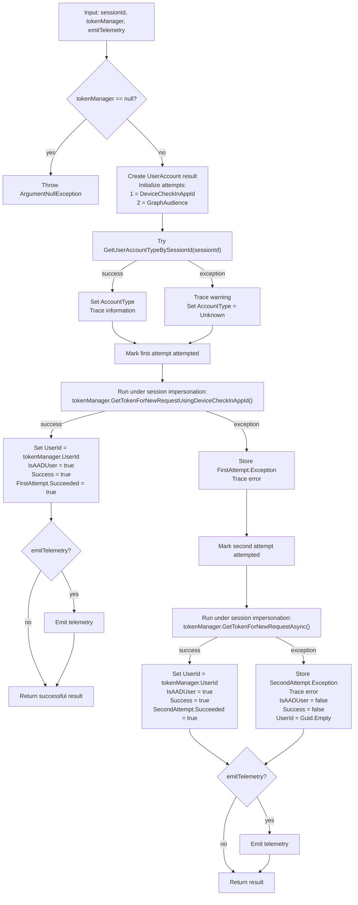

# Intune Management Extension release note

## Summary

Intune Management Extension (IME) MSI payload changed from **1.101.111.0** to **1.103.101.0**.

**Evidence-backed facts:**

- File changes: **104**
- MSI table diff rows: **287**
- CustomAction diff rows: **2**
- InstallExecuteSequence diff rows: **3**
- Managed method changes reported: **15,448**
- New payload files:
  - `Microsoft.Bcl.Memory.dll`
  - `System.Threading.Channels.dll`
  - `Microsoft.Management.Services.IntuneWindowsAgent.exe.config.bak`

No customer impact is proven from the supplied evidence alone.

## What changed

### MSI and installer flow

**Added:**

- Custom action: `SyncAppConfigTimestamps`
  - Source: `IntuneWindowsAgentCustomActions`
  - Target: `SyncAppConfigTimestamps`
  - Type: `65`
- Install sequence row:
  - `SyncAppConfigTimestamps`
  - Condition: `NOT UPGRADINGPRODUCTCODE`
  - Sequence: `799`
- Install sequence row:
  - `CopyCatalog`
  - Condition: `NOT REMOVE`
  - Sequence: `5799`

**Removed:**

- Custom action: `RunCopyCatalogSilently`
  - Source: `IntuneWindowsAgentCustomActions`
  - Target: `RunCopyCatalogSilently`
  - Type: `3137`
- Install sequence row:
  - `RunCopyCatalogSilently`
  - Condition: `NOT REMOVE`
  - Sequence: `5799`

**Interpretation:** `CopyCatalog` appears to replace the scheduled sequence position previously used by `RunCopyCatalogSilently`, but the supplied evidence does not prove whether the underlying implementation is equivalent.

### Runtime and DLL changes

Evidence-backed notable changed areas:

- `AgentCommon.dll`
  - Added `UserAccount.RetrieveAsync(...)` flow with two AAD token acquisition attempts.
  - Added registry ACL hardening support.
  - Changed Remote Help unattended telemetry/status handling.
  - Changed Remote Desktop Users group resolution from hard-coded English name to SID-based lookup with fallback.
  - Changed WTS interop to explicit Unicode APIs.
- `TamperProtection.dll`
  - Expanded root certificate trust metadata in `SideCarSigningCertificateChainInfo::.cctor`.
  - Added root subject: `Microsoft RSA Root Certificate Authority 2017`
  - Added root thumbprint: `73A5E64A3BFF8316FF0EDCCC618A906E4EAE4D74`
- `System.Text.Json.dll`
  - Updated from `9.0.9` family to `10.0.6` family.
  - Added async enumerable deserialization iterator paths.
  - No Intune-specific logic was shown in this DLL evidence.
- `WindowsPackageManager.dll`
  - Updated from `1.26.560.0` to `1.28.220.0`.
- `ClientHealthEval.exe`
  - Added disk-usage-related methods/types in visible method evidence.
- `AgentExecutor.exe`
  - Changed methods in proxy, toast, program startup, and resource areas.

## Why it matters

**Facts:**

- The MSI install sequence changed.
- The custom action payload changed.
- Core IME service binaries, plug-ins, health tools, UI/helper binaries, telemetry libraries, WinGet-related binaries, and dependency DLLs changed.
- At least one runtime function flow in `AgentCommon.dll` has evidence-backed behavioral logic changes.

**Interpretation / validation focus:**

- Installer validation should focus on app config handling, `.config.bak`, and catalog copy behavior.
- Runtime validation should focus on AAD user/session token retrieval, unattended Remote Help flows, certificate-chain trust behavior, WinGet app flows, JSON dependency loading, and client health evaluation.
- No performance, reliability, policy, enrollment, or customer-visible behavior change is proven by the supplied evidence.

## Changed components

| Component | Evidence-backed change |
|---|---|
| MSI database | Product/version metadata changed; 287 table diff rows |
| Install sequence | Added `SyncAppConfigTimestamps`; added `CopyCatalog`; removed `RunCopyCatalogSilently` |
| Custom actions | Added `SyncAppConfigTimestamps`; removed `RunCopyCatalogSilently` |
| Custom action DLL | Added `CustomActions::SyncAppConfigTimestamps`; added `CustomActions::RetryOnIOException`; changed `EnsureAppConfigExists` and other helper methods |
| `AgentCommon.dll` | Added two-stage `UserAccount.RetrieveAsync` AAD token retrieval flow; changed Remote Help, registry, WTS, and group handling |
| `TamperProtection.dll` | Added root certificate subject/thumbprint to trusted metadata lists |
| `System.Text.Json.dll` | Major dependency update to `10.0.6` family with new async iterator paths |
| WinGet stack | `WindowsPackageManager.dll` updated to `1.28.220.0`; `WinGetLibrary.dll` changed |
| Client health | `ClientHealthEval.exe` changed; disk-usage-related types/methods added |
| UI/helper | `AgentExecutor.exe`, `ImeUI.exe`, and localized resources changed |

## Mermaid function flow

Evidence-backed changed runtime function flow from focused DLL report:

`Microsoft.Management.Services.IntuneWindowsAgent.AgentCommon.UserAccount.RetrieveAsync(int sessionId, IClientTokenManager tokenManager, bool emitTelemetry = false)`

## Evidence

- Old MSI: `IntuneWindowsAgent_1.101.111.0.msi`
- New MSI: `IntuneWindowsAgent_1.103.101.0_manual_ffad3f11.msi`
- ProductVersion changed: `1.101.111.0` → `1.103.101.0`
- ProductCode changed:
  - Old: `{CEFAEC57-33DC-4775-BFD2-561699357699}`
  - New: `{58976FF3-87CA-4691-BDFC-671F37F07CB6}`
- UpgradeCode remained shown as:
  - `{9FE9701C-0F89-40B4-B77A-AA65607E87D8}`
- CustomAction table:
  - Added `SyncAppConfigTimestamps`
  - Removed `RunCopyCatalogSilently`
- InstallExecuteSequence:
  - Added `SyncAppConfigTimestamps` at sequence `799`
  - Added `CopyCatalog` at sequence `5799`
  - Removed `RunCopyCatalogSilently` at sequence `5799`
- Focused DLL evidence:
  - `AgentCommon.dll`: added `UserAccount.RetrieveAsync` two-stage token retrieval flow.
  - `TamperProtection.dll`: added trusted root subject and thumbprint in `SideCarSigningCertificateChainInfo::.cctor`.
  - `System.Text.Json.dll`: updated to `10.0.6` family and added async enumerable deserialization iterator paths.

## Uncertainty

- The supplied MSI method report is truncated; not all 15,448 method diffs were reviewed.
- Many method diffs may be rebuild/RVA/name-shift artifacts rather than behavior changes.
- The exact implementation behind `CopyCatalog` is not proven by the provided evidence.
- The exact behavior of `SyncAppConfigTimestamps` is not proven beyond its MSI scheduling and method presence.
- No runtime caller graph was supplied for `TamperProtection.dll` trust-list consumers.
- No evidence proves customer-visible impact, success-rate changes, performance changes, or service-side behavior changes.
