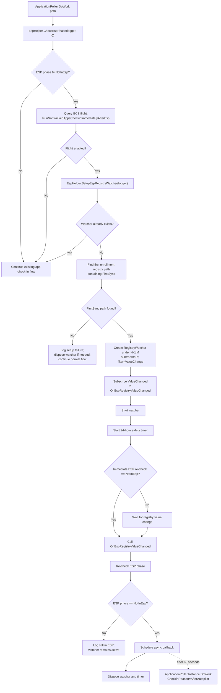

# Intune Management Extension release note

## Summary

Microsoft Intune Management Extension changed from **1.101.111.0** to **1.103.101.0**.

**Facts from the diff evidence:**

- File changes: **104**
- MSI table diff rows: **287**
- CustomAction diff rows: **2**
- InstallExecuteSequence diff rows: **3**
- Managed method changes reported: **15,448**
- This is not a version-number-only rebuild. The evidence includes MSI install-flow changes, new files, changed focused DLL logic, dependency updates, and method-level changes.

## What changed

### MSI and install flow

**Facts:**

- Added custom action:
  - `SyncAppConfigTimestamps`
  - Source: `IntuneWindowsAgentCustomActions`
  - Target: `SyncAppConfigTimestamps`
  - Type: `65`
- Scheduled `SyncAppConfigTimestamps` in `InstallExecuteSequence`:
  - Condition: `NOT UPGRADINGPRODUCTCODE`
  - Sequence: `799`
- Removed custom action:
  - `RunCopyCatalogSilently`
  - Type: `3137`
- Removed install sequence action:
  - `RunCopyCatalogSilently`
  - Condition: `NOT REMOVE`
  - Sequence: `5799`
- Added install sequence action:
  - `CopyCatalog`
  - Condition: `NOT REMOVE`
  - Sequence: `5799`
- Added installed files:
  - `Microsoft.Bcl.Memory.dll`
  - `System.Threading.Channels.dll`
  - `Microsoft.Management.Services.IntuneWindowsAgent.exe.config.bak`

**Interpretation:**

- The installer now has an explicit config timestamp action and a config backup/shadow file.
- `CopyCatalog` replaces `RunCopyCatalogSilently` at the same sequence and condition. The evidence does not prove whether catalog-copy behavior changed or only the sequenced action changed.

### Focused DLL changes

**Win32 app plug-in**

- `Microsoft.Management.Clients.IntuneManagementExtension.Win32AppPlugIn.dll` changed from `1.101.111.0` to `1.103.101.0`.
- Method evidence shows substantive changes, including:
  - ESP / Autopilot post-ESP app workload check-in watcher.
  - WinGet retry-on-transient-errors flight plumbing.
  - WinGet enforcement-timeout handling.
  - Suppression of duplicate WinGet terminal/progress reporting.
  - `CheckinReasonPayload` now includes `SyncType`.

**AgentCommon**

- `Microsoft.Management.Services.IntuneWindowsAgent.AgentCommon.dll` changed.
- Method evidence shows:
  - New `UserAccount.RetrieveAsync` two-stage AAD-user retrieval flow.
  - Registry hardening APIs.
  - WTS Unicode API usage.
  - Remote Desktop Users group resolution by SID instead of hard-coded English group name.
  - SideCar gateway API version changed from `1.5` to `1.6`.
  - `CheckinReasonPayload` includes `SyncType`.

**Trouter**

- `Microsoft.IC3.Trouter.dll` changed:
  - Old version: `1.1.52.0`
  - New version: `1.2.9.0`
- Focused method evidence shows real connection lifecycle restructuring, including:
  - `ClientStateManager`
  - `ConnectionHandler`
  - `ConnectionHandler.ConnectAsync`
  - send/disconnect semaphore usage
  - claims-challenge extraction in connection error paths

### Dependency and payload refresh

**Facts:**

- `WindowsPackageManager.dll` changed from `1.26.560.0` to `1.28.220.0`.
- VC runtime DLLs changed from `14.23.27820.0` to `14.50.35727.0`.
- Several .NET dependency assemblies moved to `10.0.626.17701` / `10.0.6` family versions.
- `ClientTelemetry.dll` changed from `3.25.206.1` to `3.25.343.1`.

## Why it matters

**Evidence-backed significance:**

- Install-time behavior changed because a new custom action is scheduled and another catalog-related action was replaced.
- The Win32 app plug-in contains a new ESP registry watcher path that can schedule an app workload check-in after ESP completion when the controlling flight is enabled.
- AgentCommon contains a new AAD-user retrieval fallback model.
- Trouter connection handling was restructured around state gating, connection handlers, retry/error data, and semaphore-protected send/disconnect paths.
- WinGet execution/reporting behavior has new flight-gated timeout and retry plumbing.

**Not proven:**

- Customer-visible impact.
- Specific bug fixes.
- Service-side behavior changes.
- Whether all reported method changes are semantic. Evidence shows some changed methods are rebuild/RVA/layout noise.

## Changed components

| Component | Evidence-backed change |
|---|---|
| MSI database | Product/version/package metadata changed; 287 table diff rows |
| Install execute sequence | Added `SyncAppConfigTimestamps`; replaced `RunCopyCatalogSilently` sequence entry with `CopyCatalog` |
| `SideCarSetupCustomActions.dll` | Added `SyncAppConfigTimestamps` and `RetryOnIOException`; changed config, registry, service, ETW, AUMID, process, and task scheduler helper methods |
| `Win32AppPlugIn.dll` | Substantive ESP, WinGet, check-in payload, reporting, and GRS-related changes |
| `AgentCommon.dll` | Substantive user-account retrieval, registry security, Remote Help, WTS, Remote Desktop Users group, and API-version changes |
| `Microsoft.IC3.Trouter.dll` | Version `1.1.52.0` to `1.2.9.0`; connection lifecycle restructuring |
| `WindowsPackageManager.dll` | Version `1.26.560.0` to `1.28.220.0` |
| `ClientHealthEval.exe` | Size increased; method evidence indicates added disk-usage telemetry-related types |
| `AgentExecutor.exe` | Method names indicate changes in startup, temp path, proxy, toast, and WinGet logging areas; exact behavior not proven from provided excerpt |

## Mermaid function flow

Primary evidence-backed changed function flow: **Win32 app plug-in ESP registry watcher and post-ESP app workload check-in**.

## Evidence

- MSI comparison:
  - Old: `IntuneWindowsAgent_1.101.111.0.msi`
  - New: `IntuneWindowsAgent_1.103.101.0_manual_ffad3f11.msi`
- MSI summary:
  - File changes: `104`
  - MSI table diff rows: `287`
  - CustomAction diff rows: `2`
  - Install flow sequence diff rows: `3`
  - Managed method changes: `15,448`
- Focused DLL reports:
  - `Microsoft.Management.Clients.IntuneManagementExtension.Win32AppPlugIn.dll`
  - `Microsoft.Management.Services.IntuneWindowsAgent.AgentCommon.dll`
  - `Microsoft.IC3.Trouter.dll`
- Custom action evidence:
  - Added `CustomActions::SyncAppConfigTimestamps`
  - Added `CustomActions::RetryOnIOException`
  - Changed `CustomActions::EnsureAppConfigExists`
- Install sequence evidence:
  - Added `SyncAppConfigTimestamps` at sequence `799`
  - Added `CopyCatalog` at sequence `5799`
  - Removed `RunCopyCatalogSilently` at sequence `5799`

## Uncertainty

- The full method body diff for all changed IME binaries was not provided.
- Exact behavior of `SyncAppConfigTimestamps` is not proven beyond method/action presence and name.
- Exact catalog-copy behavior change is not proven; only the MSI sequencing change is proven.
- Flight states are not known. ESP watcher and WinGet behavior are conditional on flights.
- Customer-visible impact is not proven by static diff evidence.
- The managed method count includes rebuild/dependency/layout noise; not every reported method change is functional.
