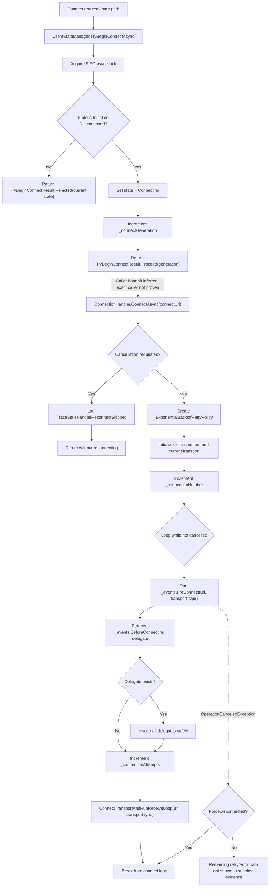

# Intune Management Extension release note

## Summary

Comparison: **IntuneWindowsAgent 1.101.111.0** → **1.103.101.0**

This release contains evidence-backed changes in the MSI install sequence, custom actions, the service executable, Trouter client connectivity code, notification workload dispatch paths, compliance monitor startup, and multiple dependency DLLs.

The highest-signal binary deltas were generated for:

1. `Microsoft.IC3.Trouter.dll`
2. `System.Text.Json.dll`
3. `Microsoft.Management.Services.IntuneWindowsAgent.exe`
4. `Microsoft.Management.Services.IntuneWindowsAgent.AgentCommon.dll`
5. `Microsoft.Management.Clients.IntuneManagementExtension.Win32AppPlugIn.dll`

## What changed

### MSI and install sequence

- Added custom action:
  - `SyncAppConfigTimestamps`
  - `Source=IntuneWindowsAgentCustomActions`
  - `Target=SyncAppConfigTimestamps`
  - `Type=65`
- Removed custom action:
  - `RunCopyCatalogSilently`
  - `Type=3137`
- Added install sequence rows:
  - `SyncAppConfigTimestamps`, condition `NOT UPGRADINGPRODUCTCODE`, sequence `799`
  - `CopyCatalog`, condition `NOT REMOVE`, sequence `5799`
- Removed install sequence row:
  - `RunCopyCatalogSilently`, condition `NOT REMOVE`, sequence `5799`

### Payload and dependency changes

- Added payload files:
  - `Microsoft.Bcl.Memory.dll`
  - `System.Threading.Channels.dll`
  - `Microsoft.Management.Services.IntuneWindowsAgent.exe.config.bak`
- Changed major service and workload binaries, including:
  - `Microsoft.Management.Services.IntuneWindowsAgent.exe`
  - `Microsoft.IC3.Trouter.dll`
  - `Microsoft.Management.Services.IntuneWindowsAgent.AgentCommon.dll`
  - `Microsoft.Management.Clients.IntuneManagementExtension.Win32AppPlugIn.dll`
  - `Microsoft.Management.Clients.IntuneManagementExtension.AppEnforcementProcessor.dll`
  - `Microsoft.Management.Clients.IntuneManagementExtension.ScriptPlugIn.dll`
  - `Microsoft.Management.Clients.IntuneManagementExtension.WinGetLibrary.dll`
  - `System.Text.Json.dll`

### Trouter connection lifecycle

Fact:

- `Microsoft.IC3.Trouter.dll` assembly metadata changed from `1.1.52.0` to `1.2.9.0`.
- New connection-management classes and paths are evidenced:
  - `Trouter.ClientSdk.ClientStateManager`
  - `Trouter.ClientSdk.ConnectionHandler`
  - `ConnectionStateManager`
  - `DisconnectIfNotHeardPongAsync`
  - `SendPingAsync`
  - `OnSocketNetworkError`
  - `StopAsync`
  - `SwitchTransport`

Interpretation:

- The Trouter client connection lifecycle appears to have been refactored into explicit state-manager and connection-handler components with serialized connect gating, connection generation tracking, cancellation handling, retry setup, and channel-based message consumption.

### Service notification and compliance monitor paths

Fact:

- `Microsoft.Management.Services.IntuneWindowsAgent.exe` changed in `EmsAgentService`.
- `OnStart` now creates and starts compliance-monitor-related objects:
  - `complianceMonitor = new ComplianceMonitor()`
  - `complianceMonitorLauncher = new ComplianceMonitorLauncher(...)`
  - `complianceMonitorLauncher.Start()`
- `OnStart` now creates `NotificationWorkloadHelper`.
- `DeviceActionCallbackAsync` now queries ECS flight:
  - `EnableNotificationWorkloadDispatch`
- When dispatch is enabled, notification handling calls:
  - `NotificationWorkloadHelper.TriggerAdditionalWorkloads(...)`
- New notification branches are evidenced for:
  - `PowerShellScriptWorkload`
  - `ProactiveRemediation`
- Win32 notification handling now uses `TriggerWin32AppAsync(primaryContext)` with fault-only continuation telemetry.

Interpretation:

- Notification processing is moving from direct workload callbacks toward a helper-mediated, flight-gated dispatch model.

## Why it matters

Fact-backed:

- Install behavior changed because a new MSI custom action is scheduled and the catalog-copy action name/path changed.
- Trouter connectivity behavior may change because new state-manager and connection-handler paths are present.
- Notification-triggered workload processing can call additional workload dispatch when `EnableNotificationWorkloadDispatch` is enabled.
- Compliance monitor startup is now part of the service lifecycle in the shown `OnStart` evidence.

Interpretation requiring validation:

- The Trouter refactor may affect reconnect, ping/pong, stale handler, and transport-switch behavior.
- The notification dispatch model may initiate more than one workload from a notification when flighting enables it.
- Compliance monitoring may add background activity after service start, but the launcher schedule and full drift-handling loop are not fully visible in the provided evidence.

## Changed components

| Component | Evidence-backed change |
|---|---|
| MSI package | 104 file changes, 287 MSI table diff rows, 2 custom action diff rows, 3 install sequence diff rows |
| `SideCarSetupCustomActions.dll` | Added `SyncAppConfigTimestamps`, added `RetryOnIOException`, changed `EnsureAppConfigExists` and registry/task helper methods |
| `Microsoft.IC3.Trouter.dll` | Version `1.1.52.0` → `1.2.9.0`; added `ClientStateManager` and `ConnectionHandler`; new async connection and ping/pong paths |
| `Microsoft.Management.Services.IntuneWindowsAgent.exe` | Changed `EmsAgentService`; added compliance monitor startup and notification workload dispatch logic |
| `Microsoft.Management.Services.IntuneWindowsAgent.AgentCommon.dll` | Changes around `RegistryHelper`, `FlightingManager`, `UserAccount.RetrieveAsync`, and AAD user async paths |
| `Microsoft.Management.Clients.IntuneManagementExtension.Win32AppPlugIn.dll` | Changes around `SideCarApplicationClientPolicy`, `ActionHandlerContext`, `ReportingManager`, `DownloadJob`, `ReportingState`, and `Win32AppResult` |
| `System.Text.Json.dll` | Dependency-level changes in async enumerable deserialization, `Utf8JsonReader`, `Utf8JsonWriter`, and `ThrowHelper` paths |

## Mermaid function flow

Evidence-backed changed DLL flow: `Microsoft.IC3.Trouter.dll` connection-start path.

## Evidence

- Old MSI:
  - `IntuneWindowsAgent_1.101.111.0.msi`
- New MSI:
  - `IntuneWindowsAgent_1.103.101.0_manual_ffad3f11.msi`
- MSI diff summary:
  - File changes: `104`
  - MSI table diff rows: `287`
  - CustomAction diff rows: `2`
  - Install flow sequence diff rows: `3`
  - Managed method changes: `15448`
- `Microsoft.IC3.Trouter.dll`:
  - `AssemblyFileVersion`: `1.1.52.0` → `1.2.9.0`
  - Added `ClientStateManager`
  - Added `ConnectionHandler`
  - Added async paths including `DisconnectIfNotHeardPongAsync`, `SendPingAsync`, `OnSocketNetworkError`, `StopAsync`, and `SwitchTransport`
- `Microsoft.Management.Services.IntuneWindowsAgent.exe`:
  - Added `ComplianceMonitor`
  - Added `ComplianceMonitorLauncher`
  - Added `NotificationWorkloadHelper`
  - Added ECS query for `EnableNotificationWorkloadDispatch`
  - Added notification branches for PowerShell script and proactive remediation workloads
- WNS registration path:
  - Still calls `CreatePushNotificationChannelForApplicationAsync`
  - Still uses `GetChannelUriWithExponentialBackoffAsync`
  - Same visible constants: `60000`, `240000`, `3`

## Uncertainty

- The evidence pack is truncated; some full method bodies and catch/finally paths are not visible.
- The exact caller that connects `ClientStateManager.TryBeginConnectAsync()` to `ConnectionHandler.ConnectAsync()` is inferred from component flow and not proven by the excerpt.
- The complete Trouter retry/error path after the shown `OperationCanceledException` handling is not visible.
- `NotificationWorkloadHelper` internals are not provided; exact additional workload selection behavior requires runtime validation.
- `ComplianceMonitorLauncher` internals are not provided; cadence, gating, and full drift remediation behavior are not fully asserted.
- Many method changes are compiler-generated async state machines, display classes, dependency updates, or RVA/token churn and should not be counted as independently meaningful behavior changes.
