# Intune Management Extension release note

## Summary

This diff compares Intune Management Extension MSI `1.101.111.0` to `1.103.101.0`.

Evidence indicates this is **not only rebuild churn**. The strongest functional candidates are:

- New/changed **ComplianceMonitor** contracts and service wiring.
- Expanded **notification workload dispatch** for `SyncType`, `AdditionalWorkloads`, PowerShell script workload, and proactive remediation.
- Substantial **Microsoft.IC3.Trouter.dll** connection, registration, proxy, reconnect, stale-handler, and logging changes.
- **ScriptPlugIn** scheduling changes, including notification scheduling and minute/hourly compliance script cadence candidates.
- **DataSensorPlugIn** proxy exception handling and BLP/BLEU environment handling.
- **WinGet / Win32 app execution** retry, timeout, cancellation, and logging-path changes.
- Installer custom-action changes around app config timestamp/config repair handling.

No customer impact is directly proven by the supplied evidence.

## What changed

### High-confidence functional evidence

- MSI changed from:
  - Old: `IntuneWindowsAgent_1.101.111.0.msi`
  - New: `IntuneWindowsAgent_1.103.101.0_manual_ffad3f11.msi`
- Diff scale:
  - File changes: `104`
  - MSI table diff rows: `287`
  - CustomAction diff rows: `2`
  - Install sequence diff rows: `3`
  - Managed method changes: `15448`
  - Generated feature signals: `77923`

### Installer and custom actions

Facts:

- Added custom action:
  - `Action=SyncAppConfigTimestamps`
  - `Source=IntuneWindowsAgentCustomActions`
  - `Target=SyncAppConfigTimestamps`
  - `Type=65`
- Removed custom action:
  - `Action=RunCopyCatalogSilently`
  - `Source=IntuneWindowsAgentCustomActions`
  - `Target=RunCopyCatalogSilently`
  - `Type=3137`
- Added install sequence rows:
  - `SyncAppConfigTimestamps`, condition `NOT UPGRADINGPRODUCTCODE`, sequence `799`
  - `CopyCatalog`, condition `NOT REMOVE`, sequence `5799`
- Removed install sequence row:
  - `RunCopyCatalogSilently`, condition `NOT REMOVE`, sequence `5799`

Focused DLL evidence for `SideCarSetupCustomActions.dll` shows:

- Added `CustomActions::SyncAppConfigTimestamps`
- Changed `CustomActions::EnsureAppConfigExists`
- Added `CustomActions::RetryOnIOException`
- Added/changed log strings:
  - `EnsureAppConfigExists: InstallFolder={0}, ShadowConfigPath={1}, TargetConfigPath={2}`
  - `EnsureAppConfigExists: Synced destination timestamps (modify = create)`
  - `SyncAppConfigTimestamps: InstallFolder={0}, ConfigPath={1}`
  - `SyncAppConfigTimestamps: Failed to sync timestamps after retries`

Interpretation:

- The app-config repair flow moved from embedded-resource restore of `EmsAgentAppConfig` to a shadow-file based path using:
  - Source: `Microsoft.Management.Services.IntuneWindowsAgent.exe.config.bak`
  - Target: `Microsoft.Management.Services.IntuneWindowsAgent.exe.config`

### Service, notification, and compliance monitoring

Evidence shows new or changed methods/strings in `Microsoft.Management.Services.IntuneWindowsAgent.exe` and service contracts:

- `ComplianceMonitor`
- `ComplianceMonitorLauncher::LaunchIfFlightEnabledAsync`
- `ComplianceMonitor::RefreshConfigAndApplyTimerInterval`
- `ComplianceMonitorStore::ClampPollIntervalSeconds`
- `IComplianceSettingHelper::DetectDriftInSetting`
- `IComplianceMonitorPrecheck::IsDefenderActiveAv`
- `ComplianceMonitorAuditing::EmitHourlyCycleSummary`
- `EmsAgentService::TriggerProactiveRemediationAsync`
- `IC3GenericWorkloadHelper::ShouldPerformOnDemandCheckIn`
- `ComplianceMonitorConfig`
- `ComplianceMonitorConfig::get_DciMaxCheckInsPerHourPerDevice`
- `ComplianceMonitorConfig::get_PollIntervalSeconds`
- `ComplianceMonitorConfig::get_PerSetting`
- `PerSettingConfig`

Added strings include:

- `[ComplianceMonitor] Poll interval changed {0}s -> {1}s.`
- `[ComplianceMonitor] server config absent from SessionSettings; will retry next cycle.`
- `[ComplianceMonitor] server config Enabled=false; stopping monitor.`
- `[ComplianceMonitor] DciMaxCheckInsPerHourPerDevice {0} clamped to {1} on read`
- `[ComplianceMonitor] PollIntervalSeconds {0} clamped to {1} on read`
- `[DciHelper] decision=Invoked drifts=[{0}] corrId={1} durationMs={2}`
- `[DciHelper] decision=TriggerFailed drifts=[{0}] errorCode={1:X8} durationMs={2}`
- `[ProactiveRemediation] {0} will now trigger proactive remediation full sync`
- `[Notification] On-demand check-in not needed - IC3 feature is disabled`
- `[NotificationManager] Triggered immediate IC3 check, recurring interval reset to {0} minutes`

Interpretation:

- `ComplianceMonitor` is a new major behavior candidate.
- Notification processing now has evidence of on-demand IC3 check-in decisions and proactive remediation dispatch.
- Exact customer-facing behavior depends on server config, ECS/flight settings, and runtime conditions that are not included in the evidence.

### Sidecar notification payload helpers

`Microsoft.Management.Clients.IntuneManagementExtension.SidecarNotification.dll` added:

- `SidecarNotificationPayloadExtensions::GetSyncType`
- `SidecarNotificationPayloadExtensions::GetAdditionalWorkloads`
- `SidecarNotificationActionType.PowerShellScriptWorkload = 8`
- `SidecarNotificationActionType.ProactiveRemediation = 9`

Interpretation:

- The payload model now exposes optional `Arguments` values named `SyncType` and `AdditionalWorkloads`.
- Evidence does not prove all possible upstream notification senders or tenant exposure.

### ScriptPlugIn scheduling

`Microsoft.Management.Clients.IntuneManagementExtension.ScriptPlugIn.dll` added or changed:

- `PolicyPoller::ScheduleForNotification`
- `PolicyPoller::RunSchedule`
- `ScheduleManager::IsHourlyComplianceScriptCadenceEnabled`
- `MinuteScheduleHandler`
- `MinuteScheduleHandler::Process`
- `DeferOneHourScheduleHandler::Process`
- `ScriptPluginOnTimer`
- `PowerShellScriptPlugIn`
- `ScriptProcessorV2`
- `ScriptPlugInRegistryHelper`
- `ScriptPlugInRegistryHelperV2`

Added strings include:

- `[HS] ScheduleForNotification: idle`
- `[HS] ScheduleForNotification: exception during Schedule: {0}`
- `[PowerShell] ScriptPluginOnTimer already in progress, skipping.`
- `[PowerShell] ScriptPluginOnTimer failed with ex = {0}`
- `[PowerShell] Failed to fetch IsAADUserTelemetry flight, defaulting to false:`

Interpretation:

- Evidence supports notification-triggered scheduling, schedule serialization/concurrency guards, minute schedule handling, one-hour deferral fallback, and hourly compliance script cadence candidates.
- Some `UnlockWin10S` / `UnlockWin` changes are async state-machine renumbering plus string changes; they are reported as plausible but not independently proven as new behavior beyond the log/string evidence.

### Microsoft.IC3.Trouter.dll

High-signal changed areas:

- `TrouterV3Client`
- `TrouterV4Client::CreateHandshakeUriForServerSideRegistration`
- `ConnectionHandler`
- `ConnectionStateManager::IsSwitchingConnectionInProgressAsync`
- `ConnectionParameters`
- `RegistrationInfo`
- `RegistrationScheduler::'<Register>g__InitialRetryState|32_1'`
- `RegistrationScheduler::'<Unregister>g__InitialRetryState|34_0'`
- `ClientLoggingExtensions`

Added logging methods include:

- `ClientLoggingExtensions::TraceSecondaryTransportNetworkErrorIgnored`
- `ClientLoggingExtensions::TraceWebSocketTimeoutFallingBackToLongPoll`
- `ClientLoggingExtensions::InfoCannotUnregisterWhenNotRegistered`
- `ClientLoggingExtensions::TraceSequentialConnectGenerationStale`
- `ClientLoggingExtensions::WarnCannotUpdateProxyBeforeConnection`
- `ClientLoggingExtensions::TraceStaleHandlerNetworkErrorIgnored`
- `ClientLoggingExtensions::WarningLoadingConnectionParamsCache`
- `ClientLoggingExtensions::TraceStaleHandlerDisconnectIgnored`

Removed methods include:

- `TrouterV3Client::DisconnectTransportClientSafeAsync`
- `TrouterV3Client::ConnectTransportAndRunReceiveLoop`
- `TrouterV3Client::RegistrationSchedulerStateChanged`
- `TrouterV3Client::SafeExchangePingCancellationToken`

Interpretation:

- The Trouter client connection lifecycle was substantially refactored around connection state, stale connection handling, proxy update warnings, WebSocket fallback to long poll, ping/disconnect handling, registration, and server-side registration URI creation.
- Many method-count signals are compiler-generated async state machines or source-generated JSON metadata; these are not interpreted as standalone behavior changes.

### DataSensorPlugIn

Evidence-backed changed areas:

- `CollectorEndpoint::RefreshCollectorServiceURL`
- `ListenerFrameworkFactory::InitializeEventManagerCollectionAsync`
- `ListenerFrameworkFactory::IsProxyUpdateRequired`
- `ListenerFrameworkFactory::GetProxyDetails`
- `DataCollectionManager`
- `ListenerEventConfiguration`
- `EventSenderUtils`
- `AggregatedEntityConfiguration`
- `IntuneManagementExtensionProvider`

Added strings and tokens include:

- `GetProxyDetails failed: flighting client not initialized.`
- `GetProxyDetails failed with invalid operation:`
- `GetProxyDetails failed with exception:`
- `IsProxyUpdateRequired failed with exception:`
- `Initializing EventManager with environment [BLP]`
- `IsEnrolledWithIntuneBLP`
- `FlightingClientNotInitializedException`
- `System.InvalidOperationException`

Interpretation:

- Evidence supports BLP/BLEU environment handling, empty BLP instrumentation-key behavior, proxy exception logging-and-continue behavior, and event-listener/query changes.
- Some methods marked changed have identical IL except RVA/address movement and are treated as rebuild churn unless backed by changed strings or C# diffs.

### WinGet / Win32 app execution

Evidence from focused DLL reports shows:

- `AgentExecutor.exe` changed the `executeWinGet` path:
  - Reads optional `enableRetryOnTransientErrors`
  - Parses `installTimeout` independently from `installVisibility`
  - Uses `TryGetValue` for optional parameters
  - Preserves existing `WinGetInstallExperience` when present
  - Constructs `PackageManager` with `WinGetLibraryLogger`
  - Constructs `WinGetOperation(logger, new SystemTime(), appPackageManager)`
- WinGet library evidence shows:
  - `AppPackageManager.InitializeAsync` retry-capable catalog connection loop
  - `WinGetOperationRequest.EnableRetryOnTransientErrors`
  - `WinGetOperationRequest.MaxRetries`, default `3`
  - `WinGetOperationRequest.RetryDelay`, default `100`
  - `InstallAppAsync` / `UninstallAppAsync` optional `CancellationToken`
  - `WinGetOperationResultCode.EnforcementTimeout`
  - `WinGetEnforcementTimeoutException`

Interpretation:

- Evidence supports targeted WinGet retry, timeout, cancellation, and logging changes.
- Broader Win32 app impact is not proven from this evidence alone.

### Client health, certificate check, telemetry, cloud, and common base

Evidence-backed changes:

- `ClientCertCheck.exe`
  - `ClientCertPicker::Init` now calls `TelemetryManager.Start()` unconditionally.
- `ClientHealthEval.exe`
  - Added `HealthCheckType.ProcessMonitoring`
  - Added `ClientHealthTelemetryManager`
  - Added `ProcessMonitoringRuleHandler`
  - SideCar health report API version changed from `api-version=1.5` to `api-version=1.6`
- `Microsoft.Management.Clients.Common.Telemetry.dll`
  - App crash telemetry adds managed/.NET crash Event ID `1026`
  - Adds `ProcessId` propagation
  - Changes crash collection level resolution to async delegate
- `Microsoft.Management.Clients.Common.Base.dll`
  - Added `CloudEnvironmentProvider`, `ICloudEnvironmentProvider`, `IntuneCloudEnvironment`
  - Added native call `SignatureValidationLibrary.dll!GetRegistrationEnvironment`
  - Added Windows Job Object support: `IJobObject`, `JobObject`, `CreateJobObject`, `SetInformationJobObject`, `AssignProcessToJobObject`, `OpenProcess`, `CloseHandle`
  - `IIpcServer.StopAsync()` changed to `IIpcServer.StopAsync(CancellationToken cancellationToken)`
  - `ClientApp` gained `ComponentManager`
- `Microsoft.Management.Clients.Flighting.dll`
  - Added `FlightEnvironment.EcsProductionBleu`
  - Added `FlightEnvironment.EcsProductionDelos`
  - Added endpoints:
    - `https://c2s.config.ecs.svc.sovcloud.fr`
    - `https://c2s.config.ecs.svc.sovcloud.de`
- `Microsoft.Management.Services.BootstrapperAgentCore.dll`
  - Added ECS-flight-gated post-DPP check-in path controlled by `RunNontrackedAppsCheckinImmediatelyAfterDpp`

### Rebuild/version/signing-only candidates

The following must-report candidates are visible in the evidence but do not show enough functional method/string evidence to claim behavior changes:

- `Microsoft.Management.Clients.IntuneManagementExtension.AppEnforcementProcessor.dll`
- `Microsoft.Management.Clients.IntuneManagementExtension.IntunePivotPlugIn.dll`
- `Microsoft.Management.Clients.IntuneManagementExtension.PivotParser.dll`
- `Microsoft.Management.Clients.IntuneManagementExtension.ProcessingAnalysis.dll`
- `Microsoft.Management.Services.IntuneWindowsAgent.SideCarETWProvider.dll`
- Visible `AgentCommon.Logging.dll` candidates

Observed evidence for these is primarily:

- Version strings such as `1.103.101.0.db5bb3a280c29104549e29428a9d57abbbca9e7d`
- Build stamps such as `d603e156c000000.260624-*`
- PDB paths under `F:\dbs\sh\inemsa\0624_211439\...`
- Signing/HSM strings such as `nShield TSS ESN:*D9471%0#`

## Why it matters

Facts:

- Multiple first-party components changed methods and strings beyond version metadata.
- Several new settings, enums, contracts, and log messages indicate new control paths.
- Installer behavior changed in the MSI sequence and custom action table.

Interpretation:

- Validation should focus on notification-driven work, compliance monitor lifecycle, Trouter reconnect/fallback behavior, script scheduling, WinGet retry/timeout paths, DataSensor BLP/proxy behavior, and app config repair/timestamp handling.
- No production/customer impact is proven by the diff alone.

## Changed components

| Component | Evidence-backed disposition |
|---|---|
| `Microsoft.Management.Services.IntuneWindowsAgent.exe` | Functional candidate: `ComplianceMonitor`, notification dispatch, proactive remediation, IC3 on-demand check-in, BitLocker key rotation method cluster |
| `Microsoft.Management.Services.IntuneWindowsAgent.AgentCommon.ServiceContracts.dll` | Contract/schema expansion: `ComplianceMonitorConfig`, `PerSettingConfig`, `MinuteSchedule`, `ScheduleType.Minute`, `ServiceEnvironment.BLP` |
| `Microsoft.Management.Services.IntuneWindowsAgent.AgentCommon.dll` | Functional candidates: notification workload helper, AAD user retrieval, registry DACL hardening, Remote Help SID/localized group handling |
| `Microsoft.Management.Clients.IntuneManagementExtension.SidecarNotification.dll` | Functional candidate: `GetSyncType`, `GetAdditionalWorkloads`, action types `PowerShellScriptWorkload = 8`, `ProactiveRemediation = 9` |
| `Microsoft.Management.Clients.IntuneManagementExtension.ScriptPlugIn.dll` | Functional candidate: notification scheduling, minute schedule handler, hourly compliance cadence, concurrency guards |
| `Microsoft.IC3.Trouter.dll` | Functional candidate: connection lifecycle, stale handler, proxy, registration, WebSocket fallback, ping/disconnect |
| `Microsoft.Management.Clients.IntuneManagementExtension.DataSensorPlugIn.dll` | Functional candidate: BLP/BLEU environment handling and proxy exception behavior |
| `AgentExecutor.exe` / WinGet library | Functional candidate: WinGet retry, timeout, cancellation, logger wiring |
| `ClientHealthEval.exe` | Functional candidate: process monitoring health check and health API `1.6` |
| `ClientCertCheck.exe` | Functional candidate: unconditional telemetry start |
| `Microsoft.Management.Clients.Common.Telemetry.dll` | Functional candidate: managed crash Event ID `1026` collection |
| `Microsoft.Management.Clients.Common.Base.dll` | Functional candidate: cloud environment resolution and Job Object support |
| `Microsoft.Management.Clients.Flighting.dll` | Functional candidate: BLEU/Delos ECS routing |
| `SideCarSetupCustomActions.dll` | Functional installer change: config shadow file and timestamp sync |
| `AppEnforcementProcessor.dll`, `IntunePivotPlugIn.dll`, `PivotParser.dll`, `ProcessingAnalysis.dll`, `SideCarETWProvider.dll` | Rebuild/version/signing/PDB evidence only from visible candidates |

## Mermaid function flow

The diagram below shows two evidence-backed changed code paths: the install-time app-config custom action flow and the runtime notification workload dispatch candidate. The runtime branch ordering is inferred from method/string evidence and should be validated with runtime logs.

```mermaid
flowchart TD
  subgraph MSI_CA["Install-time custom action path: SideCarSetupCustomActions.dll"]
    A["InstallExecuteSequence: SyncAppConfigTimestamps<br/>Condition: NOT UPGRADINGPRODUCTCODE<br/>Sequence: 799"] --> B["CustomActions::SyncAppConfigTimestamps"]
    B --> C["Resolve InstallFolder and ConfigPath<br/>Log: SyncAppConfigTimestamps: InstallFolder={0}, ConfigPath={1}"]
    C --> D["CustomActions::RetryOnIOException"]
    D --> E{"Timestamp sync succeeds?"}
    E -- "yes" --> F["Config timestamps synced"]
    E -- "no" --> G["Log: SyncAppConfigTimestamps: Failed to sync timestamps after retries"]

    H["CustomActions::EnsureAppConfigExists"] --> I["Resolve ShadowConfigPath and TargetConfigPath<br/>Log: EnsureAppConfigExists: InstallFolder={0}, ShadowConfigPath={1}, TargetConfigPath={2}"]
    I --> J["Use shadow file:<br/>Microsoft.Management.Services.IntuneWindowsAgent.exe.config.bak<br/>as source for target .exe.config"]
    J --> K["Retry file operation via CustomActions::RetryOnIOException"]
    K --> L["Log: EnsureAppConfigExists: Synced destination timestamps (modify = create)"]
  end

  subgraph NOTIF["Runtime notification dispatch path: IntuneWindowsAgent.exe / SidecarNotification / ScriptPlugIn"]
    N1["EmsAgentService.DeviceActionCallbackAsync(string payload)"] --> N2{"Payload content type"}
    N2 -- "unexpected" --> N3["Log: [Notification] Received unexpected content type. Expected string."]
    N2 -- "string" --> N4["SidecarNotificationPayloadExtensions.GetSyncType<br/>reads Arguments['SyncType']"]
    N4 --> N5["NotificationWorkloadHelper.CreateClientContextFromNotification"]
    N5 --> N6{"IC3 on-demand check-in needed?<br/>IC3GenericWorkloadHelper.ShouldPerformOnDemandCheckIn"}
    N6 -- "disabled / not needed" --> N7["Log: [Notification] On-demand check-in not needed - IC3 feature is disabled"]
    N6 -- "needed" --> N8["Immediate IC3 check-in<br/>Log: [NotificationManager] Triggered immediate IC3 check, recurring interval reset to {0} minutes"]
    N5 --> N9["SidecarNotificationPayloadExtensions.GetAdditionalWorkloads<br/>reads Arguments['AdditionalWorkloads']"]
    N9 --> N10{"Additional workload value"}
    N10 -- "PowerShellScriptWorkload = 8" --> N11["PolicyPoller::ScheduleForNotification / PolicyPoller::RunSchedule"]
    N10 -- "ProactiveRemediation = 9" --> N12["EmsAgentService::TriggerProactiveRemediationAsync<br/>Log: [ProactiveRemediation] {0} will now trigger proactive remediation full sync"]
    N10 -- "none / other" --> N13["No additional workload behavior proven by supplied evidence"]
  end
```

## Evidence

Primary evidence sources:

- MSI deep diff:
  - File changes: `104`
  - CustomAction diff rows: `2`
  - Install flow sequence diff rows: `3`
  - Managed method changes: `15448`
- High-signal feature deltas:
  - `Microsoft.IC3.Trouter.dll`
  - `Microsoft.Management.Services.IntuneWindowsAgent.exe`
  - `Microsoft.Management.Clients.IntuneManagementExtension.ScriptPlugIn.dll`
  - `Microsoft.Management.Clients.IntuneManagementExtension.DataSensorPlugIn.dll`
- First-party method coverage:
  - Confirms smaller first-party changes were not hidden by high-volume Trouter or agent-service churn.
- Focused DLL reports:
  - `SideCarSetupCustomActions.dll`
  - `Microsoft.IC3.Trouter.dll`
  - `Microsoft.Management.Services.IntuneWindowsAgent.exe`
  - `ScriptPlugIn.dll`
  - `DataSensorPlugIn.dll`
  - `SidecarNotification.dll`
  - `AgentExecutor.exe`
  - `ClientCertCheck.exe`
  - `ClientHealthEval.exe`
  - `Common.Base.dll`
  - `Common.Telemetry.dll`
  - `Flighting.dll`
  - `AgentCommon.dll`
  - `AgentCommon.ServiceContracts.dll`

## Uncertainty

- The evidence proves changed methods, added strings, MSI sequence changes, and added contracts. It does **not** prove tenant enablement, server-side configuration, flight state, or customer-visible impact.
- Some high-volume method changes are compiler-generated async state machines, source-generated serializers, PDB/build strings, RVA shifts, signing strings, or version-only deltas.
- The supplied must-report and first-party coverage blocks were truncated. This note covers every visible candidate and calls out visible rebuild-only candidates, but cannot enumerate candidates omitted by truncation.
- The runtime notification Mermaid branch order should be treated as a dispatch relationship based on method/string evidence, not a fully decompiled line-by-line control-flow proof.

## Evidence coverage appendix

These deterministic first-party candidates were not named in the narrative above. They are retained here so the publishing step cannot silently discard extracted evidence.

* `CompilerServices` (`MSI payload::PFiles\Microsoft Intune Management Extension\Microsoft.IC3.Trouter.dll`): __WillNotReconnectStruct::ToString | '<<DisconnectIfNotHeardPongAsync>b__22_0>d'::MoveNext | '<<DisconnectIfNotHeardPongAsync>b__22_0>d'::SetStateMachine | '<<OnSocketNetworkError>b__0>d'::MoveNext | '<<OnSocketNetworkError>b__0>d'::SetStateMachine
* `ldarg.0` (`MSI payload::PFiles\Microsoft Intune Management Extension\Microsoft.IC3.Trouter.dll`): '<<DisconnectIfNotHeardPongAsync>b__22_0>d'::MoveNext | '<<DisconnectIfNotHeardPongAsync>b__22_0>d'::SetStateMachine | '<<OnSocketNetworkError>b__0>d'::MoveNext | '<<OnSocketNetworkError>b__0>d'::SetStateMachine | '<<PostConnect>b__34_0>d'::MoveNext
* `logContext` (`MSI payload::PFiles\Microsoft Intune Management Extension\Microsoft.IC3.Trouter.dll`): '<<DisconnectIfNotHeardPongAsync>b__22_0>d'::MoveNext | '<<OnSocketNetworkError>b__0>d'::MoveNext | '<<SendPingAsync>b__21_0>d'::MoveNext | '<<SequentialProcessDisconnect>b__0>d'::MoveNext | '<ConnectAsync>d__31'::MoveNext
* `Trouter.ClientSdk.Impl.ServerEventHandlers.DelegatingTrouterServerConnectEventHandler` (`MSI payload::PFiles\Microsoft Intune Management Extension\Microsoft.IC3.Trouter.dll`): DelegatingTrouterServerConnectEventHandler::.ctor | DelegatingTrouterServerConnectEventHandler::OnConnectAsync
* `Trouter.ClientSdk.Impl.ServerEventHandlers.ITrouterServerAppMessageEventHandler` (`MSI payload::PFiles\Microsoft Intune Management Extension\Microsoft.IC3.Trouter.dll`): '<RouteAsync>d__8'::MoveNext | SocketIoMessageRouter::.ctor
* `Trouter.ClientSdk.Impl.ServerEventHandlers.ITrouterServerDisconnectEventHandler` (`MSI payload::PFiles\Microsoft Intune Management Extension\Microsoft.IC3.Trouter.dll`): '<RouteAsync>d__8'::MoveNext | SocketIoMessageRouter::.ctor
* `Trouter.ClientSdk.Impl.ServerEventHandlers.TrouterServerAppMessageEventHandler` (`MSI payload::PFiles\Microsoft Intune Management Extension\Microsoft.IC3.Trouter.dll`): TrouterServerAppMessageEventHandler::.ctor | TrouterServerAppMessageEventHandler::OnAppMessageAsync
* `9f693f51c000001` (`MSI payload::PFiles\Microsoft Intune Management Extension\Microsoft.Management.Clients.IntuneManagementExtension.AppEnforcementProcessor.dll`): 1.101.111.0.d7ab000a7e8ef19d51f24d615d29fe8114508230 Intune-Redist-EMSAgent.release (9f693f51c000001.260416-1525) | q1.101.111.0.d7ab000a7e8ef19d51f24d615d29fe8114508230 Intune-Redist-EMSAgent.release (9f693f51c000001.260416-1525)
* `amd64` (`MSI payload::PFiles\Microsoft Intune Management Extension\Microsoft.Management.Clients.IntuneManagementExtension.AppEnforcementProcessor.dll`): F:\dbs\sh\inemsa\0624_211439\src\AppEnforcementProcessor\Source\obj\amd64\net472\Microsoft.Management.Clients.IntuneManagementExtension.AppEnforcementProcessor.pdb | F:\dbs\sh\inemsa\0416_151706_0\src\AppEnforcementProcessor\Source\obj\amd64\net472\Microsoft.Management.Clients.IntuneManagementExtension.AppEnforcementProcessor.pdb
* `d603e156c000000.260624-2121` (`MSI payload::PFiles\Microsoft Intune Management Extension\Microsoft.Management.Clients.IntuneManagementExtension.AppEnforcementProcessor.dll`): 1.103.101.0.db5bb3a280c29104549e29428a9d57abbbca9e7d Intune-Redist-EMSAgent.release (d603e156c000000.260624-2121) | q1.103.101.0.db5bb3a280c29104549e29428a9d57abbbca9e7d Intune-Redist-EMSAgent.release (d603e156c000000.260624-2121)
* `Intune-Redist-EMSAgent.release` (`MSI payload::PFiles\Microsoft Intune Management Extension\Microsoft.Management.Clients.IntuneManagementExtension.AppEnforcementProcessor.dll`): 1.103.101.0.db5bb3a280c29104549e29428a9d57abbbca9e7d Intune-Redist-EMSAgent.release (d603e156c000000.260624-2121) | q1.103.101.0.db5bb3a280c29104549e29428a9d57abbbca9e7d Intune-Redist-EMSAgent.release (d603e156c000000.260624-2121) | 1.101.111.0.d7ab000a7e8ef19d51f24d615d29fe8114508230 Intune-Redist-EMSAgent.release (9f693f51c000001.260416-1525) | q1.101.111.0.d7ab000a7e8ef19d51f24d615d29fe8114508230 Intune-Redist-EMSAgent.release (9f693f51c000001.260416-1525)
* `Microsoft.Management.Clients.IntuneManagementExtension.AppEnforcementProcessor.pdb` (`MSI payload::PFiles\Microsoft Intune Management Extension\Microsoft.Management.Clients.IntuneManagementExtension.AppEnforcementProcessor.dll`): F:\dbs\sh\inemsa\0624_211439\src\AppEnforcementProcessor\Source\obj\amd64\net472\Microsoft.Management.Clients.IntuneManagementExtension.AppEnforcementProcessor.pdb | F:\dbs\sh\inemsa\0416_151706_0\src\AppEnforcementProcessor\Source\obj\amd64\net472\Microsoft.Management.Clients.IntuneManagementExtension.AppEnforcementProcessor.pdb
* `net472` (`MSI payload::PFiles\Microsoft Intune Management Extension\Microsoft.Management.Clients.IntuneManagementExtension.AppEnforcementProcessor.dll`): F:\dbs\sh\inemsa\0624_211439\src\AppEnforcementProcessor\Source\obj\amd64\net472\Microsoft.Management.Clients.IntuneManagementExtension.AppEnforcementProcessor.pdb | F:\dbs\sh\inemsa\0416_151706_0\src\AppEnforcementProcessor\Source\obj\amd64\net472\Microsoft.Management.Clients.IntuneManagementExtension.AppEnforcementProcessor.pdb
* `9f693f51c000002` (`MSI payload::PFiles\Microsoft Intune Management Extension\Microsoft.Management.Clients.IntuneManagementExtension.IntunePivotPlugIn.dll`): 1.101.111.0.d7ab000a7e8ef19d51f24d615d29fe8114508230 Intune-Redist-EMSAgent.release (9f693f51c000002.260416-1534) | q1.101.111.0.d7ab000a7e8ef19d51f24d615d29fe8114508230 Intune-Redist-EMSAgent.release (9f693f51c000002.260416-1534)
* `amd64` (`MSI payload::PFiles\Microsoft Intune Management Extension\Microsoft.Management.Clients.IntuneManagementExtension.IntunePivotPlugIn.dll`): F:\dbs\sh\inemsa\0624_211439\src\IntunePivotPlugIn\obj\amd64\net472\Microsoft.Management.Clients.IntuneManagementExtension.IntunePivotPlugIn.pdb | F:\dbs\sh\inemsa\0416_151706_0\src\IntunePivotPlugIn\obj\amd64\net472\Microsoft.Management.Clients.IntuneManagementExtension.IntunePivotPlugIn.pdb
* `d603e156c000000.260624-2131` (`MSI payload::PFiles\Microsoft Intune Management Extension\Microsoft.Management.Clients.IntuneManagementExtension.IntunePivotPlugIn.dll`): 1.103.101.0.db5bb3a280c29104549e29428a9d57abbbca9e7d Intune-Redist-EMSAgent.release (d603e156c000000.260624-2131) | q1.103.101.0.db5bb3a280c29104549e29428a9d57abbbca9e7d Intune-Redist-EMSAgent.release (d603e156c000000.260624-2131)
* `Intune-Redist-EMSAgent.release` (`MSI payload::PFiles\Microsoft Intune Management Extension\Microsoft.Management.Clients.IntuneManagementExtension.IntunePivotPlugIn.dll`): 1.103.101.0.db5bb3a280c29104549e29428a9d57abbbca9e7d Intune-Redist-EMSAgent.release (d603e156c000000.260624-2131) | q1.103.101.0.db5bb3a280c29104549e29428a9d57abbbca9e7d Intune-Redist-EMSAgent.release (d603e156c000000.260624-2131) | 1.101.111.0.d7ab000a7e8ef19d51f24d615d29fe8114508230 Intune-Redist-EMSAgent.release (9f693f51c000002.260416-1534) | q1.101.111.0.d7ab000a7e8ef19d51f24d615d29fe8114508230 Intune-Redist-EMSAgent.release (9f693f51c000002.260416-1534)
* `Microsoft.Management.Clients.IntuneManagementExtension.IntunePivotPlugIn.pdb` (`MSI payload::PFiles\Microsoft Intune Management Extension\Microsoft.Management.Clients.IntuneManagementExtension.IntunePivotPlugIn.dll`): F:\dbs\sh\inemsa\0624_211439\src\IntunePivotPlugIn\obj\amd64\net472\Microsoft.Management.Clients.IntuneManagementExtension.IntunePivotPlugIn.pdb | F:\dbs\sh\inemsa\0416_151706_0\src\IntunePivotPlugIn\obj\amd64\net472\Microsoft.Management.Clients.IntuneManagementExtension.IntunePivotPlugIn.pdb
* `net472` (`MSI payload::PFiles\Microsoft Intune Management Extension\Microsoft.Management.Clients.IntuneManagementExtension.IntunePivotPlugIn.dll`): F:\dbs\sh\inemsa\0624_211439\src\IntunePivotPlugIn\obj\amd64\net472\Microsoft.Management.Clients.IntuneManagementExtension.IntunePivotPlugIn.pdb | F:\dbs\sh\inemsa\0416_151706_0\src\IntunePivotPlugIn\obj\amd64\net472\Microsoft.Management.Clients.IntuneManagementExtension.IntunePivotPlugIn.pdb
* `amd64` (`MSI payload::PFiles\Microsoft Intune Management Extension\Microsoft.Management.Clients.IntuneManagementExtension.PivotParser.dll`): F:\dbs\sh\inemsa\0624_211439\src\PivotParser\obj\amd64\netstandard2.0\Microsoft.Management.Clients.IntuneManagementExtension.PivotParser.pdb | F:\dbs\sh\inemsa\0416_151706_0\src\PivotParser\obj\amd64\netstandard2.0\Microsoft.Management.Clients.IntuneManagementExtension.PivotParser.pdb
* `d603e156c000000.260624-2121` (`MSI payload::PFiles\Microsoft Intune Management Extension\Microsoft.Management.Clients.IntuneManagementExtension.PivotParser.dll`): 1.103.101.0.db5bb3a280c29104549e29428a9d57abbbca9e7d Intune-Redist-EMSAgent.release (d603e156c000000.260624-2121) | q1.103.101.0.db5bb3a280c29104549e29428a9d57abbbca9e7d Intune-Redist-EMSAgent.release (d603e156c000000.260624-2121)
* `Intune-Redist-EMSAgent.release` (`MSI payload::PFiles\Microsoft Intune Management Extension\Microsoft.Management.Clients.IntuneManagementExtension.PivotParser.dll`): 1.103.101.0.db5bb3a280c29104549e29428a9d57abbbca9e7d Intune-Redist-EMSAgent.release (d603e156c000000.260624-2121) | q1.103.101.0.db5bb3a280c29104549e29428a9d57abbbca9e7d Intune-Redist-EMSAgent.release (d603e156c000000.260624-2121) | 1.101.111.0.d7ab000a7e8ef19d51f24d615d29fe8114508230 Intune-Redist-EMSAgent.release (9f693f51c000001.260416-1525) | q1.101.111.0.d7ab000a7e8ef19d51f24d615d29fe8114508230 Intune-Redist-EMSAgent.release (9f693f51c000001.260416-1525)
* `Microsoft.Management.Clients.IntuneManagementExtension.PivotParser.pdb` (`MSI payload::PFiles\Microsoft Intune Management Extension\Microsoft.Management.Clients.IntuneManagementExtension.PivotParser.dll`): F:\dbs\sh\inemsa\0624_211439\src\PivotParser\obj\amd64\netstandard2.0\Microsoft.Management.Clients.IntuneManagementExtension.PivotParser.pdb | F:\dbs\sh\inemsa\0416_151706_0\src\PivotParser\obj\amd64\netstandard2.0\Microsoft.Management.Clients.IntuneManagementExtension.PivotParser.pdb
* `netstandard2` (`MSI payload::PFiles\Microsoft Intune Management Extension\Microsoft.Management.Clients.IntuneManagementExtension.PivotParser.dll`): F:\dbs\sh\inemsa\0624_211439\src\PivotParser\obj\amd64\netstandard2.0\Microsoft.Management.Clients.IntuneManagementExtension.PivotParser.pdb | F:\dbs\sh\inemsa\0416_151706_0\src\PivotParser\obj\amd64\netstandard2.0\Microsoft.Management.Clients.IntuneManagementExtension.PivotParser.pdb
* `netstandard2.0` (`MSI payload::PFiles\Microsoft Intune Management Extension\Microsoft.Management.Clients.IntuneManagementExtension.PivotParser.dll`): F:\dbs\sh\inemsa\0624_211439\src\PivotParser\obj\amd64\netstandard2.0\Microsoft.Management.Clients.IntuneManagementExtension.PivotParser.pdb | F:\dbs\sh\inemsa\0416_151706_0\src\PivotParser\obj\amd64\netstandard2.0\Microsoft.Management.Clients.IntuneManagementExtension.PivotParser.pdb
* `9f693f51c000001` (`MSI payload::PFiles\Microsoft Intune Management Extension\Microsoft.Management.Clients.IntuneManagementExtension.ProcessingAnalysis.dll`): 1.101.111.0.d7ab000a7e8ef19d51f24d615d29fe8114508230 Intune-Redist-EMSAgent.release (9f693f51c000001.260416-1525) | q1.101.111.0.d7ab000a7e8ef19d51f24d615d29fe8114508230 Intune-Redist-EMSAgent.release (9f693f51c000001.260416-1525)
* `amd64` (`MSI payload::PFiles\Microsoft Intune Management Extension\Microsoft.Management.Clients.IntuneManagementExtension.ProcessingAnalysis.dll`): F:\dbs\sh\inemsa\0624_211439\src\ProcessingAnalysis\Source\obj\amd64\net472\Microsoft.Management.Clients.IntuneManagementExtension.ProcessingAnalysis.pdb | F:\dbs\sh\inemsa\0416_151706_0\src\ProcessingAnalysis\Source\obj\amd64\net472\Microsoft.Management.Clients.IntuneManagementExtension.ProcessingAnalysis.pdb
* `d603e156c000000.260624-2121` (`MSI payload::PFiles\Microsoft Intune Management Extension\Microsoft.Management.Clients.IntuneManagementExtension.ProcessingAnalysis.dll`): 1.103.101.0.db5bb3a280c29104549e29428a9d57abbbca9e7d Intune-Redist-EMSAgent.release (d603e156c000000.260624-2121) | q1.103.101.0.db5bb3a280c29104549e29428a9d57abbbca9e7d Intune-Redist-EMSAgent.release (d603e156c000000.260624-2121)
* `Intune-Redist-EMSAgent.release` (`MSI payload::PFiles\Microsoft Intune Management Extension\Microsoft.Management.Clients.IntuneManagementExtension.ProcessingAnalysis.dll`): 1.103.101.0.db5bb3a280c29104549e29428a9d57abbbca9e7d Intune-Redist-EMSAgent.release (d603e156c000000.260624-2121) | q1.103.101.0.db5bb3a280c29104549e29428a9d57abbbca9e7d Intune-Redist-EMSAgent.release (d603e156c000000.260624-2121) | 1.101.111.0.d7ab000a7e8ef19d51f24d615d29fe8114508230 Intune-Redist-EMSAgent.release (9f693f51c000001.260416-1525) | q1.101.111.0.d7ab000a7e8ef19d51f24d615d29fe8114508230 Intune-Redist-EMSAgent.release (9f693f51c000001.260416-1525)
* `Microsoft.Management.Clients.IntuneManagementExtension.ProcessingAnalysis.pdb` (`MSI payload::PFiles\Microsoft Intune Management Extension\Microsoft.Management.Clients.IntuneManagementExtension.ProcessingAnalysis.dll`): F:\dbs\sh\inemsa\0624_211439\src\ProcessingAnalysis\Source\obj\amd64\net472\Microsoft.Management.Clients.IntuneManagementExtension.ProcessingAnalysis.pdb | F:\dbs\sh\inemsa\0416_151706_0\src\ProcessingAnalysis\Source\obj\amd64\net472\Microsoft.Management.Clients.IntuneManagementExtension.ProcessingAnalysis.pdb
* `net472` (`MSI payload::PFiles\Microsoft Intune Management Extension\Microsoft.Management.Clients.IntuneManagementExtension.ProcessingAnalysis.dll`): F:\dbs\sh\inemsa\0624_211439\src\ProcessingAnalysis\Source\obj\amd64\net472\Microsoft.Management.Clients.IntuneManagementExtension.ProcessingAnalysis.pdb | F:\dbs\sh\inemsa\0416_151706_0\src\ProcessingAnalysis\Source\obj\amd64\net472\Microsoft.Management.Clients.IntuneManagementExtension.ProcessingAnalysis.pdb
* `Microsoft.Management.Clients.IntuneManagementExtension.ScriptPlugIn.CommonObjects.ScheduleResult` (`MSI payload::PFiles\Microsoft Intune Management Extension\Microsoft.Management.Clients.IntuneManagementExtension.ScriptPlugIn.dll`): DeferOneHourScheduleHandler::Process | MinuteScheduleHandler::Process
* `Microsoft.Management.Clients.IntuneManagementExtension.ScriptPlugIn.CommonObjects.ScheduleState` (`MSI payload::PFiles\Microsoft Intune Management Extension\Microsoft.Management.Clients.IntuneManagementExtension.ScriptPlugIn.dll`): DeferOneHourScheduleHandler::Process | MinuteScheduleHandler::Process
* `Microsoft.Management.Clients.IntuneManagementExtension.ScriptPlugIn.Scheduling.ScheduleManager` (`MSI payload::PFiles\Microsoft Intune Management Extension\Microsoft.Management.Clients.IntuneManagementExtension.ScriptPlugIn.dll`): ScheduleManager::Process
* `Microsoft.Management.Services.IntuneWindowsAgent.AgentCommon.EcsFlighting.ISideCarECSClient` (`MSI payload::PFiles\Microsoft Intune Management Extension\Microsoft.Management.Clients.IntuneManagementExtension.ScriptPlugIn.dll`): PowerShellScriptPlugIn::RefreshActiveAADUserMap | PowerShellScriptPlugIn::ScriptPluginOnTimer | ScheduleManager::IsHourlyComplianceScriptCadenceEnabled
* `ExtensionAttribute` (`MSI payload::PFiles\Microsoft Intune Management Extension\Microsoft.Management.Clients.IntuneManagementExtension.SidecarNotification.dll`): SidecarNotificationPayloadExtensions::GetAdditionalWorkloads | SidecarNotificationPayloadExtensions::GetSyncType | ExtensionAttribute
* `get_Length` (`MSI payload::PFiles\Microsoft Intune Management Extension\Microsoft.Management.Clients.IntuneManagementExtension.SidecarNotification.dll`): SidecarNotificationPayloadExtensions::GetAdditionalWorkloads | SidecarNotificationPayloadExtensions::GetSyncType | get_Length
* `System.Collections.Generic.Dictionary` (`MSI payload::PFiles\Microsoft Intune Management Extension\Microsoft.Management.Clients.IntuneManagementExtension.SidecarNotification.dll`): SidecarNotificationPayloadExtensions::GetAdditionalWorkloads | SidecarNotificationPayloadExtensions::GetSyncType
* `System.Runtime.CompilerServices.ExtensionAttribute` (`MSI payload::PFiles\Microsoft Intune Management Extension\Microsoft.Management.Clients.IntuneManagementExtension.SidecarNotification.dll`): SidecarNotificationPayloadExtensions::GetAdditionalWorkloads | SidecarNotificationPayloadExtensions::GetSyncType
* `9f693f51c000002` (`MSI payload::PFiles\Microsoft Intune Management Extension\Microsoft.Management.Clients.IntuneManagementExtension.StatusServiceLibrary.dll`): 1.101.111.0.d7ab000a7e8ef19d51f24d615d29fe8114508230 Intune-Redist-EMSAgent.release (9f693f51c000002.260416-1525) | q1.101.111.0.d7ab000a7e8ef19d51f24d615d29fe8114508230 Intune-Redist-EMSAgent.release (9f693f51c000002.260416-1525)
* `amd64` (`MSI payload::PFiles\Microsoft Intune Management Extension\Microsoft.Management.Clients.IntuneManagementExtension.StatusServiceLibrary.dll`): F:\dbs\sh\inemsa\0624_211439\src\StatusServiceLibrary\obj\amd64\net472\Microsoft.Management.Clients.IntuneManagementExtension.StatusServiceLibrary.pdb | F:\dbs\sh\inemsa\0416_151706_0\src\StatusServiceLibrary\obj\amd64\net472\Microsoft.Management.Clients.IntuneManagementExtension.StatusServiceLibrary.pdb
* `d603e156c000000.260624-2121` (`MSI payload::PFiles\Microsoft Intune Management Extension\Microsoft.Management.Clients.IntuneManagementExtension.StatusServiceLibrary.dll`): 1.103.101.0.db5bb3a280c29104549e29428a9d57abbbca9e7d Intune-Redist-EMSAgent.release (d603e156c000000.260624-2121) | q1.103.101.0.db5bb3a280c29104549e29428a9d57abbbca9e7d Intune-Redist-EMSAgent.release (d603e156c000000.260624-2121)
* `Intune-Redist-EMSAgent.release` (`MSI payload::PFiles\Microsoft Intune Management Extension\Microsoft.Management.Clients.IntuneManagementExtension.StatusServiceLibrary.dll`): 1.103.101.0.db5bb3a280c29104549e29428a9d57abbbca9e7d Intune-Redist-EMSAgent.release (d603e156c000000.260624-2121) | q1.103.101.0.db5bb3a280c29104549e29428a9d57abbbca9e7d Intune-Redist-EMSAgent.release (d603e156c000000.260624-2121) | 1.101.111.0.d7ab000a7e8ef19d51f24d615d29fe8114508230 Intune-Redist-EMSAgent.release (9f693f51c000002.260416-1525) | q1.101.111.0.d7ab000a7e8ef19d51f24d615d29fe8114508230 Intune-Redist-EMSAgent.release (9f693f51c000002.260416-1525)
* `Microsoft.Management.Clients.IntuneManagementExtension.StatusServiceLibrary.pdb` (`MSI payload::PFiles\Microsoft Intune Management Extension\Microsoft.Management.Clients.IntuneManagementExtension.StatusServiceLibrary.dll`): F:\dbs\sh\inemsa\0624_211439\src\StatusServiceLibrary\obj\amd64\net472\Microsoft.Management.Clients.IntuneManagementExtension.StatusServiceLibrary.pdb | F:\dbs\sh\inemsa\0416_151706_0\src\StatusServiceLibrary\obj\amd64\net472\Microsoft.Management.Clients.IntuneManagementExtension.StatusServiceLibrary.pdb
* `net472` (`MSI payload::PFiles\Microsoft Intune Management Extension\Microsoft.Management.Clients.IntuneManagementExtension.StatusServiceLibrary.dll`): F:\dbs\sh\inemsa\0624_211439\src\StatusServiceLibrary\obj\amd64\net472\Microsoft.Management.Clients.IntuneManagementExtension.StatusServiceLibrary.pdb | F:\dbs\sh\inemsa\0416_151706_0\src\StatusServiceLibrary\obj\amd64\net472\Microsoft.Management.Clients.IntuneManagementExtension.StatusServiceLibrary.pdb
* `StatusServiceLibrary` (`MSI payload::PFiles\Microsoft Intune Management Extension\Microsoft.Management.Clients.IntuneManagementExtension.StatusServiceLibrary.dll`): F:\dbs\sh\inemsa\0624_211439\src\StatusServiceLibrary\obj\amd64\net472\Microsoft.Management.Clients.IntuneManagementExtension.StatusServiceLibrary.pdb | F:\dbs\sh\inemsa\0416_151706_0\src\StatusServiceLibrary\obj\amd64\net472\Microsoft.Management.Clients.IntuneManagementExtension.StatusServiceLibrary.pdb
* `<>c__DisplayClass12_0` (`MSI payload::PFiles\Microsoft Intune Management Extension\Microsoft.Management.Clients.IntuneManagementExtension.TamperProtection.dll`): '<>c__DisplayClass12_0'::.ctor | '<>c__DisplayClass12_0'::'<ValidateChain>b__0' | '<>c__DisplayClass12_0'::'<ValidateChain>b__1'
* `73A5E64A3BFF8316FF0EDCCC618A906E4EAE4D74` (`MSI payload::PFiles\Microsoft Intune Management Extension\Microsoft.Management.Clients.IntuneManagementExtension.TamperProtection.dll`): SideCarSigningCertificateChainInfo::.cctor
* `A5E64A3BFF8316FF0EDCCC618A906E4EAE4D74` (`MSI payload::PFiles\Microsoft Intune Management Extension\Microsoft.Management.Clients.IntuneManagementExtension.TamperProtection.dll`): SideCarSigningCertificateChainInfo::.cctor
* `AlwaysPassValidator` (`MSI payload::PFiles\Microsoft Intune Management Extension\Microsoft.Management.Clients.IntuneManagementExtension.TamperProtection.dll`): AlwaysPassValidator::.ctor | AlwaysPassValidator::ValidateCertificate | AlwaysPassValidator::ValidatorName
* `AlwaysRejectValidator` (`MSI payload::PFiles\Microsoft Intune Management Extension\Microsoft.Management.Clients.IntuneManagementExtension.TamperProtection.dll`): AlwaysRejectValidator::.ctor | AlwaysRejectValidator::ValidateCertificate | AlwaysRejectValidator::ValidatorName
* `DoNotUseCustomChainValidator` (`MSI payload::PFiles\Microsoft Intune Management Extension\Microsoft.Management.Clients.IntuneManagementExtension.TamperProtection.dll`): DoNotUseCustomChainValidator::.ctor | DoNotUseCustomChainValidator::DelegateFriendlyValidateChain | DoNotUseCustomChainValidator::ValidateChain
* `DoNotUseUnsafeCertificateCollectionValidationFactory` (`MSI payload::PFiles\Microsoft Intune Management Extension\Microsoft.Management.Clients.IntuneManagementExtension.TamperProtection.dll`): DoNotUseUnsafeCertificateCollectionValidationFactory::.ctor | DoNotUseUnsafeCertificateCollectionValidationFactory::AddFailValidator | DoNotUseUnsafeCertificateCollectionValidationFactory::AddPassValidator
* `DoNotUseUnsafeChainValidator` (`MSI payload::PFiles\Microsoft Intune Management Extension\Microsoft.Management.Clients.IntuneManagementExtension.TamperProtection.dll`): DoNotUseUnsafeChainValidator::.ctor | DoNotUseUnsafeChainValidator::DelegateFriendlyValidateChain | DoNotUseUnsafeChainValidator::GetErrorMessage | DoNotUseUnsafeChainValidator::ValidateChain
* `Intune-Redist-EMSAgent.release` (`MSI payload::PFiles\Microsoft Intune Management Extension\Microsoft.Management.Clients.IntuneManagementExtension.TamperProtection.dll`): 1.103.101.0.db5bb3a280c29104549e29428a9d57abbbca9e7d Intune-Redist-EMSAgent.release (d603e156c000000.260624-2124) | q1.103.101.0.db5bb3a280c29104549e29428a9d57abbbca9e7d Intune-Redist-EMSAgent.release (d603e156c000000.260624-2124) | 1.101.111.0.d7ab000a7e8ef19d51f24d615d29fe8114508230 Intune-Redist-EMSAgent.release (9f693f51c000002.260416-1527) | q1.101.111.0.d7ab000a7e8ef19d51f24d615d29fe8114508230 Intune-Redist-EMSAgent.release (9f693f51c000002.260416-1527)
* `ValidateChain` (`MSI payload::PFiles\Microsoft Intune Management Extension\Microsoft.Management.Clients.IntuneManagementExtension.TamperProtection.dll`): '<>c__DisplayClass12_0'::'<ValidateChain>b__0' | '<>c__DisplayClass12_0'::'<ValidateChain>b__1' | DoNotUseCustomChainValidator::ValidateChain | DoNotUseUnsafeChainValidator::ValidateChain
* `ValidationResult` (`MSI payload::PFiles\Microsoft Intune Management Extension\Microsoft.Management.Clients.IntuneManagementExtension.TamperProtection.dll`): ValidationResult::.ctor | ValidationResult::EnsureNonNullErrorString | ValidationResult::Equals | ValidationResult::Failure | ValidationResult::get_DebugInfo
* `9f693f51c000002` (`MSI payload::PFiles\Microsoft Intune Management Extension\Microsoft.Management.Clients.IntuneManagementExtension.UnlockWin10SPlugIn.dll`): 1.101.111.0.d7ab000a7e8ef19d51f24d615d29fe8114508230 Intune-Redist-EMSAgent.release (9f693f51c000002.260416-1534) | q1.101.111.0.d7ab000a7e8ef19d51f24d615d29fe8114508230 Intune-Redist-EMSAgent.release (9f693f51c000002.260416-1534)
* `amd64` (`MSI payload::PFiles\Microsoft Intune Management Extension\Microsoft.Management.Clients.IntuneManagementExtension.UnlockWin10SPlugIn.dll`): F:\dbs\sh\inemsa\0624_211439\src\UnlockWin10SPlugIn\obj\amd64\net472\Microsoft.Management.Clients.IntuneManagementExtension.UnlockWin10SPlugIn.pdb | F:\dbs\sh\inemsa\0416_151706_0\src\UnlockWin10SPlugIn\obj\amd64\net472\Microsoft.Management.Clients.IntuneManagementExtension.UnlockWin10SPlugIn.pdb
* `d603e156c000000.260624-2131` (`MSI payload::PFiles\Microsoft Intune Management Extension\Microsoft.Management.Clients.IntuneManagementExtension.UnlockWin10SPlugIn.dll`): 1.103.101.0.db5bb3a280c29104549e29428a9d57abbbca9e7d Intune-Redist-EMSAgent.release (d603e156c000000.260624-2131) | q1.103.101.0.db5bb3a280c29104549e29428a9d57abbbca9e7d Intune-Redist-EMSAgent.release (d603e156c000000.260624-2131)
* `Intune-Redist-EMSAgent.release` (`MSI payload::PFiles\Microsoft Intune Management Extension\Microsoft.Management.Clients.IntuneManagementExtension.UnlockWin10SPlugIn.dll`): 1.103.101.0.db5bb3a280c29104549e29428a9d57abbbca9e7d Intune-Redist-EMSAgent.release (d603e156c000000.260624-2131) | q1.103.101.0.db5bb3a280c29104549e29428a9d57abbbca9e7d Intune-Redist-EMSAgent.release (d603e156c000000.260624-2131) | 1.101.111.0.d7ab000a7e8ef19d51f24d615d29fe8114508230 Intune-Redist-EMSAgent.release (9f693f51c000002.260416-1534) | q1.101.111.0.d7ab000a7e8ef19d51f24d615d29fe8114508230 Intune-Redist-EMSAgent.release (9f693f51c000002.260416-1534)
* `Microsoft.Management.Clients.IntuneManagementExtension.UnlockWin10SPlugIn.pdb` (`MSI payload::PFiles\Microsoft Intune Management Extension\Microsoft.Management.Clients.IntuneManagementExtension.UnlockWin10SPlugIn.dll`): F:\dbs\sh\inemsa\0624_211439\src\UnlockWin10SPlugIn\obj\amd64\net472\Microsoft.Management.Clients.IntuneManagementExtension.UnlockWin10SPlugIn.pdb | F:\dbs\sh\inemsa\0416_151706_0\src\UnlockWin10SPlugIn\obj\amd64\net472\Microsoft.Management.Clients.IntuneManagementExtension.UnlockWin10SPlugIn.pdb
* `net472` (`MSI payload::PFiles\Microsoft Intune Management Extension\Microsoft.Management.Clients.IntuneManagementExtension.UnlockWin10SPlugIn.dll`): F:\dbs\sh\inemsa\0624_211439\src\UnlockWin10SPlugIn\obj\amd64\net472\Microsoft.Management.Clients.IntuneManagementExtension.UnlockWin10SPlugIn.pdb | F:\dbs\sh\inemsa\0416_151706_0\src\UnlockWin10SPlugIn\obj\amd64\net472\Microsoft.Management.Clients.IntuneManagementExtension.UnlockWin10SPlugIn.pdb
* `UnlockWin10SPlugIn` (`MSI payload::PFiles\Microsoft Intune Management Extension\Microsoft.Management.Clients.IntuneManagementExtension.UnlockWin10SPlugIn.dll`): F:\dbs\sh\inemsa\0624_211439\src\UnlockWin10SPlugIn\obj\amd64\net472\Microsoft.Management.Clients.IntuneManagementExtension.UnlockWin10SPlugIn.pdb | F:\dbs\sh\inemsa\0416_151706_0\src\UnlockWin10SPlugIn\obj\amd64\net472\Microsoft.Management.Clients.IntuneManagementExtension.UnlockWin10SPlugIn.pdb
* `amd64` (`MSI payload::PFiles\Microsoft Intune Management Extension\Microsoft.Management.Clients.IntuneManagementExtension.Win32AppInventoryCollector.dll`): F:\dbs\sh\inemsa\0624_211439\src\Win32AppInventoryCollector\obj\amd64\net472\Microsoft.Management.Clients.IntuneManagementExtension.Win32AppInventoryCollector.pdb | F:\dbs\sh\inemsa\0416_151706_0\src\Win32AppInventoryCollector\obj\amd64\net472\Microsoft.Management.Clients.IntuneManagementExtension.Win32AppInventoryCollector.pdb
* `Corporation1` (`MSI payload::PFiles\Microsoft Intune Management Extension\Microsoft.Management.Clients.IntuneManagementExtension.Win32AppInventoryCollector.dll`): Microsoft Corporation1%0# | Microsoft Corporation1-0+
* `d603e156c000000.260624-2131` (`MSI payload::PFiles\Microsoft Intune Management Extension\Microsoft.Management.Clients.IntuneManagementExtension.Win32AppInventoryCollector.dll`): 1.103.101.0.db5bb3a280c29104549e29428a9d57abbbca9e7d Intune-Redist-EMSAgent.release (d603e156c000000.260624-2131) | q1.103.101.0.db5bb3a280c29104549e29428a9d57abbbca9e7d Intune-Redist-EMSAgent.release (d603e156c000000.260624-2131)
* `Intune-Redist-EMSAgent.release` (`MSI payload::PFiles\Microsoft Intune Management Extension\Microsoft.Management.Clients.IntuneManagementExtension.Win32AppInventoryCollector.dll`): 1.103.101.0.db5bb3a280c29104549e29428a9d57abbbca9e7d Intune-Redist-EMSAgent.release (d603e156c000000.260624-2131) | q1.103.101.0.db5bb3a280c29104549e29428a9d57abbbca9e7d Intune-Redist-EMSAgent.release (d603e156c000000.260624-2131) | 1.101.111.0.d7ab000a7e8ef19d51f24d615d29fe8114508230 Intune-Redist-EMSAgent.release (9f693f51c000002.260416-1534) | q1.101.111.0.d7ab000a7e8ef19d51f24d615d29fe8114508230 Intune-Redist-EMSAgent.release (9f693f51c000002.260416-1534)
* `Microsoft.Management.Clients.IntuneManagementExtension.Win32AppInventoryCollector.pdb` (`MSI payload::PFiles\Microsoft Intune Management Extension\Microsoft.Management.Clients.IntuneManagementExtension.Win32AppInventoryCollector.dll`): F:\dbs\sh\inemsa\0624_211439\src\Win32AppInventoryCollector\obj\amd64\net472\Microsoft.Management.Clients.IntuneManagementExtension.Win32AppInventoryCollector.pdb | F:\dbs\sh\inemsa\0416_151706_0\src\Win32AppInventoryCollector\obj\amd64\net472\Microsoft.Management.Clients.IntuneManagementExtension.Win32AppInventoryCollector.pdb
* `net472` (`MSI payload::PFiles\Microsoft Intune Management Extension\Microsoft.Management.Clients.IntuneManagementExtension.Win32AppInventoryCollector.dll`): F:\dbs\sh\inemsa\0624_211439\src\Win32AppInventoryCollector\obj\amd64\net472\Microsoft.Management.Clients.IntuneManagementExtension.Win32AppInventoryCollector.pdb | F:\dbs\sh\inemsa\0416_151706_0\src\Win32AppInventoryCollector\obj\amd64\net472\Microsoft.Management.Clients.IntuneManagementExtension.Win32AppInventoryCollector.pdb
* `Win32AppInventoryCollector` (`MSI payload::PFiles\Microsoft Intune Management Extension\Microsoft.Management.Clients.IntuneManagementExtension.Win32AppInventoryCollector.dll`): F:\dbs\sh\inemsa\0624_211439\src\Win32AppInventoryCollector\obj\amd64\net472\Microsoft.Management.Clients.IntuneManagementExtension.Win32AppInventoryCollector.pdb | F:\dbs\sh\inemsa\0416_151706_0\src\Win32AppInventoryCollector\obj\amd64\net472\Microsoft.Management.Clients.IntuneManagementExtension.Win32AppInventoryCollector.pdb
* `ActionHandlerContext` (`MSI payload::PFiles\Microsoft Intune Management Extension\Microsoft.Management.Clients.IntuneManagementExtension.Win32AppPlugIn.dll`): ActionHandlerContext::.ctor | ActionHandlerContext::get_AvailableCheckInScheduleManager | ActionHandlerContext::get_CheckinIntervalManager | ActionHandlerContext::get_ClientContext | ActionHandlerContext::get_DeviceCertificate
* `BackgroundWorker` (`MSI payload::PFiles\Microsoft Intune Management Extension\Microsoft.Management.Clients.IntuneManagementExtension.Win32AppPlugIn.dll`): '<>c__DisplayClass70_0'::'<BackgroundWorker>b__0' | [Win32App] BackgroundWorker calling callBack | [Win32App] BackgroundWorker done checking at {0} TotalSeconds | [Win32App] BackgroundWorker encountered a timeout exception: | [Win32App] BackgroundWorker failed with ex:
* `Microsoft.Management.Services.IntuneWindowsAgent.AgentCommon.EcsFlighting.ISideCarECSClient` (`MSI payload::PFiles\Microsoft Intune Management Extension\Microsoft.Management.Clients.IntuneManagementExtension.Win32AppPlugIn.dll`): ApplicationPoller::DoWorkInternal
* `Microsoft.Management.Services.IntuneWindowsAgent.AgentCommon.EcsFlighting.SideCarECSClient` (`MSI payload::PFiles\Microsoft Intune Management Extension\Microsoft.Management.Clients.IntuneManagementExtension.Win32AppPlugIn.dll`): ApplicationPoller::DoWorkInternal
* `Microsoft.Management.Services.IntuneWindowsAgent.AgentCommon.RegistryChangeNotificationFilter` (`MSI payload::PFiles\Microsoft Intune Management Extension\Microsoft.Management.Clients.IntuneManagementExtension.Win32AppPlugIn.dll`): EspHelper::SetupEspRegistryWatcher
* `Microsoft.Management.Services.IntuneWindowsAgent.AgentCommon.ServiceContracts.CheckinReason` (`MSI payload::PFiles\Microsoft Intune Management Extension\Microsoft.Management.Clients.IntuneManagementExtension.Win32AppPlugIn.dll`): '<<OnEspRegistryValueChanged>b__0>d'::MoveNext | '<>c__DisplayClass58_0'::'<StartThreadToCheckUserToken>b__1'
* `OnEspRegistryValueChanged` (`MSI payload::PFiles\Microsoft Intune Management Extension\Microsoft.Management.Clients.IntuneManagementExtension.Win32AppPlugIn.dll`): '<<OnEspRegistryValueChanged>b__0>d'::MoveNext | '<<OnEspRegistryValueChanged>b__0>d'::MoveNext | [Win32App][EspHelper][OnEspRegistryValueChanged] Post-ESP check-in DoWork failed: {0} | '<<OnEspRegistryValueChanged>b__0>d'::SetStateMachine | '<<OnEspRegistryValueChanged>b__0>d'::SetStateMachine
* `ReportingManager` (`MSI payload::PFiles\Microsoft Intune Management Extension\Microsoft.Management.Clients.IntuneManagementExtension.Win32AppPlugIn.dll`): ReportingManager::.ctor | ReportingManager::AddToAppAuthorityList | ReportingManager::AppApplicabilityCheckFailedWithError | ReportingManager::AppDetectionFailedWithError | ReportingManager::ApplyDesiredState
* `SetupEspRegistryWatcher` (`MSI payload::PFiles\Microsoft Intune Management Extension\Microsoft.Management.Clients.IntuneManagementExtension.Win32AppPlugIn.dll`): '<>c__DisplayClass84_0'::'<SetupEspRegistryWatcher>b__0' | '<>c__DisplayClass84_0'::'<SetupEspRegistryWatcher>b__0' | '<>c__DisplayClass84_0'::'<SetupEspRegistryWatcher>b__1' | '<>c__DisplayClass84_0'::'<SetupEspRegistryWatcher>b__1' | [Win32App][EspHelper][SetupEspRegistryWatcher] Safety timeout ({0}h) reached. Disposing ESP registry watcher.
* `SideCarApplicationClientPolicy` (`MSI payload::PFiles\Microsoft Intune Management Extension\Microsoft.Management.Clients.IntuneManagementExtension.Win32AppPlugIn.dll`): SideCarApplicationClientPolicy::.ctor | SideCarApplicationClientPolicy::get_AppApplicabilityStateDueToAssginmentFilters | SideCarApplicationClientPolicy::get_AssignmentFilterIds | SideCarApplicationClientPolicy::get_AssignmentFilterIdToEvalStateMap | SideCarApplicationClientPolicy::get_AvailableAppEnforcement
* `SideCarContentInfo` (`MSI payload::PFiles\Microsoft Intune Management Extension\Microsoft.Management.Clients.IntuneManagementExtension.Win32AppPlugIn.dll`): SideCarContentInfo::.ctor | SideCarContentInfo::get_ApplicationEnforcement | SideCarContentInfo::get_ApplicationId | SideCarContentInfo::get_ApplicationName | SideCarContentInfo::get_ApplicationVersion
* `Win32App` (`MSI payload::PFiles\Microsoft Intune Management Extension\Microsoft.Management.Clients.IntuneManagementExtension.Win32AppPlugIn.dll`): '<<OnEspRegistryValueChanged>b__0>d'::MoveNext | [Win32App][EspHelper][OnEspRegistryValueChanged] Post-ESP check-in DoWork failed: {0} | [Win32App] ESP checker found {0} session for user | [Win32App] ESP Found {0} valid AAD user token | [Win32App] ESP Found valid user SID
* `ldarg.0` (`MSI payload::PFiles\Microsoft Intune Management Extension\Microsoft.Management.Clients.IntuneManagementExtension.WinGetLibrary.dll`): '<>c__DisplayClass11_0'::'<InstallPackageAsync>b__0' | '<>c__DisplayClass11_0'::'<InstallPackageAsync>b__1' | '<>c__DisplayClass11_1'::'<InstallPackageAsync>b__2' | '<>c__DisplayClass11_2'::.ctor | '<>c__DisplayClass11_2'::'<InstallPackageAsync>b__6'
* `Microsoft.Management.Clients.IntuneManagementExtension.WinGetLibrary.WinGetInstallExperience` (`MSI payload::PFiles\Microsoft Intune Management Extension\Microsoft.Management.Clients.IntuneManagementExtension.WinGetLibrary.dll`): '<ExecuteAsync>d__4'::MoveNext
* `Microsoft.Management.Clients.IntuneManagementExtension.WinGetLibrary.WinGetOperationResultCode` (`MSI payload::PFiles\Microsoft Intune Management Extension\Microsoft.Management.Clients.IntuneManagementExtension.WinGetLibrary.dll`): '<>c__DisplayClass11_1'::'<InstallPackageAsync>b__2' | '<>c__DisplayClass12_1'::'<UpgradePackageAsync>b__2' | '<>c__DisplayClass13_1'::'<UninstallPackageAsync>b__2' | '<InitializeAsync>d__16'::MoveNext | '<InstallAppAsync>d__20'::MoveNext
* `Microsoft.Management.Clients.IntuneManagementExtension.WinGetLibrary.WinGetPackageInstallScope` (`MSI payload::PFiles\Microsoft Intune Management Extension\Microsoft.Management.Clients.IntuneManagementExtension.WinGetLibrary.dll`): '<>c__DisplayClass11_0'::'<InstallPackageAsync>b__0' | '<>c__DisplayClass12_0'::'<UpgradePackageAsync>b__0' | '<ConnectToCatalogAsync>d__10'::MoveNext | '<InitializeAsync>d__16'::MoveNext | '<InstallAppAsync>d__20'::MoveNext
* `Microsoft.Management.Clients.IntuneManagementExtension.WinGetLibrary.WinGetPackageUninstallScope` (`MSI payload::PFiles\Microsoft Intune Management Extension\Microsoft.Management.Clients.IntuneManagementExtension.WinGetLibrary.dll`): '<>c__DisplayClass13_0'::'<UninstallPackageAsync>b__0' | '<UninstallAppAsync>d__21'::MoveNext | '<UninstallPackageAsync>d__13'::MoveNext
* `progressAndResultSender` (`MSI payload::PFiles\Microsoft Intune Management Extension\Microsoft.Management.Clients.IntuneManagementExtension.WinGetLibrary.dll`): '<>c__DisplayClass11_0'::'<InstallPackageAsync>b__0' | '<>c__DisplayClass11_0'::'<InstallPackageAsync>b__1' | '<>c__DisplayClass12_0'::'<UpgradePackageAsync>b__0' | '<>c__DisplayClass12_0'::'<UpgradePackageAsync>b__1' | '<>c__DisplayClass13_0'::'<UninstallPackageAsync>b__0'
* `Win32App` (`MSI payload::PFiles\Microsoft Intune Management Extension\Microsoft.Management.Clients.IntuneManagementExtension.WinGetLibrary.dll`): [Win32App][WinGetApp][{0}] Enforcement timeout set to {1} minutes. | [Win32App][WinGetApp][{0}] Operation {1} timed out after {2} minutes for app with id: {3}. | [Win32App][WinGetApp][{0}] Connect result status: {1} (0x{2:x}). | [Win32App][WinGetApp][{0}] Encountered exception when initializing app package manager. Exception: {1} (0x{2:x}) | [Win32App][WinGetApp][{0}] Package manager initialized with status: {1} (0x{2:x}).
* `CompilerServices` (`MSI payload::PFiles\Microsoft Intune Management Extension\Microsoft.Management.Services.IntuneWindowsAgent.AgentCommon.dll`): '<<IsAADUserInternal>b__18_0>d'::MoveNext | '<<IsAADUserInternal>b__18_0>d'::SetStateMachine | '<<IsAADUserInternal>b__18_1>d'::MoveNext | '<<IsAADUserInternal>b__18_1>d'::SetStateMachine | '<<RetrieveAsync>b__0>d'::MoveNext
* `EnvironmentResolver` (`MSI payload::PFiles\Microsoft Intune Management Extension\Microsoft.Management.Services.IntuneWindowsAgent.AgentCommon.dll`): DiscoveryService::GetEndpointFromLocationServiceServiceAddressesController | EnvironmentResolver::.cctor | EnvironmentResolver::.cctor | EnvironmentResolver::.ctor | EnvironmentResolver::.ctor
* `ldarg.0` (`MSI payload::PFiles\Microsoft Intune Management Extension\Microsoft.Management.Services.IntuneWindowsAgent.AgentCommon.dll`): '<<IsAADUserInternal>b__18_0>d'::MoveNext | '<<IsAADUserInternal>b__18_0>d'::SetStateMachine | '<<IsAADUserInternal>b__18_1>d'::MoveNext | '<<IsAADUserInternal>b__18_1>d'::SetStateMachine | '<<RetrieveAsync>b__0>d'::MoveNext
* `Microsoft.Management.Clients.Common.Telemetry.DataContracts.Events.Helpers.InfoOperationEvent` (`MSI payload::PFiles\Microsoft Intune Management Extension\Microsoft.Management.Services.IntuneWindowsAgent.AgentCommon.dll`): AgentCommonClientTelemetry::LogOperationEvent
* `Microsoft.Management.Clients.IntuneManagementExtension.Storage.Registry.IRegistryKeyFactory` (`MSI payload::PFiles\Microsoft Intune Management Extension\Microsoft.Management.Services.IntuneWindowsAgent.AgentCommon.dll`): RegistryAccessor::EnsureSecuredKeysExist | SessionSettingsStore::.ctor
* `Microsoft.Management.Services.IntuneWindowsAgent.AgentCommon.CommonHelper.EnvironmentResolver` (`MSI payload::PFiles\Microsoft Intune Management Extension\Microsoft.Management.Services.IntuneWindowsAgent.AgentCommon.dll`): DiscoveryService::GetEndpointFromLocationServiceServiceAddressesController | EnvironmentResolver::.cctor | EnvironmentResolver::NormalizeAndResolveScaleUnitName | EnvironmentResolver::NormalizeScaleUnit | EnvironmentResolver::ParseScaleUnitFromUrl
* `Microsoft.Management.Services.IntuneWindowsAgent.AgentCommon.EmsServiceEndpointNotFoundException` (`MSI payload::PFiles\Microsoft Intune Management Extension\Microsoft.Management.Services.IntuneWindowsAgent.AgentCommon.dll`): '<SendWebRequest>d__14'::MoveNext
* `specialname` (`MSI payload::PFiles\Microsoft Intune Management Extension\Microsoft.Management.Services.IntuneWindowsAgent.AgentCommon.dll`): '<>c__DisplayClass2_0'::.ctor | '<>c__DisplayClass25_0'::.ctor | '<>c__DisplayClass3_0'::.ctor | '<>c__DisplayClass37_0'::.ctor | '<>c__DisplayClass4_0`1'::.ctor
* `UserAccount` (`MSI payload::PFiles\Microsoft Intune Management Extension\Microsoft.Management.Services.IntuneWindowsAgent.AgentCommon.dll`): '<<RetrieveAsync>b__0>d'::MoveNext | '<<RetrieveAsync>b__0>d'::SetStateMachine | '<<RetrieveAsync>b__1>d'::MoveNext | '<<RetrieveAsync>b__1>d'::SetStateMachine | '<>c__DisplayClass25_0'::'<RetrieveAsync>b__0'
* `9f693f51c000002` (`MSI payload::PFiles\Microsoft Intune Management Extension\Microsoft.Management.Services.IntuneWindowsAgent.AgentCommon.Logging.dll`): 1.101.111.0.d7ab000a7e8ef19d51f24d615d29fe8114508230 Intune-Redist-EMSAgent.release (9f693f51c000002.260416-1525) | q1.101.111.0.d7ab000a7e8ef19d51f24d615d29fe8114508230 Intune-Redist-EMSAgent.release (9f693f51c000002.260416-1525)
* `AgentCommon_Logging` (`MSI payload::PFiles\Microsoft Intune Management Extension\Microsoft.Management.Services.IntuneWindowsAgent.AgentCommon.Logging.dll`): F:\dbs\sh\inemsa\0624_211439\src\AgentCommon_Logging\obj\amd64\net472\Microsoft.Management.Services.IntuneWindowsAgent.AgentCommon.Logging.pdb | F:\dbs\sh\inemsa\0416_151706_0\src\AgentCommon_Logging\obj\amd64\net472\Microsoft.Management.Services.IntuneWindowsAgent.AgentCommon.Logging.pdb
* `amd64` (`MSI payload::PFiles\Microsoft Intune Management Extension\Microsoft.Management.Services.IntuneWindowsAgent.AgentCommon.Logging.dll`): F:\dbs\sh\inemsa\0624_211439\src\AgentCommon_Logging\obj\amd64\net472\Microsoft.Management.Services.IntuneWindowsAgent.AgentCommon.Logging.pdb | F:\dbs\sh\inemsa\0416_151706_0\src\AgentCommon_Logging\obj\amd64\net472\Microsoft.Management.Services.IntuneWindowsAgent.AgentCommon.Logging.pdb
* `d603e156c000000.260624-2121` (`MSI payload::PFiles\Microsoft Intune Management Extension\Microsoft.Management.Services.IntuneWindowsAgent.AgentCommon.Logging.dll`): 1.103.101.0.db5bb3a280c29104549e29428a9d57abbbca9e7d Intune-Redist-EMSAgent.release (d603e156c000000.260624-2121) | q1.103.101.0.db5bb3a280c29104549e29428a9d57abbbca9e7d Intune-Redist-EMSAgent.release (d603e156c000000.260624-2121)
* `Intune-Redist-EMSAgent.release` (`MSI payload::PFiles\Microsoft Intune Management Extension\Microsoft.Management.Services.IntuneWindowsAgent.AgentCommon.Logging.dll`): 1.103.101.0.db5bb3a280c29104549e29428a9d57abbbca9e7d Intune-Redist-EMSAgent.release (d603e156c000000.260624-2121) | q1.103.101.0.db5bb3a280c29104549e29428a9d57abbbca9e7d Intune-Redist-EMSAgent.release (d603e156c000000.260624-2121) | 1.101.111.0.d7ab000a7e8ef19d51f24d615d29fe8114508230 Intune-Redist-EMSAgent.release (9f693f51c000002.260416-1525) | q1.101.111.0.d7ab000a7e8ef19d51f24d615d29fe8114508230 Intune-Redist-EMSAgent.release (9f693f51c000002.260416-1525)
* `Microsoft.Management.Services.IntuneWindowsAgent.AgentCommon.Logging.pdb` (`MSI payload::PFiles\Microsoft Intune Management Extension\Microsoft.Management.Services.IntuneWindowsAgent.AgentCommon.Logging.dll`): F:\dbs\sh\inemsa\0624_211439\src\AgentCommon_Logging\obj\amd64\net472\Microsoft.Management.Services.IntuneWindowsAgent.AgentCommon.Logging.pdb | F:\dbs\sh\inemsa\0416_151706_0\src\AgentCommon_Logging\obj\amd64\net472\Microsoft.Management.Services.IntuneWindowsAgent.AgentCommon.Logging.pdb
* `net472` (`MSI payload::PFiles\Microsoft Intune Management Extension\Microsoft.Management.Services.IntuneWindowsAgent.AgentCommon.Logging.dll`): F:\dbs\sh\inemsa\0624_211439\src\AgentCommon_Logging\obj\amd64\net472\Microsoft.Management.Services.IntuneWindowsAgent.AgentCommon.Logging.pdb | F:\dbs\sh\inemsa\0416_151706_0\src\AgentCommon_Logging\obj\amd64\net472\Microsoft.Management.Services.IntuneWindowsAgent.AgentCommon.Logging.pdb
* `<DciMaxCheckInsPerHourPerDevice>k__BackingField` (`MSI payload::PFiles\Microsoft Intune Management Extension\Microsoft.Management.Services.IntuneWindowsAgent.AgentCommon.ServiceContracts.dll`): ComplianceMonitorConfig::get_DciMaxCheckInsPerHourPerDevice | ComplianceMonitorConfig::set_DciMaxCheckInsPerHourPerDevice | <DciMaxCheckInsPerHourPerDevice>k__BackingField
* `<PollIntervalSeconds>k__BackingField` (`MSI payload::PFiles\Microsoft Intune Management Extension\Microsoft.Management.Services.IntuneWindowsAgent.AgentCommon.ServiceContracts.dll`): ComplianceMonitorConfig::get_PollIntervalSeconds | ComplianceMonitorConfig::set_PollIntervalSeconds | <PollIntervalSeconds>k__BackingField
* `get_Enabled` (`MSI payload::PFiles\Microsoft Intune Management Extension\Microsoft.Management.Services.IntuneWindowsAgent.AgentCommon.ServiceContracts.dll`): ComplianceMonitorConfig::get_Enabled | ComplianceMonitorConfig::get_Enabled | PerSettingConfig::get_Enabled | PerSettingConfig::get_Enabled | get_Enabled
* `k__BackingField` (`MSI payload::PFiles\Microsoft Intune Management Extension\Microsoft.Management.Services.IntuneWindowsAgent.AgentCommon.ServiceContracts.dll`): ComplianceMonitorConfig::get_DciMaxCheckInsPerHourPerDevice | ComplianceMonitorConfig::get_Enabled | ComplianceMonitorConfig::get_PerSetting | ComplianceMonitorConfig::get_PollIntervalSeconds | ComplianceMonitorConfig::get_Settings
* `ldarg.0` (`MSI payload::PFiles\Microsoft Intune Management Extension\Microsoft.Management.Services.IntuneWindowsAgent.AgentCommon.ServiceContracts.dll`): ComplianceMonitorConfig::.ctor | ComplianceMonitorConfig::get_DciMaxCheckInsPerHourPerDevice | ComplianceMonitorConfig::get_Enabled | ComplianceMonitorConfig::get_PerSetting | ComplianceMonitorConfig::get_PollIntervalSeconds
* `ScheduleBase` (`MSI payload::PFiles\Microsoft Intune Management Extension\Microsoft.Management.Services.IntuneWindowsAgent.AgentCommon.ServiceContracts.dll`): MinuteSchedule::.ctor | ScheduleBase::.ctor | ScheduleBase::get_Interval | ScheduleBase::get_Time | ScheduleBase::get_UTC
* `System.Collections.Generic.Dictionary` (`MSI payload::PFiles\Microsoft Intune Management Extension\Microsoft.Management.Services.IntuneWindowsAgent.AgentCommon.ServiceContracts.dll`): ComplianceMonitorConfig::get_PerSetting | ComplianceMonitorConfig::set_PerSetting
* `System.Runtime.CompilerServices.CompilerGeneratedAttribute` (`MSI payload::PFiles\Microsoft Intune Management Extension\Microsoft.Management.Services.IntuneWindowsAgent.AgentCommon.ServiceContracts.dll`): ComplianceMonitorConfig::get_DciMaxCheckInsPerHourPerDevice | ComplianceMonitorConfig::get_Enabled | ComplianceMonitorConfig::get_PerSetting | ComplianceMonitorConfig::get_PollIntervalSeconds | ComplianceMonitorConfig::get_Settings
* `CompilerServices` (`MSI payload::PFiles\Microsoft Intune Management Extension\Microsoft.Management.Services.IntuneWindowsAgent.exe`): '<<ExecuteCycleAsync>b__2>d'::MoveNext | '<<ExecuteCycleAsync>b__2>d'::SetStateMachine | '<<OnStart>b__13>d'::MoveNext | '<<OnStart>b__13>d'::SetStateMachine | '<<OnStart>b__136_8>d'::MoveNext
* `k__BackingField` (`MSI payload::PFiles\Microsoft Intune Management Extension\Microsoft.Management.Services.IntuneWindowsAgent.exe`): CycleTelemetry::get_ConfigLoadFailed | CycleTelemetry::get_CorrelationId | CycleTelemetry::get_DciDurationMs | CycleTelemetry::get_DriftedCount | CycleTelemetry::get_DriftedSettingsCsv
* `ldarg.0` (`MSI payload::PFiles\Microsoft Intune Management Extension\Microsoft.Management.Services.IntuneWindowsAgent.exe`): '<<ExecuteCycleAsync>b__2>d'::MoveNext | '<<ExecuteCycleAsync>b__2>d'::SetStateMachine | '<<OnStart>b__13>d'::MoveNext | '<<OnStart>b__13>d'::SetStateMachine | '<<OnStart>b__136_8>d'::MoveNext
* `ldarg.1` (`MSI payload::PFiles\Microsoft Intune Management Extension\Microsoft.Management.Services.IntuneWindowsAgent.exe`): '<<ExecuteCycleAsync>b__2>d'::SetStateMachine | '<<OnStart>b__13>d'::SetStateMachine | '<<OnStart>b__136_8>d'::SetStateMachine | '<<SetupCommonTelemetry>b__153_0>d'::SetStateMachine | '<>c__DisplayClass179_0'::'<RotateBitLockerKeys>b__0'
* `Microsoft.Management.Services.IntuneWindowsAgent.AgentCommon.IntuneCommunicationManagerFactory` (`MSI payload::PFiles\Microsoft Intune Management Extension\Microsoft.Management.Services.IntuneWindowsAgent.exe`): '<GenericPolicyCallback>d__192'::MoveNext | '<GenericPolicySaveAndBatchResults>d__193'::MoveNext | '<PivotDeviceQuery>d__166'::MoveNext | '<SendResult>d__168'::MoveNext
* `Microsoft.Management.Services.IntuneWindowsAgent.AgentCommon.ServiceContracts.CheckinReasonTypes` (`MSI payload::PFiles\Microsoft Intune Management Extension\Microsoft.Management.Services.IntuneWindowsAgent.exe`): EmsAgentService::'<OnStart>b__136_2' | EmsAgentService::'<OnStart>b__136_3' | EmsAgentService::'<OnStart>b__136_4'
* `Microsoft.Management.Services.IntuneWindowsAgent.ComplianceMonitor.ComplianceMonitorConstants` (`MSI payload::PFiles\Microsoft Intune Management Extension\Microsoft.Management.Services.IntuneWindowsAgent.exe`): '<>c'::'<ExecuteCycleAsync>b__39_1' | ComplianceCycleAggregator::Add | ComplianceMonitor::Initialize | ComplianceMonitorConstants::.cctor
* `Microsoft.Management.Services.IntuneWindowsAgent.ComplianceMonitor.IComplianceMonitorAuditing` (`MSI payload::PFiles\Microsoft Intune Management Extension\Microsoft.Management.Services.IntuneWindowsAgent.exe`): ComplianceMonitor::Initialize | ComplianceMonitor::LogCycle | ComplianceMonitor::SetTelemetrySink | ComplianceMonitor::Stop
* `RotateBitLockerKeys` (`MSI payload::PFiles\Microsoft Intune Management Extension\Microsoft.Management.Services.IntuneWindowsAgent.exe`): '<>c__DisplayClass165_0'::'<RotateBitLockerKeys>b__0' | '<>c__DisplayClass177_0'::'<ProcessRotateBitLockerKeys>b__0' | '<>c__DisplayClass178_0'::'<ProcessDeleteKeysFromAzureAD>b__0' | '<>c__DisplayClass179_0'::'<RotateBitLockerKeys>b__0' | '<>c__DisplayClass179_0'::'<RotateBitLockerKeys>b__0'
* `??2?ywYV` (`MSI payload::PFiles\Microsoft Intune Management Extension\Microsoft.Management.Services.IntuneWindowsAgent.SideCarETWProvider.dll`): ??2?ywYV
* `??suqr???a8z?` (`MSI payload::PFiles\Microsoft Intune Management Extension\Microsoft.Management.Services.IntuneWindowsAgent.SideCarETWProvider.dll`): ??suqr???a8z?
* `?Iorx` (`MSI payload::PFiles\Microsoft Intune Management Extension\Microsoft.Management.Services.IntuneWindowsAgent.SideCarETWProvider.dll`): ?Iorx,?1?
* ``luWxZ????Q?` (`MSI payload::PFiles\Microsoft Intune Management Extension\Microsoft.Management.Services.IntuneWindowsAgent.SideCarETWProvider.dll`): `luWxZ????Q?
* `amd64` (`MSI payload::PFiles\Microsoft Intune Management Extension\Microsoft.Management.Services.IntuneWindowsAgent.SideCarETWProvider.dll`): F:\dbs\sh\inemsa\0624_211439\src\SideCarETWProvider\obj\amd64\net472\Microsoft.Management.Services.IntuneWindowsAgent.SideCarETWProvider.pdb | F:\dbs\sh\inemsa\0416_151706_0\src\SideCarETWProvider\obj\amd64\net472\Microsoft.Management.Services.IntuneWindowsAgent.SideCarETWProvider.pdb
* `Intune-Redist-EMSAgent.release` (`MSI payload::PFiles\Microsoft Intune Management Extension\Microsoft.Management.Services.IntuneWindowsAgent.SideCarETWProvider.dll`): q1.103.101.0.db5bb3a280c29104549e29428a9d57abbbca9e7d Intune-Redist-EMSAgent.release (d603e156c000000.260624-2121) | q1.101.111.0.d7ab000a7e8ef19d51f24d615d29fe8114508230 Intune-Redist-EMSAgent.release (9f693f51c000001.260416-1525)
* `Microsoft.Management.Services.IntuneWindowsAgent.SideCarETWProvider.pdb` (`MSI payload::PFiles\Microsoft Intune Management Extension\Microsoft.Management.Services.IntuneWindowsAgent.SideCarETWProvider.dll`): F:\dbs\sh\inemsa\0624_211439\src\SideCarETWProvider\obj\amd64\net472\Microsoft.Management.Services.IntuneWindowsAgent.SideCarETWProvider.pdb | F:\dbs\sh\inemsa\0416_151706_0\src\SideCarETWProvider\obj\amd64\net472\Microsoft.Management.Services.IntuneWindowsAgent.SideCarETWProvider.pdb
* `net472` (`MSI payload::PFiles\Microsoft Intune Management Extension\Microsoft.Management.Services.IntuneWindowsAgent.SideCarETWProvider.dll`): F:\dbs\sh\inemsa\0624_211439\src\SideCarETWProvider\obj\amd64\net472\Microsoft.Management.Services.IntuneWindowsAgent.SideCarETWProvider.pdb | F:\dbs\sh\inemsa\0416_151706_0\src\SideCarETWProvider\obj\amd64\net472\Microsoft.Management.Services.IntuneWindowsAgent.SideCarETWProvider.pdb
