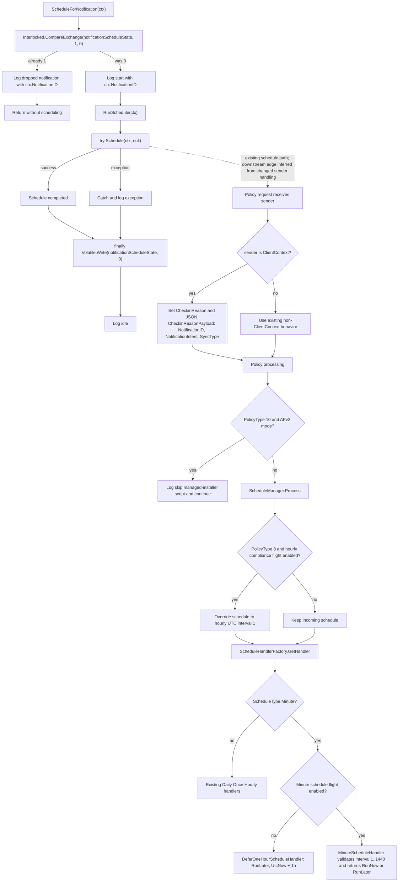

# Intune Management Extension release note

## Summary

Comparison: `IntuneWindowsAgent_1.101.111.0.msi` → `IntuneWindowsAgent_1.103.101.0_manual_ffad3f11.msi`.

High-signal, evidence-backed changes are concentrated in:

- Script policy scheduling and notification-triggered check-in handling.
- Compliance-monitor and DCI drift-detection scaffolding in the agent service.
- WinGet retry, timeout, and progress handling.
- Trouter connection-management refactoring.
- Tamper Protection certificate trust-list data.
- MSI custom action/install-sequence changes for app-config timestamp sync and catalog copy.

The diff also contains large dependency and rebuild churn. Several reported changed methods show identical IL bodies except RVA/version movement, so method-count volume alone should not be treated as functional impact.

## What changed

### MSI/package flow

**Facts**

- File changes: `104`.
- MSI table diff rows: `287`.
- CustomAction diff rows: `2`.
- Install flow sequence diff rows: `3`.
- Managed method changes: `15448`.
- Added files include:
  - `Microsoft.Bcl.Memory.dll`
  - `System.Threading.Channels.dll`
  - `Microsoft.Management.Services.IntuneWindowsAgent.exe.config.bak`
- Changed security/package file:
  - `IntuneWindowsAgent.cat`

**Custom action changes**

- Added custom action:
  - `SyncAppConfigTimestamps`
  - Source: `IntuneWindowsAgentCustomActions`
  - Target: `SyncAppConfigTimestamps`
  - Type: `65`
- Removed custom action:
  - `RunCopyCatalogSilently`
  - Source: `IntuneWindowsAgentCustomActions`
  - Target: `RunCopyCatalogSilently`
  - Type: `3137`

**Install sequence changes**

- Added:
  - `SyncAppConfigTimestamps`, condition `NOT UPGRADINGPRODUCTCODE`, sequence `799`
  - `CopyCatalog`, condition `NOT REMOVE`, sequence `5799`
- Removed:
  - `RunCopyCatalogSilently`, condition `NOT REMOVE`, sequence `5799`

### Script policy scheduling

**Facts from `Microsoft.Management.Clients.IntuneManagementExtension.ScriptPlugIn.dll`**

- Added:
  - `PolicyPoller::ScheduleForNotification`
  - `PolicyPoller::RunSchedule`
  - `MinuteScheduleHandler::Process`
  - `DeferOneHourScheduleHandler::Process`
  - `ScheduleManager::IsHourlyComplianceScriptCadenceEnabled`
- `PolicyPoller.ScheduleForNotification(ClientContext ctx)` uses `Interlocked.CompareExchange` to allow only one notification-triggered schedule at a time.
- `RunSchedule(ctx)` calls the existing `Schedule(ctx, null)` path and resets state with `Volatile.Write` in `finally`.
- `ClientContext` can now be propagated into policy check-in metadata through `CheckinReasonPayload` containing:
  - `NotificationID`
  - `NotificationIntent`
  - `SyncType`
- `ScheduleType.Minute` is now recognized.
- Minute schedule execution is flight-gated.
- If minute handling is disabled, `DeferOneHourScheduleHandler` returns `RunLater` with `NextRunTime = UtcNow + 1 hour`.
- `ScheduleManager` can force policy type `8` to hourly cadence when `EnableHourlyComplianceScriptCadence` is enabled.
- `ScriptProcessorV2.ProcessScripts` skips policy type `10` when `ProviderCommonHelper.IsDeviceInApV2Mode()` is true.
- `PowerShellScriptPlugIn.ScriptPluginOnTimer` has optional single-flight timer concurrency behavior under `IsPowershellScriptConcurrentProcessingEnabled`.
- AAD user lookup can use `UserAccount.RetrieveAsync(..., emitTelemetry: true)` behind `EnableIsAADUserTelemetry`.

### Compliance monitor and DCI

**Facts from `Microsoft.Management.Services.IntuneWindowsAgent.exe` and AgentCommon**

Added or changed method clusters indicate new compliance-monitor behavior candidates:

- `ComplianceMonitor`
- `ComplianceMonitorLauncher`
- `ComplianceMonitorStore`
- `ComplianceCycleAggregator`
- `ComplianceMonitorAuditing`
- `CycleTelemetry`
- `HourlyRollup`
- `DciHelper`
- `IComplianceSettingHelper::DetectDriftInSetting`
- `IComplianceMonitorPrecheck::IsDefenderActiveAv`
- `ComplianceMonitorPrecheck::IsDefenderActiveAv`
- `EmsAgentService::TriggerProactiveRemediationAsync`
- `EmsAgentService::GetCrashCollectionLevelFromEcsAsync`

**Interpretation**

These names and clusters indicate added compliance-monitor cycle execution, hourly rollup telemetry, drift handling, Defender precheck, and proactive-remediation trigger paths. The exact runtime enablement depends on flights/configuration not fully shown in the evidence.

### WinGet and Win32 app handling

**Facts from `WinGetLibrary.dll`**

Added clusters:

- `WinGetOperationRequest`
  - `EnableRetryOnTransientErrors`
  - `MaxRetries`
  - `RetryDelay`
- `PackageManager::WaitForOperationOrCancellation`
- `WinGetEnforcementTimeoutException`
- `ProgressDebouncer<T1,T2>`
- `AppPackageManager::.cctor`

Removed cluster:

- `WinGetOperationException::.ctor`
- `WinGetOperationException::ToString`

Changed mappings include WinGet operation result conversion to app install, uninstall, detection, and applicability result codes.

**Facts from `Win32AppPlugIn.dll`**

Added clusters:

- `EspHelper`
  - `SetupEspRegistryWatcher`
  - `OnEspRegistryValueChanged`
  - `DisposeEspRegistryWatcher`
  - `FindFirstSyncKeyPath`
- `FlightManager` / `IFlightManager`
  - `WinGetRetryOnTransientErrorsEnabled`
  - `WinGetEnforcementTimeoutEnabled`

Removed flight:

- `ClearGRSInESPEnabled`

Changed methods include Delivery Optimization callbacks, `IntuneWebClient` download methods, ESP report-state mapping, and Status Service registry helpers.

**Interpretation**

The method names support candidates for WinGet transient-error retry, enforcement timeout handling, progress debouncing, and ESP registry watching. Runtime effect depends on flight values and policy paths.

### Trouter connection handling

**Facts from `Microsoft.IC3.Trouter.dll`**

High-signal clusters:

- `TrouterV3Client`
- `ConnectionHandler`
- `RegistrationInfo`
- `ClientLoggingExtensions`
- `ConnectionEvents`
- `ConnectionStateManager`
- `TrouterV4Client::CreateHandshakeUriForServerSideRegistration`

Added logging names include:

- `TraceWebSocketTimeoutFallingBackToLongPoll`
- `TraceSecondaryTransportNetworkErrorIgnored`
- `TraceSequentialConnectGenerationStale`
- `TraceStaleHandlerNetworkErrorIgnored`
- `TraceStaleHandlerDisconnectIgnored`
- `WarnCannotUpdateProxyBeforeConnection`
- `InfoCannotUnregisterWhenNotRegistered`

Removed `TrouterV3Client` methods include:

- `DisconnectTransportClientSafeAsync`
- `ConnectTransportAndRunReceiveLoop`
- `RegistrationSchedulerStateChanged`
- `SafeExchangePingCancellationToken`

**Interpretation**

This is a plausible refactor from direct `TrouterV3Client` connection-loop ownership toward separate `ConnectionHandler`, `ConnectionStateManager`, `ConnectionEvents`, and `RegistrationInfo` structures, with additional network fallback/stale-handler logging. The evidence does not prove externally visible connection behavior.

### AgentCommon support components

**Facts from `Microsoft.Management.Services.IntuneWindowsAgent.AgentCommon.dll`**

Added or changed clusters include:

- `NotificationWorkloadHelper`
  - `CreateClientContextFromNotification`
  - `TriggerAdditionalWorkloads`
- `SessionSettingsStore`
- `SessionSettingsPersister::PersistFromGatewayResponse`
- `EnvironmentResolver::NormalizeAndResolveScaleUnitName`
- `UserAccount`
- `AttemptInfo`
- `DeviceTriggerResult`
- `FlightingManager`
  - `EnableComplianceMonitorSimulateMode`
  - `EnableHourlyComplianceScriptCadence`
  - `EnableMinuteScheduleHandling`
  - `EnableRealTimeCompliance`
- `ManagedInstallerSynchronizationHelper`
  - `NeedToInstallManagedInstallerPolicy`
  - `RequestProactiveRemediationCheckIn`
  - `StartProactiveRemediationCheckIn`
  - `IsManagedInstallerPolicyPresent`
- `WindowsUnattendedUtilities::ResolveRemoteDesktopUsersGroupName`
- `WindowsUnattendedHandler::ProcessWindowsRemoteHelpUnattendedEndSession`

**Interpretation**

AgentCommon appears to provide support for notification-to-client-context conversion, persisted session settings, scale-unit resolution, user-account telemetry, compliance-related flights, Managed Installer synchronization checks, and unattended Remote Help handling.

### Tamper Protection certificate trust data

**Facts from `TamperProtection.dll`**

`SideCarSigningCertificateChainInfo::.cctor` changed static certificate trust data.

Added trusted root subject:

- `Microsoft RSA Root Certificate Authority 2017`

Added trusted root thumbprint:

- `73A5E64A3BFF8316FF0EDCCC618A906E4EAE4D74`

Evidence also shows many certificate-validation methods reported as changed but with displayed IL bodies that are instruction-identical except RVA/version movement.

**Interpretation**

This is a security-significant trust-anchor data update. The provided evidence does not prove that the validation algorithm changed.

### Signing/catalog evidence

**Facts**

- `IntuneWindowsAgent.cat` changed.
- The evidence provided does not include Authenticode signer name, signature status, serial number, timestamp, or full certificate chain comparison for the MSI/catalog.
- Tamper Protection trust data added one Microsoft root subject and thumbprint.

**Interpretation**

Changed catalog content and trusted certificate data can be relevant to WDAC, Managed Installer, and publisher/catalog validation scenarios. However, no runtime WDAC or Managed Installer impact is proven by the supplied evidence.

## Why it matters

- Notification-triggered script scheduling is now a distinct code path with a single-flight guard.
- Script policy check-ins can carry notification context metadata.
- Minute schedules and hourly compliance-script cadence are now represented in first-party code, gated by flights.
- Compliance-monitor/DCI code is materially expanded, but runtime activation is likely flight/configuration dependent.
- WinGet handling now has explicit retry and timeout primitives.
- Trouter connection code was substantially reorganized, with added stale-handler, fallback, secondary transport, and registration logging.
- Tamper Protection trusted certificate data changed, which is security-relevant even though validation algorithm changes are not proven.
- MSI install flow changed by replacing `RunCopyCatalogSilently` with `CopyCatalog` and adding `SyncAppConfigTimestamps`.

## Changed components

| Component | Evidence-backed changed candidates |
|---|---|
| `Microsoft.IC3.Trouter.dll` | `TrouterV3Client`, `ConnectionHandler`, `RegistrationInfo`, `ClientLoggingExtensions`, `ConnectionEvents`, `ConnectionStateManager`, `TrouterV4Client::CreateHandshakeUriForServerSideRegistration`; connection/refactor and logging candidates. |
| `ScriptPlugIn.dll` | `PolicyPoller`, `MinuteScheduleHandler`, `DeferOneHourScheduleHandler`, `ScheduleManager`; notification scheduling, minute schedule, hourly compliance cadence, APv2 skip, timer concurrency, AAD telemetry candidates. |
| `TamperProtection.dll` | `SideCarSigningCertificateChainInfo` trust-list update; many other certificate-validation methods appear to be rebuild/RVA churn based on shown IL. |
| `Win32AppPlugIn.dll` | `EspHelper`, `FlightManager`, `IFlightManager`; ESP registry watcher, WinGet retry/timeout flights, removed `ClearGRSInESPEnabled`, download/status/report mapping changes. |
| `WinGetLibrary.dll` | `WinGetOperationRequest`, `ProgressDebouncer<T>`, `WinGetEnforcementTimeoutException`, `PackageManager::WaitForOperationOrCancellation`, removed `WinGetOperationException`; retry/timeout/progress candidates. |
| `AgentCommon.dll` | `UserAccount`, `SessionSettingsStore`, `FlightingManager`, `AttemptInfo`, `DeviceTriggerResult`, `EnvironmentResolver`, `NotificationWorkloadHelper`, `SessionSettingsPersister`, Managed Installer synchronization helpers, unattended Remote Help helpers. |
| `IntuneWindowsAgent.exe` | `HourlyRollup`, `CycleTelemetry`, `ComplianceMonitor`, `ComplianceMonitorStore`, `IC3Statistics`, `DciHelper`, compliance precheck, drift detection, proactive remediation trigger, crash collection level from ECS. |
| MSI custom actions | Added `SyncAppConfigTimestamps`; added `CopyCatalog`; removed `RunCopyCatalogSilently`; added custom-action helper `RetryOnIOException`. |

## Mermaid function flow

Evidence-backed changed function flow: `PolicyPoller.ScheduleForNotification(ClientContext ctx)` in `ScriptPlugIn.dll`.

## Evidence

- MSI report:
  - Old MSI: `IntuneWindowsAgent_1.101.111.0.msi`
  - New MSI: `IntuneWindowsAgent_1.103.101.0_manual_ffad3f11.msi`
  - File changes: `104`
  - CustomAction diff rows: `2`
  - InstallExecuteSequence diff rows: `3`
- `ScriptPlugIn.dll` focused report:
  - Added `PolicyPoller::ScheduleForNotification`
  - Added `PolicyPoller::RunSchedule`
  - Added `MinuteScheduleHandler::Process`
  - Added `DeferOneHourScheduleHandler::Process`
  - Added `ScheduleManager::IsHourlyComplianceScriptCadenceEnabled`
  - IL confirms `Interlocked.CompareExchange`, `Schedule(ctx, null)`, and `Volatile.Write`.
- `TamperProtection.dll` focused report:
  - Added root subject `Microsoft RSA Root Certificate Authority 2017`
  - Added root thumbprint `73A5E64A3BFF8316FF0EDCCC618A906E4EAE4D74`
  - `SideCarSigningCertificateChainInfo::.cctor` IL size changed from `1120` to `1142`.
- First-party method coverage:
  - `Trouter.dll`: added `657`, removed `211`, changed `933`
  - `ScriptPlugIn.dll`: added `12`, removed `4`, changed `294`
  - `TamperProtection.dll`: added `0`, removed `0`, changed `48`
  - `Win32AppPlugIn.dll`: added `25`, removed `12`, changed `2352`
  - `WinGetLibrary.dll`: added `54`, removed `29`, changed `216`
  - `AgentCommon.dll`: added `197`, removed `22`, changed `2206`
  - `IntuneWindowsAgent.exe`: added `350`, removed `131`, changed `502`

## Uncertainty

- Runtime activation of many candidates depends on ECS/flight values and service configuration not included in the evidence.
- The direct runtime caller chain from `PolicyPoller.Schedule` into each policy acquisition/processing method is partly inferred from changed sender handling and should be validated with runtime traces.
- `IntuneWindowsAgent.cat` changed, but signer, timestamp, serial, chain, and signature-status diffs were not provided.
- WDAC or Managed Installer behavior changes are possible validation concerns, but no runtime WDAC/Managed Installer impact is proven.
- Many reported method changes, especially in Tamper Protection and dependency-style areas, appear consistent with rebuild/RVA churn rather than behavioral logic changes.

## Additional deterministic first-party coverage

These added or removed method clusters were detected locally but were not named in the AI narrative. They are promoted here as factual coverage and still require behavioral interpretation from IL or runtime validation.
### MSI payload::PFiles\Microsoft Intune Management Extension\Microsoft.Management.Clients.IntuneManagementExtension.WinGetLibrary.dll
* **ProgressDebouncer`2**: AddedMethod: ProgressDebouncer`2::.ctor | AddedMethod: ProgressDebouncer`2::OnProgress

