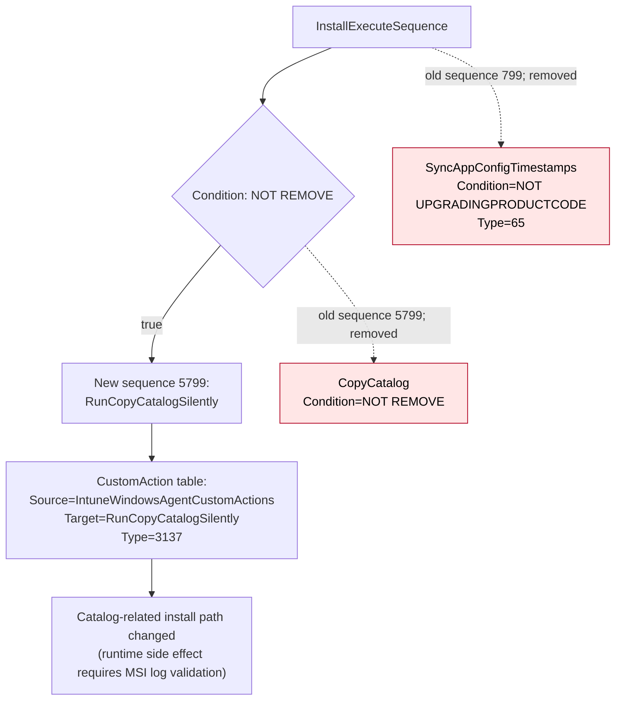
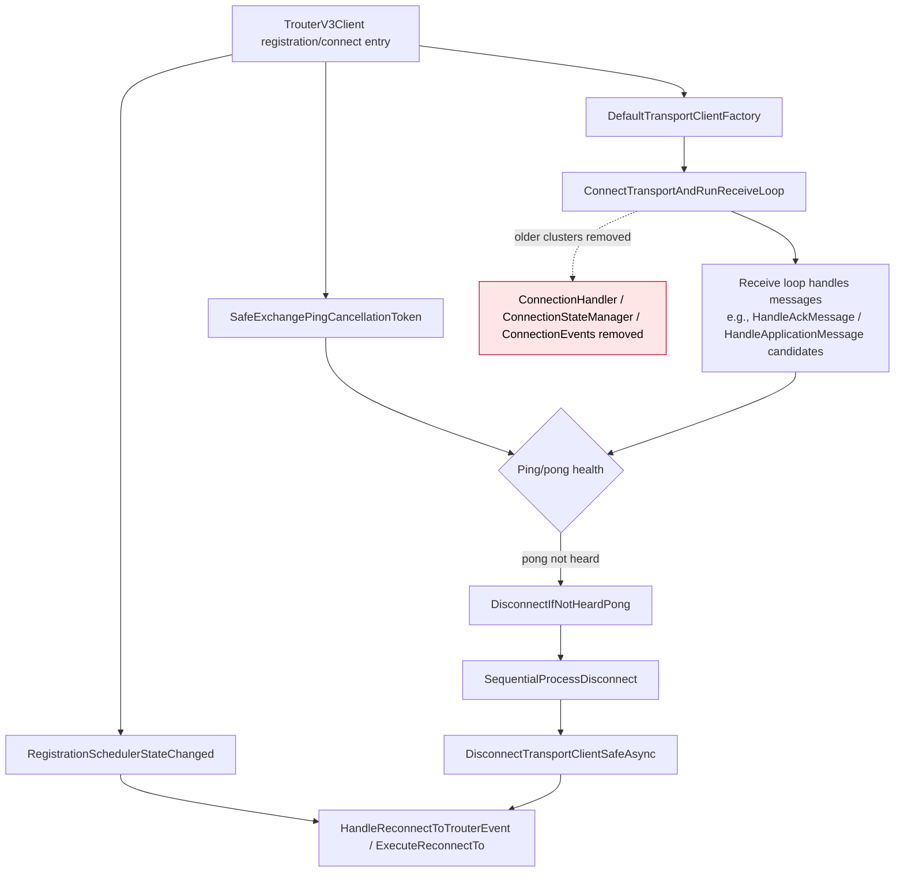
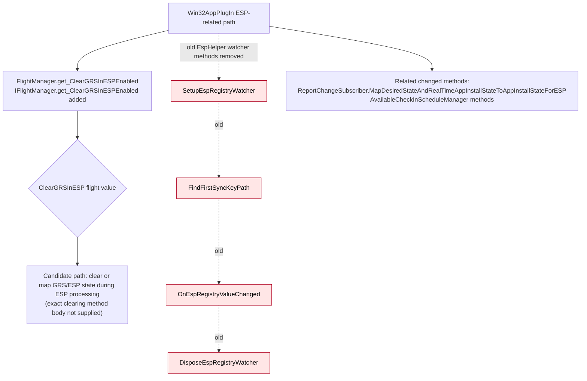
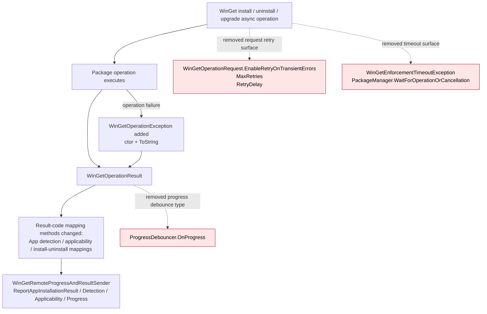

# Intune Management Extension release note

## Summary

Comparison evidence covers `IntuneWindowsAgent_1.101.108.0.msi` to `IntuneWindowsAgent_1.101.111.0.msi`.

**Facts**

- MSI file changes: `104`
- MSI table diff rows: `287`
- CustomAction diff rows: `2`
- Install flow sequence diff rows: `3`
- Managed method changes: `15448`
- Generated feature signals: `70591`
- Authenticode/signing changes: `100`
- Major first-party method churn is present in:
  - `Microsoft.IC3.Trouter.dll`
  - `Microsoft.Management.Clients.IntuneManagementExtension.Win32AppPlugIn.dll`
  - `Microsoft.Management.Clients.IntuneManagementExtension.WinGetLibrary.dll`
  - `Microsoft.Management.Services.IntuneWindowsAgent.AgentCommon.dll`
  - `Microsoft.Management.Services.IntuneWindowsAgent.exe`
  - `Microsoft.Management.Clients.IntuneManagementExtension.ScriptPlugIn.dll`
  - `Microsoft.Management.Clients.IntuneManagementExtension.TamperProtection.dll`

**Interpretation**

The strongest evidence points to a servicing release with several functional-area changes rather than a single dominant feature: MSI catalog-copy install behavior, Trouter connection/reconnect refactoring, Win32/ESP behavior changes, WinGet retry/timeout surface changes, client telemetry additions, removal of several compliance-monitor/scheduling clusters, sovereign flighting/environment handling changes, and certificate/signing updates.

## What changed

### Installation and packaging

**Facts**

- Added custom action:
  - `RunCopyCatalogSilently`
  - Source: `IntuneWindowsAgentCustomActions`
  - Target: `RunCopyCatalogSilently`
  - Type: `3137`
- Removed custom action:
  - `SyncAppConfigTimestamps`
  - Source: `IntuneWindowsAgentCustomActions`
  - Target: `SyncAppConfigTimestamps`
  - Type: `65`
- Install execute sequence changed:
  - Added: `RunCopyCatalogSilently`, condition `NOT REMOVE`, sequence `5799`
  - Removed: `SyncAppConfigTimestamps`, condition `NOT UPGRADINGPRODUCTCODE`, sequence `799`
  - Removed: `CopyCatalog`, condition `NOT REMOVE`, sequence `5799`
- Removed payload files:
  - `Microsoft.Bcl.Memory.dll`
  - `Microsoft.Management.Services.IntuneWindowsAgent.exe.config.bak`
  - `System.Threading.Channels.dll`
- Changed catalog file:
  - `IntuneWindowsAgent.cat`

**Interpretation**

The install-time catalog copy path changed from a visible `CopyCatalog` sequence entry to `RunCopyCatalogSilently`. The evidence does not prove the exact runtime side effect beyond the MSI sequence and custom-action name.

### First-party functional candidates

**Facts from method coverage and deterministic candidates**

- `Microsoft.IC3.Trouter.dll`
  - Added/changed Trouter V3 methods include `ConnectTransportAndRunReceiveLoop`, `DisconnectTransportClientSafeAsync`, `RegistrationSchedulerStateChanged`, `HandleReconnectToTrouterEvent`, `SequentialProcessDisconnect`, `DisconnectIfNotHeardPong`, and transport-client factory methods.
  - Removed clusters include `ConnectionHandler`, `ConnectionStateManager`, `ConnectionEvents`, `RegistrationInfo`, and `ClientLoggingExtensions`.
- `ScriptPlugIn.dll`
  - Added async state-machine methods for `UnlockWinAsync` and `UnlockWin10SAsync`.
  - Removed schedule/cadence methods: `MinuteScheduleHandler`, `DeferOneHourScheduleHandler`, `PolicyPoller.RunSchedule`, `PolicyPoller.ScheduleForNotification`, and `ScheduleManager.IsHourlyComplianceScriptCadenceEnabled`.
  - Changed script-result registry helpers and hardware-configuration metadata/result methods.
- `Win32AppPlugIn.dll`
  - Added `IFlightManager.get_ClearGRSInESPEnabled` and `FlightManager.get_ClearGRSInESPEnabled`.
  - Removed `EspHelper` registry watcher methods: `SetupEspRegistryWatcher`, `OnEspRegistryValueChanged`, `DisposeEspRegistryWatcher`, and `FindFirstSyncKeyPath`.
  - Removed WinGet flight properties including retry/transient-error and enforcement-timeout gates.
  - Changed status-service, available-check-in, ESP state mapping, DO/BITS callback, and Intune web-client methods.
- `WinGetLibrary.dll`
  - Removed `WinGetOperationRequest` retry properties: `EnableRetryOnTransientErrors`, `MaxRetries`, and `RetryDelay`.
  - Removed `WinGetEnforcementTimeoutException`.
  - Removed `ProgressDebouncer<T>`.
  - Removed `PackageManager.WaitForOperationOrCancellation`.
  - Added `WinGetOperationException` constructor and `ToString`.
  - Changed result-code mapping and remote progress/result sender methods.
- `AgentCommon.dll`
  - Added `DiscoveryService.PopulateScaleUnitInEnvironment`.
  - Added `FlightingManager.EnableClientTelemetry` and `get_IsClientTelemetryEnabled`.
  - Removed compliance-monitor flight gates such as minute schedule handling, hourly compliance script cadence, real-time compliance, and simulate mode.
  - Changed Managed Installer policy synchronization methods, discovery service methods, AAD-user checks, scale-unit/environment handling, sidecar file detection, and unattended Remote Help handling.
  - Removed clusters include `UserAccount`, `SessionSettingsStore`, `AttemptInfo`, `DeviceTriggerResult`, and `EnvironmentResolver`.
- `Microsoft.Management.Services.IntuneWindowsAgent.exe`
  - Added `SidecarAgentCommonClientTelemetry` logging methods.
  - Added `SidecarAgentHeartbeatSignal.EmitSidecarHeartbeatSignal`.
  - Added `EmsAgentService.SetupCommonTelemetryAsync`.
  - Removed large compliance-monitor telemetry/model clusters: `HourlyRollup`, `CycleTelemetry`, `ComplianceMonitor`, `ComplianceMonitorStore`, and `IC3Statistics`.
  - Removed workload trigger/check-in methods from `EmsAgentService` candidate list.
- `TamperProtection.dll`
  - Changed certificate-chain and certificate-validation helpers, including `ValidationResult`, `X509CertificateUtils`, `X509ChainUtils`, `AlwaysPassValidator`, `AlwaysRejectValidator`, and unsafe/custom chain validator classes.

**Interpretation**

The method names and cluster coherence indicate plausible behavior changes in connection management, ESP/GRS handling, WinGet enforcement, telemetry, scheduling/compliance monitoring, and certificate validation. Where only method names are available, this release note treats the item as a functional candidate rather than confirmed runtime behavior.

### Flighting and telemetry environment handling

**Facts from focused DLL evidence**

- `Microsoft.Management.Clients.Flighting.dll`
  - File version changed from `6.1.365.171` to `6.1.365.119`.
  - `FlightEnvironment.EcsProductionBleu` and `FlightEnvironment.EcsProductionDelos` were removed.
  - `FlightEnvironmentResolver` was removed.
  - ECS URL constants for Bleu and Delos were removed:
    - `https://c2s.config.ecs.svc.sovcloud.fr`
    - `https://c2s.config.ecs.svc.sovcloud.de`
  - Remaining ECS paths still construct `/config/v1/Intune/1.0.0.0?agents=...`.
- Data sensor focused evidence shows `CollectorEndpoint.RefreshCollectorServiceURL(deviceCert, deviceId)` changed:
  - Old code explicitly disabled telemetry for `blp` / BLEU by setting `CollectorServiceUrl = null`.
  - New code removes that `blp` branch.
  - The `mooncake` telemetry-disable path remains.
  - Proxy exception handling in `GetProxyDetails` and `IsProxyUpdateRequired` now rethrows exceptions instead of swallowing all observed failures.

**Interpretation**

The evidence supports a change in sovereign/environment handling. Actual runtime effect depends on tenant cloud, certificate/environment detection, caller behavior, location-service response, DHM/static mapping, and policy gates.

### Signing and trust evidence

**Facts**

- Signing changes were reported for `100` signable files.
- Multiple Microsoft-signed files changed certificate material while remaining `Valid -> Valid`.
- MSI package signing remained valid:
  - Signer: `CN=Microsoft Corporation, O=Microsoft Corporation, L=Redmond, S=Washington, C=US`
  - Issuer shown in evidence: `CN=Microsoft Windows Code Signing PCA 2024, O=Microsoft Corporation, C=US`
- High-review signing change:
  - `concrt140.dll`
  - Old signer: `CN=Microsoft Windows Software Compatibility Publisher, O=Microsoft Corporation, ...`
  - New signer: `CN=Microsoft Corporation, O=Microsoft Corporation, ...`
  - Old issuer: `CN=Microsoft Windows Third Party Component CA 2013, O=Microsoft Corporation, ...`
  - New issuer: `CN=Microsoft Code Signing PCA 2011, O=Microsoft Corporation, ...`
  - Signature status remained `Valid -> Valid`.

**Interpretation**

Certificate-chain and signer-subject changes are security-significant evidence for environments using WDAC, App Control for Business, publisher rules, catalog trust, or Managed Installer validation. The evidence does not prove a runtime trust failure.

## Why it matters

**Facts**

- Install-time custom actions changed.
- Trouter connection-management code moved toward `TrouterV3Client`-named methods while older `ConnectionHandler`/`ConnectionStateManager` clusters were removed.
- ESP registry watcher methods were removed while a `ClearGRSInESPEnabled` flight was added.
- WinGet retry/timeout request properties and timeout exception types were removed.
- Sidecar common telemetry and heartbeat methods were added.
- Compliance monitor and compliance scheduling clusters were removed or no longer exposed in the observed method set.
- Flighting and data-sensor environment handling changed for Bleu/Delos/BLP paths.
- Signing chains changed for many binaries.

**Interpretation**

Administrators should validate upgrade, enrollment-status-page behavior, Win32/WinGet enforcement, push notification connectivity, telemetry initialization, and trust policy compatibility in rings before broad deployment. No unobserved user impact is asserted by the static diff alone.

## Changed components

| Component | Evidence-backed change | Interpretation / reconciliation |
|---|---|---|
| MSI install flow | `RunCopyCatalogSilently` added at sequence `5799`; `CopyCatalog` and `SyncAppConfigTimestamps` removed from observed sequence/custom action evidence. | Catalog-copy behavior changed; exact custom-action internals require MSI log/runtime validation. |
| `Microsoft.IC3.Trouter.dll` | `TrouterV3Client` connect/reconnect/ping/disconnect methods added; `ConnectionHandler`, `ConnectionEvents`, `ConnectionStateManager`, `RegistrationInfo`, and many logging methods removed. | Strong candidate for Trouter connection-management refactor. |
| `ScriptPlugIn.dll` | Schedule handlers and compliance script cadence methods removed; script-result registry/hardware configuration methods changed; unlock async state machines added. | Scheduling/cadence behavior is a candidate; unlock additions may be compiler-generated async completion unless method bodies prove logic. |
| `Win32AppPlugIn.dll` | `ClearGRSInESPEnabled` added; `EspHelper` registry watcher methods removed; WinGet retry/timeout flight gates removed; status/ESP mapping methods changed. | Strong candidate for ESP GRS behavior and Win32 status mapping changes. |
| `WinGetLibrary.dll` | Retry properties, enforcement timeout exception, progress debouncer, and wait helper removed; `WinGetOperationException` added; result mapping methods changed. | Strong candidate for changed WinGet enforcement error/progress/retry model. |
| `AgentCommon.dll` | Client telemetry flight added; compliance-monitor flight gates removed; Managed Installer, DiscoveryService, AAD user, and scale-unit methods changed; several model/helper clusters removed. | Strong candidate for telemetry setup, Managed Installer decision path, and environment/scale-unit handling changes. |
| `IntuneWindowsAgent.exe` | Sidecar common telemetry and heartbeat methods added; compliance-monitor telemetry/model clusters removed; `EmsAgentService.SetupCommonTelemetryAsync` added. | Strong candidate for telemetry pipeline refactor and removal/disablement of old compliance-monitor path. |
| `TamperProtection.dll` | Certificate and chain validation helper methods changed. | Security-relevant certificate-validation implementation changed; impact not proven. |
| `Microsoft.Management.Clients.Flighting.dll` | Bleu/Delos flight environments, resolver, and ECS URLs removed. | Sovereign cloud flighting compatibility should be validated where applicable. |
| Data sensor plugin | BLP/BLEU telemetry-disable branch removed from collector URL refresh; proxy exceptions now rethrow in observed methods. | Telemetry routing/proxy failure behavior may differ under affected environments. |
| Signing/catalog | `100` signing changes; `concrt140.dll` signer and issuer changed; many Microsoft binaries remain `Valid -> Valid`. | WDAC/publisher-rule and catalog-trust validation is recommended. |

## Mermaid function flows

### Component: MSI catalog custom action path



### Component: Flighting ECS URI setup

```mermaid
flowchart TD
    A["FlightClientEcs URI setup<br/>inputs: environment, agents, filters"] --> B{"filters == null?"}
    B -- "yes" --> C["throw ArgumentNullException(\"filters\")"]
    B -- "no" --> D{"switch FlightEnvironment"}

    D -- "EcsNonProduction / EcsProduction" --> E["baseUrl=https://ecs.office.com<br/>configName=Intune"]
    D -- "EcsProductionFairfax" --> F["baseUrl=https://config.ecs.gov.teams.microsoft.us<br/>configName=Intune"]
    D -- "EcsProductionMooncake" --> G["baseUrl=https://mooncake.ecs.office.com<br/>configName=Intune"]
    D -- "other" --> H["throw NotSupportedException"]

    D -. "old only; removed" .-> R1["EcsProductionBleu<br/>https://c2s.config.ecs.svc.sovcloud.fr"]:::removed
    D -. "old only; removed" .-> R2["EcsProductionDelos<br/>https://c2s.config.ecs.svc.sovcloud.de"]:::removed

    E --> I["URL-encode filter values"]
    F --> I
    G --> I
    I --> J["Build URI:<br/>{baseUrl}/config/v1/Intune/1.0.0.0?agents={agents}{filters}"]
    J --> K["Used by flight content refresh/cache path"]

    classDef removed fill:#ffe6e6,stroke:#b00020,color:#000;
```

### Component: Data sensor collector endpoint refresh

```mermaid
flowchart TD
    A["CollectorEndpoint.RefreshCollectorServiceURL(deviceCert, deviceId)"] --> B{"IsEnvironment(deviceCert, \"mooncake\")?"}
    B -- "yes" --> C["Set CollectorServiceUrl = null<br/>Log telemetry disabled in MOONCAKE<br/>return"]
    B -- "no" --> D["RequestCollectorServiceURL(deviceCert, deviceId)"]

    B -. "old only; removed" .-> R["IsEnvironment(deviceCert, \"blp\")<br/>Set CollectorServiceUrl = null<br/>Log telemetry disabled in BLEU<br/>return"]:::removed

    D -- "success" --> E{"CollectorServiceUrl empty?"}
    E -- "yes" --> F["SetCollectorURLFromUploadDestination()"]
    E -- "no" --> G["Use discovered collector URL"]
    F --> G

    D -- "failure" --> H["SetCollectorURLFromUploadDestination()<br/>or fallback to public OneCollector on handled exceptions"]
    H --> I["Collector URL fallback path"]

    classDef removed fill:#ffe6e6,stroke:#b00020,color:#000;
```

### Component: Trouter V3 connection/reconnect path



### Component: Win32 ESP registry watcher and GRS candidate



### Component: WinGet operation result and retry/timeout model



## Evidence

- MSI report:
  - Old MSI: `IntuneWindowsAgent_1.101.108.0.msi`
  - New MSI: `IntuneWindowsAgent_1.101.111.0.msi`
  - File changes: `104`
  - CustomAction diff rows: `2`
  - Install flow sequence diff rows: `3`
  - Signing changes: `100`
- First-party method coverage:
  - `Microsoft.IC3.Trouter.dll`: added `211`, removed `657`, changed `933`
  - `ScriptPlugIn.dll`: added `4`, removed `12`, changed `294`
  - `TamperProtection.dll`: added `0`, removed `0`, changed `48`
  - `Win32AppPlugIn.dll`: added `12`, removed `25`, changed `2352`
  - `WinGetLibrary.dll`: added `29`, removed `54`, changed `216`
  - `AgentCommon.dll`: added `22`, removed `197`, changed `2206`
  - `IntuneWindowsAgent.exe`: added `131`, removed `350`, changed `502`
- Focused DLL evidence:
  - Flighting: Bleu/Delos ECS environments and resolver removed.
  - Data sensor: BLP/BLEU collector-disable branch removed; proxy exception handling now rethrows in observed methods.
- Signing evidence:
  - MSI and many binaries remained `Valid -> Valid`.
  - `concrt140.dll` signer subject and issuer changed.

## Uncertainty

- Many method-body diffs are not available in the evidence. Method names and cluster coherence identify candidates but do not prove all runtime behavior.
- Some reported method changes may be rebuild, RVA, metadata-token, or compiler-generated async state-machine churn.
- The ESP evidence proves removal of watcher methods and addition of `ClearGRSInESPEnabled`; it does not prove the exact replacement implementation.
- The Trouter diagram is based on added/removed method names and deterministic clustering, not full supplied method bodies.
- Signing changes are security-significant, but the evidence does not prove WDAC, Managed Installer, or runtime trust impact on a target device.
- Actual effect of Bleu/Delos/BLP changes depends on tenant cloud, endpoint discovery, certificates, policy, and caller paths.

## Additional deterministic first-party coverage

These added or removed method clusters were detected locally but were not named in the AI narrative. They are promoted here as factual coverage and still require behavioral interpretation from IL or runtime validation.
### MSI payload::PFiles\Microsoft Intune Management Extension\Microsoft.Management.Clients.IntuneManagementExtension.WinGetLibrary.dll
* **ProgressDebouncer`2**: RemovedMethod: ProgressDebouncer`2::.ctor | RemovedMethod: ProgressDebouncer`2::OnProgress
* **AppPackageManager**: RemovedMethod: AppPackageManager::.cctor


