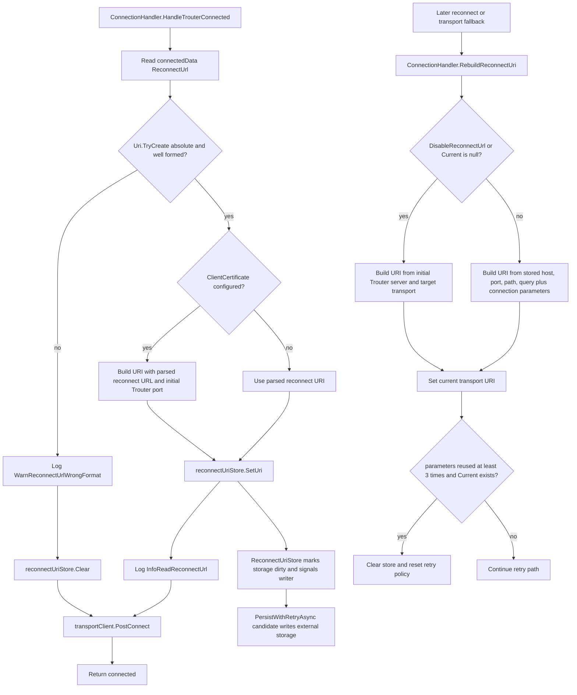
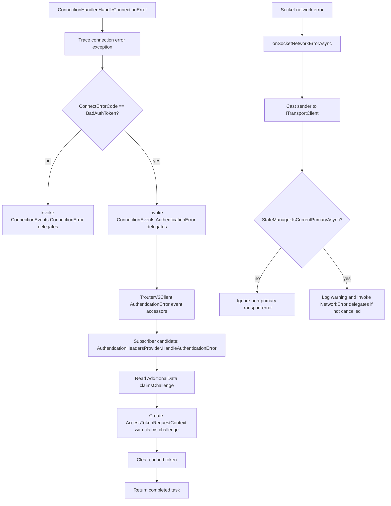
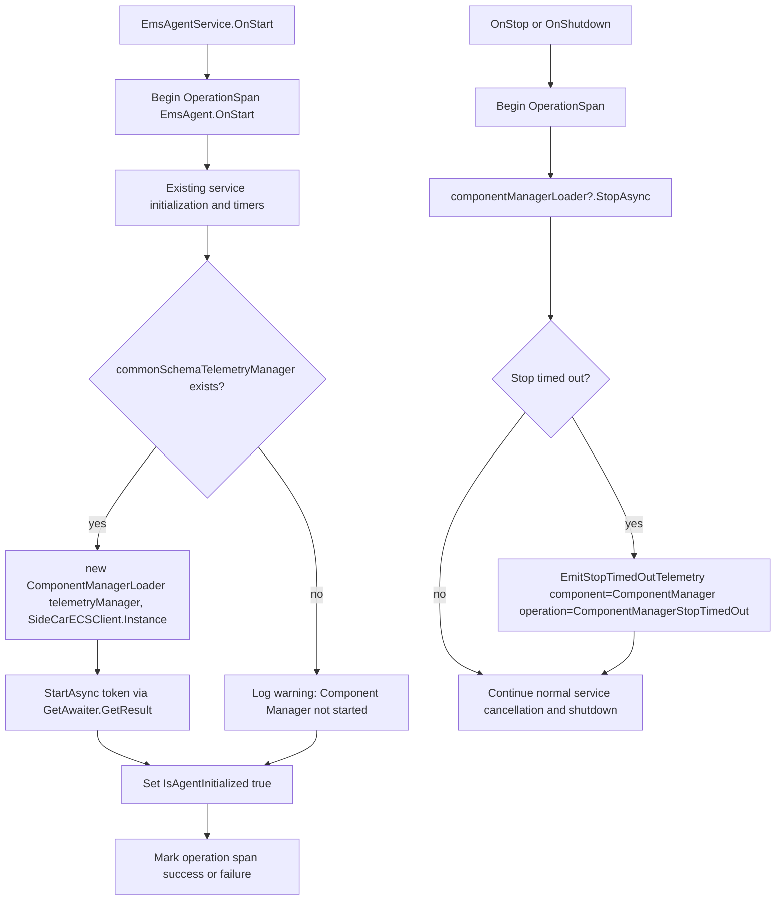
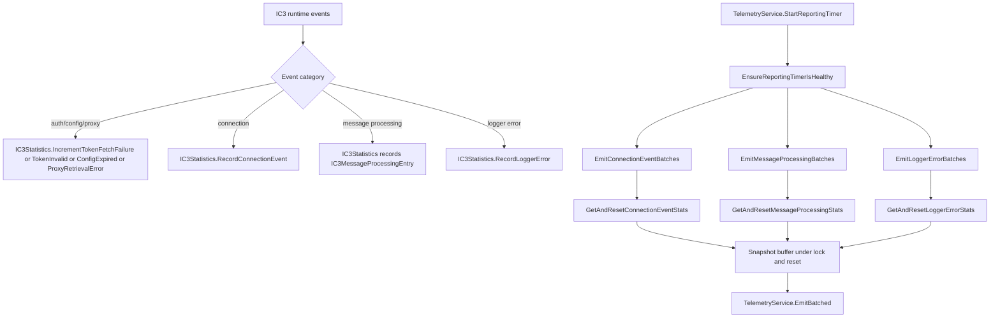
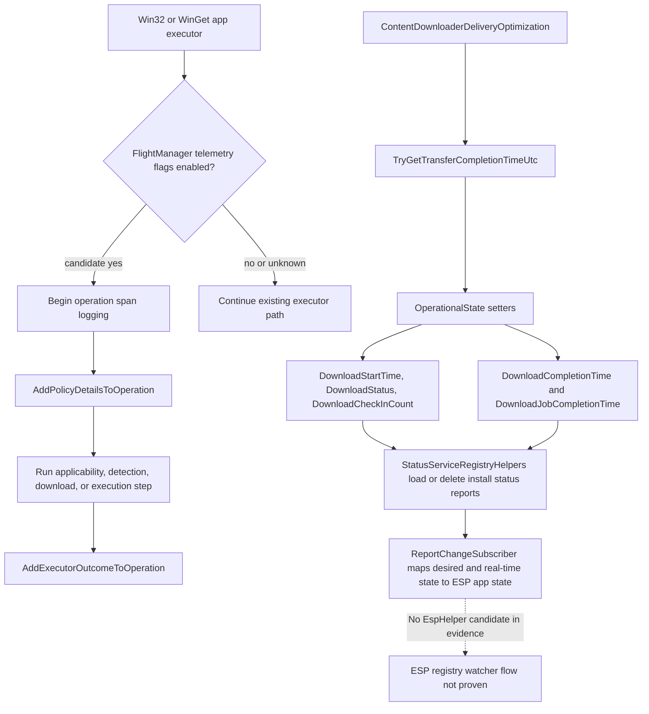
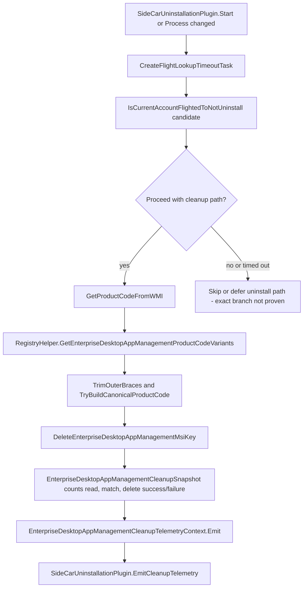

# Intune Management Extension release note

## Summary

Comparison: `IntuneWindowsAgent_1.103.101.0.msi` → `IntuneWindowsAgent_1.104.56.0000_manual_1934b8d9.msi`.

High-signal first-party deltas indicate functional change, not only rebuild churn. The strongest evidence is in:

- `Microsoft.IC3.Trouter.dll`: persisted reconnect URI store, authentication-error event separation, and primary-transport network-error filtering.
- `Microsoft.Management.Services.IntuneWindowsAgent.exe`: component-manager lifecycle integration, operation-span instrumentation, and IC3 statistics batching.
- `Microsoft.Management.Clients.IntuneManagementExtension.Win32AppPlugIn.dll`: Win32/WinGet app operation telemetry, download operational state fields, Delivery Optimization completion-time capture, and ESP state-mapping changes.
- `Microsoft.Management.Services.IntuneWindowsAgent.AgentCommon.dll`: operation spans/correlation vectors, Enterprise Desktop App Management cleanup helpers, script decryption golden-signal telemetry, Managed Installer helper changes, and registry helper changes.
- MSI packaging: new Policy Adapter / policy storage / component runtime payloads and uninstall cleanup custom actions.

Diff scale from evidence:

- File changes: `111`
- MSI table diff rows: `379`
- CustomAction diff rows: `3`
- Install flow sequence diff rows: `17`
- Managed method changes: `8503`
- Generated feature signals: `48911`
- Authenticode signing changes: `100`

## What changed

### MSI payload and install/uninstall behavior

Facts:

- Added payloads include:
  - `ClientComponents\ComponentConfiguration\Microsoft.Intune.WinRe.Bundle.json`
  - `ClientComponents\LocalCabs\Microsoft.Intune.WinRe.Bundle.cab`
  - `Microsoft.Management.IntuneComponent.exe`
  - `Microsoft.Management.Clients.Components.Base.dll`
  - `Microsoft.Management.Clients.Components.Runtime.dll`
  - `Microsoft.Management.Clients.Policy.Base.dll`
  - `Microsoft.Management.Clients.Policy.Runtime.dll`
  - `IntunePolicyStorage.dll`
  - `PolicyStorageCmdlets.dll`
  - `PolicyAdapter\IntunePolicyAdapter.dll`
  - `PolicyAdapter\IntunePolicyAdapter.mof`
  - `PolicyAdapter\IntunePolicyAdapterNs.mof`
  - `PolicyAdapter\UninstallIntunePolicyAdapter.mof`
  - `dynpin_cxx.dll` in root and under `PolicyAdapter`.
- Added custom actions:
  - `RemoveIntunePoliciesFolder`
  - `RemoveClientComponentsFolder`
  - `UnregisterIntunePolicyAdapter`
- Added uninstall sequence entries run under `REMOVE ~= "ALL" AND (NOT UPGRADINGPRODUCTCODE)`.
- Several install actions moved or broadened:
  - `CreateRegistryKeyAndValues`: now sequenced with condition `NOT REMOVE`.
  - `ConfigureInstallationFolderPermission`: now sequenced with condition `NOT REMOVE`.

Interpretation:

- The MSI now carries a component/policy adapter payload and explicit uninstall cleanup actions. The evidence does not prove when or whether the new component runtime is enabled at runtime.

### First-party runtime behavior candidates

Facts:

- `Microsoft.IC3.Trouter.dll` changed from `1.2.9.0` to `1.2.18.0`.
- `Microsoft.IC3.Trouter.dll` added `ReconnectUriStore`, `IReconnectUriStore`, `AuthenticationError` event accessors, and reconnect URI persistence methods.
- `Microsoft.Management.Services.IntuneWindowsAgent.exe` added `ComponentManagerLoader`, `IC3Statistics`, telemetry batching methods, and SideCar uninstallation cleanup helpers.
- `Microsoft.Management.Services.IntuneWindowsAgent.AgentCommon.dll` added `OperationSpan`, `CorrelationVector`, Enterprise Desktop App Management cleanup snapshot/context types, script golden-signal provider methods, and registry cleanup helpers.
- `Microsoft.Management.Clients.IntuneManagementExtension.Win32AppPlugIn.dll` added download operational state fields, Win32/WinGet executor operation telemetry helpers, FlightManager flags, app processor subgraph counters, and Delivery Optimization completion-time capture.
- `Microsoft.Management.Clients.IntuneManagementExtension.ScriptPlugIn.dll` added SideCar uninstallation helper methods and changed PowerShell provisioning/policy processor paths.
- `Microsoft.Management.Clients.IntuneManagementExtension.TamperProtection.dll` changed certificate validation utility methods but had no added or removed methods in the provided coverage.

Interpretation:

- The release appears to emphasize connection resilience, structured telemetry, cleanup observability, componentized policy/client infrastructure, and app-processing state visibility.
- Some changed-method volume is compiler-generated churn. Candidate clusters without method-body evidence are treated as plausible behavior candidates, not confirmed runtime impact.

### Signing and trust evidence

Facts:

- Signing changes were reported for `100` signable items.
- The MSI package and custom action payload remained `Valid`; their timestamp signer changed.
- Many payload files changed signing certificate while remaining:
  - signer: `CN=Microsoft Corporation, O=Microsoft Corporation, L=Redmond, S=Washington, C=US`
  - issuer: `CN=Microsoft Windows Code Signing PCA 2024, O=Microsoft Corporation, C=US`
  - status: `Valid -> Valid`
- Added `dynpin_cxx.dll` is signed and valid:
  - signer: Microsoft Corporation
  - issuer: `CN=Microsoft Code Signing PCA 2024, O=Microsoft Corporation, C=US`
- Extracted MSI payload artifacts named as MSI files were reported as `NotSigned` in the payload comparison, while the MSI package signing record itself was valid.

Interpretation:

- Environments using WDAC, App Control for Business, publisher rules, file hash rules, or Managed Installer trust should validate the new leaf certificates, PCA chain, hashes, and added binaries. The evidence does not prove a runtime trust failure.

## Why it matters

Facts:

- Trouter `BadAuthToken` errors are now routed to a separate `AuthenticationError` event path instead of only the generic `ConnectionError` path.
- Trouter reconnect URI state moved from a private in-memory field to a store abstraction with load, clear, set, and persist-with-retry methods.
- The service host now starts and stops a `ComponentManagerLoader` during service lifecycle methods.
- Operation-span and IC3 statistics methods were added across the service host and common library.
- Win32 app processing gained methods to attach policy details and executor outcomes to operations.
- MSI uninstall now has explicit cleanup actions for policy/client component artifacts and policy adapter registration.

Interpretation:

- Reconnect, token-refresh, and telemetry behavior should be validated because these are first-party code path changes.
- Operational telemetry may change even where workload semantics remain the same.
- Strict application-control deployments should treat signing/certificate changes and new payload files as security-relevant validation items.

## Changed components

| Component | Evidence-backed change | Interpretation / reconciliation |
|---|---|---|
| `Microsoft.IC3.Trouter.dll` | Added `ReconnectUriStore`, `IReconnectUriStore`, `ReconnectUriStore::PersistWithRetryAsync`, `SetUri`, `Clear`, `LoadAsync`; removed old external-storage methods on `TrouterV3Client`; added `AuthenticationError` event accessors; changed `ConnectionHandler`; added `DisconnectDecision.IsSwitchingConnectionInProgress`. | Functional change. Reconnect URI handling and auth-error routing changed. `RegistrationScheduler` local helper ordinal changes appear equivalent/rebuild churn based on shown IL. |
| `Microsoft.Management.Clients.IntuneManagementExtension.ScriptPlugIn.dll` | Added `SideCarUninstallationPlugin::CreateFlightLookupTimeoutTask`, `GetProductCodeFromWMI`, `StartProcess`; changed PowerShell provisioning provider, policy processor, uploader, and plugin methods. | SideCar uninstall cleanup is a plausible behavior change. PowerShell/policy processor changes are not independently characterized by the supplied method bodies. |
| `Microsoft.Management.Clients.IntuneManagementExtension.TamperProtection.dll` | Changed certificate/chain validation utility methods, including `ValidateChain`, `ValidateCertificate`, `X509CertificateUtils`, `X509ChainUtils`, `ValidationResult`; no added/removed methods. | Security-relevant review item. Evidence proves code churn in validation utilities, but not a specific validation policy change. |
| `Microsoft.Management.Clients.IntuneManagementExtension.Win32AppPlugIn.dll` | Added `OperationalState` download fields, executor operation helpers, FlightManager telemetry flags, app processor subgraph counters; changed `BackgroundCopyCallbackHandler`, `IntuneWebClient`, `AvailableCheckInScheduleManager`, `StatusServiceRegistryHelpers`, and `ReportChangeSubscriber::MapDesiredStateAndRealTimeAppInstallStateToAppInstallStateForESP`. | Functional candidates around Win32/WinGet operation telemetry, Delivery Optimization completion time, available check-in state, status registry reports, and ESP state mapping. No `EspHelper` candidate was present, so an ESP registry watcher flow is not proven. |
| `Microsoft.Management.Services.IntuneWindowsAgent.AgentCommon.dll` | Added `OperationSpan`, `CorrelationVector`, `EnterpriseDesktopAppManagementCleanupSnapshot`, `EnterpriseDesktopAppManagementCleanupTelemetryContext`, `ScriptGoldenSignalProvider`, `RegistryHelper` EDAM cleanup methods; changed Managed Installer synchronization helpers, `DiscoveryService`, startup optimization, tamper-protection registry overrides, Remote Help/RDP helpers, and telemetry metadata initialization. | Functional candidates around structured telemetry, cleanup telemetry, script decryption telemetry, registry cleanup, Managed Installer applicability/sync decisions, and discovery. Some changed paths require focused method-body validation. |
| `Microsoft.Management.Services.IntuneWindowsAgent.exe` | Added `ComponentManagerLoader`, `IC3Statistics`, `TelemetryService` batching methods, `SideCarUninstallationPlugin` cleanup helpers; changed `EmsAgentService` lifecycle/custom-command/session handling, registration table config, Remote Help, BitLocker rotation, generic workload payload, inventory collection, and proxy metadata. | Functional change in service lifecycle instrumentation and component-manager start/stop. Other changed paths are plausible candidates but not fully characterized by the provided excerpts. |
| MSI custom action payload | Added custom action methods `RemoveClientComponentsFolder`, `RemoveIntunePoliciesFolder`, `UnregisterIntunePolicyAdapter`, `ConfigureFolderPermissions`, `GetDefaultInstallationFolderPermissions`, `GetRestrictedPermissions`. | Installer/uninstaller behavior changed. Exact filesystem/registry side effects should be confirmed from full custom action body or runtime logs. |

## Mermaid function flows

### Component: Trouter reconnect URI store

### Component: Trouter authentication-error routing

### Component: IntuneWindowsAgent service component manager lifecycle

### Component: IC3 statistics batching

### Component: Win32 app operation and download state

### Component: Enterprise Desktop App Management cleanup during SideCar uninstall

## Evidence

- MSI comparison:
  - old: `IntuneWindowsAgent_1.103.101.0.msi`
  - new: `IntuneWindowsAgent_1.104.56.0000_manual_1934b8d9.msi`
- MSI summary evidence:
  - `111` file changes
  - `379` MSI table diff rows
  - `3` custom action diff rows
  - `17` install flow sequence diff rows
  - `8503` managed method changes
  - `100` signing changes
- Trouter focused DLL report:
  - version `1.2.9.0` → `1.2.18.0`
  - new `ReconnectUriStore` / `IReconnectUriStore`
  - new `AuthenticationError` event path
  - `AuthenticationHeadersProvider::HandleConnectionError` removed
  - `AuthenticationHeadersProvider::HandleAuthenticationError` added
  - primary transport check added for socket network errors.
- First-party method coverage:
  - Trouter: `added=136`, `removed=112`, `changed=1429`
  - Script plugin: `added=4`, `removed=0`, `changed=96`
  - TamperProtection: `added=0`, `removed=0`, `changed=48`
  - Win32 app plugin: `added=134`, `removed=43`, `changed=2375`
  - AgentCommon: `added=125`, `removed=0`, `changed=2256`
  - Agent service exe: `added=177`, `removed=76`, `changed=679`
- Custom actions added:
  - `RemoveIntunePoliciesFolder`
  - `RemoveClientComponentsFolder`
  - `UnregisterIntunePolicyAdapter`
- Signing evidence:
  - many files remain `Valid -> Valid` with Microsoft signer and `Microsoft Windows Code Signing PCA 2024`
  - added `dynpin_cxx.dll` is valid and issued by `Microsoft Code Signing PCA 2024`.

## Uncertainty

- No `EspHelper` candidate was present in the supplied evidence. Only ESP state-mapping changes were shown, so an ESP registry watcher function flow is not included.
- Several first-party changed methods are only available as method names/counts, not full method-body diffs. Those are reported as candidates rather than confirmed runtime behavior.
- The full body of `ReconnectUriStore.PersistWithRetryAsync` was not provided. Persistence and retry are evidenced by method names and fields, but exact retry timing is not proven.
- The exact runtime subscription wiring between `TrouterV3Client.AuthenticationError` and `AuthenticationHeadersProvider.HandleAuthenticationError` was not shown.
- Signing changes are security-significant, but the evidence does not prove WDAC, Managed Installer, or App Control runtime impact.

## Additional deterministic first-party coverage

These added or removed method clusters were detected locally but were not named in the AI narrative. They are promoted here as factual coverage and still require behavioral interpretation from IL or runtime validation.
### MSI payload::PFiles\Microsoft Intune Management Extension\Microsoft.Management.Clients.IntuneManagementExtension.Win32AppPlugIn.dll
* **ApplicationPoller**: AddedMethod: ApplicationPoller::EnsurePowerEventListenerStarted | AddedMethod: ApplicationPoller::get_AgentInfoRetriever | AddedMethod: ApplicationPoller::set_AgentInfoRetriever
* **IFlightManager**: AddedMethod: IFlightManager::get_OperationSpanLoggingEnabled | AddedMethod: IFlightManager::get_Win32AppEnforcementTelemetryEnabled | AddedMethod: IFlightManager::get_Win32AppOperationSpanTelemetryEnabled

### MSI payload::PFiles\Microsoft Intune Management Extension\Microsoft.Management.Services.IntuneWindowsAgent.exe
* **IC3LoggerErrorEntry**: AddedMethod: IC3LoggerErrorEntry::.ctor | AddedMethod: IC3LoggerErrorEntry::get_ExceptionType | AddedMethod: IC3LoggerErrorEntry::get_HResult | AddedMethod: IC3LoggerErrorEntry::get_LogLevel | AddedMethod: IC3LoggerErrorEntry::get_Message | AddedMethod: IC3LoggerErrorEntry::get_RawException | AddedMethod: IC3LoggerErrorEntry::get_Timestamp

